# Spring And Spring Boot.

## What is Spring?

## IoC (Inversion of Control):

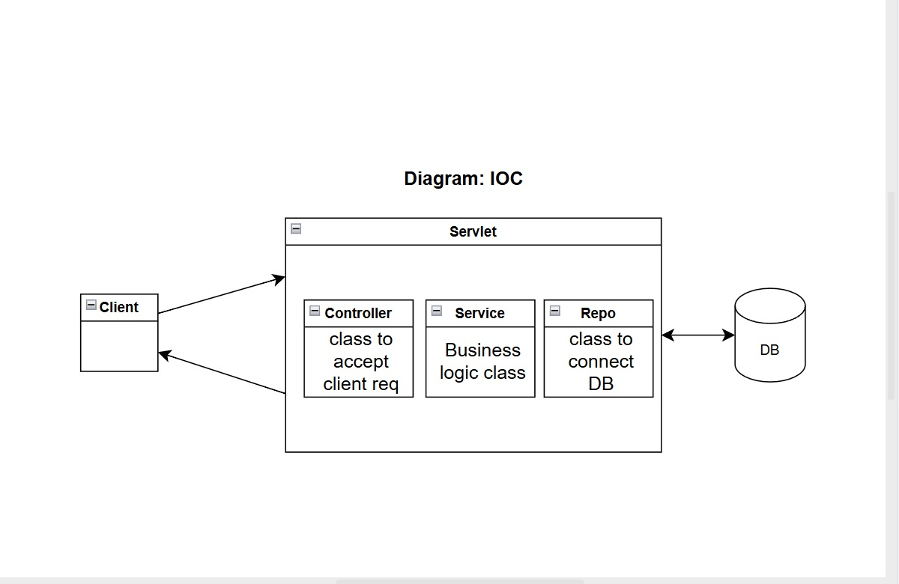

### example:

```
class Controller {
    Service service = new Service();
}
```

```
class Service {
    Repo repo = new Repo();
}
```

```
import java.sql.Connection;
import java.sql.DriverManager;
class Repo {
    public Repo() {
        String url = "jdbc:mysql://localhost:3306/testdb";
        String username = "root";
        String password = "password";

        try(Connection con = DriverManager.getConnection(url,username,password)) {
            System.out.println("Database connected successfully");
        } catch(Exception e) {
            e.printStackTrace();
        }
    }
}
```

- Typically, we developers create objects by ourselves using the new keyword.
- But what if we give that control to someone else (a framework)?
- - This concept is called IoC.
- IoC(Inversion Of Control) is principle.
- IoC means you don't create objects yourself -- the framework creates and manages them for you
- To achieve IoC, we use a technique called DI(Dependency Injection).
- DI is the actual implementation of IoC (a Concrete Technique).

### example:

```
class Controller {
    //instead of doing.
    Service service = new Service();

    //you can ask Spring to inject -> you mention the reference -> Spring will give you the object.
}
```

## 3 Techniques to achieve Dependency Injection:

### Without Dependency Injection:

```
class Controller {
    private Service service = new Service();

    public void handleRequest() {
        service.doSomeThing();
    }
}

class Service {
    public void doSomeThing() {
        System.out.println("doing work");
    }
}
```

### 1. Constructor Injection:

```
class Controller {
    Service service;

    //Constructor
    Controller(Service serv) { //reference of service(serv)
        this.service = serv;
    }

    //usage
    public void handleRequest() {
        service.doSomeThing();
    }

}

class Service {
    public void doSomeThing() {
        System.out.println("doing work");
    }
}
```

### 2. Setter Method Injection:

```
public class Controller {
    private Service service;

    //Setter Method
    public void setService(Service serv) {
        this.service = serv;
    }

    //usage
    public void handleRequest() {
        service.doSomeThing();
    }
}

public class Service {
    public void doSomeThing() {
        System.out.println("Doing SomeWork.");
    }
}
```

### 3. Field Injection (Not Recommended):

- Field Injection = dependency is injected directly into a class variable(field), instead of through a constructor or setter method.
- Most commonly seen in Spring/Spring Boot using the '@Autowired' annotation.

```
public class Controller {
    @Autowired
    private Service service; //interface

    public void handleRequest() {
        service.doSomeThing();
    }
}

public class Service {
    public void doSomeThing() {
        System.out.println("doing somework");
    }
}
```

- Loose Coupling: you don't have a concrete implementation of one class in another. You code for interfaces.
- What it means:
- You do not create objects using the new keyword.
- You do not depend on a specific class.
- You declare the dependency as an interface.
- Spring injects the actual implementation at runtime.

### example :

1. Without Loose Coupling (tight coupling):

```
@Component
class UserService {
    private MySQLRepository repo = new MySQLRepository();
}
// problem: UserService is stuck with MySQLRepository.
```

2. With Loose Coupling (Field Injection):

```
@Component
class UserService {
    @Autowired
    private UserRepository repo; // interface
}

@Repository
class MySQLRepository implements UserRepository { }
// What this means:
// - UserService does not know which class is used.
// - Spring injects the correct implementation.
// - You can change the implementation without touching UserService
```

- Someone else is injecting the object in your app. -> Spring(IoC container)

## Spring Boot:

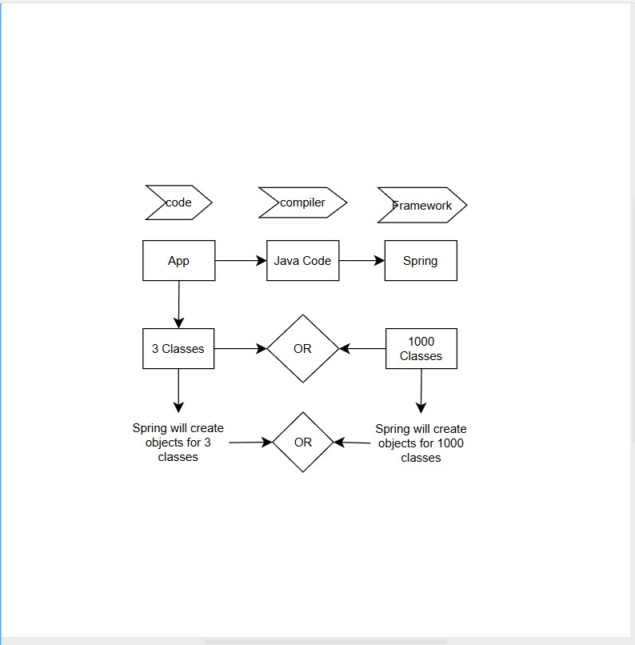

### Question:

- Do you want Spring to handle all the classes?
- Most of the time, we don't need objects for all the classes.
- We need objects for a selected few classes.

### How do you talk to your Spring Framework and say -> Don't create objects for everything?

- I just want a few classes.
- We do it in a configuration file -> xml or property file. (talking to framework)

- Just because you are using Spring, -> you will not be able to run your code on the first go.
- You will have to first work with the 'Configuration file'.
- For web apps, -> you need a server; -> you can use Tomcat.
- If you build a web app in Spring, -> you need to have Tomcat configured and installed.

## Spring Boot:

- Let me take care of your config problems.
- Get your project running in a few minutes.
- Build projects in less time.

## Note: In Spring, you do the configurations manually.


- We can build apps using Spring Framework.
- Or if you want to make it easy, use Spring Boot. (opinionated Framework)

## Spring Boot is an opinionated framework, which means:

- The framework decides defaults for you.
- You follow its way of doing things.
- Fewer choices, fewer configurations.

- Means: Spring Boot will give you certain things the way it wants.
- And you can simply use it to run your apps.

## Spring Initializer (steps):

- https://start.spring.io
- Project (Build Tool): Maven.
- Language: Java.
- Spring Boot (Version): 3.2.5
- Project Metadata:
- Group: com.bagewadi
- Artifact: DemoApp
- Name: DemoApp
- Description: Demo project for Spring Boot
- Package name: com.bagewadi.DemoApp
- Packaging (type): jar(selected) war
- Java (version): 22 21(selected) 17

## Web apps:

- Deploy on the cloud.
- You need a (.War) file (Web Archive).
- And then you push your war file into Tomcat to run it.

- You can create a Jar file, -> Jar doesn't run on Tomcat.
- What if you don't need an external Tomcat?
- What if the project itself has a Tomcat?
- Spring Boot says if you want to build a web app, -> you will get embedded Tomcat.

## Dependencies:

- We talked about Spring. -> There are multiple projects inside Spring, and we don't need all.
- Depending on your use case, you will choose one.

## Add Dependencies:

- Example: I want to build a web app, select -> Spring web.
- Add Database -> JPA.
- Click on generate.
- Download and Unzip.
- Goto -> IDE -> open downloaded project.
- If you expand the dependencies.
- Jackson: (Convert Java objects to JSON) automatically.
- Micrometer: Used for application metrics (Monitoring).
- - Collects metrics like:
  - request count
  - response time
  - memory / CPU usage
  - custom counters
  - Sends them to monitoring tools (Prometheus, Grafana, etc.)
- Embedded Tomcat
- Spring Boot
- Spring Framework
- Spring Core
- all things needed for the Spring project.

## Using the above steps and information, create a DemoApp.

- Trying to create and run the project.
- (Steps):
- - Steps in Spring initializer.
  - Add the dependency (Spring Web).
  - And try to run the Project.
  - Observe the (External dependencies) and try to find the above dependencies.
  - Unzip the project folder.
  - Open the project with IntelliJ IDEA.
  - Let Maven download the dependencies.
  - Goto -> src (folder) -> main -> java -> com.prajwal.demo -> DemoApplication.java

```
//auto-generated
package com.prajwal.demo;

import org.springframework.boot.SpringApplication;
import org.springframework.boot.autoconfigure.SpringBootApplication;

@SpringBootApplication
public class DemoApplication {
    public static void main(String[] args) {
        SpringApplication.run(DemoApplication.class, args);
    }
}
```

- Current file -> run.
- Goto -> Chrome -> localhost:8080
- Observe the 'Whitelabel Error Page' (more on that).
- - Servlet or anyother app before.
- Create a class Hello.
- Create -> src (folder) -> main -> java -> com.prajwal.demo -> Controller (Package)
- Create class Hello.java in the controller package.

```
package com.prajwal.demo.Controller;

import org.springframework.web.bind.annotation.RequestMapping;
import org.springframework.web.bind.annotation.RestController;

@RestController
public class Hello {
    @RequestMapping("/") // "/" maps to homepage
    public String greet() {
        return "Hello World!";
    }
}
```

- Running Project: Goto -> src (folder) -> main -> java -> com.prajwal.demo -> DemoApplication.java -> Run (automatically compiling and running the project on the embedded Tomcat)
- Goto -> Chrome -> localhost:8080
- Observe the output on the screen: "Hello World!".

## Spring Boot Issues:

- Default.
- It will do a lot of stuff for you.
- Convenience over Configuration.
- In Spring, you will have to configure a lot of the stuff.
- Spring Boot will give you extra things that you might need or might not.
- It gives you a lot of default stuff.
- If you want more control over your stuff, use Spring.
- Debatable.
- Convenient Spring Boot.

## Dependency Injection using Spring Boot:

- Create a 'Core Spring Boot app' using the Spring Initializr (https://start.spring.io)
- Repeat the steps in [Go to Spring Initializer (steps)](#spring-initializer-steps)
- Maven -> java -> 3.2.5,(3.5.5)
- Group -> com.prajwal
- Name -> MyApp
- Packaging -> Jar
- Java -> 21
- (No Dependencies!) Please don't add any Dependencies.

```
package com.prajwal.MyApp;

import org.springframework.boot.SpringApplication;
import org.springframework.boot.autoconfigure.SpringBootApplication;


@SpringBootApplication
public class MyAppApplication {
    public static void main(String[] args) {
        SpringApplication.run(MyAppApplication.class, args);
        // It creates a container responsible for creating and running an IoC container.
        // ChatGpt corrected: It starts the Spring Boot Application and initializes the IoC container.
    }
}
```

- SpringApplication.run() bootstraps the Spring Boot app and creates the IoC container.

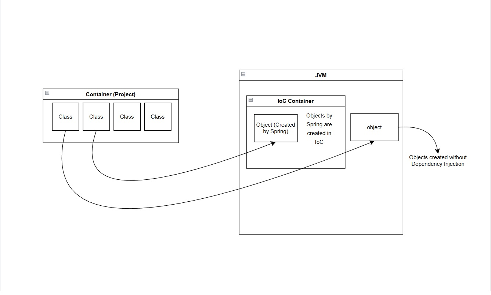

## Spring Boot without Dependency Injection:

```
package com.prajwal.demo.Controller;

public class Calculator {
    public int calculate(int a, int b, String opr){
        switch (opr){
            case "+": {
                return a+b;
            }
            case "-": {
                return a-b;
            }
            case "*": {
                return a*b;
            }
            case "/": {
                if(b==0){
                    throw new ArithmeticException("Division by zero");
                }
                return a/b;
            }
            case "%": {
                return a%b;
            }
            default: {
                throw new  IllegalArgumentException("Invalid operation");
            }
        }
    }
}
```

```
package com.prajwal.demo;

import com.prajwal.demo.Controller.Calculator;
import org.springframework.boot.SpringApplication;
import org.springframework.boot.autoconfigure.SpringBootApplication;

import java.util.Calendar;

@SpringBootApplication
public class DemoApplication {

	public static void main(String[] args) {
		SpringApplication.run(DemoApplication.class, args); //responsible for creating and running IoC Container

		//object without Dependency Injection
		Calculator calculator = new Calculator();
		System.out.println("calculator:"+calculator.calculate(25,25,"+"));
	}

}

```

## Before Spring:

- To talk to the container, we need to (get a reference to the container).
- To get a Reference to the IoC container, we must know the type of the container.
- Which is Application Context.
- ApplicationContext is the central Spring IoC container that creates, manages, and injects beans in a Spring application.
- SpringApplication.run() method creates and returns an object of type ApplicationContext.

```
@SpringBootApplication
public class MyAppApplication {
    public static void main(String[] args) {
        ApplicationContext context = SpringApplication.run(MyAppApplication.class, args);
        Service object = context.getBean(Service.class); //Spring creates the Service object of Service in my IoC container.
        object.display();
    }
}
// Service must be a Spring Bean.
@Service //or @Component
public class Service {
    public void display() {
        System.out.println("Hello from Service");
    }
}
```

## What is getBean():

- The purpose of 'getBean()' is to retrieve an instance of a Bean managed by the Spring IoC(Inversion of Control).

## Spring:

- Spring, by default, will not create objects for all the classes (Eg, 1000 classes), and also we don't want that.
- Spring says, "You tell me which class objects you want".
- "And I'll manage them for you."
- How will you talk to Spring? -> You may need a configuration, typically via a '@Configuration' class.
- OR in Spring Boot. -> We can use an Annotation called '@Component'.

### @Component:

- @Component annotation marks a class as a Spring Bean so that Spring can create and manage its object.
- Spring identifies this class during component scanning and registers it as a bean definition in the ApplicationContext(Spring IoC container).
- Spring creates the object and manages its lifecycle (creation, dependency injection, destruction).

```
//PaymentService.java
package com.prajwal.MyApp1.Service;

import org.springframework.stereotype.Component;

@Component
public class PaymentService {
    public void run() {
        System.out.println("PaymentService is running");
    }
}
```

```
//MyApp1Application.java
package com.prajwal.MyApp1;

import com.prajwal.MyApp1.Service.PaymentService;
import org.springframework.boot.SpringApplication;
import org.springframework.boot.autoconfigure.SpringBootApplication;
import org.springframework.context.ApplicationContext;

@SpringBootApplication
public class MyApp1Application {

	public static void main(String[] args) {
		ApplicationContext context = SpringApplication.run(MyApp1Application.class, args);

		PaymentService paymentService = context.getBean(PaymentService.class);
		paymentService.run();
	}

}
```

## What is ApplicationContext:

- ApplicationContext is a central interface of the Spring Framework that represents the Spring IoC(Inversion of Control) container.
- It is responsible for creating, configuring, and managing the lifecycle of your app -> "Spring Beans".

## What is @Component:

- @Component is a core Spring annotation used to mark a class as a Spring-managed component (Bean).

## We can go a bit more layers (Sub Classes):

- Autowiring:

```
// src (folder) -> main -> java -> com.prajwal.MyApp2 ->  MyApp2Application.java
package com.prajwal.MyApp2;

import com.prajwal.MyApp2.Controller.Dev;
import org.springframework.beans.factory.annotation.Autowired;
import org.springframework.boot.SpringApplication;
import org.springframework.boot.autoconfigure.SpringBootApplication;
import org.springframework.context.ApplicationContext;

@SpringBootApplication
public class MyApp2Application {

	public static void main(String[] args) {
		ApplicationContext context = SpringApplication.run(MyApp2Application.class, args);
		Dev dev = context.getBean(Dev.class);
		dev.build();
	}

}
```

```
// src (folder) -> main -> java -> com.prajwal.MyApp2 -> Controller -> Dev.java
package com.prajwal.MyApp2.Controller;

import com.prajwal.MyApp2.Service.Laptop;
import org.springframework.beans.factory.annotation.Autowired;
import org.springframework.stereotype.Component;

@Component
public class Dev {
    @Autowired //Field Injection
    private Laptop macbook;

    public void build() {
        macbook.ide();
        System.out.println("Dev Writing on Code.");
    }
}
```

```
// src (folder) -> main -> java -> com.prajwal.MyApp2 -> Service -> Laptop.java
package com.prajwal.MyApp2.Service;

import org.springframework.stereotype.Component;

@Component
public class Laptop {
    public void ide() {
        System.out.println("IntelliJ IDEA Running.");
    }
}
```

- REST-style controller returning plain text style example:

```
// src (folder) -> main -> java -> com.prajwal.MyWebApp1 -> MyWebApp1Application
package com.prajwal.MyWebApp1;

import org.springframework.boot.SpringApplication;
import org.springframework.boot.autoconfigure.SpringBootApplication;

@SpringBootApplication
public class MyWebApp1Application {

	public static void main(String[] args) {
		SpringApplication.run(MyWebApp1Application.class, args);
	}

}
```

```
// src (folder) -> main -> java -> com.prajwal.MyWebApp1 -> Controller -> Dev.java
package com.prajwal.MyWebApp1.Controller;

import com.prajwal.MyWebApp1.Service.Laptop;
import org.springframework.beans.factory.annotation.Autowired;
import org.springframework.web.bind.annotation.RequestMapping;
import org.springframework.web.bind.annotation.RestController;

@RestController
public class Dev {
    @Autowired //Field Injection
    private Laptop macbook;

    @RequestMapping("/")
    public String dev(){
        return macbook.ide()+" !dev working on code.";
    }
}
```

```
// src (folder) -> main -> java -> com.prajwal.MyWebApp1 -> Service -> Laptop.java
package com.prajwal.MyWebApp1.Service;

import org.springframework.stereotype.Component;

@Component
public class Laptop {
    public String ide(){
        return "IntelliJ Idea Running.";
    }
}
```

## @Autowired:

- @Autowired is a Spring annotation used for Dependency Injection. It tells Spring, "Inject the required bean here automatically".

- As we don't want to manually invoke ApplicationContext.
- We can use @Autowired.
- Now Spring understands "I need an object of Dev".
- But Dev is dependent on the Laptop.
- So Spring says, "Let me connect (wire) these two classes."
- (Behind the scenes, dependency injection happens.)
- As a result, you get an instance of Laptop injected into Dev.
- @Autowired //field injection (placed on top of the variable).

## Constructor Injection:

```
package com.prajwal.MyWebApp1;

import org.springframework.boot.SpringApplication;
import org.springframework.boot.autoconfigure.SpringBootApplication;

@SpringBootApplication
public class MyWebApp1Application {

	public static void main(String[] args) {
		SpringApplication.run(MyWebApp1Application.class, args);
	}

}
```

```
package com.prajwal.MyWebApp1.Controller;

import com.prajwal.MyWebApp1.Service.Laptop;
import org.springframework.beans.factory.annotation.Autowired;
import org.springframework.web.bind.annotation.RequestMapping;
import org.springframework.web.bind.annotation.RestController;

@RestController
public class Dev {

    private Laptop macbook;

    @Autowired //Constructor Injection.
    public Dev(Laptop laptop) {
        this.macbook = laptop;
    }

    @RequestMapping("/")
    public String dev(){
        return macbook.ide()+" !dev working on code.";
    }
}
```

```
package com.prajwal.MyWebApp1.Service;

import org.springframework.stereotype.Component;

@Component
public class Laptop {
    public String ide(){
        return "IntelliJ Idea Running.";
    }
}
```

## Setter Injection

```
package com.prajwal.MyWebApp1;

import org.springframework.boot.SpringApplication;
import org.springframework.boot.autoconfigure.SpringBootApplication;

@SpringBootApplication
public class MyWebApp1Application {

	public static void main(String[] args) {
		SpringApplication.run(MyWebApp1Application.class, args);
	}

}
```

```
package com.prajwal.MyWebApp1.Controller;

import com.prajwal.MyWebApp1.Service.Laptop;
import org.springframework.beans.factory.annotation.Autowired;
import org.springframework.web.bind.annotation.RequestMapping;
import org.springframework.web.bind.annotation.RestController;

@RestController
public class Dev {

    private Laptop macbook;

    @Autowired //Setter Injection.
    public void setDevice(Laptop laptop) {
        this.macbook = laptop;
    }

    @RequestMapping("/")
    public String dev(){
        return macbook.ide()+" !dev working on code.";
    }
}
```

```
package com.prajwal.MyWebApp1.Service;

import org.springframework.stereotype.Component;

@Component
public class Laptop {
    public String ide(){
        return "IntelliJ Idea Running.";
    }
}
```

## How does Setter Injection work:

- Spring finds Beans: Spring creates one Laptop object and stores it in the IoC Container
- Dev Controller Spring creates the Dev object.
- Notices @Autowired on a setter method.
- Setter Injection happens:
- Looks at the Parameter Type -> Laptop.
- Searches the IoC container for a Laptop Bean.
- Calls the setter method automatically. setDevice(laptopBean);
- Assigns it to: this.macbook = laptopBean;
- Request comes to '/', @RequestMapping("/").
- Object 'macbook' is NOT null.
- Because Spring already injected it via the setter.
- Method executes successfully.

## Note:

- For field injection(not recommended), '@Autowired' is required.
- For setter injection, '@Autowired' is required unless the class has only one setter.

## Field Injection:

```
package com.prajwal.MyWebApp1;

import org.springframework.boot.SpringApplication;
import org.springframework.boot.autoconfigure.SpringBootApplication;

@SpringBootApplication
public class MyWebApp1Application {

	public static void main(String[] args) {
		SpringApplication.run(MyWebApp1Application.class, args);
	}

}
```

```
package com.prajwal.MyWebApp1.Controller;

import com.prajwal.MyWebApp1.Service.Laptop;
import org.springframework.beans.factory.annotation.Autowired;
import org.springframework.web.bind.annotation.RequestMapping;
import org.springframework.web.bind.annotation.RestController;

@RestController
public class Dev {

    @Autowired //Field Injection.
    private Laptop macbook;

//    @Autowired //Setter Injection.
//    public void setDevice(Laptop laptop) {
//        this.macbook = laptop;
//    }

//    @Autowired //Constructor Injection.
//    public Dev(Laptop laptop) {
//        this.macbook = laptop;
//    }

    @RequestMapping("/")
    public String dev(){
        return macbook.ide()+" !dev working on code.";
    }
}
```

```
package com.prajwal.MyWebApp1.Service;

import org.springframework.stereotype.Component;

@Component
public class Laptop {
    public String ide(){
        return "IntelliJ Idea Running.";
    }
}
```

## How exactly is Spring Boot Connecting @Autowired?

- How does your Spring framework know that when you say @Autowired?
- It will connect with Laptop.class and not some other class.
- As the project has multiple classes.
- How does it know we have to connect with the object 'laptop' only?
- It goes for By Type.

```
@Autowired //Field Injection.
private Laptop macbook;
```

- The Datatype of 'macbook'.

## Loose Coupling:

- What if you create an interface for a laptop?
- Refactor -> Extract interface -> Code to the interface.
- Meaning:
- Take an existing class.
- Extract an interface from it.
- Use the interface type instead of the concrete class.
- Achieves loose coupling.

### Example:

- Let's take the example of 'Computer'.
- In the real world, there is no single entity called a 'Computer'.
- Instead, we have Desktop and Laptop, both of which are called Computers.

```
// Interface methods are implicitly public and abstract
public  interface Computer {

	//abstract method
  	void compile() {}
}

public class Laptop implements Computer {

	@Override
  	public void compile () {
    	System.out.println("Java Compiler running.");
  	}
}
```

- When you join a company, they don't promise you a specific device; they promise a Computer.
- Which could be a Desktop or a laptop.

```
public class Dev {

	@Autowired //Field injection
	//private Laptop macbook; //❌ hardcoded value.
	private Computer comp;
	public void build() {
		comp.compile();
	}
}
```

- The company can provide you with a laptop or a desktop.
- You should go by Computer.
- As @Autowired goes by type 'Computer.'
- Class Laptop implements Computer.
- ### "As a Laptop is a type of Computer".

```
package com.prajwal.InterfaceExample;

import org.springframework.boot.SpringApplication;
import org.springframework.boot.autoconfigure.SpringBootApplication;

@SpringBootApplication
public class InterfaceExampleApplication {

	public static void main(String[] args) {

		SpringApplication.run(InterfaceExampleApplication.class, args);
	}

}
```

```
package com.prajwal.InterfaceExample.Controller;

import com.prajwal.InterfaceExample.Service.Computer;
import com.prajwal.InterfaceExample.Service.Laptop;
import org.springframework.beans.factory.annotation.Autowired;
import org.springframework.web.bind.annotation.RequestMapping;
import org.springframework.web.bind.annotation.RestController;

@RestController
public class Dev {

    //private Laptop macbook; //❌ hard coded value.
    @Autowired //Field injection
    private Computer computer;

    @RequestMapping("/")
    public String build() {
        return "Dev Building."+"<br>"+computer.compile();
    }
}
```

```
package com.prajwal.InterfaceExample.Service;

// Interface methods are implicitly public and abstract
public interface Computer {

    // Abstract method
    String compile();
}
```

```
package com.prajwal.InterfaceExample.Service;

import org.springframework.stereotype.Component;

@Component
public class Laptop implements Computer {

    @Override
    public String compile() {
        return "Java Compiler running...";
    }
}
```

- rerun. -> Loose Coupling.

## Loose Coupling Confusion:

- But what if there is confusion?
- Copy the Laptop class and rename it to Desktop.
- Both classes implement the Computer interface.

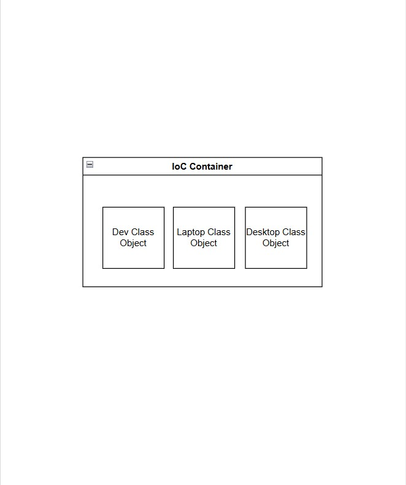

### Question:

- We have two classes, both implementing the computer interface "type of Computer".
- Now in the Dev class, when you use Computer, which object will it connect to: Laptop or Desktop?
- When you join a company, they give you a choice: Desktop or Laptop.

```
package com.prajwal.InterfaceExample;

import org.springframework.boot.SpringApplication;
import org.springframework.boot.autoconfigure.SpringBootApplication;

@SpringBootApplication
public class InterfaceExampleApplication {

	public static void main(String[] args) {

		SpringApplication.run(InterfaceExampleApplication.class, args);
	}

}
```

```
package com.prajwal.InterfaceExample.Controller;

import com.prajwal.InterfaceExample.Service.Computer;
import com.prajwal.InterfaceExample.Service.Laptop;
import org.springframework.beans.factory.annotation.Autowired;
import org.springframework.web.bind.annotation.RequestMapping;
import org.springframework.web.bind.annotation.RestController;

@RestController
public class Dev {

    //private Laptop macbook; //❌ hard coded value.
    @Autowired //Field injection
    private Computer computer;

    @RequestMapping("/")
    public String build() {
        return "Dev Building."+"<br>"+computer.compile();
    }
}
```

```
package com.prajwal.InterfaceExample.Service;

// Interface methods are implicitly public and abstract
public interface Computer {

    // Abstract method
    String compile();
}
```

```
package com.prajwal.InterfaceExample.Service;

import org.springframework.stereotype.Component;

@Component
public class Desktop implements Computer {

    @Override
    public String compile() {
        return "Java Compiler running..."+"<br>"+"On Desktop.";
    }
}
```

```
package com.prajwal.InterfaceExample.Service;

import org.springframework.stereotype.Component;

@Component
public class Laptop implements Computer {

    @Override
    public String compile() {
        return "Java Compiler running..."+"<br>"+"On Laptop.";
    }
}
```

```
//Error:
Description:
Field computer in com.prajwal.InterfaceExample.Controller.Dev required a single bean, but 2 were found:
	- desktop: defined in file [C:\Users\bagew\Desktop\Project_Ideas\spring24jan2026\InterfaceExample\InterfaceExample\target\classes\com\prajwal\InterfaceExample\Service\Desktop.class]
	- laptop: defined in file [C:\Users\bagew\Desktop\Project_Ideas\spring24jan2026\InterfaceExample\InterfaceExample\target\classes\com\prajwal\InterfaceExample\Service\Laptop.class]
```

- Error: App failed to start. Field Computer requires a single bean. But found 2.
- I prefer Desktop -> you can add @Primary annotation.

```
package com.prajwal.InterfaceExample;

import org.springframework.boot.SpringApplication;
import org.springframework.boot.autoconfigure.SpringBootApplication;

@SpringBootApplication
public class InterfaceExampleApplication {

	public static void main(String[] args) {

		SpringApplication.run(InterfaceExampleApplication.class, args);
	}

}
```

```
package com.prajwal.InterfaceExample.Controller;

import com.prajwal.InterfaceExample.Service.Computer;
import com.prajwal.InterfaceExample.Service.Laptop;
import org.springframework.beans.factory.annotation.Autowired;
import org.springframework.web.bind.annotation.RequestMapping;
import org.springframework.web.bind.annotation.RestController;

@RestController
public class Dev {

    //private Laptop macbook; //❌ hard coded value.
    @Autowired //Field injection
    private Computer computer;

    @RequestMapping("/")
    public String build() {
        return "Dev Building."+"<br>"+computer.compile();
    }
}
```

```
package com.prajwal.InterfaceExample.Service;

// Interface methods are implicitly public and abstract
public interface Computer {

    // Abstract method
    String compile();
}
```

```
package com.prajwal.InterfaceExample.Service;

import org.springframework.context.annotation.Primary;
import org.springframework.stereotype.Component;

@Component
@Primary //Default bean when multiple implementations are present.
public class Desktop implements Computer {

    @Override
    public String compile() {
        return "Java Compiler running..."+"<br>"+"On Desktop.";
    }
}
```

```
package com.prajwal.InterfaceExample.Service;

import org.springframework.stereotype.Component;

@Component
public class Laptop implements Computer {

    @Override
    public String compile() {
        return "Java Compiler running..."+"<br>"+"On Laptop.";
    }
}
```

```
//output:
//browser: http://localhost:8080/
Dev Building.
Java Compiler running...
On Desktop.
```

## Use of @Primary:

- In case of confusion/ambiguity, this class will be preferred.
- If you put @Primary on both classes.
- An error occurs, more than one @Primary bean found.

## What if you don't want to use @Primary:

- Then you can decide explicitly in Dev class.

```
package com.prajwal.InterfaceExample;

import org.springframework.boot.SpringApplication;
import org.springframework.boot.autoconfigure.SpringBootApplication;

@SpringBootApplication
public class InterfaceExampleApplication {

	public static void main(String[] args) {

		SpringApplication.run(InterfaceExampleApplication.class, args);
	}

}
```

```
package com.prajwal.InterfaceExample.Controller;

import com.prajwal.InterfaceExample.Service.Computer;
import com.prajwal.InterfaceExample.Service.Laptop;
import org.springframework.beans.factory.annotation.Autowired;
import org.springframework.beans.factory.annotation.Qualifier;
import org.springframework.web.bind.annotation.RequestMapping;
import org.springframework.web.bind.annotation.RestController;

@RestController
public class Dev {

    //private Laptop macbook; //❌ hard coded value.
    @Autowired //Field injection
    @Qualifier("laptop") // Explicitly tells Spring to inject the Laptop bean.
    private Computer computer;

    @RequestMapping("/")
    public String build() {
        return "Dev Building."+"<br>"+computer.compile();
    }
}
```

```
package com.prajwal.InterfaceExample.Service;

// Interface methods are implicitly public and abstract
public interface Computer {

    // Abstract method
    String compile();
}
```

```
package com.prajwal.InterfaceExample.Service;

import org.springframework.context.annotation.Primary;
import org.springframework.stereotype.Component;

@Component
public class Desktop implements Computer {

    @Override
    public String compile() {
        return "Java Compiler running..."+"<br>"+"On Desktop.";
    }
}
```

```
package com.prajwal.InterfaceExample.Service;

import org.springframework.stereotype.Component;

@Component
public class Laptop implements Computer {

    @Override
    public String compile() {
        return "Java Compiler running..."+"<br>"+"On Laptop.";
    }
}

```

```
//output:
Dev Building.
Java Compiler running...
On Laptop.
```

## Use of @Qualifier("bean-name"):

- Used when multiple beans of the same type exist.
- Explicitly tells Spring which bean to inject.
- Applied at the injection point (field, setter, or constructor).
- Overrides @Primary when both are present.

```
Syntax:
@Qualifer("bean-name")
```

- Refers to the name of the bean instance.
- By default, every class object managed by Spring has a bean name.
- The default "bean-name" is the class name with the first letter in lowercase.
- Example: class Laptop -> bean-name: laptop.

## @Autowired:

- Tells Spring to find a matching bean in the application context and inject it automatically."

## @Primary:

- Resolves the conflict when multiple beans of the same type exist by marking one as the default choice.

## @Qualifier("bean-name"):

- Specifies exactly which bean to inject when multiple beans of the same type exist.

## Spring without Spring Boot:

- What if you cannot use Spring Boot?
- You work directly with Spring.
- A company may be using Spring without Spring Boot.

## Steps to create a Spring project:

- New Project. -> IntelliJ IDEA (Community).
- New Project. -> Generators Maven Archetype (creates a Maven project).
- Name: SimpleSpringProject.
- JDK: 21 Oracle JDK.
- Catalog: Internal.
- Archetype: maven-archetype-quickstart.
- Version: 1.1
- Advanced Settings ->
- GroupId: com.prajwal
- ArtifactId: SimpleSpringProject
- Version: 1.0-SNAPSHOT
- create.

- This is just a Project with a Spring name.
- There is no Spring Framework in the Project.
- Project with no Spring Feature. -> Add Dependency.
- (Unknown) Add Spring Dependency.
- (Unknown) No Configuration file for Spring.
- Add Public class Developer.java

```
package com.prajwal;

public class Developer {
    public void build() {
        System.out.println( "Developer working on code..." );
    }
}
```

- First step, run your project to check if it is working.

```
package com.prajwal;

/**
 * Hello world!
 *
 */
public class App {
    public static void main( String[] args ) {
        System.out.println( "Hello World!" );
        Developer developer = new Developer();
        developer.build();
    }
}
```

```
package com.prajwal;

public class Developer {
    public void build() {
        System.out.println( "Developer working on code..." );
    }
}
```

```
//output:
Hello World!
Developer working on code...
Process finished with exit code 0
```

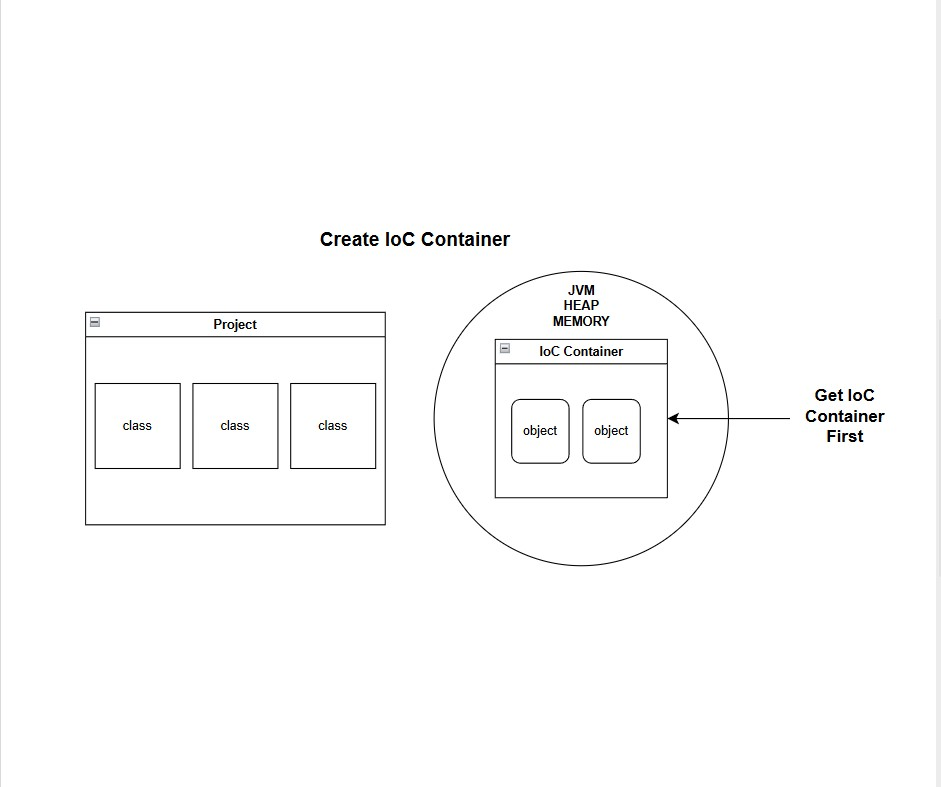

### pom.xml:

- Add the Spring dependency.
- Go to https://mvnrepository.com.
- Search for Spring Context
- Select Version: 6.2.9
- Copy the Maven dependency code.

```
<!-- Source: https://mvnrepository.com/artifact/org.springframework/spring-context -->
<dependency>
    <groupId>org.springframework</groupId>
    <artifactId>spring-context</artifactId>
    <version>6.2.9</version>
    <scope>compile</scope>
</dependency>
```

- Paste it inside the '<dependencies></dependencies>' section of 'pom.xml'.
- Click on Sync Maven changes.

```
package com.prajwal;

import org.springframework.context.ApplicationContext;
import org.springframework.context.support.ClassPathXmlApplicationContext;

/**
 * Hello world!
 *
 */
public class App {
    public static void main( String[] args ) {
        System.out.println( "Hello World!" );
//        Developer developer = new Developer();
//        developer.build();
        ApplicationContext context = new ClassPathXmlApplicationContext("Spring.xml");
        //ApplicationContext -> Spring interface that defines the IoC Container behavior.
        //ClassPathXmlApplicationContext() -> Concrete class that implements ApplicationContext and loads beans definitions from an XML file present in the classpath.
        //This line creates the IoC container.
        Developer developer = context.getBean(Developer.class);
        //Spring gives the object.
        developer.build();
    }
}
```

- We need to create the Spring.xml file in:
- src -> main -> resources
- run App.java code.
- ### Error: "Exception in thread "main" org.springframework.beans.factory.xml.XmlBeanDefinitionStoreException: Line 1 in XML document from class path resource [Spring.xml] is invalid".
- ### Why does this error occur:
- Spring tried to parse the Spring.xml
- The parser immediately failed at line 1, col 1.
- As Spring.xml is empty.
- ### We need Spring XML Schema-based configuration:
- search: "Spring XML Schema-based configuration."
- https://docs.spring.io/spring-framework/docs/4.2.x/spring-framework-reference/html/xsd-configuration.html
- Copy the XML code in Spring.xml

```
//DTD
<?xml version="1.0" encoding="UTF-8"?>
<beans xmlns="http://www.springframework.org/schema/beans"
    xmlns:xsi="http://www.w3.org/2001/XMLSchema-instance"
    xsi:schemaLocation="
        http://www.springframework.org/schema/beans http://www.springframework.org/schema/beans/spring-beans.xsd">

    <!-- bean definitions here -->

</beans>
```

- ### Error: Exception in thread "main" org.springframework.beans.factory.NoSuchBeanDefinitionException: No qualifying bean of type 'com.prajwal.Developer' available.
- To fix, we need to create a bean.

```
// defining a bean in Spring.xml
<bean id="developer" class="com.prajwal.Developer" />
```

```
package com.prajwal;

import org.springframework.context.ApplicationContext;
import org.springframework.context.support.ClassPathXmlApplicationContext;

/**
 * Hello world!
 *
 */
public class App {
    public static void main( String[] args ) {
        System.out.println( "Hello World!" );
//        Developer developer = new Developer();
//        developer.build();
        ApplicationContext context = new ClassPathXmlApplicationContext("Spring.xml");
        //ApplicationContext -> Spring interface that defines the IoC Container behavior.
        //ClassPathXmlApplicationContext() -> Concrete class that implements ApplicationContext and loads beans definitions from an XML file present in the classpath.
        //This line creates the IoC container.
        Developer developer = context.getBean(Developer.class);
        //Spring gives the object.
        developer.build();
    }
}
```

```
package com.prajwal;

public class Developer {
    public void build() {
        System.out.println( "Developer working on code..." );
    }
}
```

```
<?xml version="1.0" encoding="UTF-8"?>
<beans xmlns="http://www.springframework.org/schema/beans"
       xmlns:xsi="http://www.w3.org/2001/XMLSchema-instance"
       xsi:schemaLocation="
        http://www.springframework.org/schema/beans http://www.springframework.org/schema/beans/spring-beans.xsd">

    <!-- bean definitions here -->
    <bean id="developer" class="com.prajwal.Developer" />
</beans>
```

```
//output:
Hello World!
Developer working on code...
Process finished with exit code 0
```

- ### Error: BeanFactory not initialized or closed.
- It is a Spring lifecycle/context management issue.
- Occurs when your code tries to access Spring beans before the container is ready or after it has been shut down.

```
package com.prajwal;

import org.springframework.context.ApplicationContext;
import org.springframework.context.support.ClassPathXmlApplicationContext;

/**
 * Hello world!
 *
 */
public class App {
    public static void main( String[] args ) {
        System.out.println( "Hello World!" );
//        Developer developer = new Developer();
//        developer.build();
        //ApplicationContext context = new ClassPathXmlApplicationContext("Spring.xml");
        ClassPathXmlApplicationContext context = new ClassPathXmlApplicationContext("Spring.xml");
        context.close(); // ❌ close Spring container
        //ApplicationContext -> Spring interface that defines the IoC Container behavior.
        //ClassPathXmlApplicationContext() -> Concrete class that implements ApplicationContext and loads beans definitions from an XML file present in the classpath.
        //This line creates the IoC container.
        Developer developer = context.getBean(Developer.class);
        //Spring gives the object.
        developer.build();
    }
}
```

```
package com.prajwal;

public class Developer {
    public void build() {
        System.out.println( "Developer working on code..." );
    }
}
```

```
<?xml version="1.0" encoding="UTF-8"?>
<beans xmlns="http://www.springframework.org/schema/beans"
       xmlns:xsi="http://www.w3.org/2001/XMLSchema-instance"
       xsi:schemaLocation="
        http://www.springframework.org/schema/beans http://www.springframework.org/schema/beans/spring-beans.xsd">

    <!-- bean definitions here -->
    <bean id="developer" class="com.prajwal.Developer" />
</beans>
```

```
//output:
Exception in thread "main" java.lang.IllegalStateException: BeanFactory not initialized or already closed - call 'refresh' before accessing beans via the ApplicationContext
```

## What is BeanFactory:

- BeanFactory is an IoC(Inversion of Control) container in Spring.
- It is responsible for creating, managing, and configuring beans.
- In earlier versions of Spring, BeanFactory was commonly used as the core container.
- Beans are created lazily (only when they are requested).
- The container remains active as long as the application is running (it is not closed by default).
- BeanFactory is a lightweight Spring IoC container that manages beans using lazy initialization.

## Bean Lifecycle Diagram

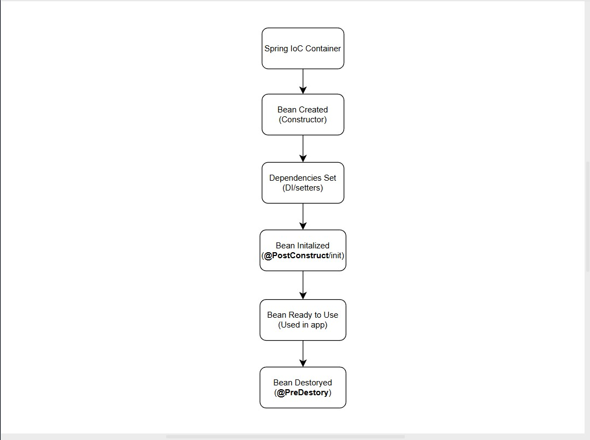

- Spring creates the Bean.
- Injects Dependencies.
- Initializes it.
- Uses it.
- Destroys it.

```
<project xmlns="http://maven.apache.org/POM/4.0.0" xmlns:xsi="http://www.w3.org/2001/XMLSchema-instance"
  xsi:schemaLocation="http://maven.apache.org/POM/4.0.0 http://maven.apache.org/xsd/maven-4.0.0.xsd">
  <modelVersion>4.0.0</modelVersion>

  <groupId>com.prajwal</groupId>
  <artifactId>BeanLifecycle</artifactId>
  <version>1.0-SNAPSHOT</version>
  <packaging>jar</packaging>

  <name>BeanLifecycle</name>
  <url>http://maven.apache.org</url>

  <properties>
    <project.build.sourceEncoding>UTF-8</project.build.sourceEncoding>
  </properties>

  <dependencies>
    <dependency>
      <groupId>junit</groupId>
      <artifactId>junit</artifactId>
      <version>3.8.1</version>
      <scope>test</scope>
    </dependency>

    <!-- Source: https://mvnrepository.com/artifact/org.springframework/spring-context -->
    <dependency>
      <groupId>org.springframework</groupId>
      <artifactId>spring-context</artifactId>
      <version>6.2.9</version>
      <scope>compile</scope>
    </dependency>

    <!-- Source: https://mvnrepository.com/artifact/jakarta.annotation/jakarta.annotation-api -->
    <dependency>
      <groupId>jakarta.annotation</groupId>
      <artifactId>jakarta.annotation-api</artifactId>
      <version>2.1.1</version>
      <scope>compile</scope>
    </dependency>

  </dependencies>
</project>
```

```
package com.prajwal;

import org.springframework.context.ApplicationContext;
import org.springframework.context.support.ClassPathXmlApplicationContext;

/**
 * Hello world!
 *
 */
public class App
{
    public static void main( String[] args ) {
        System.out.println( "Hello World!" );
        //ApplicationContext context = new ClassPathXmlApplicationContext("Spring.xml");
        ClassPathXmlApplicationContext context = new ClassPathXmlApplicationContext("Spring.xml");
        //Student student = context.getBean("student");
        //Error: java: incompatible types: java.lang.Object cannot be converted to com.prajwal.Student
        Student student = (Student) context.getBean("student");
        //typecasting to solve the error.
        student.display();
        context.close();  // 🔥 REQUIRED for @PreDestroy
    }
}
```

```
package com.prajwal;
// search: Jakarta Annotations API, in MVNRepository.
import jakarta.annotation.PostConstruct;
import jakarta.annotation.PreDestroy;

public class Student {

    private String name;

    public Student(){
        System.out.println("1. Bean Created.");
    }

    //setter
    public void setName(String name){
        this.name = name;
    }

    @PostConstruct
    public void init(){
        System.out.println("2. Bean Initialized.");
        //setName(name);
    }

    public void display() {
        System.out.println("3. Bean is Ready to Use.");
        System.out.println("Student Name: " + this.name);
    }

    @PreDestroy
    public void destroy(){
        System.out.println("4. Bean Destroyed.");
    }
}
```

```
<?xml version="1.0" encoding="UTF-8"?>
<beans xmlns="http://www.springframework.org/schema/beans"
       xmlns:xsi="http://www.w3.org/2001/XMLSchema-instance"
       xsi:schemaLocation="
        http://www.springframework.org/schema/beans http://www.springframework.org/schema/beans/spring-beans.xsd">

    <!-- bean definitions here -->


    <!-- REQUIRED for @PostConstruct & @PreDestroy -->
    <bean class="org.springframework.context.annotation.CommonAnnotationBeanPostProcessor"/>

    <bean id="student" class="com.prajwal.Student">
        <property name="name" value="Prajwal Bagewadi"/>
    </bean>
</beans>
```

```
//output:
D:\Software_Installed\jdk\bin\java.exe "-
Hello World!
1. Bean Created.
2. Bean Initialized.
3. Bean is Ready to Use.
Student Name: Prajwal Bagewadi
4. Bean Destroyed.

Process finished with exit code 0
```

- ### Note:
- To get @PostConstruct & @PreDestroy.
- Add Maven dependency

```
  <!-- Source: https://mvnrepository.com/artifact/jakarta.annotation/jakarta.annotation-api -->
    <dependency>
      <groupId>jakarta.annotation</groupId>
      <artifactId>jakarta.annotation-api</artifactId>
      <version>2.1.1</version>
      <scope>compile</scope>
    </dependency>
```

- Observe Error: java: incompatible types: java.lang.Object cannot be converted to com.prajwal.Student
- Use TypeCasting to fix the error.

```
Student student = (Student) context.getBean("student");
```

- Observe that when running the App, @PostConstruct and @PreDestroy won't run.
- Insert the DTD code in Spring.xml <Beans></Beans>.

```
<!-- REQUIRED for @PostConstruct & @PreDestroy -->
    <bean class="org.springframework.context.annotation.CommonAnnotationBeanPostProcessor"/>
```

- To @PreDestroy, we need to close the IoC container at the end of the main() code.

```
context.close(); // 🔥 REQUIRED for @PreDestroy
```

- Use of public void init() method with no args.
- The init() method is not meant to receive any data.
- It is meant to run logic after the dependencies are added.
- When to use init() method:
- Validation.
- Logging.
- Initial Calculations.
- Opening Resources.
- Checking Required Fields.

```
 @PostConstruct
    public void init(){
        System.out.println("2. Bean Initialized.");
        //setName(name);
        if (name.equals("")) {
            throw new IllegalStateException("Name must not be null.");
        }
    }
```

```
package com.prajwal;
// search: Jakarta Annotations API, in MVNRepository.
import jakarta.annotation.PostConstruct;
import jakarta.annotation.PreDestroy;

public class Student {

    private String name;

    public Student(){
        System.out.println("1. Bean Created.");
    }

    //setter
    public void setName(String name){
        this.name = name;
    }

    @PostConstruct
    public void init(){
        System.out.println("2. Bean Initialized.");
        //setName(name);
        if (name.equals("")) {
            throw new IllegalStateException("Name must not be null.");
        }
    }

    public void display() {
        System.out.println("3. Bean is Ready to Use.");
        System.out.println("Student Name: " + this.name);
    }

    @PreDestroy
    public void destroy(){
        System.out.println("4. Bean Destroyed.");
    }
}
```

## Creating Spring.xml or Anyname.xml file:

```
//Load Spring Configuration (two options)
ApplicationContext context = new ClassPathXmlApplicationContext("Spring.xml");
//OR
ClassPathXmlApplicationContext context = new ClassPathXmlApplicationContext("Spring.xml");
```

- In your project, go to src/main -> create a new folder: resources -> inside it, create a new file -> Spring.xml
- Spring.xml is the Spring configuration file where you define beans, their properties, and lifecycle callbacks.
- Spring reads this file to create, manage, and configure beans in your application.

### How to use Spring.xml or Anyname.xml for lifecycle callbacks

```
<?xml version="1.0" encoding="UTF-8"?>
<beans xmlns="http://www.springframework.org/schema/beans"
       xmlns:xsi="http://www.w3.org/2001/XMLSchema-instance"
       xsi:schemaLocation="
        http://www.springframework.org/schema/beans http://www.springframework.org/schema/beans/spring-beans.xsd">

    <!-- bean definitions here -->


    <!-- REQUIRED for @PostConstruct & @PreDestroy -->
    <!-- <bean class="org.springframework.context.annotation.CommonAnnotationBeanPostProcessor"/> -->

    <bean id="student" class="com.prajwal.Student" init-method="initMethod" destroy-method="destroyMethod">
        <property name="name" value="Prajwal"/>
    </bean>
</beans>
```

```
package com.prajwal;
// search: Jakarta Annotations API, in MVNRepository.
import jakarta.annotation.PostConstruct;
import jakarta.annotation.PreDestroy;

public class Student {

    private String name;

    public Student(){
        System.out.println("1. Bean Created.");
    }

    //setter
    public void setName(String name){
        this.name = name;
    }

    //@PostConstruct
    public void initMethod(){
        System.out.println("2. Bean Initialized.");
        //setName(name);
        if (name.equals("")) {
            throw new IllegalStateException("Name must not be null.");
        }
    }

    public void display() {
        System.out.println("3. Bean is Ready to Use.");
        System.out.println("Student Name: " + this.name);
    }

    //@PreDestroy
    public void destroyMethod(){
        System.out.println("4. Bean Destroyed.");
    }
}
```

```
\\output
D:\Software_Installed\jdk\bin\java.exe "-
Hello World!
1. Bean Created.
2. Bean Initialized.
3. Bean is Ready to Use.
Student Name: Prajwal
4. Bean Destroyed.

Process finished with exit code 0
```

## Why Spring instead of Spring Boot?

- The project might be a legacy project that was built using Spring, not Spring Boot.
- To understand what happens behind the scenes: Spring provides the container first, and then it creates and manages objects (beans).
- Every class that Spring manages is called a bean.

## <!Extensible Markup Lang/>:

- DTD (Document Type Definition):
- Defines which tags and attributes are allowed in an XML file.
- Can be in a separate file or inside XML with <!DOCTYPE>.

```
<!--Example/Syntax:-->
<!DOCTYPE student [
    <!ELEMENT student (name, age)>
    <!ELEMENT name (#PCDATA)>
    <!ELEMENT age (#PCDATA)>
]>

<!--
NOTE:
<!DOCTYPE -> Declares the document type.
student -> Root element of the XML.
[ ] -> Contains internal DTD.
<!DOCTYPE> Defines the root element and its DTD rules.
<!Element -> DTD keyword to define an element.
age -> element (tag) name.
( ) -> content of the element.
#PCDATA -> plain text data.
> -> end of definition.
-->

<student>
    <name>Prajwal</name>
    <age>26</age>
</student>
```

```
//output:
> <student>
<name>Prajwal</name>
<age>26</age>
</student>
```

```
<!--Example 2-->
<!DOCTYPE book [
    <!ELEMENT book (title, author)>
    <!ELEMENT title (#PCDATA)>
    <!ELEMENT author (#PCDATA)>
]>

<book>
    <title>TWISTED LOVE</title>
    <author>Ana Huang</author>
</book>
```

```
<!--Example 3-->
<!DOCTYPE books [
    <!ELEMENT books (book)>
    <!ELEMENT book (title,author)>
    <!ELEMENT title (#PCDATA)>
    <!ELEMENT author (#PCDATA)>
]>

<books>
    <book>
        <title>TWISTED LOVE</title>
        <author>Ana Huang</author>
    </book>
</books>
```

- XML Tags: The actual elements in the XML file, written like <tag>content</tag>.

```
<beans>
    <!---->
    <bean class="com.prajwal.Developer" id="developer"/>
    <!--class -> attribute-->
    <!--com.prajwal. -> package-->
    <!--Developer -> classname-->
    <!--com.prajwal.Developer -> qualified classname-->
    <!--id="developer -> optional beanname"-->
</beans>
```

- When id is Mandatory?
- If you access bean like this:

```
Developer dev = (Developer) context.getBean("developer");
```

- When id is not required:
- If you access bean like this:

```
Developer dev = context.getBean("Developer.class");
```

## App.java

```
package com.prajwal;

import org.springframework.context.ApplicationContext;
import org.springframework.context.support.ClassPathXmlApplicationContext;

public class App {
    public static void main(String[] args) {

        ClassPathXmlApplicationContext context = new ClassPathXmlApplicationContext("Spring.xml");

        Student student = (Student) context.getBean("student");
        //instead of context.getBean("Student.class");
        //getBean -> returns type Object, typecast it to (Developer)
    }
}
```

## Error: Cannot find defination for <beans>:

- This happens when Spring cannot find the XML schema definations that validates <beans> and <bean>

```
<!--Error causing code:-->
<beans>
    <bean id="student" class="com.prajwal.Student" init-method="initMethod" destroy-method="destroyMethod">-->
        <property name="name" value="Prajwal"/>
    </bean>
</beans>
```

- To fix, search: XML Schema-based configuration.
- Copy paste the xml script in Spring.xml

```
<?xml version="1.0" encoding="UTF-8"?>
<!--code line that resolves error-->
<beans xmlns="http://www.springframework.org/schema/beans"
    xmlns:xsi="http://www.w3.org/2001/XMLSchema-instance"
    xsi:schemaLocation="
        http://www.springframework.org/schema/beans http://www.springframework.org/schema/beans/spring-beans.xsd">
<!--Provide defination for beans and bean tags-->
    <!-- bean definitions here -->

</beans
```

```
<beans xmlns="http://www.springframework.org/schema/beans"
       xmlns:xsi="http://www.w3.org/2001/XMLSchema-instance"
       xsi:schemaLocation="
        http://www.springframework.org/schema/beans http://www.springframework.org/schema/beans/spring-beans.xsd">
</beans>
```

- We are asking Spring that you responsible for creating the objects defined in bean.
- which we have configured in Spring.xml

## Adding one more class (complexity):

```
public class Laptop {
    public Laptop(){
        System.out.println("Laptop constructor Obj created in IoC.");
    }
    public void compiler() {
        System.out.println("Java compiler running");
    }
}
```

```
public class Developer {
    public Developer(){
        System.out.println("Developer constructor Obj created in IoC.");
    }
    public void build() {
        System.out.println("Dev writing code.")
    }
}
```

- In the Container we create objects of 2 bean classes.

```
//pom.xml
<project xmlns="http://maven.apache.org/POM/4.0.0" xmlns:xsi="http://www.w3.org/2001/XMLSchema-instance"
  xsi:schemaLocation="http://maven.apache.org/POM/4.0.0 http://maven.apache.org/xsd/maven-4.0.0.xsd">
  <modelVersion>4.0.0</modelVersion>

  <groupId>com.prajwal</groupId>
  <artifactId>SpringCore</artifactId>
  <version>1.0-SNAPSHOT</version>
  <packaging>jar</packaging>

  <name>SpringCore</name>
  <url>http://maven.apache.org</url>

  <properties>
    <project.build.sourceEncoding>UTF-8</project.build.sourceEncoding>
  </properties>

  <dependencies>
    <dependency>
      <groupId>junit</groupId>
      <artifactId>junit</artifactId>
      <version>3.8.1</version>
      <scope>test</scope>
    </dependency>

    <!-- Source: https://mvnrepository.com/artifact/org.springframework/spring-context -->
    <dependency>
      <groupId>org.springframework</groupId>
      <artifactId>spring-context</artifactId>
      <version>6.2.9</version>
      <scope>compile</scope>
    </dependency>

  </dependencies>
</project>
```

```
//App.java
package com.prajwal;

import org.springframework.context.ApplicationContext;
import org.springframework.context.support.ClassPathXmlApplicationContext;

/**
 * Hello world!
 *
 */
public class App {
    public static void main( String[] args ) {
        System.out.println( "Hello World!" );
        ApplicationContext context = new ClassPathXmlApplicationContext("Spring.xml");
    }
}
```

```
//Developer.java
package com.prajwal;

public class Developer {
    public Developer(){
        System.out.println("Developer constructor Obj created in IoC.");
    }

    public void build() {
        System.out.println("Dev writing code.");
    }
}
```

```
//Laptop.java
package com.prajwal;

public class Laptop {

    public Laptop(){
        System.out.println("Laptop constructor Obj created in IoC.");
    }

    public void compiler() {
        System.out.println("Java compiler running.");
    }

}
```

```
//Spring.xml
<?xml version="1.0" encoding="UTF-8"?>
<beans xmlns="http://www.springframework.org/schema/beans"
       xmlns:xsi="http://www.w3.org/2001/XMLSchema-instance"
       xsi:schemaLocation="
        http://www.springframework.org/schema/beans http://www.springframework.org/schema/beans/spring-beans.xsd">

    <!-- bean definitions here -->


    <!-- REQUIRED for @PostConstruct & @PreDestroy -->
    <!-- <bean class="org.springframework.context.annotation.CommonAnnotationBeanPostProcessor"/> -->
    <bean class="com.prajwal.Developer" id="developer"/>
    <bean class="com.prajwal.Laptop" id="laptop"/>
</beans>
```

```
//output:
Hello World!
Developer constructor Obj created in IoC.
Laptop constructor Obj created in IoC.

Process finished with exit code 0
```

- It will create the Container.
- Spring will see two bean configs.
- It will create objects for both of the beans.

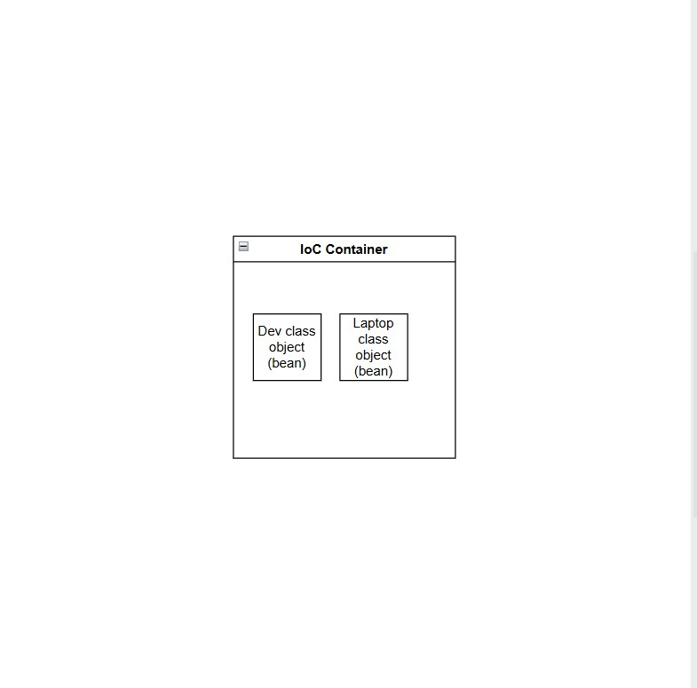

- Adding another Dev class bean.

```
<?xml version="1.0" encoding="UTF-8"?>
<beans xmlns="http://www.springframework.org/schema/beans"
       xmlns:xsi="http://www.w3.org/2001/XMLSchema-instance"
       xsi:schemaLocation="
        http://www.springframework.org/schema/beans http://www.springframework.org/schema/beans/spring-beans.xsd">

    <!-- bean definitions here -->


    <!-- REQUIRED for @PostConstruct & @PreDestroy -->
    <!-- <bean class="org.springframework.context.annotation.CommonAnnotationBeanPostProcessor"/> -->
    <bean class="com.prajwal.Developer" id="developer"/>
    <bean id="developer1" class="com.prajwal.Developer"/>
    <bean class="com.prajwal.Laptop" id="laptop"/>
</beans>
```

```
//output:
Hello World!
Developer constructor Obj created in IoC.
Developer constructor Obj created in IoC.
Laptop constructor Obj created in IoC.

Process finished with exit code 0
```

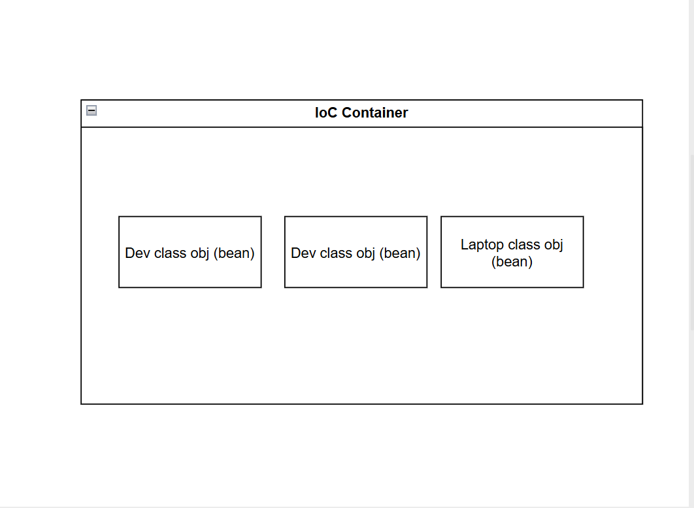

## Setter and Constructor Injection:

- Setter Injection:

```
package com.prajwal;

public class Developer {

    private int age;

    public Developer(){
        System.out.println("Developer constructor Obj created in IoC.");
    }

    public void setAge(int age) {
        this.age = age;
    }
    public int getAge() {
        return age;
    }

    public void build() {
        System.out.println("Dev writing code.");
    }
}
```

```
<?xml version="1.0" encoding="UTF-8"?>
<beans xmlns="http://www.springframework.org/schema/beans"
       xmlns:xsi="http://www.w3.org/2001/XMLSchema-instance"
       xsi:schemaLocation="
        http://www.springframework.org/schema/beans http://www.springframework.org/schema/beans/spring-beans.xsd">

    <!-- bean definitions here -->


    <!-- REQUIRED for @PostConstruct & @PreDestroy -->
    <!-- <bean class="org.springframework.context.annotation.CommonAnnotationBeanPostProcessor"/> -->
    <bean class="com.prajwal.Developer" id="developer">
        <property name="age" value="26"/>
    </bean>

    <bean id="developer1" class="com.prajwal.Developer"/>
    <bean class="com.prajwal.Laptop" id="laptop"/>
</beans>
```

```
package com.prajwal;

import org.springframework.context.ApplicationContext;
import org.springframework.context.support.ClassPathXmlApplicationContext;

/**
 * Hello world!
 *
 */
public class App {
    public static void main( String[] args ) {
        System.out.println( "Hello World!" );
        ApplicationContext context = new ClassPathXmlApplicationContext("Spring.xml");
        Developer dev = (Developer) context.getBean("developer");
        System.out.println("dev age:"+dev.getAge());
    }
}
```

```
//output
Hello World!
Developer constructor Obj created in IoC.
Developer constructor Obj created in IoC.
Laptop constructor Obj created in IoC.
dev age:26

Process finished with exit code 0
```

- Spring.xml

```
<bean class="com.prajwal.Developer" id="developer">
    <property name="age" value="26"/>
    <!--sets the age property in dev.class with setAge() using Spring-->
</bean>
```

- Spring is assiging value to age.

```
//output
dev age:26
```

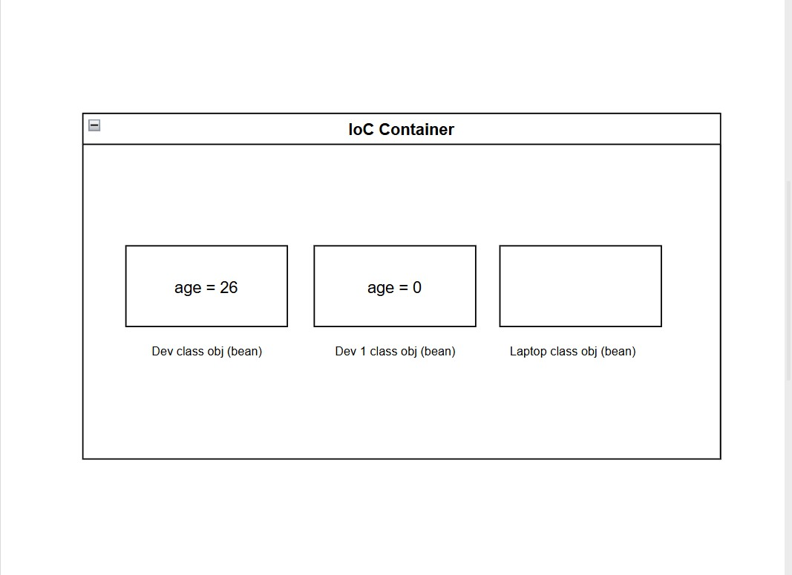

```
package com.prajwal;

import org.springframework.context.ApplicationContext;
import org.springframework.context.support.ClassPathXmlApplicationContext;

/**
 * Hello world!
 *
 */
public class App {
    public static void main( String[] args ) {
        System.out.println( "Hello World!" );
        ApplicationContext context = new ClassPathXmlApplicationContext("Spring.xml");
        Developer dev = (Developer) context.getBean("developer");
        Developer dev1 = (Developer) context.getBean("developer1");
        System.out.println("dev age:"+dev.getAge());
        System.out.println("dev1 age:"+dev1.getAge());
    }
}
```

```
//output
Hello World!
Developer constructor Obj created in IoC.
Developer constructor Obj created in IoC.
Laptop constructor Obj created in IoC.
dev age:26
dev1 age:0

Process finished with exit code 0
```

```
Developer dev1 = (Developer) context.getBean("developer1");
System.out.println("dev1 age:"+dev1.getAge());
```

- Dev1 age = value 0 as it is not set in properties.

- Constructor Injection:

```
package com.prajwal;

public class Developer {

    private int age;

    public Developer(int age){
        System.out.println("Developer constructor Obj created in IoC.");
        this.age = age;
    }

//    public void setAge(int age) {
//        this.age = age;
//    }
    public int getAge() {
        return age;
    }

    public void build() {
        System.out.println("Dev writing code.");
    }
}
```

```
<?xml version="1.0" encoding="UTF-8"?>
<beans xmlns="http://www.springframework.org/schema/beans"
       xmlns:xsi="http://www.w3.org/2001/XMLSchema-instance"
       xsi:schemaLocation="
        http://www.springframework.org/schema/beans http://www.springframework.org/schema/beans/spring-beans.xsd">

    <!-- bean definitions here -->


    <!-- REQUIRED for @PostConstruct & @PreDestroy -->
    <!-- <bean class="org.springframework.context.annotation.CommonAnnotationBeanPostProcessor"/> -->
    <bean class="com.prajwal.Developer" id="developer">
        <!--<property name="age" value="26"/>-->
        <constructor-arg name="age" value="26"/>
    </bean>

    <bean id="developer1" class="com.prajwal.Developer"/>
    <bean class="com.prajwal.Laptop" id="laptop"/>
</beans>
```

```
package com.prajwal;

import org.springframework.context.ApplicationContext;
import org.springframework.context.support.ClassPathXmlApplicationContext;

/**
 * Hello world!
 *
 */
public class App {
    public static void main( String[] args ) {
        System.out.println( "Hello World!" );
        ApplicationContext context = new ClassPathXmlApplicationContext("Spring.xml");
        Developer dev = (Developer) context.getBean("developer");
        Developer dev1 = (Developer) context.getBean("developer1");
        System.out.println("dev age:"+dev.getAge());
        System.out.println("dev1 age:"+dev1.getAge());
    }
}
```

- Error: Spring cannot create the developer1 bean because the class has no no-argument (default) constructor and no constructor is specified in Spring.xml.
- To fix, create a default constructor with no arguments.

```
package com.prajwal;

public class Developer {

    private int age;

    public Developer(){
        System.out.println("Default Developer constructor Obj created in IoC.");
    }

    public Developer(int age){
        System.out.println("Developer constructor Obj created in IoC.");
        this.age = age;
    }

//    public void setAge(int age) {
//        this.age = age;
//    }
    public int getAge() {
        return age;
    }

    public void build() {
        System.out.println("Dev writing code.");
    }
}
```

```
//output:
Hello World!
Developer constructor Obj created in IoC.
Default Developer constructor Obj created in IoC.
Laptop constructor Obj created in IoC.
dev age:26
dev1 age:0

Process finished with exit code 0
```

- We can use `<constructor-arg name="age" value="26"/>`
- If you have multiple parameters and you want to specify the sequence.
- We use index = 0 to n.

```
//example:
<constructor-arg index="0" value="26"/>
```

```
package com.prajwal;

public class Developer {

    private int age;
    private double salary;

    public Developer(){
        System.out.println("Default Developer constructor Obj created in IoC.");
    }

    public Developer(int age, double salary){
        System.out.println("Developer constructor Obj created in IoC.");
        this.age = age;
        this.salary = salary;
    }

//    public void setAge(int age) {
//        this.age = age;
//    }
    public int getAge() {
        return age;
    }

    public double getSalary(){
        return salary;
    }

    public void build() {
        System.out.println("Dev writing code.");
    }
}
```

```
<?xml version="1.0" encoding="UTF-8"?>
<beans xmlns="http://www.springframework.org/schema/beans"
       xmlns:xsi="http://www.w3.org/2001/XMLSchema-instance"
       xsi:schemaLocation="
        http://www.springframework.org/schema/beans http://www.springframework.org/schema/beans/spring-beans.xsd">

    <!-- bean definitions here -->


    <!-- REQUIRED for @PostConstruct & @PreDestroy -->
    <!-- <bean class="org.springframework.context.annotation.CommonAnnotationBeanPostProcessor"/> -->
    <bean class="com.prajwal.Developer" id="developer">
        <!--<property name="age" value="26"/>-->
        <!--<constructor-arg name="age" value="26"/>-->
        <constructor-arg index="0" value="26"/>
        <constructor-arg index="1" value="6500"/>
    </bean>

    <bean id="developer1" class="com.prajwal.Developer"/>
    <bean class="com.prajwal.Laptop" id="laptop"/>
</beans>
```

```
package com.prajwal;

import org.springframework.context.ApplicationContext;
import org.springframework.context.support.ClassPathXmlApplicationContext;

/**
 * Hello world!
 *
 */
public class App {
    public static void main( String[] args ) {
        System.out.println( "Hello World!" );
        ApplicationContext context = new ClassPathXmlApplicationContext("Spring.xml");
        Developer dev = (Developer) context.getBean("developer");
        Developer dev1 = (Developer) context.getBean("developer1");
        System.out.println("dev age:"+dev.getAge());
        System.out.println("dev salary:"+dev.getSalary());
        System.out.println("dev1 age:"+dev1.getAge());
    }
}
```

```
//output:
Hello World!
Developer constructor Obj created in IoC.
Default Developer constructor Obj created in IoC.
Laptop constructor Obj created in IoC.
dev age:26
dev salary:6500.0
dev1 age:0

Process finished with exit code 0
```

## What about Reference variable (<property name ="" ref=""/>):

- "ref" is used in Spring XML to inject a reference to another bean (object) instead of a primitive value.
- 'value=""' refers to primitives/String.
- 'ref=""' refers to another Spring managed object.

```
package com.prajwal;

public class Developer {

    private int age;
    private double salary;
    private Laptop macbook;

    public Developer(){
        System.out.println("Default Developer constructor Obj created in IoC.");
    }

    public Developer(int age, double salary, Laptop macbook){
        System.out.println("Developer constructor Obj created in IoC.");
        this.age = age;
        this.salary = salary;
        this.macbook = macbook;
    }

//    public void setAge(int age) {
//        this.age = age;
//    }
    public int getAge() {
        return age;
    }

    public double getSalary(){
        return salary;
    }

    public Laptop getLatop(){ return macbook; }

    public void build() {
        macbook.compiler();
        System.out.println("Dev writing code.");
    }
}
```

```
<?xml version="1.0" encoding="UTF-8"?>
<beans xmlns="http://www.springframework.org/schema/beans"
       xmlns:xsi="http://www.w3.org/2001/XMLSchema-instance"
       xsi:schemaLocation="
        http://www.springframework.org/schema/beans http://www.springframework.org/schema/beans/spring-beans.xsd">

    <!-- bean definitions here -->


    <!-- REQUIRED for @PostConstruct & @PreDestroy -->
    <!-- <bean class="org.springframework.context.annotation.CommonAnnotationBeanPostProcessor"/> -->
    <bean class="com.prajwal.Developer" id="developer">
        <!--<property name="age" value="26"/>-->
        <!--<constructor-arg name="age" value="26"/>-->
        <constructor-arg index="0" value="26"/>
        <constructor-arg index="1" value="6500"/>
        <constructor-arg index="3" ref="laptop"/>
    </bean>

    <bean id="developer1" class="com.prajwal.Developer"/>
    <bean class="com.prajwal.Laptop" id="laptop"/>
</beans>
```

- Error: WARNING: Exception encountered during context initialization - cancelling refresh attempt: org.springframework.beans.factory.BeanCreationException: Error creating bean with name 'developer' defined in class path resource [Spring.xml]: Could not resolve matching constructor on bean class [com.prajwal.Developer] (hint: specify index/type/name arguments for simple parameters to avoid type ambiguities. You should also check the consistency of arguments when mixing indexed and named arguments, especially in case of bean definition inheritance)
  Exception in thread "main" org.springframework.beans.factory.BeanCreationException: Error creating bean with name 'developer' defined in class path resource [Spring.xml]: Could not resolve matching constructor on bean class [com.prajwal.Developer] (hint: specify index/type/name arguments for simple parameters to avoid type ambiguities. You should also check the consistency of arguments when mixing indexed and named arguments, especially in case of bean definition inheritance)
- Chatgpt: give error in one line.
- **Error:** Spring failed to create the `developer` bean because the constructor argument index is wrong (index `3` used instead of `2`).

```
<bean class="com.prajwal.Developer" id="developer">
    <!--<property name="age" value="26"/>-->
    <!--<constructor-arg name="age" value="26"/>-->
    <constructor-arg index="0" value="26"/>
    <constructor-arg index="1" value="6500"/>
    <constructor-arg index="3" ref="laptop"/> <!--Line causing Error.-->
</bean>
```

- Indexes start from 0,1,2 hence 3 is causing the error.
- Code:

```
//pom.xml
<project xmlns="http://maven.apache.org/POM/4.0.0" xmlns:xsi="http://www.w3.org/2001/XMLSchema-instance"
  xsi:schemaLocation="http://maven.apache.org/POM/4.0.0 http://maven.apache.org/xsd/maven-4.0.0.xsd">
  <modelVersion>4.0.0</modelVersion>

  <groupId>com.prajwal</groupId>
  <artifactId>SpringCore</artifactId>
  <version>1.0-SNAPSHOT</version>
  <packaging>jar</packaging>

  <name>SpringCore</name>
  <url>http://maven.apache.org</url>

  <properties>
    <project.build.sourceEncoding>UTF-8</project.build.sourceEncoding>
  </properties>

  <dependencies>
    <dependency>
      <groupId>junit</groupId>
      <artifactId>junit</artifactId>
      <version>3.8.1</version>
      <scope>test</scope>
    </dependency>

    <!-- Source: https://mvnrepository.com/artifact/org.springframework/spring-context -->
    <dependency>
      <groupId>org.springframework</groupId>
      <artifactId>spring-context</artifactId>
      <version>6.2.9</version>
      <scope>compile</scope>
    </dependency>

  </dependencies>
</project>
```

```
//App.java
package com.prajwal;

import org.springframework.context.ApplicationContext;
import org.springframework.context.support.ClassPathXmlApplicationContext;

/**
 * Hello world!
 *
 */
public class App {
    public static void main( String[] args ) {
        System.out.println( "Hello World!" );
        ApplicationContext context = new ClassPathXmlApplicationContext("Spring.xml");
        Developer dev = (Developer) context.getBean("developer");
        Developer dev1 = (Developer) context.getBean("developer1");
        System.out.println("dev age:"+dev.getAge());
        System.out.println("dev salary:"+dev.getSalary());
        System.out.println("dev laptop:"+dev.getLatop().toString());
        dev.build();
        System.out.println("dev1 age:"+dev1.getAge());
    }
}
```

```
//Developer.java
package com.prajwal;

public class Developer {

    private int age;
    private double salary;
    private Laptop macbook;

    public Developer(){
        System.out.println("Default Developer constructor Obj created in IoC.");
    }

    public Developer(int age, double salary, Laptop macbook){
        System.out.println("Developer constructor Obj created in IoC.");
        this.age = age;
        this.salary = salary;
        this.macbook = macbook;
    }

//    public void setAge(int age) {
//        this.age = age;
//    }
    public int getAge() {
        return age;
    }

    public double getSalary(){
        return salary;
    }

    public Laptop getLatop(){ return macbook; }

    public void build() {
        macbook.compiler();
        System.out.println("Dev writing code.");
    }
}
```

```
//Laptop.java
package com.prajwal;

public class Laptop {

    private String model;
    private String manufacturer;

    public Laptop(){
        System.out.println("Laptop constructor Obj created in IoC.");
    }

    public void setModel(String model) {
        //MacBook Air 13
        this.model = model;
    }

    public void setManufacturer(String manufacturer) {
        //Apple
        this.manufacturer = manufacturer;
    }

    public void compiler() {
        System.out.println("Java compiler running.");
    }

    @Override
    public String toString() {
        return "model:"+model+", manufacturer:"+manufacturer;
    }
}
```

```
//Spring.xml
<?xml version="1.0" encoding="UTF-8"?>
<beans xmlns="http://www.springframework.org/schema/beans"
       xmlns:xsi="http://www.w3.org/2001/XMLSchema-instance"
       xsi:schemaLocation="
        http://www.springframework.org/schema/beans http://www.springframework.org/schema/beans/spring-beans.xsd">

    <!-- bean definitions here -->


    <!-- REQUIRED for @PostConstruct & @PreDestroy -->
    <!-- <bean class="org.springframework.context.annotation.CommonAnnotationBeanPostProcessor"/> -->
    <bean class="com.prajwal.Developer" id="developer">
        <!--<property name="age" value="26"/>-->
        <!--<constructor-arg name="age" value="26"/>-->
        <constructor-arg index="0" value="26"/>
        <constructor-arg index="1" value="6500"/>
        <constructor-arg index="2" ref="laptop"/>
    </bean>

    <bean id="developer1" class="com.prajwal.Developer"/>
    <bean class="com.prajwal.Laptop" id="laptop">
        <property name="model" value="MacBook Air 13"/>
        <property name="manufacturer" value="Apple"/>
    </bean>
</beans>
```

```
//output:
Hello World!
Laptop constructor Obj created in IoC.
Developer constructor Obj created in IoC.
Default Developer constructor Obj created in IoC.
dev age:26
dev salary:6500.0
dev laptop:model:MacBook Air 13, manufacturer:Apple
Java compiler running.
Dev writing code.
dev1 age:0

Process finished with exit code 0
```

## What Causes Null Exception:

- Dependency is not injected, so the object is null and its method is called.

```
//Spring.xml
<?xml version="1.0" encoding="UTF-8"?>
<beans xmlns="http://www.springframework.org/schema/beans"
       xmlns:xsi="http://www.w3.org/2001/XMLSchema-instance"
       xsi:schemaLocation="
        http://www.springframework.org/schema/beans http://www.springframework.org/schema/beans/spring-beans.xsd">

    <!-- bean definitions here -->


    <!-- REQUIRED for @PostConstruct & @PreDestroy -->
    <!-- <bean class="org.springframework.context.annotation.CommonAnnotationBeanPostProcessor"/> -->
    <bean class="com.prajwal.Developer" id="developer">
        <!--<property name="age" value="26"/>-->
        <!--<constructor-arg name="age" value="26"/>-->
        <constructor-arg index="0" value="26"/>
        <constructor-arg index="1" value="6500"/>
        <constructor-arg index="2" ref="laptop"/>
    </bean>

    <bean id="developer1" class="com.prajwal.Developer"/>
    <bean class="com.prajwal.Laptop" id="laptop">
        <property name="model" value="MacBook Air 13"/>
        <property name="manufacturer" value="Apple"/>
    </bean>
</beans>
```

```
package com.prajwal;

import org.springframework.context.ApplicationContext;
import org.springframework.context.support.ClassPathXmlApplicationContext;

/**
 * Hello world!
 *
 */
public class App {
    public static void main( String[] args ) {
        System.out.println( "Hello World!" );
        ApplicationContext context = new ClassPathXmlApplicationContext("Spring.xml");
        Developer dev = (Developer) context.getBean("developer");
        Developer dev1 = (Developer) context.getBean("developer1");
        System.out.println("dev age:"+dev.getAge());
        System.out.println("dev salary:"+dev.getSalary());
        System.out.println("dev laptop:"+dev.getLatop().toString());
        dev.build();
        System.out.println("dev1 age:"+dev1.getAge());
        dev1.build(); // 💥 NullPointerException
    }
}
```

```
<bean id="developer1" class="com.prajwal.Developer"/>
```

- Observe that developer1 is created using default constructor.
- Laptop dependecy is not injected.
- So macbook remains null.

```
dev1.build(); // 💥 NullPointerException
```

- When dev1.build() -> build() tries to call, macbook.compiler().
- Since macbook is null, java throws NullPointerException.

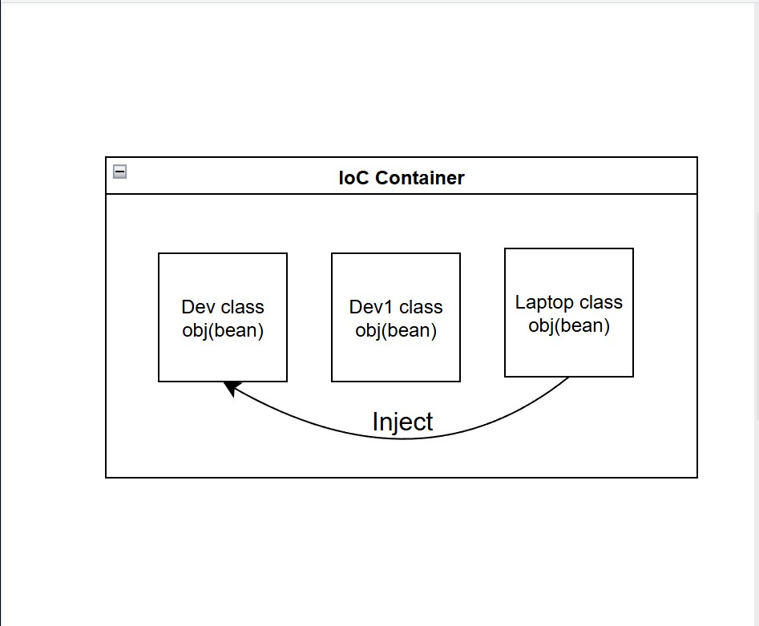

```
<?xml version="1.0" encoding="UTF-8"?>
<beans xmlns="http://www.springframework.org/schema/beans"
       xmlns:xsi="http://www.w3.org/2001/XMLSchema-instance"
       xsi:schemaLocation="
        http://www.springframework.org/schema/beans http://www.springframework.org/schema/beans/spring-beans.xsd">

    <!-- bean definitions here -->


    <!-- REQUIRED for @PostConstruct & @PreDestroy -->
    <!-- <bean class="org.springframework.context.annotation.CommonAnnotationBeanPostProcessor"/> -->
    <bean class="com.prajwal.Developer" id="developer">
        <!--<property name="age" value="26"/>-->
        <!--<constructor-arg name="age" value="26"/>-->
        <constructor-arg index="0" value="26"/>
        <constructor-arg index="1" value="6500"/>
        <constructor-arg index="2" ref="laptop"/>
    </bean>

    <bean id="developer1" class="com.prajwal.Developer">
        <property name="macbook" ref="laptop"/>
    </bean>
    <bean class="com.prajwal.Laptop" id="laptop">
        <property name="model" value="MacBook Air 13"/>
        <property name="manufacturer" value="Apple"/>
    </bean>
</beans>
```

```
<bean id="developer1" class="com.prajwal.Developer">
    <property name="macbook" ref="laptop"/>
</bean>
```

```
package com.prajwal;

public class Developer {

    private int age;
    private double salary;
    private Laptop macbook;

    public Developer(){
        System.out.println("Default Developer constructor Obj created in IoC.");
    }

    public Developer(int age, double salary, Laptop macbook){
        System.out.println("Developer constructor Obj created in IoC.");
        this.age = age;
        this.salary = salary;
        this.macbook = macbook;
    }

//    public void setAge(int age) {
//        this.age = age;
//    }
    public void setLaptop(Laptop macbook) {
        this.macbook = macbook;
    }

    public int getAge() {
        return age;
    }

    public double getSalary(){
        return salary;
    }

    public Laptop getLatop(){ return macbook; }

    public void build() {
        macbook.compiler();
        System.out.println("Dev writing code.");
    }
}
```

```
public void setLaptop(Laptop macbook) {
    this.macbook = macbook;
}
```

- Error: WARNING: Exception encountered during context initialization - cancelling refresh attempt: org.springframework.beans.factory.BeanCreationException: Error creating bean with name 'developer1' defined in class path resource [Spring.xml]: Invalid property 'macbook' of bean class [com.prajwal.Developer]: Bean property 'macbook' is not writable or has an invalid setter method. Does the parameter type of the setter match the return type of the getter?
  Exception in thread "main" org.springframework.beans.factory.BeanCreationException: Error creating bean with name 'developer1' defined in class path resource [Spring.xml]: Invalid property 'macbook' of bean class [com.prajwal.Developer]: Bean property 'macbook' is not writable or has an invalid setter method. Does the parameter type of the setter match the return type of the getter?
- Error: Spring failed to create developer1 because the property macbook has no matching setter method (setMacbook) in the Developer class.

- Spring XML maps <property> to setter methods (JavaBean rule)
- Property name comes from the method name after set.
- setLaptop() -> property name = laptop.
- setMacbook() -> property name = macbook.
- Field name and parameter name are ignored.
- Wrong property name -> setter not found -> dependency stays null.

```
//Spring.xml
<?xml version="1.0" encoding="UTF-8"?>
<beans xmlns="http://www.springframework.org/schema/beans"
       xmlns:xsi="http://www.w3.org/2001/XMLSchema-instance"
       xsi:schemaLocation="
        http://www.springframework.org/schema/beans http://www.springframework.org/schema/beans/spring-beans.xsd">

    <!-- bean definitions here -->


    <!-- REQUIRED for @PostConstruct & @PreDestroy -->
    <!-- <bean class="org.springframework.context.annotation.CommonAnnotationBeanPostProcessor"/> -->
    <bean class="com.prajwal.Developer" id="developer">
        <!--<property name="age" value="26"/>-->
        <!--<constructor-arg name="age" value="26"/>-->
        <constructor-arg index="0" value="26"/>
        <constructor-arg index="1" value="6500"/>
        <constructor-arg index="2" ref="laptop"/>
    </bean>

    <bean id="developer1" class="com.prajwal.Developer">
        <property name="laptop" ref="laptop"/>
    </bean>
    <bean class="com.prajwal.Laptop" id="laptop">
        <property name="model" value="MacBook Air 13"/>
        <property name="manufacturer" value="Apple"/>
    </bean>
</beans>
```

```
//Developer.java
package com.prajwal;

public class Developer {

    private int age;
    private double salary;
    private Laptop macbook;

    public Developer(){
        System.out.println("Default Developer constructor Obj created in IoC.");
    }

    public Developer(int age, double salary, Laptop macbook){
        System.out.println("Developer constructor Obj created in IoC.");
        this.age = age;
        this.salary = salary;
        this.macbook = macbook;
    }

//    public void setAge(int age) {
//        this.age = age;
//    }
    public void setLaptop(Laptop macbook) {
        this.macbook = macbook;
    }

    public int getAge() {
        return age;
    }

    public double getSalary(){
        return salary;
    }

    public Laptop getLatop(){ return macbook; }

    public void build() {
        macbook.compiler();
        System.out.println("Dev writing code.");
    }
}
```

```
//Laptop.java
package com.prajwal;

public class Laptop {

    private String model;
    private String manufacturer;

    public Laptop(){
        System.out.println("Laptop constructor Obj created in IoC.");
    }

    public void setModel(String model) {
        //MacBook Air 13
        this.model = model;
    }

    public void setManufacturer(String manufacturer) {
        //Apple
        this.manufacturer = manufacturer;
    }

    public void compiler() {
        System.out.println("Java compiler running.");
    }

    @Override
    public String toString() {
        return "model:"+model+", manufacturer:"+manufacturer;
    }
}
```

```
//App.java
package com.prajwal;

import org.springframework.context.ApplicationContext;
import org.springframework.context.support.ClassPathXmlApplicationContext;

/**
 * Hello world!
 *
 */
public class App {
    public static void main( String[] args ) {
        System.out.println( "Hello World!" );
        ApplicationContext context = new ClassPathXmlApplicationContext("Spring.xml");
        Developer dev = (Developer) context.getBean("developer");
        Developer dev1 = (Developer) context.getBean("developer1");
        System.out.println("dev age:"+dev.getAge());
        System.out.println("dev salary:"+dev.getSalary());
        System.out.println("dev laptop:"+dev.getLatop().toString());
        dev.build();
        System.out.println("dev1 age:"+dev1.getAge());
        System.out.println("dev1 Laptop:"+dev1.getLatop().toString());
        dev1.build(); // 💥 NullPointerException
    }
}
```

```
//output
Hello World!
Laptop constructor Obj created in IoC.
Developer constructor Obj created in IoC.
Default Developer constructor Obj created in IoC.
dev age:26
dev salary:6500.0
dev laptop:model:MacBook Air 13, manufacturer:Apple
Java compiler running.
Dev writing code.
dev1 age:0
dev1 Laptop:model:MacBook Air 13, manufacturer:Apple
Java compiler running.
Dev writing code.

Process finished with exit code 0
```

```
<bean id="developer1" class="com.prajwal.Developer">
    <property name="laptop" ref="laptop"/>
                        <!--Object ref-->
</bean>
<bean class="com.prajwal.Laptop" id="laptop">
    <property name="model" value="MacBook Air 13"/>
    <property name="manufacturer" value="Apple"/>
</bean>
```

- Hey Spring create the object.
- Create object for developer1.
- Spring will see the property -> Laptop ref="laptop".
- Spring will search the IoC container for laptop.
- Do we have any object name laptop.


- We are injecting the laptop object in the Dev1 class using setter injection.

- **_Error:_** laptop is not writable has no valid setter.
- Exception in thread "main" org.springframework.beans.factory.BeanCreationException: Error creating bean with name 'developer1' defined in class path resource [Spring.xml]: Invalid property 'laptop' of bean class [com.prajwal.Developer]: Bean property 'laptop' is not writable or has an invalid setter method. Does the parameter type of the setter match the return type of the getter?

```
package com.prajwal;

public class Developer {

    private int age;
    private double salary;
    private Laptop macbook;

    public Developer(){
        System.out.println("Default Developer constructor Obj created in IoC.");
    }

    public Developer(int age, double salary, Laptop macbook){
        System.out.println("Developer constructor Obj created in IoC.");
        this.age = age;
        this.salary = salary;
        this.macbook = macbook;
    }

//    public void setAge(int age) {
//        this.age = age;
//    }

// code that causes the exception. Commenting the setter
//    public void setLaptop(Laptop macbook) {
//        this.macbook = macbook;
//    }

    public int getAge() {
        return age;
    }

    public double getSalary(){
        return salary;
    }

    public Laptop getLatop(){ return macbook; }

    public void build() {
        macbook.compiler();
        System.out.println("Dev writing code.");
    }
}
```

- To fix use.
- **_\_Setter Injection:_**:\_\*\*

```
//Dev.java
package com.prajwal;

public class Dev {

    private Laptop laptop;

    //setter injection
    public void setLaptop(Laptop laptop) {
        this.laptop = laptop;
    }

    public Laptop getLaptop() {
        return laptop;
    }

    public void build() {
        laptop.compiler();
        System.out.println("Dev writing code.");
    }
}
```

```
//Laptop.java
package com.prajwal;

public class Laptop {

    private String model;
    private String manufacturer;

    public void setModel(String model) {
        this.model = model;
    }

    public void setManufacturer(String manufacturer) {
        this.manufacturer = manufacturer;
    }

    public String getModel() {
        return model;
    }

    public String getManufacturer() {
        return manufacturer;
    }

    public void compiler() {
        System.out.println("java compiler running.");
    }

    @Override
    public String toString() {
        return getManufacturer() + " " + getModel() ;
    }
}
```

```
//App.java
package com.prajwal;

import org.springframework.context.ApplicationContext;
import org.springframework.context.support.ClassPathXmlApplicationContext;

/**
 * Hello world!
 *
 */
public class App
{
    public static void main( String[] args ) {

        System.out.println( "Hello World!" );
        ApplicationContext context = new ClassPathXmlApplicationContext("Spring.xml");
        Dev dev = (Dev) context.getBean("dev");
        dev.build();
        System.out.println(dev.getLaptop());

    }
}
```

```
//Spring.xml
<?xml version="1.0" encoding="UTF-8"?>
<beans xmlns="http://www.springframework.org/schema/beans"
       xmlns:xsi="http://www.w3.org/2001/XMLSchema-instance"
       xsi:schemaLocation="
        http://www.springframework.org/schema/beans http://www.springframework.org/schema/beans/spring-beans.xsd">

    <!-- bean definitions here -->
    <bean name="dev" class="com.prajwal.Dev">
        <property name="laptop" ref="lap"/>
    </bean>
    <bean name="lap" class="com.prajwal.Laptop">
        <property name="model" value="MacBook Air 13"/>
        <property name="manufacturer" value="Apple"/>
    </bean>
</beans>
```

```
//pom.xml
<project xmlns="http://maven.apache.org/POM/4.0.0" xmlns:xsi="http://www.w3.org/2001/XMLSchema-instance"
  xsi:schemaLocation="http://maven.apache.org/POM/4.0.0 http://maven.apache.org/xsd/maven-4.0.0.xsd">
  <modelVersion>4.0.0</modelVersion>

  <groupId>com.prajwal</groupId>
  <artifactId>SpringCoreComplication</artifactId>
  <version>1.0-SNAPSHOT</version>
  <packaging>jar</packaging>

  <name>SpringCoreComplication</name>
  <url>http://maven.apache.org</url>

  <properties>
    <project.build.sourceEncoding>UTF-8</project.build.sourceEncoding>
  </properties>

  <dependencies>
    <dependency>
      <groupId>junit</groupId>
      <artifactId>junit</artifactId>
      <version>3.8.1</version>
      <scope>test</scope>
    </dependency>

    <!-- Source: https://mvnrepository.com/artifact/org.springframework/spring-context -->
    <dependency>
      <groupId>org.springframework</groupId>
      <artifactId>spring-context</artifactId>
      <version>6.2.9</version>
      <scope>compile</scope>
    </dependency>

  </dependencies>
</project>
```

```
//output:
Hello World!
java compiler running.
Dev writing code.
Apple MacBook Air 13

Process finished with exit code 0
```

- **_Constructor Injection:_**

```
//Dev.java
package com.prajwal;

public class Dev {

    private Laptop laptop;

    //setter injection
//    public void setLaptop(Laptop laptop) {
//        this.laptop = laptop;
//    }

    //constructor injection
    public Dev(Laptop laptop) {
        this.laptop = laptop;
    }

    public Laptop getLaptop() {
        return laptop;
    }

    public void build() {
        laptop.compiler();
        System.out.println("Dev writing code.");
    }
}
```

```
//Spring.xml
<?xml version="1.0" encoding="UTF-8"?>
<beans xmlns="http://www.springframework.org/schema/beans"
       xmlns:xsi="http://www.w3.org/2001/XMLSchema-instance"
       xsi:schemaLocation="
        http://www.springframework.org/schema/beans http://www.springframework.org/schema/beans/spring-beans.xsd">

    <!-- bean definitions here -->
    <bean name="dev" class="com.prajwal.Dev">
        <!--<property name="laptop" ref="lap"/>-->
        <constructor-arg ref="lap"/>
    </bean>
    <bean name="lap" class="com.prajwal.Laptop">
        <property name="model" value="MacBook Air 13"/>
        <property name="manufacturer" value="Apple"/>
    </bean>
</beans>
```

```
//output:
Hello World!
java compiler running.
Dev writing code.
Apple MacBook Air 13

Process finished with exit code 0
```

- Constructor injection -> Compulsary Dependencies.
- Setter injection -> Optional Dependencies.

## Autowiring:

- autowire="constructor"

```
<bean name="dev" class="com.prajwal.Dev" autowire="constructor">
    <!--<property name="laptop" ref="lap"/>-->
    <!--<constructor-arg ref="lap"/>-->
</bean>
```

- Spring looks at the constructors of Dev.
- It checks the parameter types.
- It searches the IoC container for beans matching those types.
- It automatically injects the matching bean(s).
- No <constructor-arg> is needed.

```
//Dev.java
package com.prajwal;

public class Dev {

    private Laptop laptop;

    //setter injection
//    public void setLaptop(Laptop laptop) {
//        this.laptop = laptop;
//    }

    //constructor injection
    public Dev(Laptop laptop) {
        this.laptop = laptop;
    }

    public Laptop getLaptop() {
        return laptop;
    }

    public void build() {
        laptop.compiler();
        System.out.println("Dev writing code.");
    }
}
```

```
//Laptop.java
package com.prajwal;

public class Laptop {

    private String model;
    private String manufacturer;

    public void setModel(String model) {
        this.model = model;
    }

    public void setManufacturer(String manufacturer) {
        this.manufacturer = manufacturer;
    }

    public String getModel() {
        return model;
    }

    public String getManufacturer() {
        return manufacturer;
    }

    public void compiler() {
        System.out.println("java compiler running.");
    }

    @Override
    public String toString() {
        return getManufacturer() + " " + getModel() ;
    }
}
```

```
//Spring.xml
<?xml version="1.0" encoding="UTF-8"?>
<beans xmlns="http://www.springframework.org/schema/beans"
       xmlns:xsi="http://www.w3.org/2001/XMLSchema-instance"
       xsi:schemaLocation="
        http://www.springframework.org/schema/beans http://www.springframework.org/schema/beans/spring-beans.xsd">

    <!-- bean definitions here -->
    <bean name="dev" class="com.prajwal.Dev" autowire="constructor">
        <!--<property name="laptop" ref="lap"/>-->
        <!--<constructor-arg ref="lap"/>-->
    </bean>
    <bean name="lap" class="com.prajwal.Laptop">
        <property name="model" value="MacBook Air 13"/>
        <property name="manufacturer" value="Apple"/>
    </bean>
</beans>
```

```
//output
Hello World!
java compiler running.
Dev writing code.
Apple MacBook Air 13

Process finished with exit code 0
```

- autowire="byType"

```
<bean name="dev" class="com.prajwal.Dev" autowire="byType">
    <!--<property name="laptop" ref="lap"/>-->
    <!--<constructor-arg ref="lap"/>-->
</bean>
```

- Spring creates the Dev object using the default constructor.
- It scans all setter methods in Dev.
- For each setter, Spring checks the parameter type.
- It searches the container for exactly One bean of that type.
- If found -> Spring automatically calls the setter.

```
//Dev.java
package com.prajwal;

public class Dev {

    private Laptop laptop;

    //setter injection
    public void setLaptop(Laptop laptop) {
        this.laptop = laptop;
    }

    //constructor injection
//    public Dev(Laptop laptop) {
//        this.laptop = laptop;
//    }

    public Laptop getLaptop() {
        return laptop;
    }

    public void build() {
        laptop.compiler();
        System.out.println("Dev writing code.");
    }
}
```

```
//Laptop.java
package com.prajwal;

public class Laptop {

    private String model;
    private String manufacturer;

    public void setModel(String model) {
        this.model = model;
    }

    public void setManufacturer(String manufacturer) {
        this.manufacturer = manufacturer;
    }

    public String getModel() {
        return model;
    }

    public String getManufacturer() {
        return manufacturer;
    }

    public void compiler() {
        System.out.println("java compiler running.");
    }

    @Override
    public String toString() {
        return getManufacturer() + " " + getModel() ;
    }
}
```

```
//Spring.xml
<?xml version="1.0" encoding="UTF-8"?>
<beans xmlns="http://www.springframework.org/schema/beans"
       xmlns:xsi="http://www.w3.org/2001/XMLSchema-instance"
       xsi:schemaLocation="
        http://www.springframework.org/schema/beans http://www.springframework.org/schema/beans/spring-beans.xsd">

    <!-- bean definitions here -->
    <bean name="dev" class="com.prajwal.Dev" autowire="byType">
        <!--<property name="laptop" ref="lap"/>-->
        <!--<constructor-arg ref="lap"/>-->
    </bean>
    <bean name="lap" class="com.prajwal.Laptop">
        <property name="model" value="MacBook Air 13"/>
        <property name="manufacturer" value="Apple"/>
    </bean>
</beans>
```

```
//output
Hello World!
java compiler running.
Dev writing code.
Apple MacBook Air 13

Process finished with exit code 0
```

- autowire="byName".

```
<bean name="dev" class="com.prajwal.Dev" autowire="byName">
    <!--<property name="laptop" ref="lap"/>-->
    <!--<constructor-arg ref="lap"/>-->
</bean>
```

- Spring creates the bean using the default constructor.
- Spring scans the class for setter methods.
- For each setter, Spring derives the property name from the setter method name.
- Eg: setLap() -> property name = lap
- Spring does not use the setter parameter name.
- Eg: setLap(Laptop xyz) -> xyz is ignored.
- Spring searches the container for a bean with id = property name. id = "lap".
- if a matching bean is found, Spring injects it by calling the setter.
- else is skipped silently.

```
//Spring.xml
<?xml version="1.0" encoding="UTF-8"?>
<beans xmlns="http://www.springframework.org/schema/beans"
       xmlns:xsi="http://www.w3.org/2001/XMLSchema-instance"
       xsi:schemaLocation="
        http://www.springframework.org/schema/beans http://www.springframework.org/schema/beans/spring-beans.xsd">

    <!-- bean definitions here -->
    <bean name="dev" class="com.prajwal.Dev" autowire="byName">
        <!--<property name="laptop" ref="lap"/>-->
        <!--<constructor-arg ref="lap"/>-->
    </bean>
    <bean name="lap" class="com.prajwal.Laptop">
        <property name="model" value="MacBook Air 13"/>
        <property name="manufacturer" value="Apple"/>
    </bean>
</beans>
```

```
//Dev.java
package com.prajwal;

public class Dev {

    private Laptop laptop;

    //setter injection
    public void setLap(Laptop laptop) {
        this.laptop = laptop;
    }

    //constructor injection
//    public Dev(Laptop laptop) {
//        this.laptop = laptop;
//    }

    public Laptop getLaptop() {
        return laptop;
    }

    public void build() {
        laptop.compiler();
        System.out.println("Dev writing code.");
    }
}
```

```
//Laptop.java
package com.prajwal;

public class Laptop {

    private String model;
    private String manufacturer;

    public void setModel(String model) {
        this.model = model;
    }

    public void setManufacturer(String manufacturer) {
        this.manufacturer = manufacturer;
    }

    public String getModel() {
        return model;
    }

    public String getManufacturer() {
        return manufacturer;
    }

    public void compiler() {
        System.out.println("java compiler running.");
    }

    @Override
    public String toString() {
        return getManufacturer() + " " + getModel() ;
    }
}
```

```
//output:
Hello World!
java compiler running.
Dev writing code.
Apple MacBook Air 13

Process finished with exit code 0

```

- **_Remaining types:_**
- no : <bean class="com.prajwal.Dev" autowire="no"/>
- autodetect (deprecated) : <bean class="com.prajwal.Dev" autowire="autodetect"/>
- **_autodetect:_**
- Tries constructor first, then setter.

## Adding complexities to Spring Core Project:

```
//pom.xml
<project xmlns="http://maven.apache.org/POM/4.0.0" xmlns:xsi="http://www.w3.org/2001/XMLSchema-instance"
  xsi:schemaLocation="http://maven.apache.org/POM/4.0.0 http://maven.apache.org/xsd/maven-4.0.0.xsd">
  <modelVersion>4.0.0</modelVersion>

  <groupId>com.prajwal</groupId>
  <artifactId>SpringCoreComplication</artifactId>
  <version>1.0-SNAPSHOT</version>
  <packaging>jar</packaging>

  <name>SpringCoreComplication</name>
  <url>http://maven.apache.org</url>

  <properties>
    <project.build.sourceEncoding>UTF-8</project.build.sourceEncoding>
  </properties>

  <dependencies>
    <dependency>
      <groupId>junit</groupId>
      <artifactId>junit</artifactId>
      <version>3.8.1</version>
      <scope>test</scope>
    </dependency>

    <!-- Source: https://mvnrepository.com/artifact/org.springframework/spring-context -->
    <dependency>
      <groupId>org.springframework</groupId>
      <artifactId>spring-context</artifactId>
      <version>6.2.9</version>
      <scope>compile</scope>
    </dependency>

  </dependencies>
</project>
```

```
//Computer.java
package com.prajwal;

public interface Computer {
    //abstract method
    void compiler();
}
```

```
//Desktop.java
package com.prajwal;

public class Desktop implements Computer {

    private String cpu;
    private String ram;
    private String storage;

    public Desktop() {
        System.out.println("Default Desktop Constructor");
    }

    public void setCpu(String cpu) {
        this.cpu = cpu;
    }

    public void setRam(String ram) {
        this.ram = ram;
    }

    public void setStorage(String storage) {
        this.storage = storage;
    }

    public String getCpu() {
        return cpu;
    }

    public String getRam() {
        return ram;
    }

    public String getStorage() {
        return storage;
    }

    @Override
    public void compiler() {
        System.out.println("java compiler running.");
    }

    @Override
    public String toString() {
        return getCpu() + "/" + getRam() + "/" + getStorage();
    }

}
```

```
//Laptop.java
package com.prajwal;

public class Laptop implements Computer {

    private String model;
    private String manufacturer;

    public Laptop() {
        System.out.println("Default Laptop Constructor");
    }

    public void setModel(String model) {
        this.model = model;
    }

    public void setManufacturer(String manufacturer) {
        this.manufacturer = manufacturer;
    }

    public String getModel() {
        return model;
    }

    public String getManufacturer() {
        return manufacturer;
    }

    @Override
    public void compiler() {
        System.out.println("java compiler running.");
    }

    @Override
    public String toString() {
        return getManufacturer() + "/" + getModel() ;
    }
}
```

```
//Dev.java
package com.prajwal;

public class Dev {

//    private Laptop laptop;
    private Computer device;

    //setter injection
//    public void setLap(Laptop laptop) {
//        this.laptop = laptop;
//    }

    public void setDevice(Computer device) {
        this.device = device;
    }

    public Computer getDevice() {
        return device;
    }

    //constructor injection
//    public Dev(Laptop laptop) {
//        this.laptop = laptop;
//    }

//    public Laptop getLaptop() {
//        return laptop;
//    }

    public void build() {
        device.compiler();
        System.out.println("Dev writing code.");
    }
}
```

```
//App.java
package com.prajwal;

import org.springframework.context.ApplicationContext;
import org.springframework.context.support.ClassPathXmlApplicationContext;

/**
 * Hello world!
 *
 */
public class App
{
    public static void main( String[] args ) {

        System.out.println( "Hello World!" );
        ApplicationContext context = new ClassPathXmlApplicationContext("Spring.xml");
        Dev dev = (Dev) context.getBean("dev");
        Dev dev1 = (Dev) context.getBean("dev1");
        dev.build();
        dev1.build();
        System.out.println(dev.getDevice().toString());
        System.out.println(dev1.getDevice().toString());
    }
}
```

```
//Spring.xml
<?xml version="1.0" encoding="UTF-8"?>
<beans xmlns="http://www.springframework.org/schema/beans"
       xmlns:xsi="http://www.w3.org/2001/XMLSchema-instance"
       xsi:schemaLocation="
        http://www.springframework.org/schema/beans http://www.springframework.org/schema/beans/spring-beans.xsd">

    <!-- bean definitions here -->
    <!--<bean name="dev" class="com.prajwal.Dev" autowire="byType">-->
    <bean name="dev" class="com.prajwal.Dev">
        <!--<property name="laptop" ref="lap"/>-->
        <!--<constructor-arg ref="lap"/>-->
        <property name="device" ref="lap1"/>
    </bean>
    <bean name="dev1" class="com.prajwal.Dev">
        <property name="device" ref="desk1"/>
    </bean>
    <bean name="lap1" class="com.prajwal.Laptop">
        <property name="model" value="MacBook Air 13"/>
        <property name="manufacturer" value="Apple"/>
    </bean>
    <bean class="com.prajwal.Desktop" name="desk1">
        <property name="cpu" value="Intel Core i7 12700F 12 Gen"/>
        <property name="ram" value=" Corsair Vengeance LPX 16GB (1x16GB) DDR4 3200MHZ UDIMM"/>
        <property name="storage" value="Western Digital WD Black SN7100 NVMe 500GB"/>
    </bean>
</beans>
```

```
//output:
Hello World!
Default Laptop Constructor
Default Desktop Constructor
java compiler running.
Dev writing code.
java compiler running.
Dev writing code.
Apple/MacBook Air 13
Intel Core i7 12700F 12 Gen/ Corsair Vengeance LPX 16GB (1x16GB) DDR4 3200MHZ UDIMM/Western Digital WD Black SN7100 NVMe 500GB

Process finished with exit code 0
```

- public class Laptop implements interface Computer.
- public class Desktop implements interface Computer.

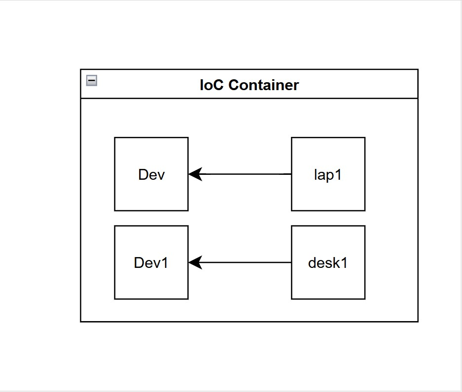

- But in Dev class we are using lap1 bean.
- And in Dev1 class we are using desk1 bean.
- You can interchange the beans.

```
//Computer.java
package com.prajwal;

public interface Computer {
    //abstract method
    void compiler();
}
```

```
//Desktop.java
package com.prajwal;

public class Desktop implements Computer {

    private String cpu;
    private String ram;
    private String storage;

    public Desktop() {
        System.out.println("Default Desktop Constructor");
    }

    public void setCpu(String cpu) {
        this.cpu = cpu;
    }

    public void setRam(String ram) {
        this.ram = ram;
    }

    public void setStorage(String storage) {
        this.storage = storage;
    }

    public String getCpu() {
        return cpu;
    }

    public String getRam() {
        return ram;
    }

    public String getStorage() {
        return storage;
    }

    @Override
    public void compiler() {
        System.out.println("java compiler running.");
    }

    @Override
    public String toString() {
        return getCpu() + " /" + getRam() + " /" + getStorage();
    }

}
```

```
//Laptop.java
package com.prajwal;

public class Laptop implements Computer {

    private String model;
    private String manufacturer;

    public Laptop() {
        System.out.println("Default Laptop Constructor");
    }

    public void setModel(String model) {
        this.model = model;
    }

    public void setManufacturer(String manufacturer) {
        this.manufacturer = manufacturer;
    }

    public String getModel() {
        return model;
    }

    public String getManufacturer() {
        return manufacturer;
    }

    @Override
    public void compiler() {
        System.out.println("java compiler running.");
    }

    @Override
    public String toString() {
        return getManufacturer() + " /" + getModel() ;
    }
}
```

```
//Dev.java
package com.prajwal;

public class Dev {

//    private Laptop laptop;
    private Computer device;

    //setter injection
//    public void setLap(Laptop laptop) {
//        this.laptop = laptop;
//    }

    public void setDevice(Computer device) {
        this.device = device;
    }

    public Computer getDevice() {
        return device;
    }

    //constructor injection
//    public Dev(Laptop laptop) {
//        this.laptop = laptop;
//    }

//    public Laptop getLaptop() {
//        return laptop;
//    }

    public void build() {
        device.compiler();
        System.out.println("Dev writing code.");
    }
}
```

```
//App.java
package com.prajwal;

import org.springframework.context.ApplicationContext;
import org.springframework.context.support.ClassPathXmlApplicationContext;

/**
 * Hello world!
 *
 */
public class App
{
    public static void main( String[] args ) {

        System.out.println( "Hello World!" );
        ApplicationContext context = new ClassPathXmlApplicationContext("Spring.xml");
        Dev dev = (Dev) context.getBean("dev");
        Dev dev1 = (Dev) context.getBean("dev1");
        dev.build();
        dev1.build();
        System.out.println("dev_device="+dev.getDevice().toString());
        System.out.println("dev1_device="+dev1.getDevice().toString());
    }
}
```

```
//Spring.xml
<?xml version="1.0" encoding="UTF-8"?>
<beans xmlns="http://www.springframework.org/schema/beans"
       xmlns:xsi="http://www.w3.org/2001/XMLSchema-instance"
       xsi:schemaLocation="
        http://www.springframework.org/schema/beans http://www.springframework.org/schema/beans/spring-beans.xsd">

    <!-- bean definitions here -->
    <!--<bean name="dev" class="com.prajwal.Dev" autowire="byType">-->
    <bean name="dev" class="com.prajwal.Dev">
        <!--<property name="laptop" ref="lap"/>-->
        <!--<constructor-arg ref="lap"/>-->
        <property name="device" ref="desk1"/>
        <!--<property name="device" ref="desk1"/>-->
    </bean>
    <bean name="dev1" class="com.prajwal.Dev">
        <property name="device" ref="lap1"/>
    </bean>
    <!--<bean name="lap1" class="com.prajwal.Laptop">-->
    <bean name="lap1" class="com.prajwal.Laptop">
        <property name="model" value="MacBook Air 13"/>
        <property name="manufacturer" value="Apple"/>
    </bean>
    <!--<bean class="com.prajwal.Desktop" name="desk1">-->
    <bean name="desk1" class="com.prajwal.Desktop">
        <property name="cpu" value="Intel Core i7 12700F 12 Gen"/>
        <property name="ram" value=" Corsair Vengeance LPX 16GB (1x16GB) DDR4 3200MHZ UDIMM"/>
        <property name="storage" value="Western Digital WD Black SN7100 NVMe 500GB"/>
    </bean>
</beans>
```

```
//pom.xml
<project xmlns="http://maven.apache.org/POM/4.0.0" xmlns:xsi="http://www.w3.org/2001/XMLSchema-instance"
  xsi:schemaLocation="http://maven.apache.org/POM/4.0.0 http://maven.apache.org/xsd/maven-4.0.0.xsd">
  <modelVersion>4.0.0</modelVersion>

  <groupId>com.prajwal</groupId>
  <artifactId>SpringCoreComplication</artifactId>
  <version>1.0-SNAPSHOT</version>
  <packaging>jar</packaging>

  <name>SpringCoreComplication</name>
  <url>http://maven.apache.org</url>

  <properties>
    <project.build.sourceEncoding>UTF-8</project.build.sourceEncoding>
  </properties>

  <dependencies>
    <dependency>
      <groupId>junit</groupId>
      <artifactId>junit</artifactId>
      <version>3.8.1</version>
      <scope>test</scope>
    </dependency>

    <!-- Source: https://mvnrepository.com/artifact/org.springframework/spring-context -->
    <dependency>
      <groupId>org.springframework</groupId>
      <artifactId>spring-context</artifactId>
      <version>6.2.9</version>
      <scope>compile</scope>
    </dependency>

  </dependencies>
</project>
```

```
//output:
Hello World!
Default Desktop Constructor
Default Laptop Constructor
java compiler running.
Dev writing code.
java compiler running.
Dev writing code.
dev_device=Intel Core i7 12700F 12 Gen / Corsair Vengeance LPX 16GB (1x16GB) DDR4 3200MHZ UDIMM /Western Digital WD Black SN7100 NVMe 500GB
dev1_device=Apple /MacBook Air 13

Process finished with exit code 0
```

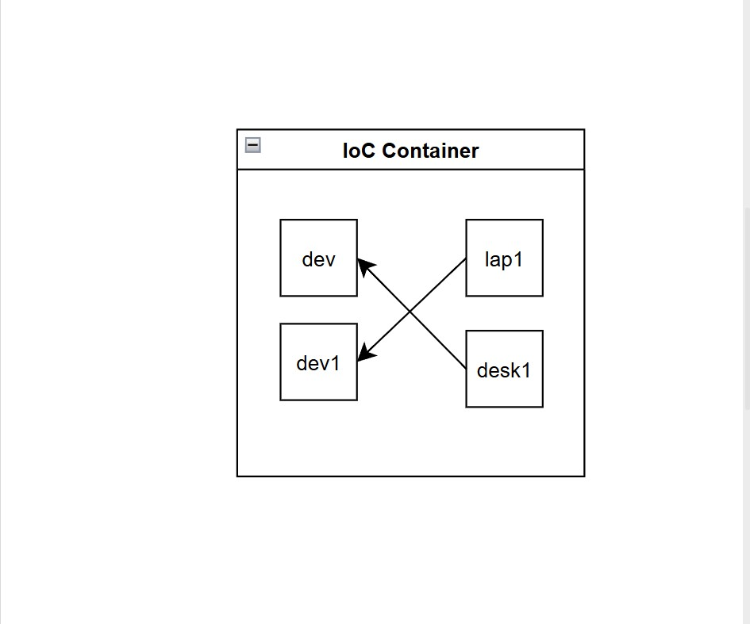

```
//errorcode
<beans>
    <bean name="dev" class="com.prajwal.Dev">
        <property name="device" ref="lap1">
    </bean>
    <bean name="lap1" class="com.prajwal.Laptop"/>
    <bean name="desk1" class="com.prajwal.Desktop"/>
</beans>
// to this
<beans>
    <bean name="dev" class="com.prajwal.Dev">
        <property name="device" ref="com">
    </bean>
    <bean name="com" class="com.prajwal.Laptop"/>
    <bean name="com" class="com.prajwal.Desktop"/>
</beans>
```

- **_*Example 2(Book):copy example from book.*_**

```
//pom.xml
<project xmlns="http://maven.apache.org/POM/4.0.0" xmlns:xsi="http://www.w3.org/2001/XMLSchema-instance"
  xsi:schemaLocation="http://maven.apache.org/POM/4.0.0 http://maven.apache.org/xsd/maven-4.0.0.xsd">
  <modelVersion>4.0.0</modelVersion>

  <groupId>com.prajwal</groupId>
  <artifactId>SpringComplex2</artifactId>
  <version>1.0-SNAPSHOT</version>
  <packaging>jar</packaging>

  <name>SpringComplex2</name>
  <url>http://maven.apache.org</url>

  <properties>
    <project.build.sourceEncoding>UTF-8</project.build.sourceEncoding>
  </properties>

  <dependencies>
    <dependency>
      <groupId>junit</groupId>
      <artifactId>junit</artifactId>
      <version>3.8.1</version>
      <scope>test</scope>
    </dependency>

    <!-- Source: https://mvnrepository.com/artifact/org.springframework/spring-context -->
    <dependency>
      <groupId>org.springframework</groupId>
      <artifactId>spring-context</artifactId>
      <version>6.2.9</version>
      <scope>compile</scope>
    </dependency>
  </dependencies>
</project>
```

```
//Desktop.java
package com.prajwal;

public class Desktop implements Computer {

    private String cpu;
    private String ram;
    private String Storage;

    public Desktop() {
        System.out.println("Default Constructor Desktop.");
    }

    public void setCpu( String cpu ) {
        this.cpu = cpu;
    }

    public void setRam( String ram ) {
        this.ram = ram;
    }

    public void setStorage( String Storage ) {
        this.Storage = Storage;
    }

    public String getCpu() {
        return this.cpu;
    }

    public String getRam() {
        return this.ram;
    }

    public String getStorage() {
        return this.Storage;
    }

    @Override
    public void compile() {
        System.out.println("Java compiler running.");
    }

    @Override
    public String toString() {
        return  "Desktop{" + "cpu=" + cpu + ", ram=" + ram + ", Storage=" + Storage + '}';
    }
}
```

```
//Laptop.java
package com.prajwal;

public class Laptop implements Computer {

    private String model;
    private String manufacturer;

    public Laptop() {
        System.out.println("Default constructor laptop.");
    }

    public void setModel( String model ) {
        this.model = model;
    }

    public void setManufacturer( String manufacturer ) {
        this.manufacturer = manufacturer;
    }

    public String getModel() {
        return this.model;
    }

    public String getManufacturer() {
        return this.manufacturer;
    }

    @Override
    public void compile() {
        System.out.println("Java compiler running.");
    }

    @Override
    public String toString() {
        return "Laptop{" + "model=" + model + ", manufacturer=" + manufacturer + '}';
    }
}
```

```
//Computer.java
package com.prajwal;

public interface Computer {
    //abstract method
    void compile();
}
```

```
//Dev.java
package com.prajwal;

public class Dev {
    private Computer comp;

    public Dev() {
        System.out.println("Default constructor dev.");
    }

    public void setComp(Computer comp) {
        this.comp = comp;
    }

    public Computer getComp() {
        return comp;
    }

    public void build() {
        comp.compile();
        System.out.println("dev working on code.");
    }
}
```

```
//App.java
package com.prajwal;

import org.springframework.context.ApplicationContext;
import org.springframework.context.support.ClassPathXmlApplicationContext;

/**
 * Hello world!
 *
 */
public class App
{
    public static void main( String[] args ) {
        System.out.println( "Hello World!" );

        ApplicationContext context = new ClassPathXmlApplicationContext("Spring.xml");
        Dev dev = (Dev) context.getBean("dev");
        System.out.println("dev comp="+dev.getComp().toString());
        dev.build();
    }
}
```

```
//Spring.xml
<?xml version="1.0" encoding="UTF-8"?>
<beans xmlns="http://www.springframework.org/schema/beans"
       xmlns:xsi="http://www.w3.org/2001/XMLSchema-instance"
       xsi:schemaLocation="
        http://www.springframework.org/schema/beans http://www.springframework.org/schema/beans/spring-beans.xsd">

    <!-- bean definitions here -->
    <bean name="dev" class="com.prajwal.Dev">
        <property name="comp" ref="lap1"/>
    </bean>

    <bean name="lap1" class="com.prajwal.Laptop">
        <property name="model" value="MacBook Air 13"/>
        <property name="manufacturer" value="Apple"/>
    </bean>

    <bean name="desk1" class="com.prajwal.Desktop">
        <property name="cpu" value="Intel Core i5-13400F"/>
        <property name="ram" value="Corsair Vengeance RGB Pro 16GB DDR4"/>
        <property name="storage" value="Samsung 980 NVMe M.2 SSD 250GB"/>
    </bean>
</beans>
```

```
//output:
Hello World!
Default constructor dev.
Default constructor laptop.
Default Constructor Desktop.
dev comp=Laptop{model=MacBook Air 13, manufacturer=Apple}
Java compiler running.
dev working on code.

Process finished with exit code 0
```

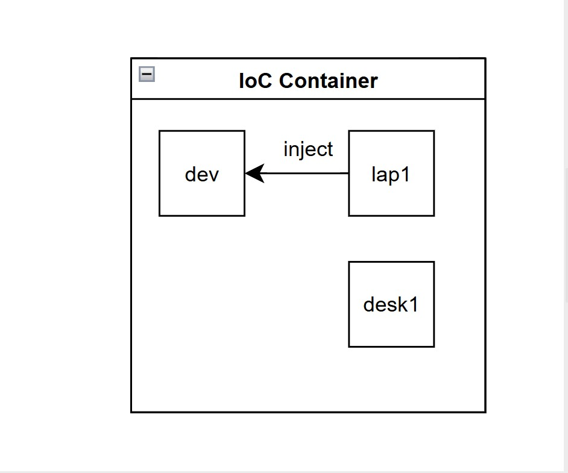

- But in dev bean we are using lap1 as property ref.
- You can change to property to Desk1.

```
//Spring.xml
<?xml version="1.0" encoding="UTF-8"?>
<beans xmlns="http://www.springframework.org/schema/beans"
       xmlns:xsi="http://www.w3.org/2001/XMLSchema-instance"
       xsi:schemaLocation="
        http://www.springframework.org/schema/beans http://www.springframework.org/schema/beans/spring-beans.xsd">

    <!-- bean definitions here -->
    <bean name="dev" class="com.prajwal.Dev">
        <property name="comp" ref="desk1"/>
    </bean>

    <bean name="lap1" class="com.prajwal.Laptop">
        <property name="model" value="MacBook Air 13"/>
        <property name="manufacturer" value="Apple"/>
    </bean>

    <bean name="desk1" class="com.prajwal.Desktop">
        <property name="cpu" value="Intel Core i5-13400F"/>
        <property name="ram" value="Corsair Vengeance RGB Pro 16GB DDR4"/>
        <property name="storage" value="Samsung 980 NVMe M.2 SSD 250GB"/>
    </bean>
</beans>
```

```
//App.java
package com.prajwal;

import org.springframework.context.ApplicationContext;
import org.springframework.context.support.ClassPathXmlApplicationContext;

/**
 * Hello world!
 *
 */
public class App
{
    public static void main( String[] args ) {
        System.out.println( "Hello World!" );

        ApplicationContext context = new ClassPathXmlApplicationContext("Spring.xml");
        Dev dev = (Dev) context.getBean("dev");
        System.out.println("dev comp="+dev.getComp().toString());
        dev.build();
    }
}

```

```
//output:
Hello World!
Default constructor dev.
Default Constructor Desktop.
Default constructor laptop.
dev comp=Desktop{cpu=Intel Core i5-13400F, ram=Corsair Vengeance RGB Pro 16GB DDR4, Storage=Samsung 980 NVMe M.2 SSD 250GB}
Java compiler running.
dev working on code.

Process finished with exit code 0
```


```
//Spring.xml
<?xml version="1.0" encoding="UTF-8"?>
<beans xmlns="http://www.springframework.org/schema/beans"
       xmlns:xsi="http://www.w3.org/2001/XMLSchema-instance"
       xsi:schemaLocation="
        http://www.springframework.org/schema/beans http://www.springframework.org/schema/beans/spring-beans.xsd">

    <!-- bean definitions here -->
    <bean name="dev" class="com.prajwal.Dev">
        <property name="com" ref="com"/>
    </bean>

    <bean name="com" class="com.prajwal.Laptop">
        <property name="model" value="MacBook Air 13"/>
        <property name="manufacturer" value="Apple"/>
    </bean>

    <bean name="desk1" class="com.prajwal.Desktop">
        <property name="cpu" value="Intel Core i5-13400F"/>
        <property name="ram" value="Corsair Vengeance RGB Pro 16GB DDR4"/>
        <property name="storage" value="Samsung 980 NVMe M.2 SSD 250GB"/>
    </bean>
</beans>
```

```
//App.java
package com.prajwal;

import org.springframework.context.ApplicationContext;
import org.springframework.context.support.ClassPathXmlApplicationContext;

/**
 * Hello world!
 *
 */
public class App
{
    public static void main( String[] args ) {
        System.out.println( "Hello World!" );

        ApplicationContext context = new ClassPathXmlApplicationContext("Spring.xml");
        Dev dev = (Dev) context.getBean("dev");
        System.out.println("dev comp="+dev.getCom().toString());
        dev.build();
    }
}
```

```
//output:
Hello World!
Default constructor dev.
Default constructor laptop.
Default Constructor Desktop.
dev comp=Laptop{model=MacBook Air 13, manufacturer=Apple}
Java compiler running.
dev working on code.

Process finished with exit code 0
```

- **_<property name="com" ref="com"/>:_**
- property name="com" -> looks for setter setCom().
- ref="com" -> looks for bean with name com.
- Finds:

```
<bean name="com" class="com.prajwal.Laptop"/>
```

- if we comment the <property name="com" ref="com">
- Null pointerException

```
<?xml version="1.0" encoding="UTF-8"?>
<beans xmlns="http://www.springframework.org/schema/beans"
       xmlns:xsi="http://www.w3.org/2001/XMLSchema-instance"
       xsi:schemaLocation="
        http://www.springframework.org/schema/beans http://www.springframework.org/schema/beans/spring-beans.xsd">

    <!-- bean definitions here -->
    <bean name="dev" class="com.prajwal.Dev">
        <!--<property name="com" ref="com"/>-->
        <!--Comment the property to cause nullpointerException-->
    </bean>

    <bean name="com" class="com.prajwal.Laptop">
        <property name="model" value="MacBook Air 13"/>
        <property name="manufacturer" value="Apple"/>
    </bean>

    <bean name="desk1" class="com.prajwal.Desktop">
        <property name="cpu" value="Intel Core i5-13400F"/>
        <property name="ram" value="Corsair Vengeance RGB Pro 16GB DDR4"/>
        <property name="storage" value="Samsung 980 NVMe M.2 SSD 250GB"/>
    </bean>
</beans>
```

- Spring says it will not automatically wire -> user will have to tell me to do it.(Default behaviour.)
- Spring's 'I won't auto-wire' rule explains why NullPointerException occurs.
- They are two sides of the same cause.
- Because Spring does not auto-wire dependencies unless explicitly configured, the field remains 'null', and Java throws a NullPointerException when <property> are not mentioned.

```
//Error code: Spring.xml
<?xml version="1.0" encoding="UTF-8"?>
<beans xmlns="http://www.springframework.org/schema/beans"
       xmlns:xsi="http://www.w3.org/2001/XMLSchema-instance"
       xsi:schemaLocation="
        http://www.springframework.org/schema/beans http://www.springframework.org/schema/beans/spring-beans.xsd">

    <!-- bean definitions here -->
    <bean name="dev" class="com.prajwal.Dev" autowire="byName">
        <!--<property name="com" ref="com"/>-->
        <!--Comment the property to cause nullpointerException-->
    </bean>

    <bean name="comp" class="com.prajwal.Laptop">
        <property name="model" value="MacBook Air 13"/>
        <property name="manufacturer" value="Apple"/>
    </bean>

    <bean name="comp" class="com.prajwal.Desktop">
        <property name="cpu" value="Intel Core i5-13400F"/>
        <property name="ram" value="Corsair Vengeance RGB Pro 16GB DDR4"/>
        <property name="storage" value="Samsung 980 NVMe M.2 SSD 250GB"/>
    </bean>
</beans>
```

- It fails because two beans are defined with the same name 'comp'.
- Spring requires every bean name/id in a <beans> file to be unique.

## Autowire

- **Common:**

```
//Desktop.java
package com.prajwal;

public class Desktop implements Computer {

    private String cpu;
    private String ram;
    private String Storage;

    public Desktop() {
        System.out.println("Default Constructor Desktop.");
    }

    public void setCpu( String cpu ) {
        this.cpu = cpu;
    }

    public void setRam( String ram ) {
        this.ram = ram;
    }

    public void setStorage( String Storage ) {
        this.Storage = Storage;
    }

    public String getCpu() {
        return this.cpu;
    }

    public String getRam() {
        return this.ram;
    }

    public String getStorage() {
        return this.Storage;
    }

    @Override
    public void compile() {
        System.out.println("Java compiler running.");
    }

    @Override
    public String toString() {
        return  "Desktop{" + "cpu=" + cpu + ", ram=" + ram + ", Storage=" + Storage + '}';
    }
}
```

```
//Laptop.java
package com.prajwal;

public class Laptop implements Computer {

    private String model;
    private String manufacturer;

    public Laptop() {
        System.out.println("Default constructor laptop.");
    }

    public void setModel( String model ) {
        this.model = model;
    }

    public void setManufacturer( String manufacturer ) {
        this.manufacturer = manufacturer;
    }

    public String getModel() {
        return this.model;
    }

    public String getManufacturer() {
        return this.manufacturer;
    }

    @Override
    public void compile() {
        System.out.println("Java compiler running.");
    }

    @Override
    public String toString() {
        return "Laptop{" + "model=" + model + ", manufacturer=" + manufacturer + '}';
    }
}
```

```
//Computer.java
package com.prajwal;

public interface Computer {
    //abstract method
    void compile();
}
```

```
//Dev.java
package com.prajwal;

public class Dev {
    private Computer comp;

    public Dev() {
        System.out.println("Default constructor dev.");
    }

    public void setComp(Computer comp) {
        this.comp = comp;
    }

    public Computer getComp() {
        return comp;
    }

    public void build() {
        comp.compile();
        System.out.println("dev working on code.");
    }
}
```

- **_byName:_**

```
<bean name="dev" class="com.prajwal.Dev" autowire="byName">
</bean>
```

- 'byName' autowiring works by matching the bean name with the setter (property) name in the target class.
- Eg: if Dev has setComp(). Spring looks for bean named comp and injects it.

```
//Spring.xml
<?xml version="1.0" encoding="UTF-8"?>
<beans xmlns="http://www.springframework.org/schema/beans"
       xmlns:xsi="http://www.w3.org/2001/XMLSchema-instance"
       xsi:schemaLocation="
        http://www.springframework.org/schema/beans http://www.springframework.org/schema/beans/spring-beans.xsd">

    <!-- bean definitions here -->
    <bean name="dev" class="com.prajwal.Dev" autowire="byName">
        <!--<property name="com" ref="com"/>-->
        <!--Comment the property to cause nullpointerException-->
    </bean>

    <bean name="comp" class="com.prajwal.Laptop">
        <property name="model" value="MacBook Air 13"/>
        <property name="manufacturer" value="Apple"/>
    </bean>

    <bean name="comp1" class="com.prajwal.Desktop">
        <property name="cpu" value="Intel Core i5-13400F"/>
        <property name="ram" value="Corsair Vengeance RGB Pro 16GB DDR4"/>
        <property name="storage" value="Samsung 980 NVMe M.2 SSD 250GB"/>
    </bean>
</beans>
```

```
//App.java
package com.prajwal;

import org.springframework.context.ApplicationContext;
import org.springframework.context.support.ClassPathXmlApplicationContext;

/**
 * Hello world!
 *
 */
public class App
{
    public static void main( String[] args ) {
        System.out.println( "Hello World!" );

        ApplicationContext context = new ClassPathXmlApplicationContext("Spring.xml");
        Dev dev = (Dev) context.getBean("dev");
        System.out.println("dev comp="+dev.getComp().toString());
        dev.build();
    }
}
```

```
//output:
Hello World!
Default constructor dev.
Default constructor laptop.
Default Constructor Desktop.
dev comp=Laptop{model=MacBook Air 13, manufacturer=Apple}
Java compiler running.
dev working on code.

Process finished with exit code 0
```

- Example2:

```
//Spring.xml
<?xml version="1.0" encoding="UTF-8"?>
<beans xmlns="http://www.springframework.org/schema/beans"
       xmlns:xsi="http://www.w3.org/2001/XMLSchema-instance"
       xsi:schemaLocation="
        http://www.springframework.org/schema/beans http://www.springframework.org/schema/beans/spring-beans.xsd">

    <!-- bean definitions here -->
    <bean name="dev" class="com.prajwal.Dev" autowire="byName">
        <!--<property name="com" ref="com"/>-->
        <!--Comment the property to cause nullpointerException-->
    </bean>

    <bean name="comp" class="com.prajwal.Laptop">
        <property name="model" value="MacBook Air 13"/>
        <property name="manufacturer" value="Apple"/>
    </bean>

    <bean name="comp1" class="com.prajwal.Desktop">
        <property name="cpu" value="Intel Core i5-13400F"/>
        <property name="ram" value="Corsair Vengeance RGB Pro 16GB DDR4"/>
        <property name="storage" value="Samsung 980 NVMe M.2 SSD 250GB"/>
    </bean>
</beans>
```

```
//Dev.java
package com.prajwal;

public class Dev {
    private Computer comp;

    public Dev() {
        System.out.println("Default constructor dev.");
    }

    public void setComp1(Computer comp) {
        this.comp = comp;
    }

    public Computer getComp1() {
        return comp;
    }

    public void build() {
        comp.compile();
        System.out.println("dev working on code.");
    }
}
```

```
//App.java
package com.prajwal;

public class Dev {
    private Computer comp;

    public Dev() {
        System.out.println("Default constructor dev.");
    }

    public void setComp1(Computer comp) {
        this.comp = comp;
    }

    public Computer getComp1() {
        return comp;
    }

    public void build() {
        comp.compile();
        System.out.println("dev working on code.");
    }
}
```

```
//output:
Hello World!
Default constructor dev.
Default Constructor Desktop.
Default constructor laptop.
dev comp=Desktop{cpu=Intel Core i5-13400F, ram=Corsair Vengeance RGB Pro 16GB DDR4, Storage=Samsung 980 NVMe M.2 SSD 250GB}
Java compiler running.
dev working on code.

Process finished with exit code 0
```

- **_byType:_**
- 'byType' autowiring works by matching the data type of the property with a single bean of the same type in the Spring container.
- If more than one bean of the same type exists, Spring throws an ambiguity error and fails to autowire.
- byType autowiring in Spring checks the type of the setter parameter.

```
//Spring.xml
<?xml version="1.0" encoding="UTF-8"?>
<beans xmlns="http://www.springframework.org/schema/beans"
       xmlns:xsi="http://www.w3.org/2001/XMLSchema-instance"
       xsi:schemaLocation="
        http://www.springframework.org/schema/beans http://www.springframework.org/schema/beans/spring-beans.xsd">

    <!-- bean definitions here -->
    <bean name="dev" class="com.prajwal.Dev" autowire="byType">
        <!--<property name="com" ref="com"/>-->
        <!--Comment the property to cause nullpointerException-->
    </bean>

    <bean name="comp" class="com.prajwal.Laptop">
        <property name="model" value="MacBook Air 13"/>
        <property name="manufacturer" value="Apple"/>
    </bean>

    <bean name="comp1" class="com.prajwal.Desktop">
        <property name="cpu" value="Intel Core i5-13400F"/>
        <property name="ram" value="Corsair Vengeance RGB Pro 16GB DDR4"/>
        <property name="storage" value="Samsung 980 NVMe M.2 SSD 250GB"/>
    </bean>
</beans>
```

```
//Dev.java
package com.prajwal;

public class Dev {
//    private Computer comp;
    private Desktop comp; //change for byType

    public Dev() {
        System.out.println("Default constructor dev.");
    }

//    public void setComp1(Computer comp) {
//        this.comp = comp;
//    }

//    public Computer getComp1() {
//        return comp;
//    }

    public void setComp(Desktop comp) {
        this.comp = comp;
    }

    public Desktop getComp() {
        return comp;
    }

    public void build() {
        comp.compile();
        System.out.println("dev working on code.");
    }
}
```

```
//App.java
package com.prajwal;

import org.springframework.context.ApplicationContext;
import org.springframework.context.support.ClassPathXmlApplicationContext;

/**
 * Hello world!
 *
 */
public class App {
    public static void main( String[] args ) {
        System.out.println( "Hello World!" );

        ApplicationContext context = new ClassPathXmlApplicationContext("Spring.xml");
        Dev dev = (Dev) context.getBean("dev");
        System.out.println("dev comp="+dev.getComp().toString());
        dev.build();
    }
}
```

```
//output:
Hello World!
Default constructor dev.
Default Constructor Desktop.
Default constructor laptop.
dev comp=Desktop{cpu=Intel Core i5-13400F, ram=Corsair Vengeance RGB Pro 16GB DDR4, Storage=Samsung 980 NVMe M.2 SSD 250GB}
Java compiler running.
dev working on code.

Process finished with exit code 0
```

- **_constructor:_**
