# Spring And Spring Boot.

## What is Spring?

## IoC (Inversion of Control):

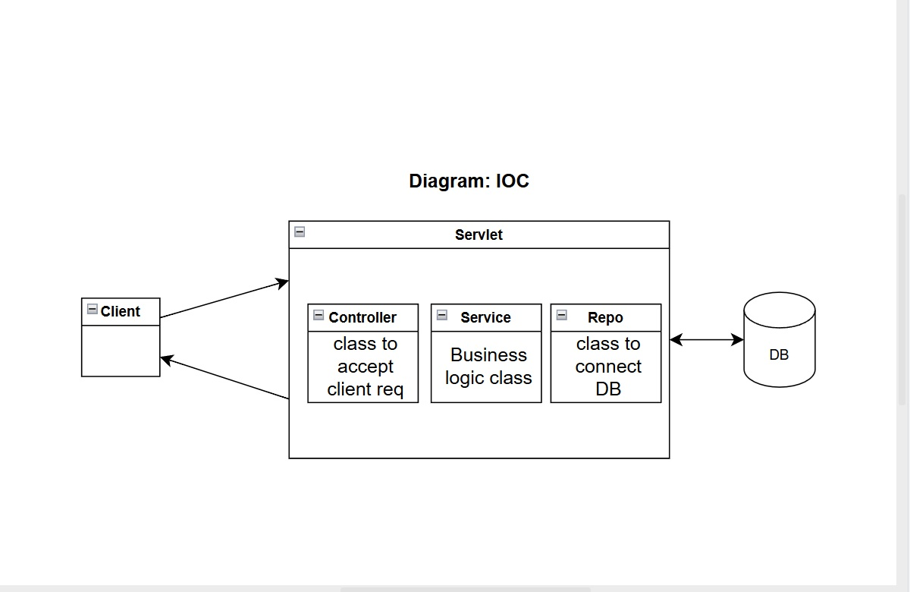

### example:

```
class Controller {
    Service service = new Service();
}
```

```
class Service {
    Repo repo = new Repo();
}
```

```
import java.sql.Connection;
import java.sql.DriverManager;
class Repo {
    public Repo() {
        String url = "jdbc:mysql://localhost:3306/testdb";
        String username = "root";
        String password = "password";

        try(Connection con = DriverManager.getConnection(url,username,password)) {
            System.out.println("Database connected successfully");
        } catch(Exception e) {
            e.printStackTrace();
        }
    }
}
```

- Typically, we developers create objects by ourselves using the new keyword.
- But what if we give that control to someone else (a framework)?
- - This concept is called IoC.
- IoC(Inversion Of Control) is principle.
- IoC means you don't create objects yourself -- the framework creates and manages them for you
- To achieve IoC, we use a technique called DI(Dependency Injection).
- DI is the actual implementation of IoC (a Concrete Technique).

### example:

```
class Controller {
    //instead of doing.
    Service service = new Service();

    //you can ask Spring to inject -> you mention the reference -> Spring will give you the object.
}
```

## 3 Techniques to achieve Dependency Injection:

### Without Dependency Injection:

```
class Controller {
    private Service service = new Service();

    public void handleRequest() {
        service.doSomeThing();
    }
}

class Service {
    public void doSomeThing() {
        System.out.println("doing work");
    }
}
```

### 1. Constructor Injection:

```
class Controller {
    Service service;

    //Constructor
    Controller(Service serv) { //reference of service(serv)
        this.service = serv;
    }

    //usage
    public void handleRequest() {
        service.doSomeThing();
    }

}

class Service {
    public void doSomeThing() {
        System.out.println("doing work");
    }
}
```

### 2. Setter Method Injection:

```
public class Controller {
    private Service service;

    //Setter Method
    public void setService(Service serv) {
        this.service = serv;
    }

    //usage
    public void handleRequest() {
        service.doSomeThing();
    }
}

public class Service {
    public void doSomeThing() {
        System.out.println("Doing SomeWork.");
    }
}
```

### 3. Field Injection (Not Recommended):

- Field Injection = dependency is injected directly into a class variable(field), instead of through a constructor or setter method.
- Most commonly seen in Spring/Spring Boot using the '@Autowired' annotation.

```
public class Controller {
    @Autowired
    private Service service; //interface

    public void handleRequest() {
        service.doSomeThing();
    }
}

public class Service {
    public void doSomeThing() {
        System.out.println("doing somework");
    }
}
```

- Loose Coupling: you don't have a concrete implementation of one class in another. You code for interfaces.
- What it means:
- You do not create objects using the new keyword.
- You do not depend on a specific class.
- You declare the dependency as an interface.
- Spring injects the actual implementation at runtime.

### example :

1. Without Loose Coupling (tight coupling):

```
@Component
class UserService {
    private MySQLRepository repo = new MySQLRepository();
}
// problem: UserService is stuck with MySQLRepository.
```

2. With Loose Coupling (Field Injection):

```
@Component
class UserService {
    @Autowired
    private UserRepository repo; // interface
}

@Repository
class MySQLRepository implements UserRepository { }
// What this means:
// - UserService does not know which class is used.
// - Spring injects the correct implementation.
// - You can change the implementation without touching UserService
```

- Someone else is injecting the object in your app. -> Spring(IoC container)

## Spring Boot:

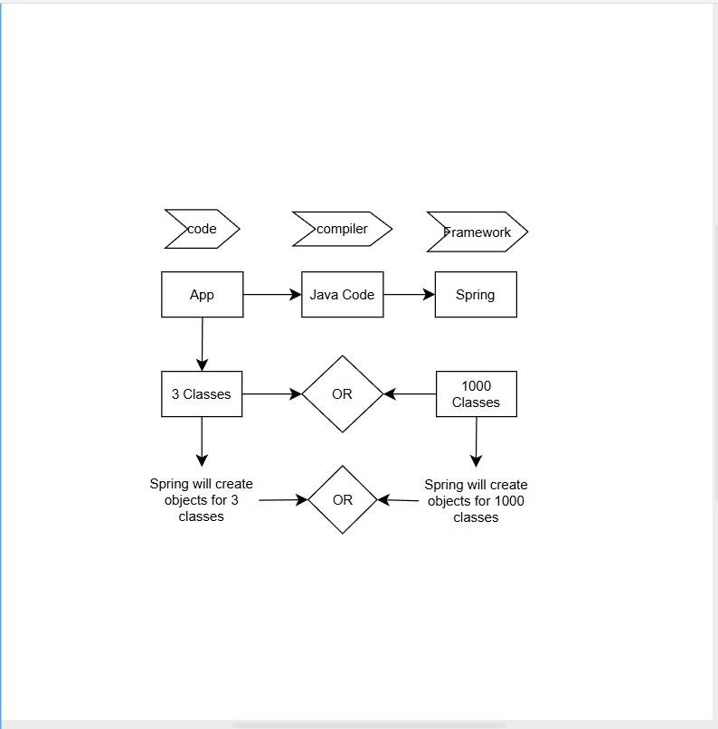

### Question:

- Do you want Spring to handle all the classes?
- Most of the time, we don't need objects for all the classes.
- We need objects for a selected few classes.

### How do you talk to your Spring Framework and say -> Don't create objects for everything?

- I just want a few classes.
- We do it in a configuration file -> xml or property file. (talking to framework)

- Just because you are using Spring, -> you will not be able to run your code on the first go.
- You will have to first work with the 'Configuration file'.
- For web apps, -> you need a server; -> you can use Tomcat.
- If you build a web app in Spring, -> you need to have Tomcat configured and installed.

## Spring Boot:

- Let me take care of your config problems.
- Get your project running in a few minutes.
- Build projects in less time.

## Note: In Spring, you do the configurations manually.

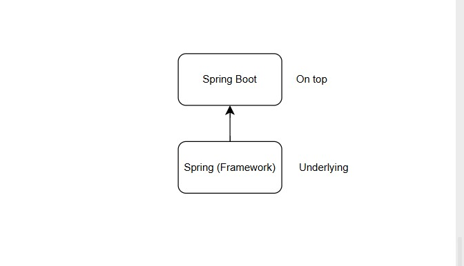

- We can build apps using Spring Framework.
- Or if you want to make it easy, use Spring Boot. (opinionated Framework)

## Spring Boot is an opinionated framework, which means:

- The framework decides defaults for you.
- You follow its way of doing things.
- Fewer choices, fewer configurations.

- Means: Spring Boot will give you certain things the way it wants.
- And you can simply use it to run your apps.

## Spring Initializer (steps):

- https://start.spring.io
- Project (Build Tool): Maven.
- Language: Java.
- Spring Boot (Version): 3.2.5
- Project Metadata:
- Group: com.bagewadi
- Artifact: DemoApp
- Name: DemoApp
- Description: Demo project for Spring Boot
- Package name: com.bagewadi.DemoApp
- Packaging (type): jar(selected) war
- Java (version): 22 21(selected) 17

## Web apps:

- Deploy on the cloud.
- You need a (.War) file (Web Archive).
- And then you push your war file into Tomcat to run it.

- You can create a Jar file, -> Jar doesn't run on Tomcat.
- What if you don't need an external Tomcat?
- What if the project itself has a Tomcat?
- Spring Boot says if you want to build a web app, -> you will get embedded Tomcat.

## Dependencies:

- We talked about Spring. -> There are multiple projects inside Spring, and we don't need all.
- Depending on your use case, you will choose one.

## Add Dependencies:

- Example: I want to build a web app, select -> Spring web.
- Add Database -> JPA.
- Click on generate.
- Download and Unzip.
- Goto -> IDE -> open downloaded project.
- If you expand the dependencies.
- Jackson: (Convert Java objects to JSON) automatically.
- Micrometer: Used for application metrics (Monitoring).
- - Collects metrics like:
  - request count
  - response time
  - memory / CPU usage
  - custom counters
  - Sends them to monitoring tools (Prometheus, Grafana, etc.)
- Embedded Tomcat
- Spring Boot
- Spring Framework
- Spring Core
- all things needed for the Spring project.

## Using the above steps and information, create a DemoApp.

- Trying to create and run the project.
- (Steps):
- - Steps in Spring initializer.
  - Add the dependency (Spring Web).
  - And try to run the Project.
  - Observe the (External dependencies) and try to find the above dependencies.
  - Unzip the project folder.
  - Open the project with IntelliJ IDEA.
  - Let Maven download the dependencies.
  - Goto -> src (folder) -> main -> java -> com.prajwal.demo -> DemoApplication.java

```
//auto-generated
package com.prajwal.demo;

import org.springframework.boot.SpringApplication;
import org.springframework.boot.autoconfigure.SpringBootApplication;

@SpringBootApplication
public class DemoApplication {
    public static void main(String[] args) {
        SpringApplication.run(DemoApplication.class, args);
    }
}
```

- Current file -> run.
- Goto -> Chrome -> localhost:8080
- Observe the 'Whitelabel Error Page' (more on that).
- - Servlet or anyother app before.
- Create a class Hello.
- Create -> src (folder) -> main -> java -> com.prajwal.demo -> Controller (Package)
- Create class Hello.java in the controller package.

```
package com.prajwal.demo.Controller;

import org.springframework.web.bind.annotation.RequestMapping;
import org.springframework.web.bind.annotation.RestController;

@RestController
public class Hello {
    @RequestMapping("/") // "/" maps to homepage
    public String greet() {
        return "Hello World!";
    }
}
```

- Running Project: Goto -> src (folder) -> main -> java -> com.prajwal.demo -> DemoApplication.java -> Run (automatically compiling and running the project on the embedded Tomcat)
- Goto -> Chrome -> localhost:8080
- Observe the output on the screen: "Hello World!".

## Spring Boot Issues:

- Default.
- It will do a lot of stuff for you.
- Convenience over Configuration.
- In Spring, you will have to configure a lot of the stuff.
- Spring Boot will give you extra things that you might need or might not.
- It gives you a lot of default stuff.
- If you want more control over your stuff, use Spring.
- Debatable.
- Convenient Spring Boot.

## Dependency Injection using Spring Boot:

- Create a 'Core Spring Boot app' using the Spring Initializr (https://start.spring.io)
- Repeat the steps in [Go to Spring Initializer (steps)](#spring-initializer-steps)
- Maven -> java -> 3.2.5,(3.5.5)
- Group -> com.prajwal
- Name -> MyApp
- Packaging -> Jar
- Java -> 21
- (No Dependencies!) Please don't add any Dependencies.

```
package com.prajwal.MyApp;

import org.springframework.boot.SpringApplication;
import org.springframework.boot.autoconfigure.SpringBootApplication;


@SpringBootApplication
public class MyAppApplication {
    public static void main(String[] args) {
        SpringApplication.run(MyAppApplication.class, args);
        // It creates a container responsible for creating and running an IoC container.
        // ChatGpt corrected: It starts the Spring Boot Application and initializes the IoC container.
    }
}
```

- SpringApplication.run() bootstraps the Spring Boot app and creates the IoC container.

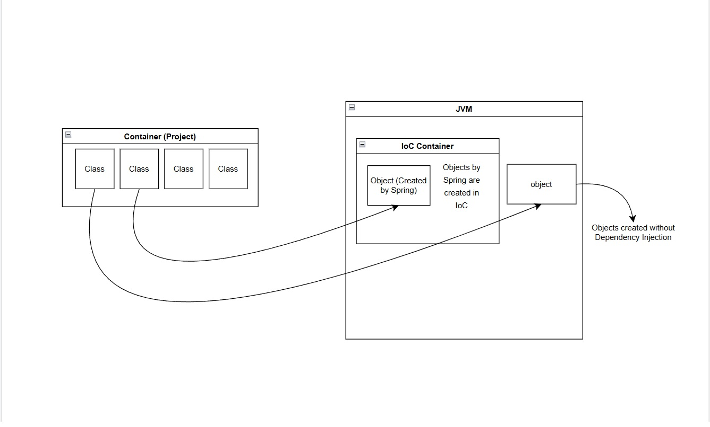

## Spring Boot without Dependency Injection:

```
package com.prajwal.demo.Controller;

public class Calculator {
    public int calculate(int a, int b, String opr){
        switch (opr){
            case "+": {
                return a+b;
            }
            case "-": {
                return a-b;
            }
            case "*": {
                return a*b;
            }
            case "/": {
                if(b==0){
                    throw new ArithmeticException("Division by zero");
                }
                return a/b;
            }
            case "%": {
                return a%b;
            }
            default: {
                throw new  IllegalArgumentException("Invalid operation");
            }
        }
    }
}
```

```
package com.prajwal.demo;

import com.prajwal.demo.Controller.Calculator;
import org.springframework.boot.SpringApplication;
import org.springframework.boot.autoconfigure.SpringBootApplication;

import java.util.Calendar;

@SpringBootApplication
public class DemoApplication {

	public static void main(String[] args) {
		SpringApplication.run(DemoApplication.class, args); //responsible for creating and running IoC Container

		//object without Dependency Injection
		Calculator calculator = new Calculator();
		System.out.println("calculator:"+calculator.calculate(25,25,"+"));
	}

}

```

## Before Spring:

- To talk to the container, we need to (get a reference to the container).
- To get a Reference to the IoC container, we must know the type of the container.
- Which is Application Context.
- ApplicationContext is the central Spring IoC container that creates, manages, and injects beans in a Spring application.
- SpringApplication.run() method creates and returns an object of type ApplicationContext.

```
@SpringBootApplication
public class MyAppApplication {
    public static void main(String[] args) {
        ApplicationContext context = SpringApplication.run(MyAppApplication.class, args);
        Service object = context.getBean(Service.class); //Spring creates the Service object of Service in my IoC container.
        object.display();
    }
}
// Service must be a Spring Bean.
@Service //or @Component
public class Service {
    public void display() {
        System.out.println("Hello from Service");
    }
}
```

## What is getBean():

- The purpose of 'getBean()' is to retrieve an instance of a Bean managed by the Spring IoC(Inversion of Control).

## Spring:

- Spring, by default, will not create objects for all the classes (Eg, 1000 classes), and also we don't want that.
- Spring says, "You tell me which class objects you want".
- "And I'll manage them for you."
- How will you talk to Spring? -> You may need a configuration, typically via a '@Configuration' class.
- OR in Spring Boot. -> We can use an Annotation called '@Component'.

### @Component:

- @Component annotation marks a class as a Spring Bean so that Spring can create and manage its object.
- Spring identifies this class during component scanning and registers it as a bean definition in the ApplicationContext(Spring IoC container).
- Spring creates the object and manages its lifecycle (creation, dependency injection, destruction).

```
//PaymentService.java
package com.prajwal.MyApp1.Service;

import org.springframework.stereotype.Component;

@Component
public class PaymentService {
    public void run() {
        System.out.println("PaymentService is running");
    }
}
```

```
//MyApp1Application.java
package com.prajwal.MyApp1;

import com.prajwal.MyApp1.Service.PaymentService;
import org.springframework.boot.SpringApplication;
import org.springframework.boot.autoconfigure.SpringBootApplication;
import org.springframework.context.ApplicationContext;

@SpringBootApplication
public class MyApp1Application {

	public static void main(String[] args) {
		ApplicationContext context = SpringApplication.run(MyApp1Application.class, args);

		PaymentService paymentService = context.getBean(PaymentService.class);
		paymentService.run();
	}

}
```

## What is ApplicationContext:

- ApplicationContext is a central interface of the Spring Framework that represents the Spring IoC(Inversion of Control) container.
- It is responsible for creating, configuring, and managing the lifecycle of your app -> "Spring Beans".

## What is @Component:

- @Component is a core Spring annotation used to mark a class as a Spring-managed component (Bean).

## We can go a bit more layers (Sub Classes):

- Autowiring:

```
// src (folder) -> main -> java -> com.prajwal.MyApp2 ->  MyApp2Application.java
package com.prajwal.MyApp2;

import com.prajwal.MyApp2.Controller.Dev;
import org.springframework.beans.factory.annotation.Autowired;
import org.springframework.boot.SpringApplication;
import org.springframework.boot.autoconfigure.SpringBootApplication;
import org.springframework.context.ApplicationContext;

@SpringBootApplication
public class MyApp2Application {

	public static void main(String[] args) {
		ApplicationContext context = SpringApplication.run(MyApp2Application.class, args);
		Dev dev = context.getBean(Dev.class);
		dev.build();
	}

}
```

```
// src (folder) -> main -> java -> com.prajwal.MyApp2 -> Controller -> Dev.java
package com.prajwal.MyApp2.Controller;

import com.prajwal.MyApp2.Service.Laptop;
import org.springframework.beans.factory.annotation.Autowired;
import org.springframework.stereotype.Component;

@Component
public class Dev {
    @Autowired //Field Injection
    private Laptop macbook;

    public void build() {
        macbook.ide();
        System.out.println("Dev Writing on Code.");
    }
}
```

```
// src (folder) -> main -> java -> com.prajwal.MyApp2 -> Service -> Laptop.java
package com.prajwal.MyApp2.Service;

import org.springframework.stereotype.Component;

@Component
public class Laptop {
    public void ide() {
        System.out.println("IntelliJ IDEA Running.");
    }
}
```

- REST-style controller returning plain text style example:

```
// src (folder) -> main -> java -> com.prajwal.MyWebApp1 -> MyWebApp1Application
package com.prajwal.MyWebApp1;

import org.springframework.boot.SpringApplication;
import org.springframework.boot.autoconfigure.SpringBootApplication;

@SpringBootApplication
public class MyWebApp1Application {

	public static void main(String[] args) {
		SpringApplication.run(MyWebApp1Application.class, args);
	}

}
```

```
// src (folder) -> main -> java -> com.prajwal.MyWebApp1 -> Controller -> Dev.java
package com.prajwal.MyWebApp1.Controller;

import com.prajwal.MyWebApp1.Service.Laptop;
import org.springframework.beans.factory.annotation.Autowired;
import org.springframework.web.bind.annotation.RequestMapping;
import org.springframework.web.bind.annotation.RestController;

@RestController
public class Dev {
    @Autowired //Field Injection
    private Laptop macbook;

    @RequestMapping("/")
    public String dev(){
        return macbook.ide()+" !dev working on code.";
    }
}
```

```
// src (folder) -> main -> java -> com.prajwal.MyWebApp1 -> Service -> Laptop.java
package com.prajwal.MyWebApp1.Service;

import org.springframework.stereotype.Component;

@Component
public class Laptop {
    public String ide(){
        return "IntelliJ Idea Running.";
    }
}
```

## @Autowired:

- @Autowired is a Spring annotation used for Dependency Injection. It tells Spring, "Inject the required bean here automatically".

- As we don't want to manually invoke ApplicationContext.
- We can use @Autowired.
- Now Spring understands "I need an object of Dev".
- But Dev is dependent on the Laptop.
- So Spring says, "Let me connect (wire) these two classes."
- (Behind the scenes, dependency injection happens.)
- As a result, you get an instance of Laptop injected into Dev.
- @Autowired //field injection (placed on top of the variable).

## Constructor Injection:

```
package com.prajwal.MyWebApp1;

import org.springframework.boot.SpringApplication;
import org.springframework.boot.autoconfigure.SpringBootApplication;

@SpringBootApplication
public class MyWebApp1Application {

	public static void main(String[] args) {
		SpringApplication.run(MyWebApp1Application.class, args);
	}

}
```

```
package com.prajwal.MyWebApp1.Controller;

import com.prajwal.MyWebApp1.Service.Laptop;
import org.springframework.beans.factory.annotation.Autowired;
import org.springframework.web.bind.annotation.RequestMapping;
import org.springframework.web.bind.annotation.RestController;

@RestController
public class Dev {

    private Laptop macbook;

    @Autowired //Constructor Injection.
    public Dev(Laptop laptop) {
        this.macbook = laptop;
    }

    @RequestMapping("/")
    public String dev(){
        return macbook.ide()+" !dev working on code.";
    }
}
```

```
package com.prajwal.MyWebApp1.Service;

import org.springframework.stereotype.Component;

@Component
public class Laptop {
    public String ide(){
        return "IntelliJ Idea Running.";
    }
}
```

## Setter Injection

```
package com.prajwal.MyWebApp1;

import org.springframework.boot.SpringApplication;
import org.springframework.boot.autoconfigure.SpringBootApplication;

@SpringBootApplication
public class MyWebApp1Application {

	public static void main(String[] args) {
		SpringApplication.run(MyWebApp1Application.class, args);
	}

}
```

```
package com.prajwal.MyWebApp1.Controller;

import com.prajwal.MyWebApp1.Service.Laptop;
import org.springframework.beans.factory.annotation.Autowired;
import org.springframework.web.bind.annotation.RequestMapping;
import org.springframework.web.bind.annotation.RestController;

@RestController
public class Dev {

    private Laptop macbook;

    @Autowired //Setter Injection.
    public void setDevice(Laptop laptop) {
        this.macbook = laptop;
    }

    @RequestMapping("/")
    public String dev(){
        return macbook.ide()+" !dev working on code.";
    }
}
```

```
package com.prajwal.MyWebApp1.Service;

import org.springframework.stereotype.Component;

@Component
public class Laptop {
    public String ide(){
        return "IntelliJ Idea Running.";
    }
}
```

## How does Setter Injection work:

- Spring finds Beans: Spring creates one Laptop object and stores it in the IoC Container
- Dev Controller Spring creates the Dev object.
- Notices @Autowired on a setter method.
- Setter Injection happens:
- Looks at the Parameter Type -> Laptop.
- Searches the IoC container for a Laptop Bean.
- Calls the setter method automatically. setDevice(laptopBean);
- Assigns it to: this.macbook = laptopBean;
- Request comes to '/', @RequestMapping("/").
- Object 'macbook' is NOT null.
- Because Spring already injected it via the setter.
- Method executes successfully.

## Note:

- For field injection(not recommended), '@Autowired' is required.
- For setter injection, '@Autowired' is required unless the class has only one setter.

## Field Injection:

```
package com.prajwal.MyWebApp1;

import org.springframework.boot.SpringApplication;
import org.springframework.boot.autoconfigure.SpringBootApplication;

@SpringBootApplication
public class MyWebApp1Application {

	public static void main(String[] args) {
		SpringApplication.run(MyWebApp1Application.class, args);
	}

}
```

```
package com.prajwal.MyWebApp1.Controller;

import com.prajwal.MyWebApp1.Service.Laptop;
import org.springframework.beans.factory.annotation.Autowired;
import org.springframework.web.bind.annotation.RequestMapping;
import org.springframework.web.bind.annotation.RestController;

@RestController
public class Dev {

    @Autowired //Field Injection.
    private Laptop macbook;

//    @Autowired //Setter Injection.
//    public void setDevice(Laptop laptop) {
//        this.macbook = laptop;
//    }

//    @Autowired //Constructor Injection.
//    public Dev(Laptop laptop) {
//        this.macbook = laptop;
//    }

    @RequestMapping("/")
    public String dev(){
        return macbook.ide()+" !dev working on code.";
    }
}
```

```
package com.prajwal.MyWebApp1.Service;

import org.springframework.stereotype.Component;

@Component
public class Laptop {
    public String ide(){
        return "IntelliJ Idea Running.";
    }
}
```

## How exactly is Spring Boot Connecting @Autowired?

- How does your Spring framework know that when you say @Autowired?
- It will connect with Laptop.class and not some other class.
- As the project has multiple classes.
- How does it know we have to connect with the object 'laptop' only?
- It goes for By Type.

```
@Autowired //Field Injection.
private Laptop macbook;
```

- The Datatype of 'macbook'.

## Loose Coupling:

- What if you create an interface for a laptop?
- Refactor -> Extract interface -> Code to the interface.
- Meaning:
- Take an existing class.
- Extract an interface from it.
- Use the interface type instead of the concrete class.
- Achieves loose coupling.

### Example:

- Let's take the example of 'Computer'.
- In the real world, there is no single entity called a 'Computer'.
- Instead, we have Desktop and Laptop, both of which are called Computers.

```
// Interface methods are implicitly public and abstract
public  interface Computer {

	//abstract method
  	void compile() {}
}

public class Laptop implements Computer {

	@Override
  	public void compile () {
    	System.out.println("Java Compiler running.");
  	}
}
```

- When you join a company, they don't promise you a specific device; they promise a Computer.
- Which could be a Desktop or a laptop.

```
public class Dev {

	@Autowired //Field injection
	//private Laptop macbook; //❌ hardcoded value.
	private Computer comp;
	public void build() {
		comp.compile();
	}
}
```

- The company can provide you with a laptop or a desktop.
- You should go by Computer.
- As @Autowired goes by type 'Computer.'
- Class Laptop implements Computer.
- ### "As a Laptop is a type of Computer".

```
package com.prajwal.InterfaceExample;

import org.springframework.boot.SpringApplication;
import org.springframework.boot.autoconfigure.SpringBootApplication;

@SpringBootApplication
public class InterfaceExampleApplication {

	public static void main(String[] args) {

		SpringApplication.run(InterfaceExampleApplication.class, args);
	}

}
```

```
package com.prajwal.InterfaceExample.Controller;

import com.prajwal.InterfaceExample.Service.Computer;
import com.prajwal.InterfaceExample.Service.Laptop;
import org.springframework.beans.factory.annotation.Autowired;
import org.springframework.web.bind.annotation.RequestMapping;
import org.springframework.web.bind.annotation.RestController;

@RestController
public class Dev {

    //private Laptop macbook; //❌ hard coded value.
    @Autowired //Field injection
    private Computer computer;

    @RequestMapping("/")
    public String build() {
        return "Dev Building."+"<br>"+computer.compile();
    }
}
```

```
package com.prajwal.InterfaceExample.Service;

// Interface methods are implicitly public and abstract
public interface Computer {

    // Abstract method
    String compile();
}
```

```
package com.prajwal.InterfaceExample.Service;

import org.springframework.stereotype.Component;

@Component
public class Laptop implements Computer {

    @Override
    public String compile() {
        return "Java Compiler running...";
    }
}
```

- rerun. -> Loose Coupling.

## Loose Coupling Confusion:

- But what if there is confusion?
- Copy the Laptop class and rename it to Desktop.
- Both classes implement the Computer interface.

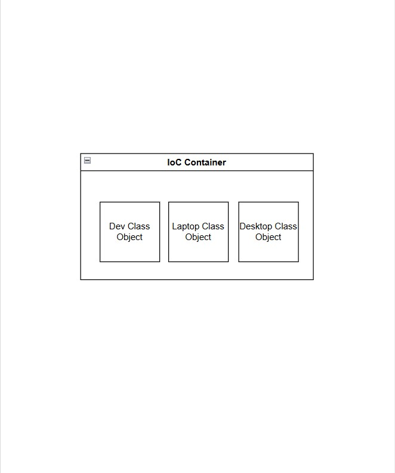

### Question:

- We have two classes, both implementing the computer interface "type of Computer".
- Now in the Dev class, when you use Computer, which object will it connect to: Laptop or Desktop?
- When you join a company, they give you a choice: Desktop or Laptop.

```
package com.prajwal.InterfaceExample;

import org.springframework.boot.SpringApplication;
import org.springframework.boot.autoconfigure.SpringBootApplication;

@SpringBootApplication
public class InterfaceExampleApplication {

	public static void main(String[] args) {

		SpringApplication.run(InterfaceExampleApplication.class, args);
	}

}
```

```
package com.prajwal.InterfaceExample.Controller;

import com.prajwal.InterfaceExample.Service.Computer;
import com.prajwal.InterfaceExample.Service.Laptop;
import org.springframework.beans.factory.annotation.Autowired;
import org.springframework.web.bind.annotation.RequestMapping;
import org.springframework.web.bind.annotation.RestController;

@RestController
public class Dev {

    //private Laptop macbook; //❌ hard coded value.
    @Autowired //Field injection
    private Computer computer;

    @RequestMapping("/")
    public String build() {
        return "Dev Building."+"<br>"+computer.compile();
    }
}
```

```
package com.prajwal.InterfaceExample.Service;

// Interface methods are implicitly public and abstract
public interface Computer {

    // Abstract method
    String compile();
}
```

```
package com.prajwal.InterfaceExample.Service;

import org.springframework.stereotype.Component;

@Component
public class Desktop implements Computer {

    @Override
    public String compile() {
        return "Java Compiler running..."+"<br>"+"On Desktop.";
    }
}
```

```
package com.prajwal.InterfaceExample.Service;

import org.springframework.stereotype.Component;

@Component
public class Laptop implements Computer {

    @Override
    public String compile() {
        return "Java Compiler running..."+"<br>"+"On Laptop.";
    }
}
```

```
//Error:
Description:
Field computer in com.prajwal.InterfaceExample.Controller.Dev required a single bean, but 2 were found:
	- desktop: defined in file [C:\Users\bagew\Desktop\Project_Ideas\spring24jan2026\InterfaceExample\InterfaceExample\target\classes\com\prajwal\InterfaceExample\Service\Desktop.class]
	- laptop: defined in file [C:\Users\bagew\Desktop\Project_Ideas\spring24jan2026\InterfaceExample\InterfaceExample\target\classes\com\prajwal\InterfaceExample\Service\Laptop.class]
```

- Error: App failed to start. Field Computer requires a single bean. But found 2.
- I prefer Desktop -> you can add @Primary annotation.

```
package com.prajwal.InterfaceExample;

import org.springframework.boot.SpringApplication;
import org.springframework.boot.autoconfigure.SpringBootApplication;

@SpringBootApplication
public class InterfaceExampleApplication {

	public static void main(String[] args) {

		SpringApplication.run(InterfaceExampleApplication.class, args);
	}

}
```

```
package com.prajwal.InterfaceExample.Controller;

import com.prajwal.InterfaceExample.Service.Computer;
import com.prajwal.InterfaceExample.Service.Laptop;
import org.springframework.beans.factory.annotation.Autowired;
import org.springframework.web.bind.annotation.RequestMapping;
import org.springframework.web.bind.annotation.RestController;

@RestController
public class Dev {

    //private Laptop macbook; //❌ hard coded value.
    @Autowired //Field injection
    private Computer computer;

    @RequestMapping("/")
    public String build() {
        return "Dev Building."+"<br>"+computer.compile();
    }
}
```

```
package com.prajwal.InterfaceExample.Service;

// Interface methods are implicitly public and abstract
public interface Computer {

    // Abstract method
    String compile();
}
```

```
package com.prajwal.InterfaceExample.Service;

import org.springframework.context.annotation.Primary;
import org.springframework.stereotype.Component;

@Component
@Primary //Default bean when multiple implementations are present.
public class Desktop implements Computer {

    @Override
    public String compile() {
        return "Java Compiler running..."+"<br>"+"On Desktop.";
    }
}
```

```
package com.prajwal.InterfaceExample.Service;

import org.springframework.stereotype.Component;

@Component
public class Laptop implements Computer {

    @Override
    public String compile() {
        return "Java Compiler running..."+"<br>"+"On Laptop.";
    }
}
```

```
//output:
//browser: http://localhost:8080/
Dev Building.
Java Compiler running...
On Desktop.
```

## Use of @Primary:

- In case of confusion/ambiguity, this class will be preferred.
- If you put @Primary on both classes.
- An error occurs, more than one @Primary bean found.

## What if you don't want to use @Primary:

- Then you can decide explicitly in Dev class.

```
package com.prajwal.InterfaceExample;

import org.springframework.boot.SpringApplication;
import org.springframework.boot.autoconfigure.SpringBootApplication;

@SpringBootApplication
public class InterfaceExampleApplication {

	public static void main(String[] args) {

		SpringApplication.run(InterfaceExampleApplication.class, args);
	}

}
```

```
package com.prajwal.InterfaceExample.Controller;

import com.prajwal.InterfaceExample.Service.Computer;
import com.prajwal.InterfaceExample.Service.Laptop;
import org.springframework.beans.factory.annotation.Autowired;
import org.springframework.beans.factory.annotation.Qualifier;
import org.springframework.web.bind.annotation.RequestMapping;
import org.springframework.web.bind.annotation.RestController;

@RestController
public class Dev {

    //private Laptop macbook; //❌ hard coded value.
    @Autowired //Field injection
    @Qualifier("laptop") // Explicitly tells Spring to inject the Laptop bean.
    private Computer computer;

    @RequestMapping("/")
    public String build() {
        return "Dev Building."+"<br>"+computer.compile();
    }
}
```

```
package com.prajwal.InterfaceExample.Service;

// Interface methods are implicitly public and abstract
public interface Computer {

    // Abstract method
    String compile();
}
```

```
package com.prajwal.InterfaceExample.Service;

import org.springframework.context.annotation.Primary;
import org.springframework.stereotype.Component;

@Component
public class Desktop implements Computer {

    @Override
    public String compile() {
        return "Java Compiler running..."+"<br>"+"On Desktop.";
    }
}
```

```
package com.prajwal.InterfaceExample.Service;

import org.springframework.stereotype.Component;

@Component
public class Laptop implements Computer {

    @Override
    public String compile() {
        return "Java Compiler running..."+"<br>"+"On Laptop.";
    }
}

```

```
//output:
Dev Building.
Java Compiler running...
On Laptop.
```

## Use of @Qualifier("bean-name"):

- Used when multiple beans of the same type exist.
- Explicitly tells Spring which bean to inject.
- Applied at the injection point (field, setter, or constructor).
- Overrides @Primary when both are present.

```
Syntax:
@Qualifer("bean-name")
```

- Refers to the name of the bean instance.
- By default, every class object managed by Spring has a bean name.
- The default "bean-name" is the class name with the first letter in lowercase.
- Example: class Laptop -> bean-name: laptop.

## @Autowired:

- Tells Spring to find a matching bean in the application context and inject it automatically."

## @Primary:

- Resolves the conflict when multiple beans of the same type exist by marking one as the default choice.

## @Qualifier("bean-name"):

- Specifies exactly which bean to inject when multiple beans of the same type exist.

## Spring without Spring Boot:

- What if you cannot use Spring Boot?
- You work directly with Spring.
- A company may be using Spring without Spring Boot.

## Steps to create a Spring project:

- New Project. -> IntelliJ IDEA (Community).
- New Project. -> Generators Maven Archetype (creates a Maven project).
- Name: SimpleSpringProject.
- JDK: 21 Oracle JDK.
- Catalog: Internal.
- Archetype: maven-archetype-quickstart.
- Version: 1.1
- Advanced Settings ->
- GroupId: com.prajwal
- ArtifactId: SimpleSpringProject
- Version: 1.0-SNAPSHOT
- create.

- This is just a Project with a Spring name.
- There is no Spring Framework in the Project.
- Project with no Spring Feature. -> Add Dependency.
- (Unknown) Add Spring Dependency.
- (Unknown) No Configuration file for Spring.
- Add Public class Developer.java

```
package com.prajwal;

public class Developer {
    public void build() {
        System.out.println( "Developer working on code..." );
    }
}
```

- First step, run your project to check if it is working.

```
package com.prajwal;

/**
 * Hello world!
 *
 */
public class App {
    public static void main( String[] args ) {
        System.out.println( "Hello World!" );
        Developer developer = new Developer();
        developer.build();
    }
}
```

```
package com.prajwal;

public class Developer {
    public void build() {
        System.out.println( "Developer working on code..." );
    }
}
```

```
//output:
Hello World!
Developer working on code...
Process finished with exit code 0
```

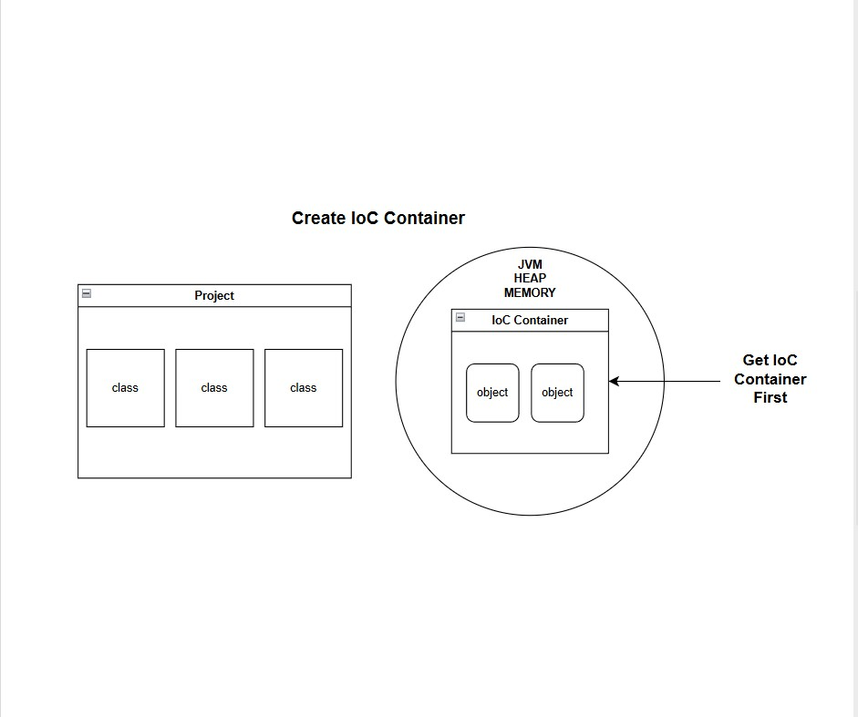

### pom.xml:

- Add the Spring dependency.
- Go to https://mvnrepository.com.
- Search for Spring Context
- Select Version: 6.2.9
- Copy the Maven dependency code.

```
<!-- Source: https://mvnrepository.com/artifact/org.springframework/spring-context -->
<dependency>
    <groupId>org.springframework</groupId>
    <artifactId>spring-context</artifactId>
    <version>6.2.9</version>
    <scope>compile</scope>
</dependency>
```

- Paste it inside the '<dependencies></dependencies>' section of 'pom.xml'.
- Click on Sync Maven changes.

```
package com.prajwal;

import org.springframework.context.ApplicationContext;
import org.springframework.context.support.ClassPathXmlApplicationContext;

/**
 * Hello world!
 *
 */
public class App {
    public static void main( String[] args ) {
        System.out.println( "Hello World!" );
//        Developer developer = new Developer();
//        developer.build();
        ApplicationContext context = new ClassPathXmlApplicationContext("Spring.xml");
        //ApplicationContext -> Spring interface that defines the IoC Container behavior.
        //ClassPathXmlApplicationContext() -> Concrete class that implements ApplicationContext and loads beans definitions from an XML file present in the classpath.
        //This line creates the IoC container.
        Developer developer = context.getBean(Developer.class);
        //Spring gives the object.
        developer.build();
    }
}
```

- We need to create the Spring.xml file in:
- src -> main -> resources
- run App.java code.
- ### Error: "Exception in thread "main" org.springframework.beans.factory.xml.XmlBeanDefinitionStoreException: Line 1 in XML document from class path resource [Spring.xml] is invalid".
- ### Why does this error occur:
- Spring tried to parse the Spring.xml
- The parser immediately failed at line 1, col 1.
- As Spring.xml is empty.
- ### We need Spring XML Schema-based configuration:
- search: "Spring XML Schema-based configuration."
- https://docs.spring.io/spring-framework/docs/4.2.x/spring-framework-reference/html/xsd-configuration.html
- Copy the XML code in Spring.xml

```
//DTD
<?xml version="1.0" encoding="UTF-8"?>
<beans xmlns="http://www.springframework.org/schema/beans"
    xmlns:xsi="http://www.w3.org/2001/XMLSchema-instance"
    xsi:schemaLocation="
        http://www.springframework.org/schema/beans http://www.springframework.org/schema/beans/spring-beans.xsd">

    <!-- bean definitions here -->

</beans>
```

- ### Error: Exception in thread "main" org.springframework.beans.factory.NoSuchBeanDefinitionException: No qualifying bean of type 'com.prajwal.Developer' available.
- To fix, we need to create a bean.

```
// defining a bean in Spring.xml
<bean id="developer" class="com.prajwal.Developer" />
```

```
package com.prajwal;

import org.springframework.context.ApplicationContext;
import org.springframework.context.support.ClassPathXmlApplicationContext;

/**
 * Hello world!
 *
 */
public class App {
    public static void main( String[] args ) {
        System.out.println( "Hello World!" );
//        Developer developer = new Developer();
//        developer.build();
        ApplicationContext context = new ClassPathXmlApplicationContext("Spring.xml");
        //ApplicationContext -> Spring interface that defines the IoC Container behavior.
        //ClassPathXmlApplicationContext() -> Concrete class that implements ApplicationContext and loads beans definitions from an XML file present in the classpath.
        //This line creates the IoC container.
        Developer developer = context.getBean(Developer.class);
        //Spring gives the object.
        developer.build();
    }
}
```

```
package com.prajwal;

public class Developer {
    public void build() {
        System.out.println( "Developer working on code..." );
    }
}
```

```
<?xml version="1.0" encoding="UTF-8"?>
<beans xmlns="http://www.springframework.org/schema/beans"
       xmlns:xsi="http://www.w3.org/2001/XMLSchema-instance"
       xsi:schemaLocation="
        http://www.springframework.org/schema/beans http://www.springframework.org/schema/beans/spring-beans.xsd">

    <!-- bean definitions here -->
    <bean id="developer" class="com.prajwal.Developer" />
</beans>
```

```
//output:
Hello World!
Developer working on code...
Process finished with exit code 0
```

- ### Error: BeanFactory not initialized or closed.
- It is a Spring lifecycle/context management issue.
- Occurs when your code tries to access Spring beans before the container is ready or after it has been shut down.

```
package com.prajwal;

import org.springframework.context.ApplicationContext;
import org.springframework.context.support.ClassPathXmlApplicationContext;

/**
 * Hello world!
 *
 */
public class App {
    public static void main( String[] args ) {
        System.out.println( "Hello World!" );
//        Developer developer = new Developer();
//        developer.build();
        //ApplicationContext context = new ClassPathXmlApplicationContext("Spring.xml");
        ClassPathXmlApplicationContext context = new ClassPathXmlApplicationContext("Spring.xml");
        context.close(); // ❌ close Spring container
        //ApplicationContext -> Spring interface that defines the IoC Container behavior.
        //ClassPathXmlApplicationContext() -> Concrete class that implements ApplicationContext and loads beans definitions from an XML file present in the classpath.
        //This line creates the IoC container.
        Developer developer = context.getBean(Developer.class);
        //Spring gives the object.
        developer.build();
    }
}
```

```
package com.prajwal;

public class Developer {
    public void build() {
        System.out.println( "Developer working on code..." );
    }
}
```

```
<?xml version="1.0" encoding="UTF-8"?>
<beans xmlns="http://www.springframework.org/schema/beans"
       xmlns:xsi="http://www.w3.org/2001/XMLSchema-instance"
       xsi:schemaLocation="
        http://www.springframework.org/schema/beans http://www.springframework.org/schema/beans/spring-beans.xsd">

    <!-- bean definitions here -->
    <bean id="developer" class="com.prajwal.Developer" />
</beans>
```

```
//output:
Exception in thread "main" java.lang.IllegalStateException: BeanFactory not initialized or already closed - call 'refresh' before accessing beans via the ApplicationContext
```

## What is BeanFactory:

- BeanFactory is an IoC(Inversion of Control) container in Spring.
- It is responsible for creating, managing, and configuring beans.
- In earlier versions of Spring, BeanFactory was commonly used as the core container.
- Beans are created lazily (only when they are requested).
- The container remains active as long as the application is running (it is not closed by default).
- BeanFactory is a lightweight Spring IoC container that manages beans using lazy initialization.

## Bean Lifecycle Diagram

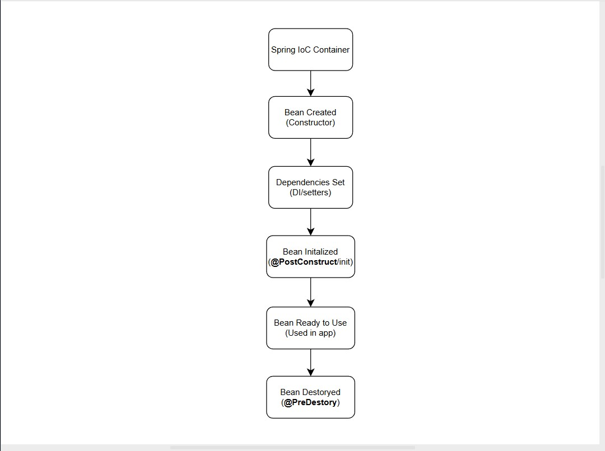

- Spring creates the Bean.
- Injects Dependencies.
- Initializes it.
- Uses it.
- Destroys it.

```
<project xmlns="http://maven.apache.org/POM/4.0.0" xmlns:xsi="http://www.w3.org/2001/XMLSchema-instance"
  xsi:schemaLocation="http://maven.apache.org/POM/4.0.0 http://maven.apache.org/xsd/maven-4.0.0.xsd">
  <modelVersion>4.0.0</modelVersion>

  <groupId>com.prajwal</groupId>
  <artifactId>BeanLifecycle</artifactId>
  <version>1.0-SNAPSHOT</version>
  <packaging>jar</packaging>

  <name>BeanLifecycle</name>
  <url>http://maven.apache.org</url>

  <properties>
    <project.build.sourceEncoding>UTF-8</project.build.sourceEncoding>
  </properties>

  <dependencies>
    <dependency>
      <groupId>junit</groupId>
      <artifactId>junit</artifactId>
      <version>3.8.1</version>
      <scope>test</scope>
    </dependency>

    <!-- Source: https://mvnrepository.com/artifact/org.springframework/spring-context -->
    <dependency>
      <groupId>org.springframework</groupId>
      <artifactId>spring-context</artifactId>
      <version>6.2.9</version>
      <scope>compile</scope>
    </dependency>

    <!-- Source: https://mvnrepository.com/artifact/jakarta.annotation/jakarta.annotation-api -->
    <dependency>
      <groupId>jakarta.annotation</groupId>
      <artifactId>jakarta.annotation-api</artifactId>
      <version>2.1.1</version>
      <scope>compile</scope>
    </dependency>

  </dependencies>
</project>
```

```
package com.prajwal;

import org.springframework.context.ApplicationContext;
import org.springframework.context.support.ClassPathXmlApplicationContext;

/**
 * Hello world!
 *
 */
public class App
{
    public static void main( String[] args ) {
        System.out.println( "Hello World!" );
        //ApplicationContext context = new ClassPathXmlApplicationContext("Spring.xml");
        ClassPathXmlApplicationContext context = new ClassPathXmlApplicationContext("Spring.xml");
        //Student student = context.getBean("student");
        //Error: java: incompatible types: java.lang.Object cannot be converted to com.prajwal.Student
        Student student = (Student) context.getBean("student");
        //typecasting to solve the error.
        student.display();
        context.close();  // 🔥 REQUIRED for @PreDestroy
    }
}
```

```
package com.prajwal;
// search: Jakarta Annotations API, in MVNRepository.
import jakarta.annotation.PostConstruct;
import jakarta.annotation.PreDestroy;

public class Student {

    private String name;

    public Student(){
        System.out.println("1. Bean Created.");
    }

    //setter
    public void setName(String name){
        this.name = name;
    }

    @PostConstruct
    public void init(){
        System.out.println("2. Bean Initialized.");
        //setName(name);
    }

    public void display() {
        System.out.println("3. Bean is Ready to Use.");
        System.out.println("Student Name: " + this.name);
    }

    @PreDestroy
    public void destroy(){
        System.out.println("4. Bean Destroyed.");
    }
}
```

```
<?xml version="1.0" encoding="UTF-8"?>
<beans xmlns="http://www.springframework.org/schema/beans"
       xmlns:xsi="http://www.w3.org/2001/XMLSchema-instance"
       xsi:schemaLocation="
        http://www.springframework.org/schema/beans http://www.springframework.org/schema/beans/spring-beans.xsd">

    <!-- bean definitions here -->


    <!-- REQUIRED for @PostConstruct & @PreDestroy -->
    <bean class="org.springframework.context.annotation.CommonAnnotationBeanPostProcessor"/>

    <bean id="student" class="com.prajwal.Student">
        <property name="name" value="Prajwal Bagewadi"/>
    </bean>
</beans>
```

```
//output:
D:\Software_Installed\jdk\bin\java.exe "-
Hello World!
1. Bean Created.
2. Bean Initialized.
3. Bean is Ready to Use.
Student Name: Prajwal Bagewadi
4. Bean Destroyed.

Process finished with exit code 0
```

- ### Note:
- To get @PostConstruct & @PreDestroy.
- Add Maven dependency

```
  <!-- Source: https://mvnrepository.com/artifact/jakarta.annotation/jakarta.annotation-api -->
    <dependency>
      <groupId>jakarta.annotation</groupId>
      <artifactId>jakarta.annotation-api</artifactId>
      <version>2.1.1</version>
      <scope>compile</scope>
    </dependency>
```

- Observe Error: java: incompatible types: java.lang.Object cannot be converted to com.prajwal.Student
- Use TypeCasting to fix the error.

```
Student student = (Student) context.getBean("student");
```

- Observe that when running the App, @PostConstruct and @PreDestroy won't run.
- Insert the DTD code in Spring.xml <Beans></Beans>.

```
<!-- REQUIRED for @PostConstruct & @PreDestroy -->
    <bean class="org.springframework.context.annotation.CommonAnnotationBeanPostProcessor"/>
```

- To @PreDestroy, we need to close the IoC container at the end of the main() code.

```
context.close(); // 🔥 REQUIRED for @PreDestroy
```

- Use of public void init() method with no args.
- The init() method is not meant to receive any data.
- It is meant to run logic after the dependencies are added.
- When to use init() method:
- Validation.
- Logging.
- Initial Calculations.
- Opening Resources.
- Checking Required Fields.

```
 @PostConstruct
    public void init(){
        System.out.println("2. Bean Initialized.");
        //setName(name);
        if (name.equals("")) {
            throw new IllegalStateException("Name must not be null.");
        }
    }
```

```
package com.prajwal;
// search: Jakarta Annotations API, in MVNRepository.
import jakarta.annotation.PostConstruct;
import jakarta.annotation.PreDestroy;

public class Student {

    private String name;

    public Student(){
        System.out.println("1. Bean Created.");
    }

    //setter
    public void setName(String name){
        this.name = name;
    }

    @PostConstruct
    public void init(){
        System.out.println("2. Bean Initialized.");
        //setName(name);
        if (name.equals("")) {
            throw new IllegalStateException("Name must not be null.");
        }
    }

    public void display() {
        System.out.println("3. Bean is Ready to Use.");
        System.out.println("Student Name: " + this.name);
    }

    @PreDestroy
    public void destroy(){
        System.out.println("4. Bean Destroyed.");
    }
}
```

## Creating Spring.xml or Anyname.xml file:

```
//Load Spring Configuration (two options)
ApplicationContext context = new ClassPathXmlApplicationContext("Spring.xml");
//OR
ClassPathXmlApplicationContext context = new ClassPathXmlApplicationContext("Spring.xml");
```

- In your project, go to src/main -> create a new folder: resources -> inside it, create a new file -> Spring.xml
- Spring.xml is the Spring configuration file where you define beans, their properties, and lifecycle callbacks.
- Spring reads this file to create, manage, and configure beans in your application.

### How to use Spring.xml or Anyname.xml for lifecycle callbacks

```
<?xml version="1.0" encoding="UTF-8"?>
<beans xmlns="http://www.springframework.org/schema/beans"
       xmlns:xsi="http://www.w3.org/2001/XMLSchema-instance"
       xsi:schemaLocation="
        http://www.springframework.org/schema/beans http://www.springframework.org/schema/beans/spring-beans.xsd">

    <!-- bean definitions here -->


    <!-- REQUIRED for @PostConstruct & @PreDestroy -->
    <!-- <bean class="org.springframework.context.annotation.CommonAnnotationBeanPostProcessor"/> -->

    <bean id="student" class="com.prajwal.Student" init-method="initMethod" destroy-method="destroyMethod">
        <property name="name" value="Prajwal"/>
    </bean>
</beans>
```

```
package com.prajwal;
// search: Jakarta Annotations API, in MVNRepository.
import jakarta.annotation.PostConstruct;
import jakarta.annotation.PreDestroy;

public class Student {

    private String name;

    public Student(){
        System.out.println("1. Bean Created.");
    }

    //setter
    public void setName(String name){
        this.name = name;
    }

    //@PostConstruct
    public void initMethod(){
        System.out.println("2. Bean Initialized.");
        //setName(name);
        if (name.equals("")) {
            throw new IllegalStateException("Name must not be null.");
        }
    }

    public void display() {
        System.out.println("3. Bean is Ready to Use.");
        System.out.println("Student Name: " + this.name);
    }

    //@PreDestroy
    public void destroyMethod(){
        System.out.println("4. Bean Destroyed.");
    }
}
```

```
\\output
D:\Software_Installed\jdk\bin\java.exe "-
Hello World!
1. Bean Created.
2. Bean Initialized.
3. Bean is Ready to Use.
Student Name: Prajwal
4. Bean Destroyed.

Process finished with exit code 0
```

## Why Spring instead of Spring Boot?

- The project might be a legacy project that was built using Spring, not Spring Boot.
- To understand what happens behind the scenes: Spring provides the container first, and then it creates and manages objects (beans).
- Every class that Spring manages is called a bean.

## <!Extensible Markup Lang/>:

- DTD (Document Type Definition):
- Defines which tags and attributes are allowed in an XML file.
- Can be in a separate file or inside XML with <!DOCTYPE>.

```
<!--Example/Syntax:-->
<!DOCTYPE student [
    <!ELEMENT student (name, age)>
    <!ELEMENT name (#PCDATA)>
    <!ELEMENT age (#PCDATA)>
]>

<!--
NOTE:
<!DOCTYPE -> Declares the document type.
student -> Root element of the XML.
[ ] -> Contains internal DTD.
<!DOCTYPE> Defines the root element and its DTD rules.
<!Element -> DTD keyword to define an element.
age -> element (tag) name.
( ) -> content of the element.
#PCDATA -> plain text data.
> -> end of definition.
-->

<student>
    <name>Prajwal</name>
    <age>26</age>
</student>
```

```
//output:
> <student>
<name>Prajwal</name>
<age>26</age>
</student>
```

```
<!--Example 2-->
<!DOCTYPE book [
    <!ELEMENT book (title, author)>
    <!ELEMENT title (#PCDATA)>
    <!ELEMENT author (#PCDATA)>
]>

<book>
    <title>TWISTED LOVE</title>
    <author>Ana Huang</author>
</book>
```

```
<!--Example 3-->
<!DOCTYPE books [
    <!ELEMENT books (book)>
    <!ELEMENT book (title,author)>
    <!ELEMENT title (#PCDATA)>
    <!ELEMENT author (#PCDATA)>
]>

<books>
    <book>
        <title>TWISTED LOVE</title>
        <author>Ana Huang</author>
    </book>
</books>
```

- XML Tags: The actual elements in the XML file, written like <tag>content</tag>.

```
<beans>
    <!---->
    <bean class="com.prajwal.Developer" id="developer"/>
    <!--class -> attribute-->
    <!--com.prajwal. -> package-->
    <!--Developer -> classname-->
    <!--com.prajwal.Developer -> qualified classname-->
    <!--id="developer -> optional beanname"-->
</beans>
```

- When id is Mandatory?
- If you access bean like this:

```
Developer dev = (Developer) context.getBean("developer");
```

- When id is not required:
- If you access bean like this:

```
Developer dev = context.getBean("Developer.class");
```

## App.java

```
package com.prajwal;

import org.springframework.context.ApplicationContext;
import org.springframework.context.support.ClassPathXmlApplicationContext;

public class App {
    public static void main(String[] args) {

        ClassPathXmlApplicationContext context = new ClassPathXmlApplicationContext("Spring.xml");

        Student student = (Student) context.getBean("student");
        //instead of context.getBean("Student.class");
        //getBean -> returns type Object, typecast it to (Developer)
    }
}
```

## Error: Cannot find defination for <beans>:

- This happens when Spring cannot find the XML schema definations that validates <beans> and <bean>

```
<!--Error causing code:-->
<beans>
    <bean id="student" class="com.prajwal.Student" init-method="initMethod" destroy-method="destroyMethod">-->
        <property name="name" value="Prajwal"/>
    </bean>
</beans>
```

- To fix, search: XML Schema-based configuration.
- Copy paste the xml script in Spring.xml

```
<?xml version="1.0" encoding="UTF-8"?>
<!--code line that resolves error-->
<beans xmlns="http://www.springframework.org/schema/beans"
    xmlns:xsi="http://www.w3.org/2001/XMLSchema-instance"
    xsi:schemaLocation="
        http://www.springframework.org/schema/beans http://www.springframework.org/schema/beans/spring-beans.xsd">
<!--Provide defination for beans and bean tags-->
    <!-- bean definitions here -->

</beans
```

```
<beans xmlns="http://www.springframework.org/schema/beans"
       xmlns:xsi="http://www.w3.org/2001/XMLSchema-instance"
       xsi:schemaLocation="
        http://www.springframework.org/schema/beans http://www.springframework.org/schema/beans/spring-beans.xsd">
</beans>
```

- We are asking Spring that you responsible for creating the objects defined in bean.
- which we have configured in Spring.xml

## Adding one more class (complexity):

```
public class Laptop {
    public Laptop(){
        System.out.println("Laptop constructor Obj created in IoC.");
    }
    public void compiler() {
        System.out.println("Java compiler running");
    }
}
```

```
public class Developer {
    public Developer(){
        System.out.println("Developer constructor Obj created in IoC.");
    }
    public void build() {
        System.out.println("Dev writing code.")
    }
}
```

- In the Container we create objects of 2 bean classes.

```
//pom.xml
<project xmlns="http://maven.apache.org/POM/4.0.0" xmlns:xsi="http://www.w3.org/2001/XMLSchema-instance"
  xsi:schemaLocation="http://maven.apache.org/POM/4.0.0 http://maven.apache.org/xsd/maven-4.0.0.xsd">
  <modelVersion>4.0.0</modelVersion>

  <groupId>com.prajwal</groupId>
  <artifactId>SpringCore</artifactId>
  <version>1.0-SNAPSHOT</version>
  <packaging>jar</packaging>

  <name>SpringCore</name>
  <url>http://maven.apache.org</url>

  <properties>
    <project.build.sourceEncoding>UTF-8</project.build.sourceEncoding>
  </properties>

  <dependencies>
    <dependency>
      <groupId>junit</groupId>
      <artifactId>junit</artifactId>
      <version>3.8.1</version>
      <scope>test</scope>
    </dependency>

    <!-- Source: https://mvnrepository.com/artifact/org.springframework/spring-context -->
    <dependency>
      <groupId>org.springframework</groupId>
      <artifactId>spring-context</artifactId>
      <version>6.2.9</version>
      <scope>compile</scope>
    </dependency>

  </dependencies>
</project>
```

```
//App.java
package com.prajwal;

import org.springframework.context.ApplicationContext;
import org.springframework.context.support.ClassPathXmlApplicationContext;

/**
 * Hello world!
 *
 */
public class App {
    public static void main( String[] args ) {
        System.out.println( "Hello World!" );
        ApplicationContext context = new ClassPathXmlApplicationContext("Spring.xml");
    }
}
```

```
//Developer.java
package com.prajwal;

public class Developer {
    public Developer(){
        System.out.println("Developer constructor Obj created in IoC.");
    }

    public void build() {
        System.out.println("Dev writing code.");
    }
}
```

```
//Laptop.java
package com.prajwal;

public class Laptop {

    public Laptop(){
        System.out.println("Laptop constructor Obj created in IoC.");
    }

    public void compiler() {
        System.out.println("Java compiler running.");
    }

}
```

```
//Spring.xml
<?xml version="1.0" encoding="UTF-8"?>
<beans xmlns="http://www.springframework.org/schema/beans"
       xmlns:xsi="http://www.w3.org/2001/XMLSchema-instance"
       xsi:schemaLocation="
        http://www.springframework.org/schema/beans http://www.springframework.org/schema/beans/spring-beans.xsd">

    <!-- bean definitions here -->


    <!-- REQUIRED for @PostConstruct & @PreDestroy -->
    <!-- <bean class="org.springframework.context.annotation.CommonAnnotationBeanPostProcessor"/> -->
    <bean class="com.prajwal.Developer" id="developer"/>
    <bean class="com.prajwal.Laptop" id="laptop"/>
</beans>
```

```
//output:
Hello World!
Developer constructor Obj created in IoC.
Laptop constructor Obj created in IoC.

Process finished with exit code 0
```

- It will create the Container.
- Spring will see two bean configs.
- It will create objects for both of the beans.

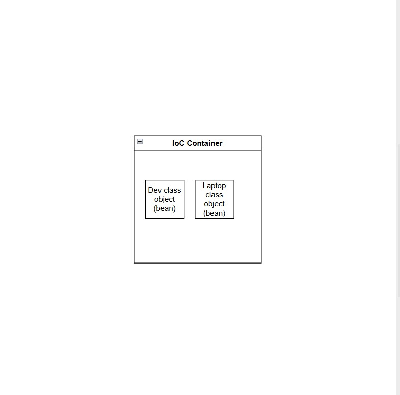

- Adding another Dev class bean.

```
<?xml version="1.0" encoding="UTF-8"?>
<beans xmlns="http://www.springframework.org/schema/beans"
       xmlns:xsi="http://www.w3.org/2001/XMLSchema-instance"
       xsi:schemaLocation="
        http://www.springframework.org/schema/beans http://www.springframework.org/schema/beans/spring-beans.xsd">

    <!-- bean definitions here -->


    <!-- REQUIRED for @PostConstruct & @PreDestroy -->
    <!-- <bean class="org.springframework.context.annotation.CommonAnnotationBeanPostProcessor"/> -->
    <bean class="com.prajwal.Developer" id="developer"/>
    <bean id="developer1" class="com.prajwal.Developer"/>
    <bean class="com.prajwal.Laptop" id="laptop"/>
</beans>
```

```
//output:
Hello World!
Developer constructor Obj created in IoC.
Developer constructor Obj created in IoC.
Laptop constructor Obj created in IoC.

Process finished with exit code 0
```

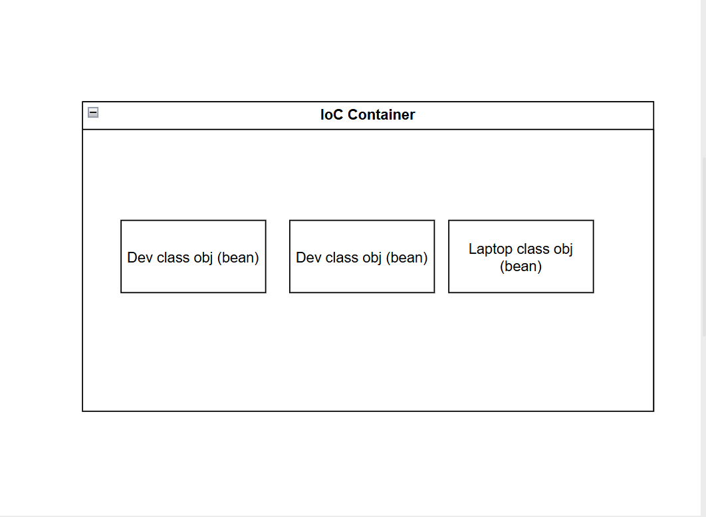

## Setter and Constructor Injection:

- Setter Injection:

```
package com.prajwal;

public class Developer {

    private int age;

    public Developer(){
        System.out.println("Developer constructor Obj created in IoC.");
    }

    public void setAge(int age) {
        this.age = age;
    }
    public int getAge() {
        return age;
    }

    public void build() {
        System.out.println("Dev writing code.");
    }
}
```

```
<?xml version="1.0" encoding="UTF-8"?>
<beans xmlns="http://www.springframework.org/schema/beans"
       xmlns:xsi="http://www.w3.org/2001/XMLSchema-instance"
       xsi:schemaLocation="
        http://www.springframework.org/schema/beans http://www.springframework.org/schema/beans/spring-beans.xsd">

    <!-- bean definitions here -->


    <!-- REQUIRED for @PostConstruct & @PreDestroy -->
    <!-- <bean class="org.springframework.context.annotation.CommonAnnotationBeanPostProcessor"/> -->
    <bean class="com.prajwal.Developer" id="developer">
        <property name="age" value="26"/>
    </bean>

    <bean id="developer1" class="com.prajwal.Developer"/>
    <bean class="com.prajwal.Laptop" id="laptop"/>
</beans>
```

```
package com.prajwal;

import org.springframework.context.ApplicationContext;
import org.springframework.context.support.ClassPathXmlApplicationContext;

/**
 * Hello world!
 *
 */
public class App {
    public static void main( String[] args ) {
        System.out.println( "Hello World!" );
        ApplicationContext context = new ClassPathXmlApplicationContext("Spring.xml");
        Developer dev = (Developer) context.getBean("developer");
        System.out.println("dev age:"+dev.getAge());
    }
}
```

```
//output
Hello World!
Developer constructor Obj created in IoC.
Developer constructor Obj created in IoC.
Laptop constructor Obj created in IoC.
dev age:26

Process finished with exit code 0
```

- Spring.xml

```
<bean class="com.prajwal.Developer" id="developer">
    <property name="age" value="26"/>
    <!--sets the age property in dev.class with setAge() using Spring-->
</bean>
```

- Spring is assiging value to age.

```
//output
dev age:26
```

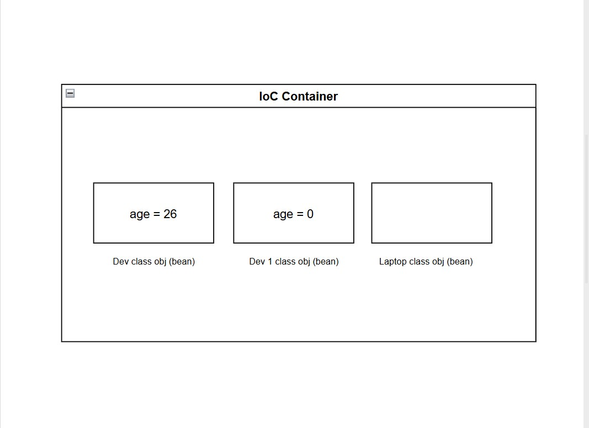

```
package com.prajwal;

import org.springframework.context.ApplicationContext;
import org.springframework.context.support.ClassPathXmlApplicationContext;

/**
 * Hello world!
 *
 */
public class App {
    public static void main( String[] args ) {
        System.out.println( "Hello World!" );
        ApplicationContext context = new ClassPathXmlApplicationContext("Spring.xml");
        Developer dev = (Developer) context.getBean("developer");
        Developer dev1 = (Developer) context.getBean("developer1");
        System.out.println("dev age:"+dev.getAge());
        System.out.println("dev1 age:"+dev1.getAge());
    }
}
```

```
//output
Hello World!
Developer constructor Obj created in IoC.
Developer constructor Obj created in IoC.
Laptop constructor Obj created in IoC.
dev age:26
dev1 age:0

Process finished with exit code 0
```

```
Developer dev1 = (Developer) context.getBean("developer1");
System.out.println("dev1 age:"+dev1.getAge());
```

- Dev1 age = value 0 as it is not set in properties.

- Constructor Injection:

```
package com.prajwal;

public class Developer {

    private int age;

    public Developer(int age){
        System.out.println("Developer constructor Obj created in IoC.");
        this.age = age;
    }

//    public void setAge(int age) {
//        this.age = age;
//    }
    public int getAge() {
        return age;
    }

    public void build() {
        System.out.println("Dev writing code.");
    }
}
```

```
<?xml version="1.0" encoding="UTF-8"?>
<beans xmlns="http://www.springframework.org/schema/beans"
       xmlns:xsi="http://www.w3.org/2001/XMLSchema-instance"
       xsi:schemaLocation="
        http://www.springframework.org/schema/beans http://www.springframework.org/schema/beans/spring-beans.xsd">

    <!-- bean definitions here -->


    <!-- REQUIRED for @PostConstruct & @PreDestroy -->
    <!-- <bean class="org.springframework.context.annotation.CommonAnnotationBeanPostProcessor"/> -->
    <bean class="com.prajwal.Developer" id="developer">
        <!--<property name="age" value="26"/>-->
        <constructor-arg name="age" value="26"/>
    </bean>

    <bean id="developer1" class="com.prajwal.Developer"/>
    <bean class="com.prajwal.Laptop" id="laptop"/>
</beans>
```

```
package com.prajwal;

import org.springframework.context.ApplicationContext;
import org.springframework.context.support.ClassPathXmlApplicationContext;

/**
 * Hello world!
 *
 */
public class App {
    public static void main( String[] args ) {
        System.out.println( "Hello World!" );
        ApplicationContext context = new ClassPathXmlApplicationContext("Spring.xml");
        Developer dev = (Developer) context.getBean("developer");
        Developer dev1 = (Developer) context.getBean("developer1");
        System.out.println("dev age:"+dev.getAge());
        System.out.println("dev1 age:"+dev1.getAge());
    }
}
```

- Error: Spring cannot create the developer1 bean because the class has no no-argument (default) constructor and no constructor is specified in Spring.xml.
- To fix, create a default constructor with no arguments.

```
package com.prajwal;

public class Developer {

    private int age;

    public Developer(){
        System.out.println("Default Developer constructor Obj created in IoC.");
    }

    public Developer(int age){
        System.out.println("Developer constructor Obj created in IoC.");
        this.age = age;
    }

//    public void setAge(int age) {
//        this.age = age;
//    }
    public int getAge() {
        return age;
    }

    public void build() {
        System.out.println("Dev writing code.");
    }
}
```

```
//output:
Hello World!
Developer constructor Obj created in IoC.
Default Developer constructor Obj created in IoC.
Laptop constructor Obj created in IoC.
dev age:26
dev1 age:0

Process finished with exit code 0
```

- We can use `<constructor-arg name="age" value="26"/>`
- If you have multiple parameters and you want to specify the sequence.
- We use index = 0 to n.

```
//example:
<constructor-arg index="0" value="26"/>
```

```
package com.prajwal;

public class Developer {

    private int age;
    private double salary;

    public Developer(){
        System.out.println("Default Developer constructor Obj created in IoC.");
    }

    public Developer(int age, double salary){
        System.out.println("Developer constructor Obj created in IoC.");
        this.age = age;
        this.salary = salary;
    }

//    public void setAge(int age) {
//        this.age = age;
//    }
    public int getAge() {
        return age;
    }

    public double getSalary(){
        return salary;
    }

    public void build() {
        System.out.println("Dev writing code.");
    }
}
```

```
<?xml version="1.0" encoding="UTF-8"?>
<beans xmlns="http://www.springframework.org/schema/beans"
       xmlns:xsi="http://www.w3.org/2001/XMLSchema-instance"
       xsi:schemaLocation="
        http://www.springframework.org/schema/beans http://www.springframework.org/schema/beans/spring-beans.xsd">

    <!-- bean definitions here -->


    <!-- REQUIRED for @PostConstruct & @PreDestroy -->
    <!-- <bean class="org.springframework.context.annotation.CommonAnnotationBeanPostProcessor"/> -->
    <bean class="com.prajwal.Developer" id="developer">
        <!--<property name="age" value="26"/>-->
        <!--<constructor-arg name="age" value="26"/>-->
        <constructor-arg index="0" value="26"/>
        <constructor-arg index="1" value="6500"/>
    </bean>

    <bean id="developer1" class="com.prajwal.Developer"/>
    <bean class="com.prajwal.Laptop" id="laptop"/>
</beans>
```

```
package com.prajwal;

import org.springframework.context.ApplicationContext;
import org.springframework.context.support.ClassPathXmlApplicationContext;

/**
 * Hello world!
 *
 */
public class App {
    public static void main( String[] args ) {
        System.out.println( "Hello World!" );
        ApplicationContext context = new ClassPathXmlApplicationContext("Spring.xml");
        Developer dev = (Developer) context.getBean("developer");
        Developer dev1 = (Developer) context.getBean("developer1");
        System.out.println("dev age:"+dev.getAge());
        System.out.println("dev salary:"+dev.getSalary());
        System.out.println("dev1 age:"+dev1.getAge());
    }
}
```

```
//output:
Hello World!
Developer constructor Obj created in IoC.
Default Developer constructor Obj created in IoC.
Laptop constructor Obj created in IoC.
dev age:26
dev salary:6500.0
dev1 age:0

Process finished with exit code 0
```

## What about Reference variable (<property name ="" ref=""/>):

- "ref" is used in Spring XML to inject a reference to another bean (object) instead of a primitive value.
- 'value=""' refers to primitives/String.
- 'ref=""' refers to another Spring managed object.

```
package com.prajwal;

public class Developer {

    private int age;
    private double salary;
    private Laptop macbook;

    public Developer(){
        System.out.println("Default Developer constructor Obj created in IoC.");
    }

    public Developer(int age, double salary, Laptop macbook){
        System.out.println("Developer constructor Obj created in IoC.");
        this.age = age;
        this.salary = salary;
        this.macbook = macbook;
    }

//    public void setAge(int age) {
//        this.age = age;
//    }
    public int getAge() {
        return age;
    }

    public double getSalary(){
        return salary;
    }

    public Laptop getLatop(){ return macbook; }

    public void build() {
        macbook.compiler();
        System.out.println("Dev writing code.");
    }
}
```

```
<?xml version="1.0" encoding="UTF-8"?>
<beans xmlns="http://www.springframework.org/schema/beans"
       xmlns:xsi="http://www.w3.org/2001/XMLSchema-instance"
       xsi:schemaLocation="
        http://www.springframework.org/schema/beans http://www.springframework.org/schema/beans/spring-beans.xsd">

    <!-- bean definitions here -->


    <!-- REQUIRED for @PostConstruct & @PreDestroy -->
    <!-- <bean class="org.springframework.context.annotation.CommonAnnotationBeanPostProcessor"/> -->
    <bean class="com.prajwal.Developer" id="developer">
        <!--<property name="age" value="26"/>-->
        <!--<constructor-arg name="age" value="26"/>-->
        <constructor-arg index="0" value="26"/>
        <constructor-arg index="1" value="6500"/>
        <constructor-arg index="3" ref="laptop"/>
    </bean>

    <bean id="developer1" class="com.prajwal.Developer"/>
    <bean class="com.prajwal.Laptop" id="laptop"/>
</beans>
```

- Error: WARNING: Exception encountered during context initialization - cancelling refresh attempt: org.springframework.beans.factory.BeanCreationException: Error creating bean with name 'developer' defined in class path resource [Spring.xml]: Could not resolve matching constructor on bean class [com.prajwal.Developer] (hint: specify index/type/name arguments for simple parameters to avoid type ambiguities. You should also check the consistency of arguments when mixing indexed and named arguments, especially in case of bean definition inheritance)
  Exception in thread "main" org.springframework.beans.factory.BeanCreationException: Error creating bean with name 'developer' defined in class path resource [Spring.xml]: Could not resolve matching constructor on bean class [com.prajwal.Developer] (hint: specify index/type/name arguments for simple parameters to avoid type ambiguities. You should also check the consistency of arguments when mixing indexed and named arguments, especially in case of bean definition inheritance)
- Chatgpt: give error in one line.
- **Error:** Spring failed to create the `developer` bean because the constructor argument index is wrong (index `3` used instead of `2`).

```
<bean class="com.prajwal.Developer" id="developer">
    <!--<property name="age" value="26"/>-->
    <!--<constructor-arg name="age" value="26"/>-->
    <constructor-arg index="0" value="26"/>
    <constructor-arg index="1" value="6500"/>
    <constructor-arg index="3" ref="laptop"/> <!--Line causing Error.-->
</bean>
```

- Indexes start from 0,1,2 hence 3 is causing the error.
- Code:

```
//pom.xml
<project xmlns="http://maven.apache.org/POM/4.0.0" xmlns:xsi="http://www.w3.org/2001/XMLSchema-instance"
  xsi:schemaLocation="http://maven.apache.org/POM/4.0.0 http://maven.apache.org/xsd/maven-4.0.0.xsd">
  <modelVersion>4.0.0</modelVersion>

  <groupId>com.prajwal</groupId>
  <artifactId>SpringCore</artifactId>
  <version>1.0-SNAPSHOT</version>
  <packaging>jar</packaging>

  <name>SpringCore</name>
  <url>http://maven.apache.org</url>

  <properties>
    <project.build.sourceEncoding>UTF-8</project.build.sourceEncoding>
  </properties>

  <dependencies>
    <dependency>
      <groupId>junit</groupId>
      <artifactId>junit</artifactId>
      <version>3.8.1</version>
      <scope>test</scope>
    </dependency>

    <!-- Source: https://mvnrepository.com/artifact/org.springframework/spring-context -->
    <dependency>
      <groupId>org.springframework</groupId>
      <artifactId>spring-context</artifactId>
      <version>6.2.9</version>
      <scope>compile</scope>
    </dependency>

  </dependencies>
</project>
```

```
//App.java
package com.prajwal;

import org.springframework.context.ApplicationContext;
import org.springframework.context.support.ClassPathXmlApplicationContext;

/**
 * Hello world!
 *
 */
public class App {
    public static void main( String[] args ) {
        System.out.println( "Hello World!" );
        ApplicationContext context = new ClassPathXmlApplicationContext("Spring.xml");
        Developer dev = (Developer) context.getBean("developer");
        Developer dev1 = (Developer) context.getBean("developer1");
        System.out.println("dev age:"+dev.getAge());
        System.out.println("dev salary:"+dev.getSalary());
        System.out.println("dev laptop:"+dev.getLatop().toString());
        dev.build();
        System.out.println("dev1 age:"+dev1.getAge());
    }
}
```

```
//Developer.java
package com.prajwal;

public class Developer {

    private int age;
    private double salary;
    private Laptop macbook;

    public Developer(){
        System.out.println("Default Developer constructor Obj created in IoC.");
    }

    public Developer(int age, double salary, Laptop macbook){
        System.out.println("Developer constructor Obj created in IoC.");
        this.age = age;
        this.salary = salary;
        this.macbook = macbook;
    }

//    public void setAge(int age) {
//        this.age = age;
//    }
    public int getAge() {
        return age;
    }

    public double getSalary(){
        return salary;
    }

    public Laptop getLatop(){ return macbook; }

    public void build() {
        macbook.compiler();
        System.out.println("Dev writing code.");
    }
}
```

```
//Laptop.java
package com.prajwal;

public class Laptop {

    private String model;
    private String manufacturer;

    public Laptop(){
        System.out.println("Laptop constructor Obj created in IoC.");
    }

    public void setModel(String model) {
        //MacBook Air 13
        this.model = model;
    }

    public void setManufacturer(String manufacturer) {
        //Apple
        this.manufacturer = manufacturer;
    }

    public void compiler() {
        System.out.println("Java compiler running.");
    }

    @Override
    public String toString() {
        return "model:"+model+", manufacturer:"+manufacturer;
    }
}
```

```
//Spring.xml
<?xml version="1.0" encoding="UTF-8"?>
<beans xmlns="http://www.springframework.org/schema/beans"
       xmlns:xsi="http://www.w3.org/2001/XMLSchema-instance"
       xsi:schemaLocation="
        http://www.springframework.org/schema/beans http://www.springframework.org/schema/beans/spring-beans.xsd">

    <!-- bean definitions here -->


    <!-- REQUIRED for @PostConstruct & @PreDestroy -->
    <!-- <bean class="org.springframework.context.annotation.CommonAnnotationBeanPostProcessor"/> -->
    <bean class="com.prajwal.Developer" id="developer">
        <!--<property name="age" value="26"/>-->
        <!--<constructor-arg name="age" value="26"/>-->
        <constructor-arg index="0" value="26"/>
        <constructor-arg index="1" value="6500"/>
        <constructor-arg index="2" ref="laptop"/>
    </bean>

    <bean id="developer1" class="com.prajwal.Developer"/>
    <bean class="com.prajwal.Laptop" id="laptop">
        <property name="model" value="MacBook Air 13"/>
        <property name="manufacturer" value="Apple"/>
    </bean>
</beans>
```

```
//output:
Hello World!
Laptop constructor Obj created in IoC.
Developer constructor Obj created in IoC.
Default Developer constructor Obj created in IoC.
dev age:26
dev salary:6500.0
dev laptop:model:MacBook Air 13, manufacturer:Apple
Java compiler running.
Dev writing code.
dev1 age:0

Process finished with exit code 0
```

## What Causes Null Exception:

- Dependency is not injected, so the object is null and its method is called.

```
//Spring.xml
<?xml version="1.0" encoding="UTF-8"?>
<beans xmlns="http://www.springframework.org/schema/beans"
       xmlns:xsi="http://www.w3.org/2001/XMLSchema-instance"
       xsi:schemaLocation="
        http://www.springframework.org/schema/beans http://www.springframework.org/schema/beans/spring-beans.xsd">

    <!-- bean definitions here -->


    <!-- REQUIRED for @PostConstruct & @PreDestroy -->
    <!-- <bean class="org.springframework.context.annotation.CommonAnnotationBeanPostProcessor"/> -->
    <bean class="com.prajwal.Developer" id="developer">
        <!--<property name="age" value="26"/>-->
        <!--<constructor-arg name="age" value="26"/>-->
        <constructor-arg index="0" value="26"/>
        <constructor-arg index="1" value="6500"/>
        <constructor-arg index="2" ref="laptop"/>
    </bean>

    <bean id="developer1" class="com.prajwal.Developer"/>
    <bean class="com.prajwal.Laptop" id="laptop">
        <property name="model" value="MacBook Air 13"/>
        <property name="manufacturer" value="Apple"/>
    </bean>
</beans>
```

```
package com.prajwal;

import org.springframework.context.ApplicationContext;
import org.springframework.context.support.ClassPathXmlApplicationContext;

/**
 * Hello world!
 *
 */
public class App {
    public static void main( String[] args ) {
        System.out.println( "Hello World!" );
        ApplicationContext context = new ClassPathXmlApplicationContext("Spring.xml");
        Developer dev = (Developer) context.getBean("developer");
        Developer dev1 = (Developer) context.getBean("developer1");
        System.out.println("dev age:"+dev.getAge());
        System.out.println("dev salary:"+dev.getSalary());
        System.out.println("dev laptop:"+dev.getLatop().toString());
        dev.build();
        System.out.println("dev1 age:"+dev1.getAge());
        dev1.build(); // 💥 NullPointerException
    }
}
```

```
<bean id="developer1" class="com.prajwal.Developer"/>
```

- Observe that developer1 is created using default constructor.
- Laptop dependecy is not injected.
- So macbook remains null.

```
dev1.build(); // 💥 NullPointerException
```

- When dev1.build() -> build() tries to call, macbook.compiler().
- Since macbook is null, java throws NullPointerException.

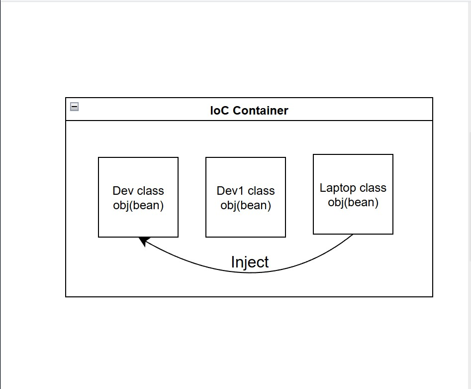

```
<?xml version="1.0" encoding="UTF-8"?>
<beans xmlns="http://www.springframework.org/schema/beans"
       xmlns:xsi="http://www.w3.org/2001/XMLSchema-instance"
       xsi:schemaLocation="
        http://www.springframework.org/schema/beans http://www.springframework.org/schema/beans/spring-beans.xsd">

    <!-- bean definitions here -->


    <!-- REQUIRED for @PostConstruct & @PreDestroy -->
    <!-- <bean class="org.springframework.context.annotation.CommonAnnotationBeanPostProcessor"/> -->
    <bean class="com.prajwal.Developer" id="developer">
        <!--<property name="age" value="26"/>-->
        <!--<constructor-arg name="age" value="26"/>-->
        <constructor-arg index="0" value="26"/>
        <constructor-arg index="1" value="6500"/>
        <constructor-arg index="2" ref="laptop"/>
    </bean>

    <bean id="developer1" class="com.prajwal.Developer">
        <property name="macbook" ref="laptop"/>
    </bean>
    <bean class="com.prajwal.Laptop" id="laptop">
        <property name="model" value="MacBook Air 13"/>
        <property name="manufacturer" value="Apple"/>
    </bean>
</beans>
```

```
<bean id="developer1" class="com.prajwal.Developer">
    <property name="macbook" ref="laptop"/>
</bean>
```

```
package com.prajwal;

public class Developer {

    private int age;
    private double salary;
    private Laptop macbook;

    public Developer(){
        System.out.println("Default Developer constructor Obj created in IoC.");
    }

    public Developer(int age, double salary, Laptop macbook){
        System.out.println("Developer constructor Obj created in IoC.");
        this.age = age;
        this.salary = salary;
        this.macbook = macbook;
    }

//    public void setAge(int age) {
//        this.age = age;
//    }
    public void setLaptop(Laptop macbook) {
        this.macbook = macbook;
    }

    public int getAge() {
        return age;
    }

    public double getSalary(){
        return salary;
    }

    public Laptop getLatop(){ return macbook; }

    public void build() {
        macbook.compiler();
        System.out.println("Dev writing code.");
    }
}
```

```
public void setLaptop(Laptop macbook) {
    this.macbook = macbook;
}
```

- Error: WARNING: Exception encountered during context initialization - cancelling refresh attempt: org.springframework.beans.factory.BeanCreationException: Error creating bean with name 'developer1' defined in class path resource [Spring.xml]: Invalid property 'macbook' of bean class [com.prajwal.Developer]: Bean property 'macbook' is not writable or has an invalid setter method. Does the parameter type of the setter match the return type of the getter?
  Exception in thread "main" org.springframework.beans.factory.BeanCreationException: Error creating bean with name 'developer1' defined in class path resource [Spring.xml]: Invalid property 'macbook' of bean class [com.prajwal.Developer]: Bean property 'macbook' is not writable or has an invalid setter method. Does the parameter type of the setter match the return type of the getter?
- Error: Spring failed to create developer1 because the property macbook has no matching setter method (setMacbook) in the Developer class.

- Spring XML maps <property> to setter methods (JavaBean rule)
- Property name comes from the method name after set.
- setLaptop() -> property name = laptop.
- setMacbook() -> property name = macbook.
- Field name and parameter name are ignored.
- Wrong property name -> setter not found -> dependency stays null.

```
//Spring.xml
<?xml version="1.0" encoding="UTF-8"?>
<beans xmlns="http://www.springframework.org/schema/beans"
       xmlns:xsi="http://www.w3.org/2001/XMLSchema-instance"
       xsi:schemaLocation="
        http://www.springframework.org/schema/beans http://www.springframework.org/schema/beans/spring-beans.xsd">

    <!-- bean definitions here -->


    <!-- REQUIRED for @PostConstruct & @PreDestroy -->
    <!-- <bean class="org.springframework.context.annotation.CommonAnnotationBeanPostProcessor"/> -->
    <bean class="com.prajwal.Developer" id="developer">
        <!--<property name="age" value="26"/>-->
        <!--<constructor-arg name="age" value="26"/>-->
        <constructor-arg index="0" value="26"/>
        <constructor-arg index="1" value="6500"/>
        <constructor-arg index="2" ref="laptop"/>
    </bean>

    <bean id="developer1" class="com.prajwal.Developer">
        <property name="laptop" ref="laptop"/>
    </bean>
    <bean class="com.prajwal.Laptop" id="laptop">
        <property name="model" value="MacBook Air 13"/>
        <property name="manufacturer" value="Apple"/>
    </bean>
</beans>
```

```
//Developer.java
package com.prajwal;

public class Developer {

    private int age;
    private double salary;
    private Laptop macbook;

    public Developer(){
        System.out.println("Default Developer constructor Obj created in IoC.");
    }

    public Developer(int age, double salary, Laptop macbook){
        System.out.println("Developer constructor Obj created in IoC.");
        this.age = age;
        this.salary = salary;
        this.macbook = macbook;
    }

//    public void setAge(int age) {
//        this.age = age;
//    }
    public void setLaptop(Laptop macbook) {
        this.macbook = macbook;
    }

    public int getAge() {
        return age;
    }

    public double getSalary(){
        return salary;
    }

    public Laptop getLatop(){ return macbook; }

    public void build() {
        macbook.compiler();
        System.out.println("Dev writing code.");
    }
}
```

```
//Laptop.java
package com.prajwal;

public class Laptop {

    private String model;
    private String manufacturer;

    public Laptop(){
        System.out.println("Laptop constructor Obj created in IoC.");
    }

    public void setModel(String model) {
        //MacBook Air 13
        this.model = model;
    }

    public void setManufacturer(String manufacturer) {
        //Apple
        this.manufacturer = manufacturer;
    }

    public void compiler() {
        System.out.println("Java compiler running.");
    }

    @Override
    public String toString() {
        return "model:"+model+", manufacturer:"+manufacturer;
    }
}
```

```
//App.java
package com.prajwal;

import org.springframework.context.ApplicationContext;
import org.springframework.context.support.ClassPathXmlApplicationContext;

/**
 * Hello world!
 *
 */
public class App {
    public static void main( String[] args ) {
        System.out.println( "Hello World!" );
        ApplicationContext context = new ClassPathXmlApplicationContext("Spring.xml");
        Developer dev = (Developer) context.getBean("developer");
        Developer dev1 = (Developer) context.getBean("developer1");
        System.out.println("dev age:"+dev.getAge());
        System.out.println("dev salary:"+dev.getSalary());
        System.out.println("dev laptop:"+dev.getLatop().toString());
        dev.build();
        System.out.println("dev1 age:"+dev1.getAge());
        System.out.println("dev1 Laptop:"+dev1.getLatop().toString());
        dev1.build(); // 💥 NullPointerException
    }
}
```

```
//output
Hello World!
Laptop constructor Obj created in IoC.
Developer constructor Obj created in IoC.
Default Developer constructor Obj created in IoC.
dev age:26
dev salary:6500.0
dev laptop:model:MacBook Air 13, manufacturer:Apple
Java compiler running.
Dev writing code.
dev1 age:0
dev1 Laptop:model:MacBook Air 13, manufacturer:Apple
Java compiler running.
Dev writing code.

Process finished with exit code 0
```

```
<bean id="developer1" class="com.prajwal.Developer">
    <property name="laptop" ref="laptop"/>
                        <!--Object ref-->
</bean>
<bean class="com.prajwal.Laptop" id="laptop">
    <property name="model" value="MacBook Air 13"/>
    <property name="manufacturer" value="Apple"/>
</bean>
```

- Hey Spring create the object.
- Create object for developer1.
- Spring will see the property -> Laptop ref="laptop".
- Spring will search the IoC container for laptop.
- Do we have any object name laptop.


- We are injecting the laptop object in the Dev1 class using setter injection.

- **_Error:_** laptop is not writable has no valid setter.
- Exception in thread "main" org.springframework.beans.factory.BeanCreationException: Error creating bean with name 'developer1' defined in class path resource [Spring.xml]: Invalid property 'laptop' of bean class [com.prajwal.Developer]: Bean property 'laptop' is not writable or has an invalid setter method. Does the parameter type of the setter match the return type of the getter?

```
package com.prajwal;

public class Developer {

    private int age;
    private double salary;
    private Laptop macbook;

    public Developer(){
        System.out.println("Default Developer constructor Obj created in IoC.");
    }

    public Developer(int age, double salary, Laptop macbook){
        System.out.println("Developer constructor Obj created in IoC.");
        this.age = age;
        this.salary = salary;
        this.macbook = macbook;
    }

//    public void setAge(int age) {
//        this.age = age;
//    }

// code that causes the exception. Commenting the setter
//    public void setLaptop(Laptop macbook) {
//        this.macbook = macbook;
//    }

    public int getAge() {
        return age;
    }

    public double getSalary(){
        return salary;
    }

    public Laptop getLatop(){ return macbook; }

    public void build() {
        macbook.compiler();
        System.out.println("Dev writing code.");
    }
}
```

- To fix use.
- **_\_Setter Injection:_**:\_\*\*

```
//Dev.java
package com.prajwal;

public class Dev {

    private Laptop laptop;

    //setter injection
    public void setLaptop(Laptop laptop) {
        this.laptop = laptop;
    }

    public Laptop getLaptop() {
        return laptop;
    }

    public void build() {
        laptop.compiler();
        System.out.println("Dev writing code.");
    }
}
```

```
//Laptop.java
package com.prajwal;

public class Laptop {

    private String model;
    private String manufacturer;

    public void setModel(String model) {
        this.model = model;
    }

    public void setManufacturer(String manufacturer) {
        this.manufacturer = manufacturer;
    }

    public String getModel() {
        return model;
    }

    public String getManufacturer() {
        return manufacturer;
    }

    public void compiler() {
        System.out.println("java compiler running.");
    }

    @Override
    public String toString() {
        return getManufacturer() + " " + getModel() ;
    }
}
```

```
//App.java
package com.prajwal;

import org.springframework.context.ApplicationContext;
import org.springframework.context.support.ClassPathXmlApplicationContext;

/**
 * Hello world!
 *
 */
public class App
{
    public static void main( String[] args ) {

        System.out.println( "Hello World!" );
        ApplicationContext context = new ClassPathXmlApplicationContext("Spring.xml");
        Dev dev = (Dev) context.getBean("dev");
        dev.build();
        System.out.println(dev.getLaptop());

    }
}
```

```
//Spring.xml
<?xml version="1.0" encoding="UTF-8"?>
<beans xmlns="http://www.springframework.org/schema/beans"
       xmlns:xsi="http://www.w3.org/2001/XMLSchema-instance"
       xsi:schemaLocation="
        http://www.springframework.org/schema/beans http://www.springframework.org/schema/beans/spring-beans.xsd">

    <!-- bean definitions here -->
    <bean name="dev" class="com.prajwal.Dev">
        <property name="laptop" ref="lap"/>
    </bean>
    <bean name="lap" class="com.prajwal.Laptop">
        <property name="model" value="MacBook Air 13"/>
        <property name="manufacturer" value="Apple"/>
    </bean>
</beans>
```

```
//pom.xml
<project xmlns="http://maven.apache.org/POM/4.0.0" xmlns:xsi="http://www.w3.org/2001/XMLSchema-instance"
  xsi:schemaLocation="http://maven.apache.org/POM/4.0.0 http://maven.apache.org/xsd/maven-4.0.0.xsd">
  <modelVersion>4.0.0</modelVersion>

  <groupId>com.prajwal</groupId>
  <artifactId>SpringCoreComplication</artifactId>
  <version>1.0-SNAPSHOT</version>
  <packaging>jar</packaging>

  <name>SpringCoreComplication</name>
  <url>http://maven.apache.org</url>

  <properties>
    <project.build.sourceEncoding>UTF-8</project.build.sourceEncoding>
  </properties>

  <dependencies>
    <dependency>
      <groupId>junit</groupId>
      <artifactId>junit</artifactId>
      <version>3.8.1</version>
      <scope>test</scope>
    </dependency>

    <!-- Source: https://mvnrepository.com/artifact/org.springframework/spring-context -->
    <dependency>
      <groupId>org.springframework</groupId>
      <artifactId>spring-context</artifactId>
      <version>6.2.9</version>
      <scope>compile</scope>
    </dependency>

  </dependencies>
</project>
```

```
//output:
Hello World!
java compiler running.
Dev writing code.
Apple MacBook Air 13

Process finished with exit code 0
```

- **_Constructor Injection:_**

```
//Dev.java
package com.prajwal;

public class Dev {

    private Laptop laptop;

    //setter injection
//    public void setLaptop(Laptop laptop) {
//        this.laptop = laptop;
//    }

    //constructor injection
    public Dev(Laptop laptop) {
        this.laptop = laptop;
    }

    public Laptop getLaptop() {
        return laptop;
    }

    public void build() {
        laptop.compiler();
        System.out.println("Dev writing code.");
    }
}
```

```
//Spring.xml
<?xml version="1.0" encoding="UTF-8"?>
<beans xmlns="http://www.springframework.org/schema/beans"
       xmlns:xsi="http://www.w3.org/2001/XMLSchema-instance"
       xsi:schemaLocation="
        http://www.springframework.org/schema/beans http://www.springframework.org/schema/beans/spring-beans.xsd">

    <!-- bean definitions here -->
    <bean name="dev" class="com.prajwal.Dev">
        <!--<property name="laptop" ref="lap"/>-->
        <constructor-arg ref="lap"/>
    </bean>
    <bean name="lap" class="com.prajwal.Laptop">
        <property name="model" value="MacBook Air 13"/>
        <property name="manufacturer" value="Apple"/>
    </bean>
</beans>
```

```
//output:
Hello World!
java compiler running.
Dev writing code.
Apple MacBook Air 13

Process finished with exit code 0
```

- Constructor injection -> Compulsary Dependencies.
- Setter injection -> Optional Dependencies.

## Autowiring:

- autowire="constructor"

```
<bean name="dev" class="com.prajwal.Dev" autowire="constructor">
    <!--<property name="laptop" ref="lap"/>-->
    <!--<constructor-arg ref="lap"/>-->
</bean>
```

- Spring looks at the constructors of Dev.
- It checks the parameter types.
- It searches the IoC container for beans matching those types.
- It automatically injects the matching bean(s).
- No <constructor-arg> is needed.

```
//Dev.java
package com.prajwal;

public class Dev {

    private Laptop laptop;

    //setter injection
//    public void setLaptop(Laptop laptop) {
//        this.laptop = laptop;
//    }

    //constructor injection
    public Dev(Laptop laptop) {
        this.laptop = laptop;
    }

    public Laptop getLaptop() {
        return laptop;
    }

    public void build() {
        laptop.compiler();
        System.out.println("Dev writing code.");
    }
}
```

```
//Laptop.java
package com.prajwal;

public class Laptop {

    private String model;
    private String manufacturer;

    public void setModel(String model) {
        this.model = model;
    }

    public void setManufacturer(String manufacturer) {
        this.manufacturer = manufacturer;
    }

    public String getModel() {
        return model;
    }

    public String getManufacturer() {
        return manufacturer;
    }

    public void compiler() {
        System.out.println("java compiler running.");
    }

    @Override
    public String toString() {
        return getManufacturer() + " " + getModel() ;
    }
}
```

```
//Spring.xml
<?xml version="1.0" encoding="UTF-8"?>
<beans xmlns="http://www.springframework.org/schema/beans"
       xmlns:xsi="http://www.w3.org/2001/XMLSchema-instance"
       xsi:schemaLocation="
        http://www.springframework.org/schema/beans http://www.springframework.org/schema/beans/spring-beans.xsd">

    <!-- bean definitions here -->
    <bean name="dev" class="com.prajwal.Dev" autowire="constructor">
        <!--<property name="laptop" ref="lap"/>-->
        <!--<constructor-arg ref="lap"/>-->
    </bean>
    <bean name="lap" class="com.prajwal.Laptop">
        <property name="model" value="MacBook Air 13"/>
        <property name="manufacturer" value="Apple"/>
    </bean>
</beans>
```

```
//output
Hello World!
java compiler running.
Dev writing code.
Apple MacBook Air 13

Process finished with exit code 0
```

- autowire="byType"

```
<bean name="dev" class="com.prajwal.Dev" autowire="byType">
    <!--<property name="laptop" ref="lap"/>-->
    <!--<constructor-arg ref="lap"/>-->
</bean>
```

- Spring creates the Dev object using the default constructor.
- It scans all setter methods in Dev.
- For each setter, Spring checks the parameter type.
- It searches the container for exactly One bean of that type.
- If found -> Spring automatically calls the setter.

```
//Dev.java
package com.prajwal;

public class Dev {

    private Laptop laptop;

    //setter injection
    public void setLaptop(Laptop laptop) {
        this.laptop = laptop;
    }

    //constructor injection
//    public Dev(Laptop laptop) {
//        this.laptop = laptop;
//    }

    public Laptop getLaptop() {
        return laptop;
    }

    public void build() {
        laptop.compiler();
        System.out.println("Dev writing code.");
    }
}
```

```
//Laptop.java
package com.prajwal;

public class Laptop {

    private String model;
    private String manufacturer;

    public void setModel(String model) {
        this.model = model;
    }

    public void setManufacturer(String manufacturer) {
        this.manufacturer = manufacturer;
    }

    public String getModel() {
        return model;
    }

    public String getManufacturer() {
        return manufacturer;
    }

    public void compiler() {
        System.out.println("java compiler running.");
    }

    @Override
    public String toString() {
        return getManufacturer() + " " + getModel() ;
    }
}
```

```
//Spring.xml
<?xml version="1.0" encoding="UTF-8"?>
<beans xmlns="http://www.springframework.org/schema/beans"
       xmlns:xsi="http://www.w3.org/2001/XMLSchema-instance"
       xsi:schemaLocation="
        http://www.springframework.org/schema/beans http://www.springframework.org/schema/beans/spring-beans.xsd">

    <!-- bean definitions here -->
    <bean name="dev" class="com.prajwal.Dev" autowire="byType">
        <!--<property name="laptop" ref="lap"/>-->
        <!--<constructor-arg ref="lap"/>-->
    </bean>
    <bean name="lap" class="com.prajwal.Laptop">
        <property name="model" value="MacBook Air 13"/>
        <property name="manufacturer" value="Apple"/>
    </bean>
</beans>
```

```
//output
Hello World!
java compiler running.
Dev writing code.
Apple MacBook Air 13

Process finished with exit code 0
```

- autowire="byName".

```
<bean name="dev" class="com.prajwal.Dev" autowire="byName">
    <!--<property name="laptop" ref="lap"/>-->
    <!--<constructor-arg ref="lap"/>-->
</bean>
```

- Spring creates the bean using the default constructor.
- Spring scans the class for setter methods.
- For each setter, Spring derives the property name from the setter method name.
- Eg: setLap() -> property name = lap
- Spring does not use the setter parameter name.
- Eg: setLap(Laptop xyz) -> xyz is ignored.
- Spring searches the container for a bean with id = property name. id = "lap".
- if a matching bean is found, Spring injects it by calling the setter.
- else is skipped silently.

```
//Spring.xml
<?xml version="1.0" encoding="UTF-8"?>
<beans xmlns="http://www.springframework.org/schema/beans"
       xmlns:xsi="http://www.w3.org/2001/XMLSchema-instance"
       xsi:schemaLocation="
        http://www.springframework.org/schema/beans http://www.springframework.org/schema/beans/spring-beans.xsd">

    <!-- bean definitions here -->
    <bean name="dev" class="com.prajwal.Dev" autowire="byName">
        <!--<property name="laptop" ref="lap"/>-->
        <!--<constructor-arg ref="lap"/>-->
    </bean>
    <bean name="lap" class="com.prajwal.Laptop">
        <property name="model" value="MacBook Air 13"/>
        <property name="manufacturer" value="Apple"/>
    </bean>
</beans>
```

```
//Dev.java
package com.prajwal;

public class Dev {

    private Laptop laptop;

    //setter injection
    public void setLap(Laptop laptop) {
        this.laptop = laptop;
    }

    //constructor injection
//    public Dev(Laptop laptop) {
//        this.laptop = laptop;
//    }

    public Laptop getLaptop() {
        return laptop;
    }

    public void build() {
        laptop.compiler();
        System.out.println("Dev writing code.");
    }
}
```

```
//Laptop.java
package com.prajwal;

public class Laptop {

    private String model;
    private String manufacturer;

    public void setModel(String model) {
        this.model = model;
    }

    public void setManufacturer(String manufacturer) {
        this.manufacturer = manufacturer;
    }

    public String getModel() {
        return model;
    }

    public String getManufacturer() {
        return manufacturer;
    }

    public void compiler() {
        System.out.println("java compiler running.");
    }

    @Override
    public String toString() {
        return getManufacturer() + " " + getModel() ;
    }
}
```

```
//output:
Hello World!
java compiler running.
Dev writing code.
Apple MacBook Air 13

Process finished with exit code 0

```

- **_Remaining types:_**
- no : <bean class="com.prajwal.Dev" autowire="no"/>
- autodetect (deprecated) : <bean class="com.prajwal.Dev" autowire="autodetect"/>
- **_autodetect:_**
- Tries constructor first, then setter.

## Adding complexities to Spring Core Project:

```
//pom.xml
<project xmlns="http://maven.apache.org/POM/4.0.0" xmlns:xsi="http://www.w3.org/2001/XMLSchema-instance"
  xsi:schemaLocation="http://maven.apache.org/POM/4.0.0 http://maven.apache.org/xsd/maven-4.0.0.xsd">
  <modelVersion>4.0.0</modelVersion>

  <groupId>com.prajwal</groupId>
  <artifactId>SpringCoreComplication</artifactId>
  <version>1.0-SNAPSHOT</version>
  <packaging>jar</packaging>

  <name>SpringCoreComplication</name>
  <url>http://maven.apache.org</url>

  <properties>
    <project.build.sourceEncoding>UTF-8</project.build.sourceEncoding>
  </properties>

  <dependencies>
    <dependency>
      <groupId>junit</groupId>
      <artifactId>junit</artifactId>
      <version>3.8.1</version>
      <scope>test</scope>
    </dependency>

    <!-- Source: https://mvnrepository.com/artifact/org.springframework/spring-context -->
    <dependency>
      <groupId>org.springframework</groupId>
      <artifactId>spring-context</artifactId>
      <version>6.2.9</version>
      <scope>compile</scope>
    </dependency>

  </dependencies>
</project>
```

```
//Computer.java
package com.prajwal;

public interface Computer {
    //abstract method
    void compiler();
}
```

```
//Desktop.java
package com.prajwal;

public class Desktop implements Computer {

    private String cpu;
    private String ram;
    private String storage;

    public Desktop() {
        System.out.println("Default Desktop Constructor");
    }

    public void setCpu(String cpu) {
        this.cpu = cpu;
    }

    public void setRam(String ram) {
        this.ram = ram;
    }

    public void setStorage(String storage) {
        this.storage = storage;
    }

    public String getCpu() {
        return cpu;
    }

    public String getRam() {
        return ram;
    }

    public String getStorage() {
        return storage;
    }

    @Override
    public void compiler() {
        System.out.println("java compiler running.");
    }

    @Override
    public String toString() {
        return getCpu() + "/" + getRam() + "/" + getStorage();
    }

}
```

```
//Laptop.java
package com.prajwal;

public class Laptop implements Computer {

    private String model;
    private String manufacturer;

    public Laptop() {
        System.out.println("Default Laptop Constructor");
    }

    public void setModel(String model) {
        this.model = model;
    }

    public void setManufacturer(String manufacturer) {
        this.manufacturer = manufacturer;
    }

    public String getModel() {
        return model;
    }

    public String getManufacturer() {
        return manufacturer;
    }

    @Override
    public void compiler() {
        System.out.println("java compiler running.");
    }

    @Override
    public String toString() {
        return getManufacturer() + "/" + getModel() ;
    }
}
```

```
//Dev.java
package com.prajwal;

public class Dev {

//    private Laptop laptop;
    private Computer device;

    //setter injection
//    public void setLap(Laptop laptop) {
//        this.laptop = laptop;
//    }

    public void setDevice(Computer device) {
        this.device = device;
    }

    public Computer getDevice() {
        return device;
    }

    //constructor injection
//    public Dev(Laptop laptop) {
//        this.laptop = laptop;
//    }

//    public Laptop getLaptop() {
//        return laptop;
//    }

    public void build() {
        device.compiler();
        System.out.println("Dev writing code.");
    }
}
```

```
//App.java
package com.prajwal;

import org.springframework.context.ApplicationContext;
import org.springframework.context.support.ClassPathXmlApplicationContext;

/**
 * Hello world!
 *
 */
public class App
{
    public static void main( String[] args ) {

        System.out.println( "Hello World!" );
        ApplicationContext context = new ClassPathXmlApplicationContext("Spring.xml");
        Dev dev = (Dev) context.getBean("dev");
        Dev dev1 = (Dev) context.getBean("dev1");
        dev.build();
        dev1.build();
        System.out.println(dev.getDevice().toString());
        System.out.println(dev1.getDevice().toString());
    }
}
```

```
//Spring.xml
<?xml version="1.0" encoding="UTF-8"?>
<beans xmlns="http://www.springframework.org/schema/beans"
       xmlns:xsi="http://www.w3.org/2001/XMLSchema-instance"
       xsi:schemaLocation="
        http://www.springframework.org/schema/beans http://www.springframework.org/schema/beans/spring-beans.xsd">

    <!-- bean definitions here -->
    <!--<bean name="dev" class="com.prajwal.Dev" autowire="byType">-->
    <bean name="dev" class="com.prajwal.Dev">
        <!--<property name="laptop" ref="lap"/>-->
        <!--<constructor-arg ref="lap"/>-->
        <property name="device" ref="lap1"/>
    </bean>
    <bean name="dev1" class="com.prajwal.Dev">
        <property name="device" ref="desk1"/>
    </bean>
    <bean name="lap1" class="com.prajwal.Laptop">
        <property name="model" value="MacBook Air 13"/>
        <property name="manufacturer" value="Apple"/>
    </bean>
    <bean class="com.prajwal.Desktop" name="desk1">
        <property name="cpu" value="Intel Core i7 12700F 12 Gen"/>
        <property name="ram" value=" Corsair Vengeance LPX 16GB (1x16GB) DDR4 3200MHZ UDIMM"/>
        <property name="storage" value="Western Digital WD Black SN7100 NVMe 500GB"/>
    </bean>
</beans>
```

```
//output:
Hello World!
Default Laptop Constructor
Default Desktop Constructor
java compiler running.
Dev writing code.
java compiler running.
Dev writing code.
Apple/MacBook Air 13
Intel Core i7 12700F 12 Gen/ Corsair Vengeance LPX 16GB (1x16GB) DDR4 3200MHZ UDIMM/Western Digital WD Black SN7100 NVMe 500GB

Process finished with exit code 0
```

- public class Laptop implements interface Computer.
- public class Desktop implements interface Computer.

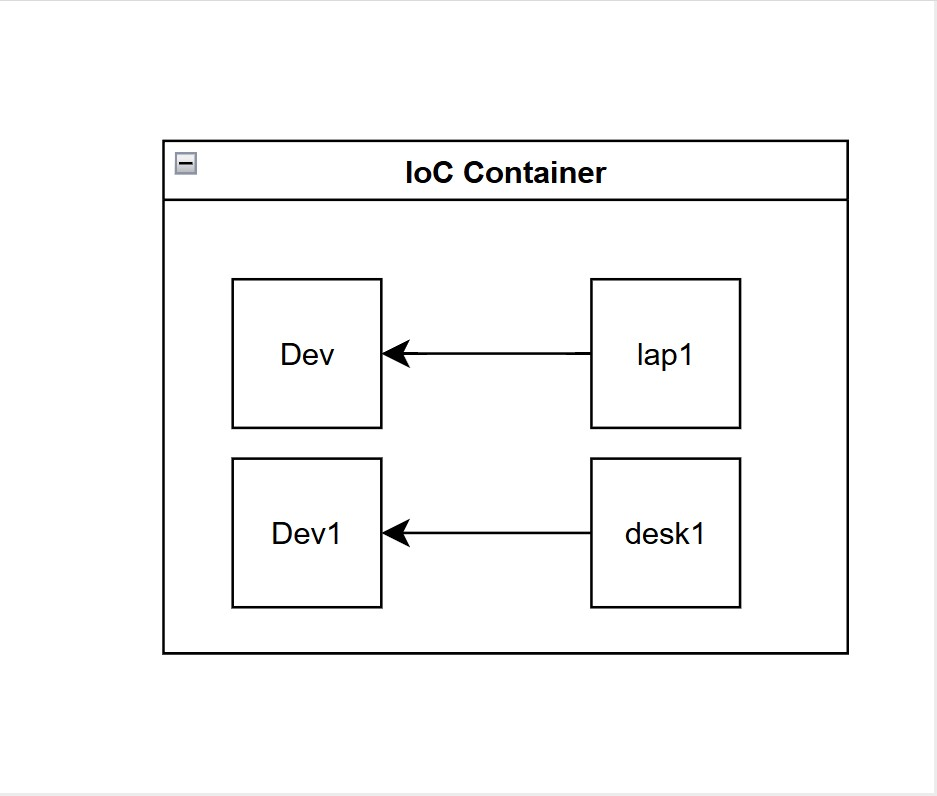

- But in Dev class we are using lap1 bean.
- And in Dev1 class we are using desk1 bean.
- You can interchange the beans.

```
//Computer.java
package com.prajwal;

public interface Computer {
    //abstract method
    void compiler();
}
```

```
//Desktop.java
package com.prajwal;

public class Desktop implements Computer {

    private String cpu;
    private String ram;
    private String storage;

    public Desktop() {
        System.out.println("Default Desktop Constructor");
    }

    public void setCpu(String cpu) {
        this.cpu = cpu;
    }

    public void setRam(String ram) {
        this.ram = ram;
    }

    public void setStorage(String storage) {
        this.storage = storage;
    }

    public String getCpu() {
        return cpu;
    }

    public String getRam() {
        return ram;
    }

    public String getStorage() {
        return storage;
    }

    @Override
    public void compiler() {
        System.out.println("java compiler running.");
    }

    @Override
    public String toString() {
        return getCpu() + " /" + getRam() + " /" + getStorage();
    }

}
```

```
//Laptop.java
package com.prajwal;

public class Laptop implements Computer {

    private String model;
    private String manufacturer;

    public Laptop() {
        System.out.println("Default Laptop Constructor");
    }

    public void setModel(String model) {
        this.model = model;
    }

    public void setManufacturer(String manufacturer) {
        this.manufacturer = manufacturer;
    }

    public String getModel() {
        return model;
    }

    public String getManufacturer() {
        return manufacturer;
    }

    @Override
    public void compiler() {
        System.out.println("java compiler running.");
    }

    @Override
    public String toString() {
        return getManufacturer() + " /" + getModel() ;
    }
}
```

```
//Dev.java
package com.prajwal;

public class Dev {

//    private Laptop laptop;
    private Computer device;

    //setter injection
//    public void setLap(Laptop laptop) {
//        this.laptop = laptop;
//    }

    public void setDevice(Computer device) {
        this.device = device;
    }

    public Computer getDevice() {
        return device;
    }

    //constructor injection
//    public Dev(Laptop laptop) {
//        this.laptop = laptop;
//    }

//    public Laptop getLaptop() {
//        return laptop;
//    }

    public void build() {
        device.compiler();
        System.out.println("Dev writing code.");
    }
}
```

```
//App.java
package com.prajwal;

import org.springframework.context.ApplicationContext;
import org.springframework.context.support.ClassPathXmlApplicationContext;

/**
 * Hello world!
 *
 */
public class App
{
    public static void main( String[] args ) {

        System.out.println( "Hello World!" );
        ApplicationContext context = new ClassPathXmlApplicationContext("Spring.xml");
        Dev dev = (Dev) context.getBean("dev");
        Dev dev1 = (Dev) context.getBean("dev1");
        dev.build();
        dev1.build();
        System.out.println("dev_device="+dev.getDevice().toString());
        System.out.println("dev1_device="+dev1.getDevice().toString());
    }
}
```

```
//Spring.xml
<?xml version="1.0" encoding="UTF-8"?>
<beans xmlns="http://www.springframework.org/schema/beans"
       xmlns:xsi="http://www.w3.org/2001/XMLSchema-instance"
       xsi:schemaLocation="
        http://www.springframework.org/schema/beans http://www.springframework.org/schema/beans/spring-beans.xsd">

    <!-- bean definitions here -->
    <!--<bean name="dev" class="com.prajwal.Dev" autowire="byType">-->
    <bean name="dev" class="com.prajwal.Dev">
        <!--<property name="laptop" ref="lap"/>-->
        <!--<constructor-arg ref="lap"/>-->
        <property name="device" ref="desk1"/>
        <!--<property name="device" ref="desk1"/>-->
    </bean>
    <bean name="dev1" class="com.prajwal.Dev">
        <property name="device" ref="lap1"/>
    </bean>
    <!--<bean name="lap1" class="com.prajwal.Laptop">-->
    <bean name="lap1" class="com.prajwal.Laptop">
        <property name="model" value="MacBook Air 13"/>
        <property name="manufacturer" value="Apple"/>
    </bean>
    <!--<bean class="com.prajwal.Desktop" name="desk1">-->
    <bean name="desk1" class="com.prajwal.Desktop">
        <property name="cpu" value="Intel Core i7 12700F 12 Gen"/>
        <property name="ram" value=" Corsair Vengeance LPX 16GB (1x16GB) DDR4 3200MHZ UDIMM"/>
        <property name="storage" value="Western Digital WD Black SN7100 NVMe 500GB"/>
    </bean>
</beans>
```

```
//pom.xml
<project xmlns="http://maven.apache.org/POM/4.0.0" xmlns:xsi="http://www.w3.org/2001/XMLSchema-instance"
  xsi:schemaLocation="http://maven.apache.org/POM/4.0.0 http://maven.apache.org/xsd/maven-4.0.0.xsd">
  <modelVersion>4.0.0</modelVersion>

  <groupId>com.prajwal</groupId>
  <artifactId>SpringCoreComplication</artifactId>
  <version>1.0-SNAPSHOT</version>
  <packaging>jar</packaging>

  <name>SpringCoreComplication</name>
  <url>http://maven.apache.org</url>

  <properties>
    <project.build.sourceEncoding>UTF-8</project.build.sourceEncoding>
  </properties>

  <dependencies>
    <dependency>
      <groupId>junit</groupId>
      <artifactId>junit</artifactId>
      <version>3.8.1</version>
      <scope>test</scope>
    </dependency>

    <!-- Source: https://mvnrepository.com/artifact/org.springframework/spring-context -->
    <dependency>
      <groupId>org.springframework</groupId>
      <artifactId>spring-context</artifactId>
      <version>6.2.9</version>
      <scope>compile</scope>
    </dependency>

  </dependencies>
</project>
```

```
//output:
Hello World!
Default Desktop Constructor
Default Laptop Constructor
java compiler running.
Dev writing code.
java compiler running.
Dev writing code.
dev_device=Intel Core i7 12700F 12 Gen / Corsair Vengeance LPX 16GB (1x16GB) DDR4 3200MHZ UDIMM /Western Digital WD Black SN7100 NVMe 500GB
dev1_device=Apple /MacBook Air 13

Process finished with exit code 0
```

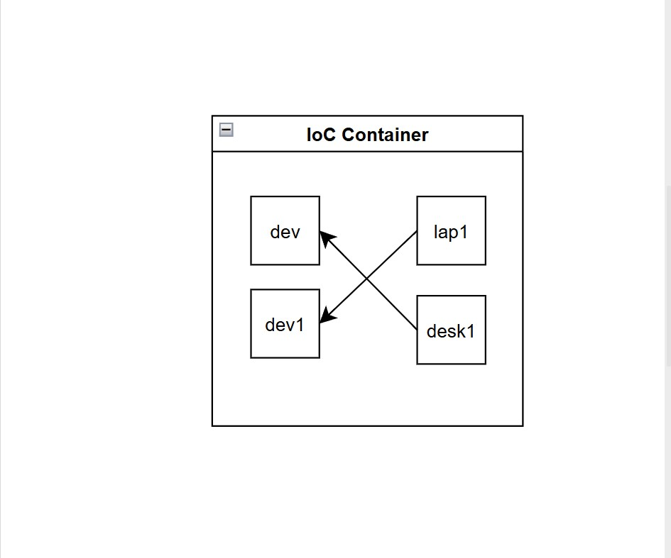

```
//errorcode
<beans>
    <bean name="dev" class="com.prajwal.Dev">
        <property name="device" ref="lap1">
    </bean>
    <bean name="lap1" class="com.prajwal.Laptop"/>
    <bean name="desk1" class="com.prajwal.Desktop"/>
</beans>
// to this
<beans>
    <bean name="dev" class="com.prajwal.Dev">
        <property name="device" ref="com">
    </bean>
    <bean name="com" class="com.prajwal.Laptop"/>
    <bean name="com" class="com.prajwal.Desktop"/>
</beans>
```

- **_*Example 2(Book):copy example from book.*_**

```
//pom.xml
<project xmlns="http://maven.apache.org/POM/4.0.0" xmlns:xsi="http://www.w3.org/2001/XMLSchema-instance"
  xsi:schemaLocation="http://maven.apache.org/POM/4.0.0 http://maven.apache.org/xsd/maven-4.0.0.xsd">
  <modelVersion>4.0.0</modelVersion>

  <groupId>com.prajwal</groupId>
  <artifactId>SpringComplex2</artifactId>
  <version>1.0-SNAPSHOT</version>
  <packaging>jar</packaging>

  <name>SpringComplex2</name>
  <url>http://maven.apache.org</url>

  <properties>
    <project.build.sourceEncoding>UTF-8</project.build.sourceEncoding>
  </properties>

  <dependencies>
    <dependency>
      <groupId>junit</groupId>
      <artifactId>junit</artifactId>
      <version>3.8.1</version>
      <scope>test</scope>
    </dependency>

    <!-- Source: https://mvnrepository.com/artifact/org.springframework/spring-context -->
    <dependency>
      <groupId>org.springframework</groupId>
      <artifactId>spring-context</artifactId>
      <version>6.2.9</version>
      <scope>compile</scope>
    </dependency>
  </dependencies>
</project>
```

```
//Desktop.java
package com.prajwal;

public class Desktop implements Computer {

    private String cpu;
    private String ram;
    private String Storage;

    public Desktop() {
        System.out.println("Default Constructor Desktop.");
    }

    public void setCpu( String cpu ) {
        this.cpu = cpu;
    }

    public void setRam( String ram ) {
        this.ram = ram;
    }

    public void setStorage( String Storage ) {
        this.Storage = Storage;
    }

    public String getCpu() {
        return this.cpu;
    }

    public String getRam() {
        return this.ram;
    }

    public String getStorage() {
        return this.Storage;
    }

    @Override
    public void compile() {
        System.out.println("Java compiler running.");
    }

    @Override
    public String toString() {
        return  "Desktop{" + "cpu=" + cpu + ", ram=" + ram + ", Storage=" + Storage + '}';
    }
}
```

```
//Laptop.java
package com.prajwal;

public class Laptop implements Computer {

    private String model;
    private String manufacturer;

    public Laptop() {
        System.out.println("Default constructor laptop.");
    }

    public void setModel( String model ) {
        this.model = model;
    }

    public void setManufacturer( String manufacturer ) {
        this.manufacturer = manufacturer;
    }

    public String getModel() {
        return this.model;
    }

    public String getManufacturer() {
        return this.manufacturer;
    }

    @Override
    public void compile() {
        System.out.println("Java compiler running.");
    }

    @Override
    public String toString() {
        return "Laptop{" + "model=" + model + ", manufacturer=" + manufacturer + '}';
    }
}
```

```
//Computer.java
package com.prajwal;

public interface Computer {
    //abstract method
    void compile();
}
```

```
//Dev.java
package com.prajwal;

public class Dev {
    private Computer comp;

    public Dev() {
        System.out.println("Default constructor dev.");
    }

    public void setComp(Computer comp) {
        this.comp = comp;
    }

    public Computer getComp() {
        return comp;
    }

    public void build() {
        comp.compile();
        System.out.println("dev working on code.");
    }
}
```

```
//App.java
package com.prajwal;

import org.springframework.context.ApplicationContext;
import org.springframework.context.support.ClassPathXmlApplicationContext;

/**
 * Hello world!
 *
 */
public class App
{
    public static void main( String[] args ) {
        System.out.println( "Hello World!" );

        ApplicationContext context = new ClassPathXmlApplicationContext("Spring.xml");
        Dev dev = (Dev) context.getBean("dev");
        System.out.println("dev comp="+dev.getComp().toString());
        dev.build();
    }
}
```

```
//Spring.xml
<?xml version="1.0" encoding="UTF-8"?>
<beans xmlns="http://www.springframework.org/schema/beans"
       xmlns:xsi="http://www.w3.org/2001/XMLSchema-instance"
       xsi:schemaLocation="
        http://www.springframework.org/schema/beans http://www.springframework.org/schema/beans/spring-beans.xsd">

    <!-- bean definitions here -->
    <bean name="dev" class="com.prajwal.Dev">
        <property name="comp" ref="lap1"/>
    </bean>

    <bean name="lap1" class="com.prajwal.Laptop">
        <property name="model" value="MacBook Air 13"/>
        <property name="manufacturer" value="Apple"/>
    </bean>

    <bean name="desk1" class="com.prajwal.Desktop">
        <property name="cpu" value="Intel Core i5-13400F"/>
        <property name="ram" value="Corsair Vengeance RGB Pro 16GB DDR4"/>
        <property name="storage" value="Samsung 980 NVMe M.2 SSD 250GB"/>
    </bean>
</beans>
```

```
//output:
Hello World!
Default constructor dev.
Default constructor laptop.
Default Constructor Desktop.
dev comp=Laptop{model=MacBook Air 13, manufacturer=Apple}
Java compiler running.
dev working on code.

Process finished with exit code 0
```

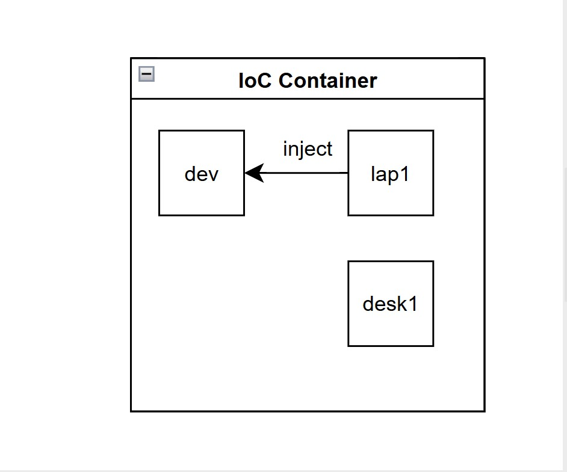

- But in dev bean we are using lap1 as property ref.
- You can change to property to Desk1.

```
//Spring.xml
<?xml version="1.0" encoding="UTF-8"?>
<beans xmlns="http://www.springframework.org/schema/beans"
       xmlns:xsi="http://www.w3.org/2001/XMLSchema-instance"
       xsi:schemaLocation="
        http://www.springframework.org/schema/beans http://www.springframework.org/schema/beans/spring-beans.xsd">

    <!-- bean definitions here -->
    <bean name="dev" class="com.prajwal.Dev">
        <property name="comp" ref="desk1"/>
    </bean>

    <bean name="lap1" class="com.prajwal.Laptop">
        <property name="model" value="MacBook Air 13"/>
        <property name="manufacturer" value="Apple"/>
    </bean>

    <bean name="desk1" class="com.prajwal.Desktop">
        <property name="cpu" value="Intel Core i5-13400F"/>
        <property name="ram" value="Corsair Vengeance RGB Pro 16GB DDR4"/>
        <property name="storage" value="Samsung 980 NVMe M.2 SSD 250GB"/>
    </bean>
</beans>
```

```
//App.java
package com.prajwal;

import org.springframework.context.ApplicationContext;
import org.springframework.context.support.ClassPathXmlApplicationContext;

/**
 * Hello world!
 *
 */
public class App
{
    public static void main( String[] args ) {
        System.out.println( "Hello World!" );

        ApplicationContext context = new ClassPathXmlApplicationContext("Spring.xml");
        Dev dev = (Dev) context.getBean("dev");
        System.out.println("dev comp="+dev.getComp().toString());
        dev.build();
    }
}

```

```
//output:
Hello World!
Default constructor dev.
Default Constructor Desktop.
Default constructor laptop.
dev comp=Desktop{cpu=Intel Core i5-13400F, ram=Corsair Vengeance RGB Pro 16GB DDR4, Storage=Samsung 980 NVMe M.2 SSD 250GB}
Java compiler running.
dev working on code.

Process finished with exit code 0
```

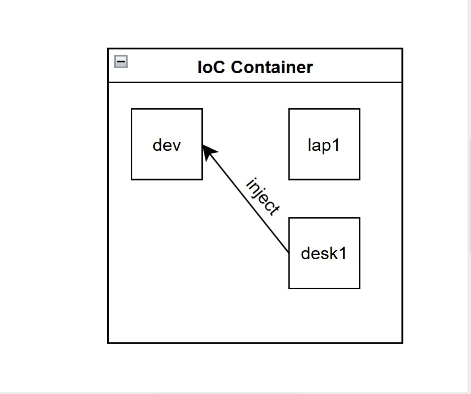

```
//Spring.xml
<?xml version="1.0" encoding="UTF-8"?>
<beans xmlns="http://www.springframework.org/schema/beans"
       xmlns:xsi="http://www.w3.org/2001/XMLSchema-instance"
       xsi:schemaLocation="
        http://www.springframework.org/schema/beans http://www.springframework.org/schema/beans/spring-beans.xsd">

    <!-- bean definitions here -->
    <bean name="dev" class="com.prajwal.Dev">
        <property name="com" ref="com"/>
    </bean>

    <bean name="com" class="com.prajwal.Laptop">
        <property name="model" value="MacBook Air 13"/>
        <property name="manufacturer" value="Apple"/>
    </bean>

    <bean name="desk1" class="com.prajwal.Desktop">
        <property name="cpu" value="Intel Core i5-13400F"/>
        <property name="ram" value="Corsair Vengeance RGB Pro 16GB DDR4"/>
        <property name="storage" value="Samsung 980 NVMe M.2 SSD 250GB"/>
    </bean>
</beans>
```

```
//App.java
package com.prajwal;

import org.springframework.context.ApplicationContext;
import org.springframework.context.support.ClassPathXmlApplicationContext;

/**
 * Hello world!
 *
 */
public class App
{
    public static void main( String[] args ) {
        System.out.println( "Hello World!" );

        ApplicationContext context = new ClassPathXmlApplicationContext("Spring.xml");
        Dev dev = (Dev) context.getBean("dev");
        System.out.println("dev comp="+dev.getCom().toString());
        dev.build();
    }
}
```

```
//output:
Hello World!
Default constructor dev.
Default constructor laptop.
Default Constructor Desktop.
dev comp=Laptop{model=MacBook Air 13, manufacturer=Apple}
Java compiler running.
dev working on code.

Process finished with exit code 0
```

- **_<property name="com" ref="com"/>:_**
- property name="com" -> looks for setter setCom().
- ref="com" -> looks for bean with name com.
- Finds:

```
<bean name="com" class="com.prajwal.Laptop"/>
```

- if we comment the <property name="com" ref="com">
- Null pointerException

```
<?xml version="1.0" encoding="UTF-8"?>
<beans xmlns="http://www.springframework.org/schema/beans"
       xmlns:xsi="http://www.w3.org/2001/XMLSchema-instance"
       xsi:schemaLocation="
        http://www.springframework.org/schema/beans http://www.springframework.org/schema/beans/spring-beans.xsd">

    <!-- bean definitions here -->
    <bean name="dev" class="com.prajwal.Dev">
        <!--<property name="com" ref="com"/>-->
        <!--Comment the property to cause nullpointerException-->
    </bean>

    <bean name="com" class="com.prajwal.Laptop">
        <property name="model" value="MacBook Air 13"/>
        <property name="manufacturer" value="Apple"/>
    </bean>

    <bean name="desk1" class="com.prajwal.Desktop">
        <property name="cpu" value="Intel Core i5-13400F"/>
        <property name="ram" value="Corsair Vengeance RGB Pro 16GB DDR4"/>
        <property name="storage" value="Samsung 980 NVMe M.2 SSD 250GB"/>
    </bean>
</beans>
```

- Spring says it will not automatically wire -> user will have to tell me to do it.(Default behaviour.)
- Spring's 'I won't auto-wire' rule explains why NullPointerException occurs.
- They are two sides of the same cause.
- Because Spring does not auto-wire dependencies unless explicitly configured, the field remains 'null', and Java throws a NullPointerException when <property> are not mentioned.

```
//Error code: Spring.xml
<?xml version="1.0" encoding="UTF-8"?>
<beans xmlns="http://www.springframework.org/schema/beans"
       xmlns:xsi="http://www.w3.org/2001/XMLSchema-instance"
       xsi:schemaLocation="
        http://www.springframework.org/schema/beans http://www.springframework.org/schema/beans/spring-beans.xsd">

    <!-- bean definitions here -->
    <bean name="dev" class="com.prajwal.Dev" autowire="byName">
        <!--<property name="com" ref="com"/>-->
        <!--Comment the property to cause nullpointerException-->
    </bean>

    <bean name="comp" class="com.prajwal.Laptop">
        <property name="model" value="MacBook Air 13"/>
        <property name="manufacturer" value="Apple"/>
    </bean>

    <bean name="comp" class="com.prajwal.Desktop">
        <property name="cpu" value="Intel Core i5-13400F"/>
        <property name="ram" value="Corsair Vengeance RGB Pro 16GB DDR4"/>
        <property name="storage" value="Samsung 980 NVMe M.2 SSD 250GB"/>
    </bean>
</beans>
```

- It fails because two beans are defined with the same name 'comp'.
- Spring requires every bean name/id in a <beans> file to be unique.

## Autowire

- **Common:**

```
//Desktop.java
package com.prajwal;

public class Desktop implements Computer {

    private String cpu;
    private String ram;
    private String Storage;

    public Desktop() {
        System.out.println("Default Constructor Desktop.");
    }

    public void setCpu( String cpu ) {
        this.cpu = cpu;
    }

    public void setRam( String ram ) {
        this.ram = ram;
    }

    public void setStorage( String Storage ) {
        this.Storage = Storage;
    }

    public String getCpu() {
        return this.cpu;
    }

    public String getRam() {
        return this.ram;
    }

    public String getStorage() {
        return this.Storage;
    }

    @Override
    public void compile() {
        System.out.println("Java compiler running.");
    }

    @Override
    public String toString() {
        return  "Desktop{" + "cpu=" + cpu + ", ram=" + ram + ", Storage=" + Storage + '}';
    }
}
```

```
//Laptop.java
package com.prajwal;

public class Laptop implements Computer {

    private String model;
    private String manufacturer;

    public Laptop() {
        System.out.println("Default constructor laptop.");
    }

    public void setModel( String model ) {
        this.model = model;
    }

    public void setManufacturer( String manufacturer ) {
        this.manufacturer = manufacturer;
    }

    public String getModel() {
        return this.model;
    }

    public String getManufacturer() {
        return this.manufacturer;
    }

    @Override
    public void compile() {
        System.out.println("Java compiler running.");
    }

    @Override
    public String toString() {
        return "Laptop{" + "model=" + model + ", manufacturer=" + manufacturer + '}';
    }
}
```

```
//Computer.java
package com.prajwal;

public interface Computer {
    //abstract method
    void compile();
}
```

```
//Dev.java
package com.prajwal;

public class Dev {
    private Computer comp;

    public Dev() {
        System.out.println("Default constructor dev.");
    }

    public void setComp(Computer comp) {
        this.comp = comp;
    }

    public Computer getComp() {
        return comp;
    }

    public void build() {
        comp.compile();
        System.out.println("dev working on code.");
    }
}
```

- **_byName:_**

```
<bean name="dev" class="com.prajwal.Dev" autowire="byName">
</bean>
```

- 'byName' autowiring works by matching the bean name with the setter (property) name in the target class.
- Eg: if Dev has setComp(). Spring looks for bean named comp and injects it.

```
//Spring.xml
<?xml version="1.0" encoding="UTF-8"?>
<beans xmlns="http://www.springframework.org/schema/beans"
       xmlns:xsi="http://www.w3.org/2001/XMLSchema-instance"
       xsi:schemaLocation="
        http://www.springframework.org/schema/beans http://www.springframework.org/schema/beans/spring-beans.xsd">

    <!-- bean definitions here -->
    <bean name="dev" class="com.prajwal.Dev" autowire="byName">
        <!--<property name="com" ref="com"/>-->
        <!--Comment the property to cause nullpointerException-->
    </bean>

    <bean name="comp" class="com.prajwal.Laptop">
        <property name="model" value="MacBook Air 13"/>
        <property name="manufacturer" value="Apple"/>
    </bean>

    <bean name="comp1" class="com.prajwal.Desktop">
        <property name="cpu" value="Intel Core i5-13400F"/>
        <property name="ram" value="Corsair Vengeance RGB Pro 16GB DDR4"/>
        <property name="storage" value="Samsung 980 NVMe M.2 SSD 250GB"/>
    </bean>
</beans>
```

```
//App.java
package com.prajwal;

import org.springframework.context.ApplicationContext;
import org.springframework.context.support.ClassPathXmlApplicationContext;

/**
 * Hello world!
 *
 */
public class App
{
    public static void main( String[] args ) {
        System.out.println( "Hello World!" );

        ApplicationContext context = new ClassPathXmlApplicationContext("Spring.xml");
        Dev dev = (Dev) context.getBean("dev");
        System.out.println("dev comp="+dev.getComp().toString());
        dev.build();
    }
}
```

```
//output:
Hello World!
Default constructor dev.
Default constructor laptop.
Default Constructor Desktop.
dev comp=Laptop{model=MacBook Air 13, manufacturer=Apple}
Java compiler running.
dev working on code.

Process finished with exit code 0
```

- Example2:

```
//Spring.xml
<?xml version="1.0" encoding="UTF-8"?>
<beans xmlns="http://www.springframework.org/schema/beans"
       xmlns:xsi="http://www.w3.org/2001/XMLSchema-instance"
       xsi:schemaLocation="
        http://www.springframework.org/schema/beans http://www.springframework.org/schema/beans/spring-beans.xsd">

    <!-- bean definitions here -->
    <bean name="dev" class="com.prajwal.Dev" autowire="byName">
        <!--<property name="com" ref="com"/>-->
        <!--Comment the property to cause nullpointerException-->
    </bean>

    <bean name="comp" class="com.prajwal.Laptop">
        <property name="model" value="MacBook Air 13"/>
        <property name="manufacturer" value="Apple"/>
    </bean>

    <bean name="comp1" class="com.prajwal.Desktop">
        <property name="cpu" value="Intel Core i5-13400F"/>
        <property name="ram" value="Corsair Vengeance RGB Pro 16GB DDR4"/>
        <property name="storage" value="Samsung 980 NVMe M.2 SSD 250GB"/>
    </bean>
</beans>
```

```
//Dev.java
package com.prajwal;

public class Dev {
    private Computer comp;

    public Dev() {
        System.out.println("Default constructor dev.");
    }

    public void setComp1(Computer comp) {
        this.comp = comp;
    }

    public Computer getComp1() {
        return comp;
    }

    public void build() {
        comp.compile();
        System.out.println("dev working on code.");
    }
}
```

```
//App.java
package com.prajwal;

public class Dev {
    private Computer comp;

    public Dev() {
        System.out.println("Default constructor dev.");
    }

    public void setComp1(Computer comp) {
        this.comp = comp;
    }

    public Computer getComp1() {
        return comp;
    }

    public void build() {
        comp.compile();
        System.out.println("dev working on code.");
    }
}
```

```
//output:
Hello World!
Default constructor dev.
Default Constructor Desktop.
Default constructor laptop.
dev comp=Desktop{cpu=Intel Core i5-13400F, ram=Corsair Vengeance RGB Pro 16GB DDR4, Storage=Samsung 980 NVMe M.2 SSD 250GB}
Java compiler running.
dev working on code.

Process finished with exit code 0
```

- **_byType:_**
- 'byType' autowiring works by matching the data type of the property with a single bean of the same type in the Spring container.
- If more than one bean of the same type exists, Spring throws an ambiguity error and fails to autowire.
- byType autowiring in Spring checks the type of the setter parameter.

```
//Spring.xml
<?xml version="1.0" encoding="UTF-8"?>
<beans xmlns="http://www.springframework.org/schema/beans"
       xmlns:xsi="http://www.w3.org/2001/XMLSchema-instance"
       xsi:schemaLocation="
        http://www.springframework.org/schema/beans http://www.springframework.org/schema/beans/spring-beans.xsd">

    <!-- bean definitions here -->
    <bean name="dev" class="com.prajwal.Dev" autowire="byType">
        <!--<property name="com" ref="com"/>-->
        <!--Comment the property to cause nullpointerException-->
    </bean>

    <bean name="comp" class="com.prajwal.Laptop">
        <property name="model" value="MacBook Air 13"/>
        <property name="manufacturer" value="Apple"/>
    </bean>

    <bean name="comp1" class="com.prajwal.Desktop">
        <property name="cpu" value="Intel Core i5-13400F"/>
        <property name="ram" value="Corsair Vengeance RGB Pro 16GB DDR4"/>
        <property name="storage" value="Samsung 980 NVMe M.2 SSD 250GB"/>
    </bean>
</beans>
```

```
//Dev.java
package com.prajwal;

public class Dev {
//    private Computer comp;
    private Desktop comp; //change for byType

    public Dev() {
        System.out.println("Default constructor dev.");
    }

//    public void setComp1(Computer comp) {
//        this.comp = comp;
//    }

//    public Computer getComp1() {
//        return comp;
//    }

    public void setComp(Desktop comp) {
        this.comp = comp;
    }

    public Desktop getComp() {
        return comp;
    }

    public void build() {
        comp.compile();
        System.out.println("dev working on code.");
    }
}
```

```
//App.java
package com.prajwal;

import org.springframework.context.ApplicationContext;
import org.springframework.context.support.ClassPathXmlApplicationContext;

/**
 * Hello world!
 *
 */
public class App {
    public static void main( String[] args ) {
        System.out.println( "Hello World!" );

        ApplicationContext context = new ClassPathXmlApplicationContext("Spring.xml");
        Dev dev = (Dev) context.getBean("dev");
        System.out.println("dev comp="+dev.getComp().toString());
        dev.build();
    }
}
```

```
//output:
Hello World!
Default constructor dev.
Default Constructor Desktop.
Default constructor laptop.
dev comp=Desktop{cpu=Intel Core i5-13400F, ram=Corsair Vengeance RGB Pro 16GB DDR4, Storage=Samsung 980 NVMe M.2 SSD 250GB}
Java compiler running.
dev working on code.

Process finished with exit code 0
```

- **_constructor:_**

- Injects dependencies by constructor parameter type/
- Spring looks for a bean whose type matches each constructor argument and passes it automatically.
- No need for <constructor-arg> if types match, but errors occur if no matching bean or multiple beans of the same type exist.

```
//Spring.xml
<?xml version="1.0" encoding="UTF-8"?>
<beans xmlns="http://www.springframework.org/schema/beans"
       xmlns:xsi="http://www.w3.org/2001/XMLSchema-instance"
       xsi:schemaLocation="
        http://www.springframework.org/schema/beans http://www.springframework.org/schema/beans/spring-beans.xsd">

    <!-- bean definitions here -->
    <bean name="dev" class="com.prajwal.Dev" autowire="constructor">
        <!--<property name="com" ref="com"/>-->
        <!--Comment the property to cause nullpointerException-->
        <constructor-arg name="laptop" ref="comp2"/>
    </bean>

    <bean name="comp" class="com.prajwal.Laptop">
        <property name="model" value="MacBook Air 13 M4 Pro"/>
        <property name="manufacturer" value="Apple"/>
    </bean>

    <bean name="comp2" class="com.prajwal.Laptop" autowire="constructor">
        <constructor-arg name="model" value="MacBook Pro 14 M5"/>
        <constructor-arg name="manufacturer" value="Apple"/>
    </bean>

    <bean name="comp1" class="com.prajwal.Desktop">
        <property name="cpu" value="Intel Core i5-13400F"/>
        <property name="ram" value="Corsair Vengeance RGB Pro 16GB DDR4"/>
        <property name="storage" value="Samsung 980 NVMe M.2 SSD 250GB"/>
    </bean>
</beans>
```

```
//Dev.java
package com.prajwal;

public class Dev {
    private Computer comp;
//    private Desktop comp; //change for byType

    public Dev() {
        System.out.println("Default constructor dev.");
    }

    public Dev(Laptop laptop) {
        this.comp = laptop;
    }

//    public void setComp1(Computer comp) {
//        this.comp = comp;
//    }

//    public Computer getComp1() {
//        return comp;
//    }

//    public void setComp(Desktop comp) {
//        this.comp = comp;
//    }

//    public Desktop getComp() {
//        return comp;
//    }

    public void setComp(Computer comp) {
        this.comp = comp;
    }

    public Computer getComp() {
        return comp;
    }

    public void build() {
        comp.compile();
        System.out.println("dev working on code.");
    }
}
```

```
//App.java
package com.prajwal;

import org.springframework.context.ApplicationContext;
import org.springframework.context.support.ClassPathXmlApplicationContext;

/**
 * Hello world!
 *
 */
public class App {
    public static void main( String[] args ) {
        System.out.println( "Hello World!" );

        ApplicationContext context = new ClassPathXmlApplicationContext("Spring.xml");
        Dev dev = (Dev) context.getBean("dev");
        System.out.println("dev comp="+dev.getComp().toString());
        dev.build();
    }
}
```

```
//output:
Hello World!
Default constructor laptop.
Default Constructor Desktop.
dev comp=Laptop{model=MacBook Pro 14 M5, manufacturer=Apple}
Java compiler running.
dev working on code.

Process finished with exit code 0
```

- Concept:
- **_autowire="byName"_**

```
<bean id="Dev" class="com.prajwal.Dev" autowire="byName">
</bean>
<bean id="com" class="com.prajwal.Laptop"/>
<bean id="desk1" class="com.prajwal.Desktop"/>
```

```
public class Dev {
    private Computer com;
    public void setCom(Computer com) {
        this.com = com;
    }
    public Computer getCom() {
        return this.com;
    }
}
```

- The Dev class setter (property) setCom -> "com" matches <bean id="com" class="com.prajwal.Laptop"/>
- In byName, Spring strips set from setter name, lowercases it, and matches it with the bean id.

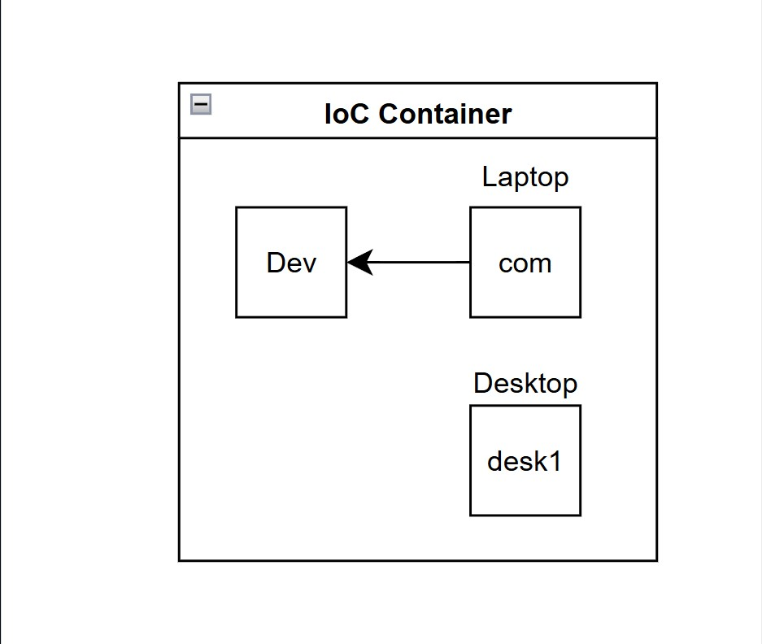

- The Spring will search, Do we have any object/bean ("com") in the container.
- IoC container, yes we have and it will connect using autowire="byName".

- **_Confusion:_**

```
<bean id="com" class="com.prajwal.Laptop"></bean>
<bean id="com" class="com.prajwal.Desktop"></bean>
```

```
//Spring.xml
<?xml version="1.0" encoding="UTF-8"?>
<beans xmlns="http://www.springframework.org/schema/beans"
       xmlns:xsi="http://www.w3.org/2001/XMLSchema-instance"
       xsi:schemaLocation="
        http://www.springframework.org/schema/beans http://www.springframework.org/schema/beans/spring-beans.xsd">

    <!-- bean definitions here -->
    <bean name="dev" class="com.prajwal.Dev" autowire="constructor">
        <!--<property name="com" ref="com"/>-->
        <!--Comment the property to cause nullpointerException-->
        <constructor-arg name="laptop" ref="comp"/>
    </bean>
    <!--name="comp"-->
    <bean name="comp" class="com.prajwal.Laptop">
        <property name="model" value="MacBook Air 13 M4 Pro"/>
        <property name="manufacturer" value="Apple"/>
    </bean>
    <!--name="comp"-->
    <bean name="comp" class="com.prajwal.Laptop" autowire="constructor">
        <constructor-arg name="model" value="MacBook Pro 14 M5"/>
        <constructor-arg name="manufacturer" value="Apple"/>
    </bean>
    <!--name="comp"-->
    <bean name="comp" class="com.prajwal.Desktop">
        <property name="cpu" value="Intel Core i5-13400F"/>
        <property name="ram" value="Corsair Vengeance RGB Pro 16GB DDR4"/>
        <property name="storage" value="Samsung 980 NVMe M.2 SSD 250GB"/>
    </bean>
</beans>
```

- Exception in thread "main" org.springframework.beans.factory.parsing.BeanDefinitionParsingException: Configuration problem: Bean name 'comp' is already used in this <beans> element

- ### We cannot use the same id twice in a container it must be unique.
- Change:

```
<bean id="com" class="com.prajwal.Desktop"></bean>
//to
<bean id="com1" class="com.prajwal.Desktop"></bean>
```

- If you want to use Desktop:
- **_autowire="byType"_**

```
<bean id="dev" class="com.prajwal.Dev" autowire="byType">
</bean>
```

- Comment <!--<bean id="com" class="com.prajwal.Laptop"></bean>-->
- byType: Is searching for the type of a computer -> Laptop or Desktop is a type of computer.

- **_Confusion:_**

```
<bean id="dev" class="com.prajwal.Dev" autowire="byType">
</bean>
<bean id="com" class="com.prajwal.Laptop">
</bean>
<bean id="com1" class="com.prajwal.Desktop">
</bean>
```

```
//Spring.xml
<?xml version="1.0" encoding="UTF-8"?>
<beans xmlns="http://www.springframework.org/schema/beans"
       xmlns:xsi="http://www.w3.org/2001/XMLSchema-instance"
       xsi:schemaLocation="
        http://www.springframework.org/schema/beans http://www.springframework.org/schema/beans/spring-beans.xsd">

    <!-- bean definitions here -->
    <bean name="dev" class="com.prajwal.Dev" autowire="byType">
        <!--<property name="com" ref="com"/>-->
        <!--Comment the property to cause nullpointerException-->
        <!--<constructor-arg name="laptop" ref="comp"/>-->
    </bean>

    <bean name="comp" class="com.prajwal.Laptop">
        <property name="model" value="MacBook Air 13 M4 Pro"/>
        <property name="manufacturer" value="Apple"/>
    </bean>

    <bean name="comp2" class="com.prajwal.Laptop" autowire="constructor">
        <constructor-arg name="model" value="MacBook Pro 14 M5"/>
        <constructor-arg name="manufacturer" value="Apple"/>
    </bean>

    <bean name="comp1" class="com.prajwal.Desktop">
        <property name="cpu" value="Intel Core i5-13400F"/>
        <property name="ram" value="Corsair Vengeance RGB Pro 16GB DDR4"/>
        <property name="storage" value="Samsung 980 NVMe M.2 SSD 250GB"/>
    </bean>
</beans>
```

- WARNING: Exception encountered during context initialization - cancelling refresh attempt: org.springframework.beans.factory.UnsatisfiedDependencyException: Error creating bean with name 'dev' defined in class path resource [Spring.xml]: Unsatisfied dependency expressed through bean property 'comp': No qualifying bean of type 'com.prajwal.Computer' available: expected single matching bean but found 3: comp,comp2,comp1
  Exception in thread "main" org.springframework.beans.factory.UnsatisfiedDependencyException: Error creating bean with name 'dev' defined in class path resource [Spring.xml]: Unsatisfied dependency expressed through bean property 'comp': No qualifying bean of type 'com.prajwal.Computer' available: expected single matching bean but found 3: comp,comp2,comp1

- Error: Expected single matching bean found 3.
- There are 3 beans claiming to be of type computer.

- Spring says it cannot select one. As Spring cannot be baised.
- As Developers we can be baised.

```
<bean id="com" class="com.prajwal.Laptop"></bean>
```

- I want to choose laptop.
- We can use the attribute primary="true" to do that.

```
<bean id="com" class="com.prajwal.laptop" primary="true"></bean>
```

- You can use the primary attribute in terms of confusion go with the primary attribute bean. Similar to '@Primary'.

```
//Spring.xml
<?xml version="1.0" encoding="UTF-8"?>
<beans xmlns="http://www.springframework.org/schema/beans"
       xmlns:xsi="http://www.w3.org/2001/XMLSchema-instance"
       xsi:schemaLocation="
        http://www.springframework.org/schema/beans http://www.springframework.org/schema/beans/spring-beans.xsd">

    <!-- bean definitions here -->
    <bean name="dev" class="com.prajwal.Dev" autowire="byType">
        <!--<property name="com" ref="com"/>-->
        <!--Comment the property to cause nullpointerException-->
        <!--<constructor-arg name="laptop" ref="comp"/>-->
    </bean>

    <bean name="comp" class="com.prajwal.Laptop" primary="true">
        <property name="model" value="MacBook Air 13 M4 Pro"/>
        <property name="manufacturer" value="Apple"/>
    </bean>

    <bean name="comp2" class="com.prajwal.Laptop" autowire="constructor">
        <constructor-arg name="model" value="MacBook Pro 14 M5"/>
        <constructor-arg name="manufacturer" value="Apple"/>
    </bean>

    <bean name="comp1" class="com.prajwal.Desktop">
        <property name="cpu" value="Intel Core i5-13400F"/>
        <property name="ram" value="Corsair Vengeance RGB Pro 16GB DDR4"/>
        <property name="storage" value="Samsung 980 NVMe M.2 SSD 250GB"/>
    </bean>
</beans>
```

```
//App.java
package com.prajwal;

import org.springframework.context.ApplicationContext;
import org.springframework.context.support.ClassPathXmlApplicationContext;

/**
 * Hello world!
 *
 */
public class App {
    public static void main( String[] args ) {
        System.out.println( "Hello World!" );

        ApplicationContext context = new ClassPathXmlApplicationContext("Spring.xml");
        Dev dev = (Dev) context.getBean("dev");
        System.out.println("dev comp="+dev.getComp().toString());
        dev.build();
    }
}
```

```
//output:
Hello World!
Default constructor dev.
Default constructor laptop.
Default Constructor Desktop.
dev comp=Laptop{model=MacBook Air 13 M4 Pro, manufacturer=Apple}
Java compiler running.
dev working on code.

Process finished with exit code 0
```

## App.java

- Currently we are using context.getBean("dev"), where 'dev' refers to id or name attribute defined in bean tag.
- What if mention the type of object we want.

```
public static void main( String[] args ) {
        System.out.println( "Hello World!" );

        ApplicationContext context = new ClassPathXmlApplicationContext("Spring.xml");
        //Dev dev = (Dev) context.getBean("dev");
        Dev dev = context.getBean(Dev.class); //byType
        System.out.println("dev comp="+dev.getComp().toString());
        dev.build();
    }
```

```
//App.java
package com.prajwal;

import org.springframework.context.ApplicationContext;
import org.springframework.context.support.ClassPathXmlApplicationContext;

/**
 * Hello world!
 *
 */
public class App {
    public static void main( String[] args ) {
        System.out.println( "Hello World!" );

        ApplicationContext context = new ClassPathXmlApplicationContext("Spring.xml");
        //Dev dev = (Dev) context.getBean("dev");
        Dev dev = context.getBean(Dev.class); //byType
        System.out.println("dev comp="+dev.getComp().toString());
        dev.build();
    }
}
```

```
//output:
Hello World!
Default constructor dev.
Default constructor laptop.
Default Constructor Desktop.
dev comp=Laptop{model=MacBook Air 13 M4 Pro, manufacturer=Apple}
Java compiler running.
dev working on code.

Process finished with exit code 0
```

- We have seen Spring and Spring Boot both are doing the same thing.
- The difference is the configuration.
- In the Normal Spring -> we use xml file "Spring.xml".
- You need to mention everything if you want a bean, you need to mention. if you need autowiring you need to mention.
- If you have an Idea you can get lost in the xml.

- But in our Spring Boot project there we have not done any configuration.
- In /resources/application.properties.
- Except for the default line spring application.name = myApp

- The config is done by using the annotations. And its easy to work with the annotations.
- In normal Spring -> no Annotations. Everything is mentioned in xml file.
- Like bean, autowire, primary.

## In Spring Boot:

- '@Component' //For Bean
- Eg: public class Dev {}
- '@Autowired' //For autowire attribute.
- We have '@Qualifier("laptop")' //Exact equivalent of ref attribute in <property name="com" ref="laptop">
- '@Primary' //For <bean primary="true"> attribute.

```
public class Laptop implements Computer {
    public void compile() {
        System.out.println("Compiling...");
    }
}
```

- We start IoC container in class.

```
public class MyAppApplication {
    public static void main(String[] args) {
        ApplicationContext context = SpringApplication.run(MyAppApplication.class, args) //Using this line we start the container
    }
}
```

- In case of Normal Spring -> we do.

```
public class App {
    public static void main(String[] args){
        ApplicationContext context = new ClassPathXmlApplicationContext("filename.xml"); //To Start the container.
    }
}
```

- What ever your doing in SpringBoot Behind the Scenes it is using the Spring framework.
- We will focus on Spring boot from now.

# Project

- We are going to build a project and the project is a web project.

- What ever we have learned till now is for the console project.
- What ever we have used annotations and config, is for standalone project.
- When you talk about web things are a bit different.

- If you want to work on a web project and you are not using SpringBoot: Special about -> web -> hosted on Server.

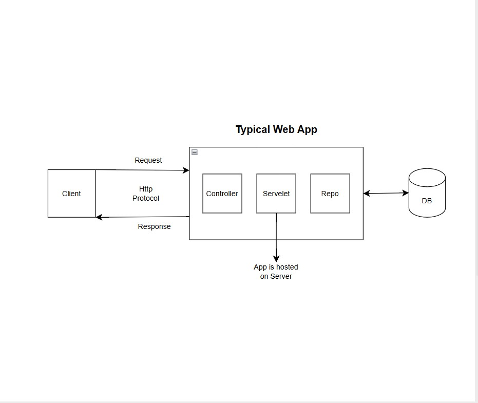

- The App must be capable enough to accept the request from client over the internet. (Which is http request).
- You can't run it using Java virtual machine (JVM) only.
- But to run a webapp -> you need a Server.
- A web server (Or a web container)
- And what you use in java is (servlet).
- And servlets run in -> web container.
- And we use the software (tomcat).
- We use tomcat to run the servlets.

- Ultimately behind the scenes -> Spring -> uses Servlets -> That run on tomcat.

- Spring: So if you want build a web app using spring -> behind the scenes it gets converted into servlet -> That run on tomcat.

- Installing tomcat:
- In a spring boot project(folder) -> spring boot says you don't have to worry -> It has tomcat embedded package inbuilt.

- Next we will need somelayer to accept the request:
- Controller Layer: To accept the request.
- Service Layer: Business Logic.
- Repo Layer: Handle DB connectivity.
- (These are normal classes.)

- **_Controller:_** is a Special class because it will accept the request from the client and also respond to it, and we need to understand how Controller works.

- We will focus on how to create the Controller and to achive that we need to first understand "Spring MVC" -> "Spring Boot MVC".

- Till now we have worked with spring and spring boot but that was for console based / standalone apps.

- Now we will focus on Web:
  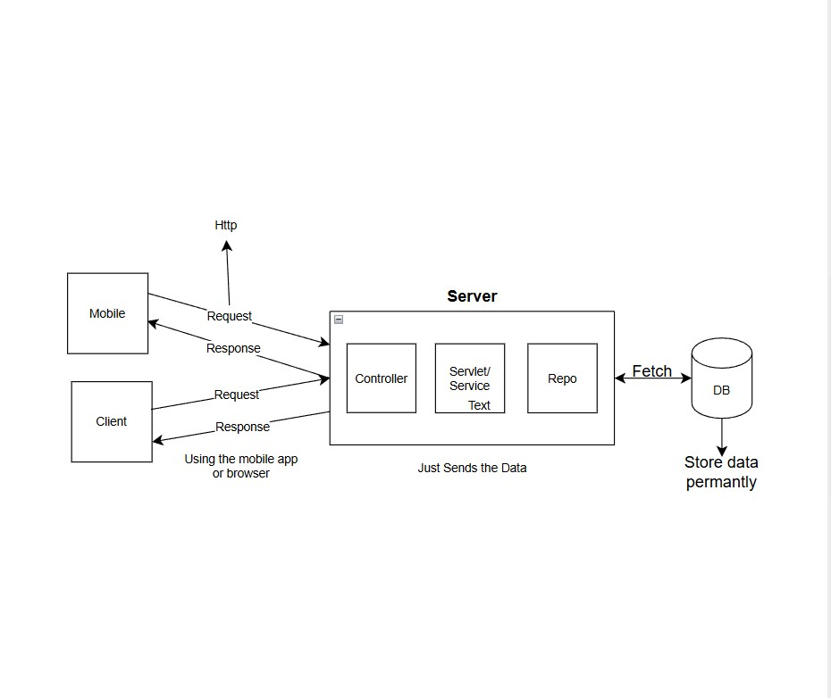

- Eg: Live Score App/ Live Score Checker.
- You will get the Layout and Score Data seperate payloads.

- But let say if your internet is not working -> That app will give you the layout but the app will be loading and cannot give you the data -> Because data is comming from the server.

- That means App -> will already have the layout -> What you are going to send from server -> It just the data.

- Same goes for the client:
- In older days -> Servers sent Layout(Html+Css+Js) and Data(Json).
- Server is responsible to generate both.

- Nowdays we are doing -> we are using two different apps for Frontend and Backend.
- So you use framework or library like (React) or (Angular Js).
- In this you have the layout ready -> which will go to the client -> And then you will send the request for the data from the server.
- And then Server will send the data.
- And data can be Json or xml (represention).

- So as backend you are only responsible for sending the data.
- The client can be browser or mobile app.
- Data can be sent in Json, XML formats. Json (JavaScript object notation) is simple to understand and represent.

- We are concerned about building a backend how do we build a backend?

## Web Controller:

- This is important.
- This has to be a special project because it is a web project, not a console project. Therefore we need the web features.

- This is a Spring Boot starter project, and it's dependencies are defined in pom.xml
- You will not get the web features of default, you want the web features.
- Spring web is a separate part.
- You can add these dependency in pom.xml

- **_Steps:_**
- Browser -> https://start.spring.io.
- Create a new web project.
- Maven
- Java
- 3.2.6 (current 4.0.3)
- Group: com.prajwal
- Artifact: SimpleWebApp
- Jar
- Java 21

- Add Dependencies:
- Spring web: for webapp library.
- Spring Boot dev tools:
- Every time make you make a change in server you have to restart your server.
- Instead you can use "Live reload" using dev tools.
- Generate

- This is a web project -> In the normal world before Spring boot, if you want to run your webapp.
- Basically you need to run a server (tomcat).
- First run server in your machine.
- And then you can run your project after configuration.

- Now we have not done any coding still.
- We will go to src/main/java/com.prajwal.SimpleWebApp/SimpleWebAppApplication.java
- And run the file without any changes in code.

```
//SimpleWebAppApplication.java
package com.prajwal.SimpleWebApp;

import org.springframework.boot.SpringApplication;
import org.springframework.boot.autoconfigure.SpringBootApplication;

@SpringBootApplication
public class SimpleWebAppApplication {

	public static void main(String[] args) {
		SpringApplication.run(SimpleWebAppApplication.class, args);
		System.out.println("server started at port 8080.");
	}

}
```

```
//output:

  .   ____          _            __ _ _
 /\\ / ___'_ __ _ _(_)_ __  __ _ \ \ \ \
( ( )\___ | '_ | '_| | '_ \/ _` | \ \ \ \
 \\/  ___)| |_)| | | | | || (_| |  ) ) ) )
  '  |____| .__|_| |_|_| |_\__, | / / / /
 =========|_|==============|___/=/_/_/_/

 :: Spring Boot ::                (v4.0.3)

2026-02-24T08:03:32.095+05:30  INFO 1080 --- [SimpleWebApp] [  restartedMain] c.p.S.SimpleWebAppApplication            : Starting SimpleWebAppApplication using Java 21.0.3 with PID 1080 (C:\Users\bagew\Desktop\Project_Ideas\spring24jan2026\Learning_Spring_Boot_Attempt2\digit_notes\web_projects\SimpleWebApp\SimpleWebApp\target\classes started by bagew in C:\Users\bagew\Desktop\Project_Ideas\spring24jan2026\Learning_Spring_Boot_Attempt2\digit_notes\web_projects\SimpleWebApp)
2026-02-24T08:03:32.102+05:30  INFO 1080 --- [SimpleWebApp] [  restartedMain] c.p.S.SimpleWebAppApplication            : No active profile set, falling back to 1 default profile: "default"
2026-02-24T08:03:32.239+05:30  INFO 1080 --- [SimpleWebApp] [  restartedMain] .e.DevToolsPropertyDefaultsPostProcessor : Devtools property defaults active! Set 'spring.devtools.add-properties' to 'false' to disable
2026-02-24T08:03:32.239+05:30  INFO 1080 --- [SimpleWebApp] [  restartedMain] .e.DevToolsPropertyDefaultsPostProcessor : For additional web related logging consider setting the 'logging.level.web' property to 'DEBUG'
2026-02-24T08:03:33.792+05:30  INFO 1080 --- [SimpleWebApp] [  restartedMain] o.s.boot.tomcat.TomcatWebServer          : Tomcat initialized with port 8080 (http)
2026-02-24T08:03:33.821+05:30  INFO 1080 --- [SimpleWebApp] [  restartedMain] o.apache.catalina.core.StandardService   : Starting service [Tomcat]
2026-02-24T08:03:33.821+05:30  INFO 1080 --- [SimpleWebApp] [  restartedMain] o.apache.catalina.core.StandardEngine    : Starting Servlet engine: [Apache Tomcat/11.0.18]
2026-02-24T08:03:33.909+05:30  INFO 1080 --- [SimpleWebApp] [  restartedMain] b.w.c.s.WebApplicationContextInitializer : Root WebApplicationContext: initialization completed in 1668 ms
2026-02-24T08:03:34.608+05:30  INFO 1080 --- [SimpleWebApp] [  restartedMain] o.s.boot.tomcat.TomcatWebServer          : Tomcat started on port 8080 (http) with context path '/'
2026-02-24T08:03:34.619+05:30  INFO 1080 --- [SimpleWebApp] [  restartedMain] c.p.S.SimpleWebAppApplication            : Started SimpleWebAppApplication in 3.549 seconds (process running for 4.76)
server started at port 8080. //user added code.
2026-02-24T08:03:57.135+05:30  INFO 1080 --- [SimpleWebApp] [nio-8080-exec-1] o.a.c.c.C.[Tomcat].[localhost].[/]       : Initializing Spring DispatcherServlet 'dispatcherServlet'
2026-02-24T08:03:57.135+05:30  INFO 1080 --- [SimpleWebApp] [nio-8080-exec-1] o.s.web.servlet.DispatcherServlet        : Initializing Servlet 'dispatcherServlet'
2026-02-24T08:03:57.137+05:30  INFO 1080 --- [SimpleWebApp] [nio-8080-exec-1] o.s.web.servlet.DispatcherServlet        : Completed initialization in 1 ms
```

- Browser -> localhost:8080
- Whitelabel Error Page. -> Says - 404
- Cause: Because - we are sending a request for the home page.
- But we have not handled the request.
- How do we do that?

- **_How to handle the Request:_**
- We need someone on the server who can accept our request.
- As there no one on the server side. To handle the request and return "Welcome" response.
- Who will or Who is the person Who will handle the request?
- Thats where we have Controller ->
- Controller class //layer -> who can handle your request.

- com.prajwal.SimpleWebApp
- new package - Controller
- new Java class - HomeController

```
//HomeController.java
package com.prajwal.SimpleWebApp.Controller;

public class HomeController {
    //In this class we can accept the request and response.
    //To do the request and response we need a method.

    public String greet() {
        return "Welcome to simple web app!";
        //Return-type as "String" as it returns a text.
    }
}
```

- We need to configure this normal class.
- And tell Spring this is a controller.
- Spring doesn't know this class is responsible to handle the request for the home page.

## @Controller

- We use "@Controller" annotation: To denote the class is a controller (using annotation) similar to "@Component" as we had seen previously.

```
//HomeController.java
package com.prajwal.SimpleWebApp.Controller;

@Controller
public class HomeController {
    //In this class we can accept the request and response.
    //To do the request and response we need a method.

    public String greet() {
        return "Welcome to simple web app!";
        //Return-type as "String" as it returns a text.
    }
}
```

- On a webapp you will have multiple requests.
- For homepage, contact_us, add_to_cart, about_us.
- On a webapp everything is a request -> Every request will have a different URL.
- Eg: localhost:8080/about

- At this point we will just do for homepage.
- As we want to send the request to the home page -> denoted by "/".

- For every request we can create a different method that responds.

- When ever someone requests '/'. We want the public String greet() {} method to be called.

## @RequestMapping("URL"):

- We use '@RequestMapping("/")' annotation to call the greet() method.

```
@RequestMapping("/")
public String greet() {
    return "hello";
}
```

```
//HomeController.java
package com.prajwal.SimpleWebApp.Controller;

@Controller
public class HomeController {
    //In this class we can accept the request and response.
    //To do the request and response we need a method.

    @RequestMapping("/")
    public String greet() {
        return "Welcome to simple web app!";
        //Return-type as "String" as it returns a text.
    }
}
```

- **_Error:_**
- Whitelabel Error Page

```
//output:
Whitelabel Error Page
This application has no explicit mapping for /error, so you are seeing this as a fallback.

Wed Feb 25 08:21:08 IST 2026
There was an unexpected error (type=Not Found, status=404).
No static resource Welcome to simple web app!.
org.springframework.web.servlet.resource.NoResourceFoundException: No static resource Welcome to simple web app! for request '/Welcome to simple web app!'.
```

- **_Codes:_**
- Not Found.
- No Static Resource.

- **_Cause:_**
- What your SpringBoot Web do when you call the greet() method and you return the String "Welcome to simple web app!".
- But Spring assumes and it looks for a file called "Welcome to simple web app!".
- But why file?

- **_Keyrule:_**
- In a Spring MVC web application, returning String means "View Name", not response text.
- So When Spring sees:

```
@RequestMapping("/")
public String greet() {
    return "Welcome to simple web app!";
    //Return-type as "String" as it returns a text.
}
```

- In the old days servers used to Sending. View = Layout + Data.
- And that layout is a page -> Welcome to simple web app!.html
- So it is searching for page "Welcome to simple web app!.html"

- In our project we don't have the page and we don't want to return the page, we need to return the text.
- And to achive this.
- Instead of using '@Controller'.
- We can use '@RestController'.

## Rest APIs:

- Rest APIs is a concept where you return the data from the server to client.
- Rest stands for (Representational State Transfer).
- You basically transfer the state (data) from server to client and not the layout only the data.
- And if you want RestApi you can use '@RestController'.

## @RestController:

- '@RestController' is an annotation used to create REST APIs where methods return data directly in (JSON/String) instead of web pages.

```
//HomeController.java
package com.prajwal.SimpleWebApp.Controller;

import org.springframework.stereotype.Controller;
import org.springframework.web.bind.annotation.RequestMapping;
import org.springframework.web.bind.annotation.RestController;

//@Controller //Error Whitelabelpage
@RestController //fix
public class HomeController {
    //In this class we can accept the request and response.
    //To do the request and response we need a method.

    @RequestMapping("/")
    public String greet() {
        return "Welcome to simple web app!";
        //Return-type as "String" as it returns a text.
    }
}

```

```
//SimpleWebAppApplication.java
package com.prajwal.SimpleWebApp;

import org.springframework.boot.SpringApplication;
import org.springframework.boot.autoconfigure.SpringBootApplication;

@SpringBootApplication
public class SimpleWebAppApplication {

	public static void main(String[] args) {
		SpringApplication.run(SimpleWebAppApplication.class, args);
		System.out.println("server started at port 8080.");
	}

}
```

```
//output:
Browser -> http://localhost:8080/
Welcome to simple web app!
```

- Another way to say Spring, hey i am not looking for the page. Im looking for the body (data), you can use the annotation '@ResponseBody'.

## @ResponseBody:

- '@ResponseBody' tells Spring to write the method's return value directly into the Http response body instead of treating it as a view name/html page.

```
//TestController.java
package com.prajwal.SimpleWebApp.Controller;

import org.springframework.stereotype.Controller;
import org.springframework.web.bind.annotation.RequestMapping;
import org.springframework.web.bind.annotation.ResponseBody;

@Controller
public class TestController {

    @RequestMapping("/test")
    @ResponseBody
    public String respond() {
        return "This is a message from @TestController <br> for successful response.";
    }
}
```

```
//HomeController.java
package com.prajwal.SimpleWebApp.Controller;

import org.springframework.stereotype.Controller;
import org.springframework.web.bind.annotation.RequestMapping;
import org.springframework.web.bind.annotation.RestController;

//@Controller //Error Whitelabelpage
@RestController //fix
public class HomeController {
    //In this class we can accept the request and response.
    //To do the request and response we need a method.

    @RequestMapping("/")
    public String greet() {
        return "Welcome to simple web app!";
        //Return-type as "String" as it returns a text.
    }
}
```

```
//SimpleWebAppApplication.java
package com.prajwal.SimpleWebApp;

import org.springframework.boot.SpringApplication;
import org.springframework.boot.autoconfigure.SpringBootApplication;

@SpringBootApplication
public class SimpleWebAppApplication {

	public static void main(String[] args) {
		SpringApplication.run(SimpleWebAppApplication.class, args);
		System.out.println("server started at port 8080.");
	}

}
```

```
//output:
Browser -> http://localhost:8080/test
This is a message from @TestController
for successful response.
```

- Run the SimpleWebAppApplication.java to get the output String as response.

- Basically what we are doing is we are returning the data and not the page.
- But if you want to create pages. you can use JSP or Themblay. you create the pages and return them by mentioning there names.

- But we have React (for pages/layout) we just want to return the data, the page is there in the react app.

- SimpleController:

```
//HomeController.java
package com.prajwal.SimpleRestApp.Controller;

import org.springframework.stereotype.Controller;
import org.springframework.web.bind.annotation.RequestMapping;
import org.springframework.web.bind.annotation.ResponseBody;

@Controller
public class HomeController {

    @RequestMapping("/")
    @ResponseBody
    public String greet() {
        return "Hello from HomeController!";
    }
}
```

- RestController:

```
//RestTestController
package com.prajwal.SimpleRestApp.Controller;

import org.springframework.web.bind.annotation.RequestMapping;
import org.springframework.web.bind.annotation.RestController;

@RestController
public class RestTestController {

    @RequestMapping("/Rest")
    public String response() {
        return "Hello from RestTestController!";
    }
}
```

```
//SimpleRestAppApplication.java
package com.prajwal.SimpleRestApp;

import org.springframework.boot.SpringApplication;
import org.springframework.boot.autoconfigure.SpringBootApplication;

@SpringBootApplication
public class SimpleRestAppApplication {

	public static void main(String[] args) {

		SpringApplication.run(SimpleRestAppApplication.class, args);
	}

}
```

```
//output:
Browser -> http://localhost:8080/
Hello from HomeController!
Browser -> http://localhost:8080/Rest
Hello from RestTestController!
```

- What if you want to do something else may be you want to return for the about page.
- Requesting for /about
- handling request.

## @RequestMapping("/about"):

- this maps to a method about().

```
@RequestMapping("/about")
public String about() {
    return "we dont teach, we educate!";
}
```

- So that, how for different requests you can have different methods.
- And that's how you use spring web.

- But if you see typical web app architecture.

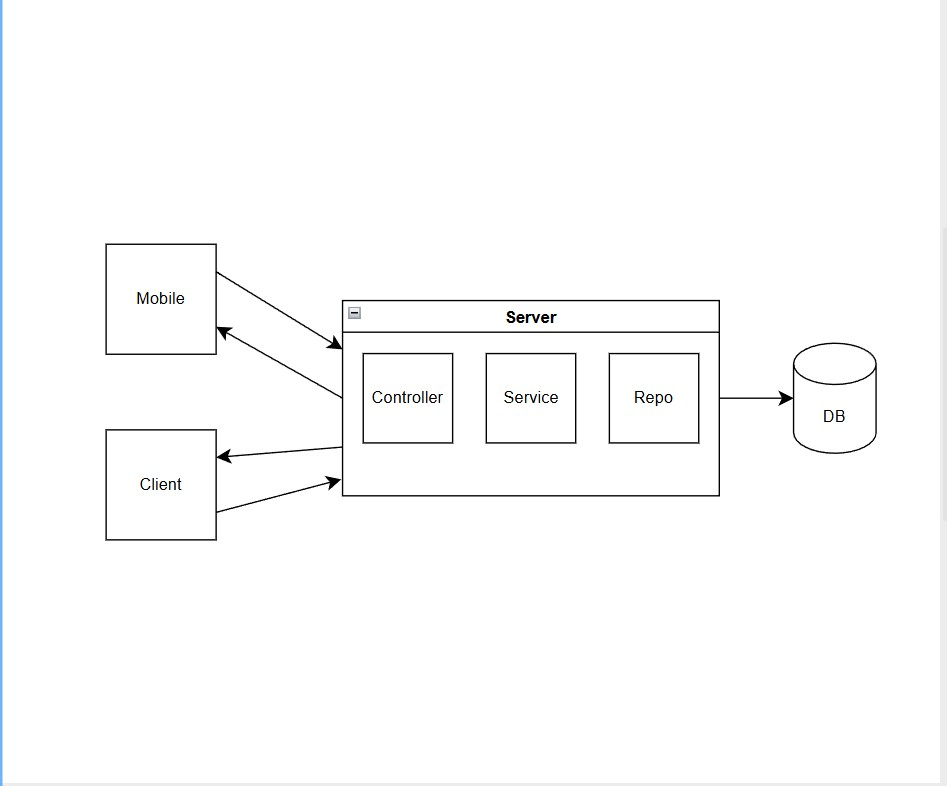

- **_We have multiple layers here:_**
- Controller. (for handling http request/response)
- Service. (Business Logic and application rules)
- Repo. (handling database operations and queries)

- **_How do we create those things?_**
- Hint: For each layer we will create different classes.
- Service class.
- Repo class.
- Controller class.
- Each layer/class will have different annotations.

- Next there is no compulsion that you should put all the requests in one particular Controller.
- You can have multiple Controllers.

- Example: LoginController -> To handle login requests.

```
//LoginController.java
package com.prajwal.SimpleRestApp.Controller;

import org.springframework.web.bind.annotation.RequestMapping;
import org.springframework.web.bind.annotation.RestController;

@RestController
public class LoginController {
    @RequestMapping("/login")
    public String login() {
        return "login page demo.";
    }
}
```

```
//output:
browser -> http://localhost:8080/login
login page demo.
```

- **_What do you think will this work?_**
- **_And Why i think it should not work?_**
- In general, we have multiple Controllers.
- We will have multiple different requests.
- Eg:
- ("/") for Homepage.
- ("/about") for Aboutpage.
- ("/login") for Loginpage.

- **_And how does SpringBoot Know?_**
- For which request, we have to go to which controller? Confusing.
- We can have 10 - 20 - 100 Controllers.
- How does Spring framework knows which one to call?

- First lets try to run the App:
- The app runs. As anticipated.
- **_So how is it working?_**
- So what happens is. **_Spring MVC_**.
- Spring Web -> Basically has something called "Front-Controller".

- So when ever you send a request from the client.

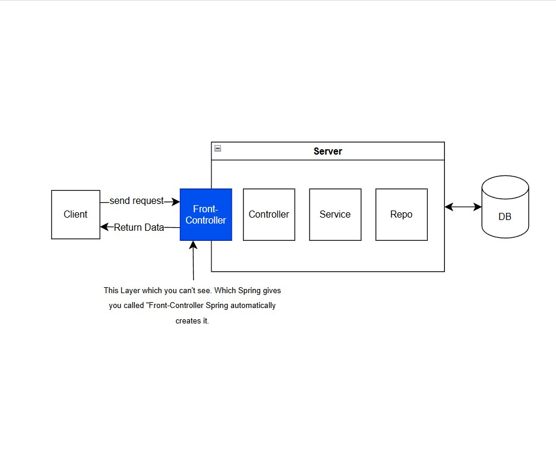

- And the "Front-Controller" sees all the "request mappings" so it creates "RequestMappings" for all Controllers.
- And it knows for which request it has to send it to which controller.
- (Job of Front-Controller). Then the request is forwarded to specified/mapped controller.

- **_What if you want to send data from the Client to Server?_**
- Till now we have send data from the Server to client.
- But what about Client to Server?
- For that, Spring provides method parameters in @RequestMapping annotation to recieve data from the client request.

```
//LoginController.java
package com.prajwal.SimpleRestApp.Controller;

import org.springframework.web.bind.annotation.RequestMapping;
import org.springframework.web.bind.annotation.RestController;

@RestController
public class LoginController {
    @RequestMapping("/login")
    public String login(String pass) { //data from client is accepted in arguments.
        return "login page demo."+"clientData:"+pass;
    }
}
```

```
//login.html
<!doctype html>
<html lang="en">
  <head>
    <meta charset="UTF-8" />
    <meta name="viewport" content="width=device-width, initial-scale=1.0" />
    <title>Login</title>
  </head>
  <body>
    <form action="http://127.0.0.1:8080/login" method="get">
      <pre>
            Password:
            <input type="password" name="pass"/>
            <!--Spring Looks for a parameter named exactly pass in the request.-->
            <!--Form field: name="pass"-->
            <!--Query String: localhost:8080/login?pass=value-->
            <!--If the name differs, Spring cannot bind automatically.-->
            <button type="submit">Submit</button>
        </pre>
    </form>
  </body>
</html>
```

```
//output
browser -> file:///C:/Users/bagew/Desktop/Project_Ideas/spring24jan2026/Learning_Spring_Boot_Attempt2/digit_notes/web_projects/SimpleRestApp/SimpleRestApp/src/main/java/com/prajwal/SimpleRestApp/Html/Login.html
-> Type the password in the password field.
-> 12345
-> click the submit button.
browser -> http://127.0.0.1:8080/login?pass=12345
login page demo.clientData:12345
```

```
//Postman
Get -> http://localhost:8080/login?pass=12345
200 OK
Body -> RAW -> login page demo.clientData:12345
```

- http://localhost:8080/login?pass=12345
- This form of sending data to server is called 'query parameter' (also called URL parameter).
- /login?pass=12345.
- Everything after '?' is the query string.
- format: key=value
- multiple params: ?key1=val1&key2=val2.

- **_Returning Complex data/User defined data(class) instead of normal text:_**
- Returning data for Entity.
- Eg: If you are building a ecommerce webapp. -> You want to return the products.
- Product will have details like:

```
class Product {
    int product_id;
    String product_name;
    double product_price;
    String product_category;
}
```

- Eg: Same goes for flight booking site. If you want to book a flight.
- Flight will have details like:

```
class Flight {
    String airline_name; //Air India Express
    String flight_number; //IX 1463
    String Source; //New Delhi
    String destination; //Navi Mumbai
    DateTime departure; //6.00 am Wed, 4Mar
    String departure_airport; // New Delhi Terminal:1 Gate:D12
    DateTime arrival; // 8:20 am Wed, 4Mar
    String arrival_airport; // Navi Mumbai Terminal: Gate:
}
```

- And if you think of any application you normally work with a entity.
- And in the world of Java we represent that with the help of objects.
- So if i want to return some details it can be one object or multiple objects.

- In terms of a ecommerce app -> If you search for a particular product.
- Eg: If you search for a laptop -> So it will give you a list of laptops and not one.

- Now the Idea is how do you send that data from server to the client.
- In which format.
- We can't send normal text. On the client side if it is a react app.
- They cannot accept normal text.
- It will be difficult to convert to UI. Or read from text.

- **_And thats why we use JSON format_**, we can use XML as well, but Json is the popular choice.
- Returning the object -> The object will contain the data. -> Which will be returned to the client.

## Creating a Controller for Searching Product:

```
//ProductController.java
package com.example.Ecommerce.Controller;

import org.springframework.web.bind.annotation.RequestMapping;
import org.springframework.web.bind.annotation.RestController;

@RestController
public class ProductController {
    @RequestMapping("/getproduct")
    public String getProducts() {
        return "getproduct controller";
    }
}
```

```
//output:
browser -> http://localhost:8080/getproduct
getproduct controller
```

- **_Create Data:_**(Dummy)
- To create Data we need to first create product class.
- create package Model -> Product.java

```
//Product.java
package com.example.Ecommerce.Model;

public class Product {
    private String prodId;
    private String prodName;

    private String category;
    private String prodDescription;

    private double price;
    private double mrp;
    private int discountPercentage;

    private boolean inStock;
    private int stockQuantity;
    private float rating;
    private int totalRating;


}
```

## Model:

- Represents a real object (User,Product,Order,Student,etc.)
- Contains fields (variables) + getters/setters
- is used to transfer data between layers (Controller <-> Service <-> Repository)
- Think of it as a data container.

## Lombok:

- **_What is Lombok?_**
- Lombok is a java library that reduces boilerplate code by automatically generating code at compile time.
- It generates:
- Getters and Setters
- Constructors
- toString()
- equals() & hashCode()
- Builder pattern code.
- Behind the scenes, lombok writes the code during compilation, so you don't see it in your .java file but it exists in the .class file.

- **_Why do we use Lombok?_**
- Without lombok:

```
class User {
    private String name;
    private int age;

    public User(String name,int age) {
        this.name = name;
        this.age = age;
    }

    public void setName(String name) {
        this.name = name;
    }
    public String getName() {
        return this.name;
    }

    public void setAge(int age) {
        this.age = age;
    }
    public String getAge() {
        return this.age;
    }

}
```

- 💡 Too much repetitive code (boilerplate).
- With lombok:

```
import lombok.*;

@Data
@AllArgsConstructor
class User {
    private String name;
    private int age;
}
```

- Clean, readable, less code.
- When we use a private variable, in Java. we usually have to create getter/setter, constructor manually.
- Instead of writing getter/setter, constructors ourselves, we can use Lombok library, which automatically generates getters, setters, constructors, and other methods behind the scenes at compile time.
- Which will help me to create getter/setter, constructor behind the scenes easily.

- **_Where Lombok is mostly used?_**
- Spring Boot / Spring MVC.
- Model / Entity / DTO classes.

- **_Lombok Annotations:_**
- @Getter - Generates getters
- @Setter - Generates setters
- @NoArgsConstructor - Generates no-argument constructor.
- @AllArgsConstructor - Generates all-argument constructor.
- @RequiredArgsConstructor - Constructor for final field.
- @ToString - Generates toString()
- @EqualsAndHashCode - Generates equals() and hashCode()
- @Data - Combines getter, setter, constructor, toString, equals, hashCode
- @Builder - Builder pattern.

- **_equals():_**
- Is used to compare to content (state) of two objects, not their memory location.

```
obj1.equals(obj2);
```

- **_hashCode():_**
- Returns as integer value that represents the object.
- When you store objects in 'HashSet' or use them as keys in 'HashMap'.

- hashCode() is a method in java that representing an objects identity.
- Used by hash-based collections like HashMap and HashSet to store objects efficiently.

- hashCode() is not actual memory addresses. It is an integer value generated by the JVM to represent the object's identity (by default in Object class).

- Memory address was historically used to generate hashCode() because() each object has unique location in memory, making it a simple way to create a unique identity value.

- Generating hashCode():

```
import java.util.*;
import java.lang.Object.*;

class Stud {
  int id;
  String name;

  public Stud(int id, String name) {
    this.id = id;
    this.name = name;
  }
}

public class Main {
    public static void main(String[] args) {
      System.out.println("Hello, World!");

      Stud s1 = new Stud(1,"a");
      Stud s2 = new Stud(1,"a");

      System.out.println("s1 hashCode="+s1.hashCode());
      System.out.println("s2 hashCode="+s2.hashCode());
    }
}

//output:
Hello, World!
s1 hashCode=498931366
s2 hashCode=622488023
```

- Observe that objects having same State/Properties have different properties.
- Note: Object State means the values of an Object's properties(fields/variables)

```
import java.util.*;
import java.lang.Object.*;

class Stud {
  int id;
  String name;

  public Stud(int id, String name) {
    this.id = id;
    this.name = name;
  }
}

public class Main {
    public static void main(String[] args) {
      System.out.println("Hello, World!");

      Stud s1 = new Stud(1,"a");
      Stud s2 = new Stud(1,"a");
      Stud s3 = new Stud(2,"b");

      System.out.println("hashCode for s1: "+s1.hashCode());
      System.out.println("hashCode for s2: "+s2.hashCode());
      System.out.println("hashCode for s3: "+s3.hashCode());
    }
}

//Output:
23 ms | 40.9 MB
Hello, World!
hashCode for s1: 498931366
hashCode for s2: 622488023
hashCode for s3: 1933863327
```

```
import java.util.*;
import java.lang.Object.*;

class Stud {
  int id;
  String name;

  public Stud(int id, String name) {
    this.id = id;
    this.name = name;
  }

}

public class Main {
    public static void main(String[] args) {
      System.out.println("Hello, World!");

      Stud s1 = new Stud(1,"a");
      Stud s2 = new Stud(1,"a");
      Stud s3 = new Stud(2,"b");

      System.out.println("hashCode for s1: "+s1.hashCode());
      System.out.println("hashCode for s2: "+s2.hashCode());
      System.out.println("hashCode for s3: "+s3.hashCode());

      System.out.println("Is s1 equal to s2? "+s1.equals(s2));
      System.out.println("Is s1 equal to s3? "+s1.equals(s3));
    }
}

//Output:
26 ms | 41.2 MB
Hello, World!
hashCode for s1: 498931366
hashCode for s2: 622488023
hashCode for s3: 1933863327
Is s1 equal to s2? false
Is s1 equal to s3? false
```

- Observe how s1 equals to s2 is false, where both Objects have same states/properties
- equals() method checks reference equality (memory address of objects)
- equals() method must be overriden to check state equality.

```
//working on code equals override
import java.util.*;
import java.lang.Object.*;

class Temp {}

class Stud extends Object{
  int id;
  String name;

  public Stud(int id, String name) {
    this.id = id;
    this.name = name;
  }


  @Override
  public boolean equals(Object o) {
    if(this == o) {
      System.out.println("Both objects have same memory location.");
    }
    if(this == null) {
      System.out.println("object passed is null.");
      return true;
    }
    if(this.getClass() != o.getClass()) {
      System.out.println("Both objects do not belong to the same Class");
      return false;
    }
    return false;
  }

}

public class Main {
    public static void main(String[] args) {
      System.out.println("Hello, World!");

      Stud s1 = new Stud(1,"a");
      Stud s2 = new Stud(1,"a");
      Stud s3 = new Stud(2,"b");

      System.out.println("hashCode for s1: "+s1.hashCode());
      System.out.println("hashCode for s2: "+s2.hashCode());
      System.out.println("hashCode for s3: "+s3.hashCode());

      System.out.println("Is s1 equal to null? "+s1.equals(null));
      System.out.println("Is s1 equal to s1? "+s1.equals(s1));
      System.out.println("Is s1 equal to s2? "+s1.equals(s2));
      System.out.println("Is s1 equal to s3? "+s1.equals(s3));
    }
}

```

- Overriding **_equals()_** method.

```
//working on code equals override
import java.util.*;
import java.lang.Object.*;


class Stud extends Object{
  int id;
  String name;

  public Stud(int id, String name) {
    this.id = id;
    this.name = name;
  }


  @Override
  public boolean equals(Object o) {
    boolean result = false;
    //checks refernce (memoery location) of calling Object and o.
    if(this == o) {
      result = true;
    }
    //checks if o is null or calling object has the same class as o.
    if(o == null || this.getClass() != o.getClass()) {
      result = false;
    }
    Stud s = (Stud) o; //type casts from type Object to Stud.
    // checks object states
    if(this.id == s.id && this.name.equals(s.name)){
      result = true;
      /*
        optimial code:
        Student s = (Student) o;
        return id == s.id; //returns boolean value if calling object id matches s (id).
      */
    }
    return result;
  }

}

public class Main {
    public static void main(String[] args) {
      System.out.println("Hello, World!");

      Stud s1 = new Stud(1,"a");
      Stud s2 = new Stud(1,"a");
      Stud s3 = new Stud(2,"b");

      System.out.println("s1 equals s2: "+s1.equals(s2));
      System.out.println("s1 equals s3: "+s1.equals(s3));
      System.out.println("s2 equals s3: "+s2.equals(s3));
    }
}

//Output:
24 ms | 41.3 MB
Hello, World!
s1 equals s2: true
s1 equals s3: false
s2 equals s3: false
```

- Overriding **_hashCode()_** method:
- hashCode() method by default generates a hash value based on objects memory location
- When we override hashCode() method, it generates hash value based on the objects states/properties, which help decide the bucket where the objects goes to in HashMap, HashSet and HashTable in java.

- hashCode() cannot directly return multiple properties like id and name. It must return a single int hash value.
- It can generate a hash using a single property.
- If 'equals()' uses multiple properties like id and name.
- hashCode() should also include those properties.
- Which can be achived using the 'Objects.hash(p1,p2)' method in java.

```
import java.util.*;
import java.lang.Object.*;


class Stud extends Object{
  int id;
  String name;

  public Stud(int id, String name) {
    this.id = id;
    this.name = name;
  }


  @Override
  public boolean equals(Object o) {
    boolean result = false;
    //checks refernce (memoery location) of calling Object and o.
    if(this == o) {
      result = true;
    }
    //checks if o is null or calling object has the same class as o.
    if(o == null || this.getClass() != o.getClass()) {
      result = false;
    }
    Stud s = (Stud) o; //type casts from type Object to Stud.
    // checks object states
    if(this.id == s.id && this.name.equals(s.name)){
      result = true;
      /*
        optimial code:
        Student s = (Student) o;
        return id == s.id; //returns boolean value if calling object id matches s (id).
      */
    }
    return result;
  }

  @Override
  public int hashCode() {
     return Objects.hash(this.id,this.name);
  }
}

public class Main {
    public static void main(String[] args) {
      System.out.println("Hello, World!");

      Stud s1 = new Stud(1,"a");
      Stud s2 = new Stud(1,"a");
      Stud s3 = new Stud(2,"b");

      System.out.println("s1 equals s2: "+s1.equals(s2));
      System.out.println("s1 equals s3: "+s1.equals(s3));
      System.out.println("s2 equals s3: "+s2.equals(s3));

      System.out.println("hashCode for s1: "+s1.hashCode());
      System.out.println("hashCode for s2: "+s2.hashCode());
      System.out.println("hashCode for s3: "+s3.hashCode());
    }
}

//Output:
25 ms | 41.3 MB
Hello, World!
s1 equals s2: true
s1 equals s3: false
s2 equals s3: false
hashCode for s1: 1089
hashCode for s2: 1089
hashCode for s3: 1121
```

- **_Bucket:_**
- Bucket = index in the internal array (sort of index). Where an object is stored based on its hashCode().
- How it is calculated: bucket = hashCode % arraySize;
- eg: 25 % 16 = 9 -> object goes to bucket 9.
- In java, hashCode() decides the bucket and equals() checks the object inside that bucket.
- HashMap, HashSet and HashTable are = array of buckets where each bucket can hold multiple entries.
- Bucket makes the **_searching very fast_** almost O(1), because java directly jumps to the bucket instead of checking every object.
- Buckets for HashmMap, HashSet and HashTable cannot be seen directly as. Buckets are internal implementation details.
- Java only lets you interact with the Keys and values, not the internal array structure.

```
import java.util.Objects;
import java.lang.Object;

class Stud {
  int id;
  String name;

  public Stud(int id,String name) {
    this.id = id;
    this.name = name;
  }

  @Override
  public int hashCode() {
    return Objects.hash(this.id,this.name);
  }

  public int getBucket(int hashCode, int arrSize) {
    //Bucket = hashCode % arrSize
    return hashCode % arrSize;
  }
}

public class Main {
  public static void main(String[] args) {
    System.out.println("hello world.");

    //array size 3.
    int size=3;

    Stud s1 = new Stud(1,"a");
    Stud s2 = new Stud(1,"a");
    Stud s3 = new Stud(2,"b");

    System.out.println("hashCode for s1: "+s1.hashCode());
    System.out.println("hashCode for s2: "+s2.hashCode());
    System.out.println("hashCode for s3: "+s3.hashCode());

    //buckets
    System.out.println("bucket for s1: "+s1.getBucket(s1.hashCode(),size));
    System.out.println("bucket for s2: "+s2.getBucket(s2.hashCode(),size));
    System.out.println("bucket for s3: "+s3.getBucket(s3.hashCode(),size));
  }
}

//Output:
26 ms | 41.3 MB
hello world.
hashCode for s1: 1089
hashCode for s2: 1089
hashCode for s3: 1121
bucket for s1: 0
bucket for s2: 0
bucket for s3: 2
```

```
//To be worked on
class Student {
    int id;

    Student(int id) {
        this.id = id;
    }

    @Override
    public boolean equals(Object o) {
        if (this == o) return true;
        if (o == null || getClass() != o.getClass()) return false;
        Student s = (Student) o;
        return id == s.id;
    }

    @Override
    public int hashCode() {
        return id;
    }
}
```

- Continuation from Line: 6510.

## Add Depenendency pom.xml:

- Google Search > Mvnrepo > Project Lombok.
- Add the dependency in <dependencies>
- Save and reload pom.xml

- '@Data' annotation will give you lombok functionality.

```
//Product.java
@Data //will give lombok functionality
public class Product {
  private int product_id;
  private String product_name;
  private double product_price;
}
```

```
//Product.java
package com.example.Ecommerce.Model;

import lombok.Data;

@Data //Will provide Lombok functionality
public class Product {
    private String prodId;
    private String prodName;

    private String category;
    private String prodDescription;

    private double price;
    private double mrp;
    private int discountPercentage;

    private boolean inStock;
    private int stockQuantity;
    private float rating;
    private int totalRating;

}

```

- Back to the Product Controller -> This is where you can return Data (product data).
- We have talked about the 3 layers.
- Controller.
- Service.
- Repository.
- If a Controller wants the data. -> It will not ask the data from the database directly.
- It will ask the data from the 'Service layer'.
- This is where we introduce new layers.
- Because you should not be writing any business logic inside the Controller.
- Controller is just for accepting the client request and responding to the client. -> And not to do any 'Business logic'.

- This is where we introduce 'ProductService' class.
- Which will have the logic for returning the data to the Product Controller class.

```
//ProductService.java
public class ProductService {
  // will contain the logic for returning data to ProductController.

}
```

- We will create different packages 📦. To group all Controller, Services and Models.

## Concept of MVC:

- Model, View, Controller.
- Is a software design pattern used in organize code in apps (especially web apps).
- So that each part has clear responsibilities.
- This makes programs easier to maintain and scale.
- This design pattern seperates the application into three parts:
- Model (data).
- View (UI).
- Controller (handles user requests).

- Controller accepts the requests from the client and responds to it (Product Controller)
- View is basically responsible for returning UI pages. But in our case we are not returning pages, we are returning data. But is still considered as a part of MVC.
- Model represents data. class Product representing the data.

## Creating New Packages:

- Controller: HomeController, ProductController, LoginController.
- Service: ProductService.
- Model: Product.
- refactor appropriately.

## Service class (ProductService):

```
//ProductService.java
public class ProductService {
  public List<Product> getProducts() {
    return null;
  }
}
```

```
//ProductService.java
package com.example.Ecommerce.Service;

import java.util.List;

public class ProductService {
    //Contains the logic for returning Data to ProductController.

   }

```

- We will use collection interface to temporarily store Products (data).
- Collection List (Interface) is used to store products temporarily.
- List is an (Interface) in java from java.util.List; While ArrayList is a class that implements it.
- Using List gives you flexibility. So later if you want to change the implementation, you can do it easily.

```
//ProductService.java
package com.example.Ecommerce.Service;

import com.example.Ecommerce.Model.Product;

import java.util.List;

public class ProductService {
    //Contains the logic for returning Data to ProductController.

    public List<Product> getProducts() {
        return null;
    }
}
```

## Dummy data (Adding dummy to Service):

- We are adding dummy data using Arrays.asList() ProductService to use in the application.

```
//ProductService.java
package com.example.Ecommerce.Service;

import com.example.Ecommerce.Model.Product;

import java.util.Arrays;
import java.util.List;

public class ProductService {
    //Contains the logic for returning Data to ProductController.

    public List<Product> getProducts() {
        List<Product> products =  Arrays.asList(
                new Product("G006","Kissan Mixed Fruit Jam","groceries","Kissan Mixed Fruit Jam , With Real Fruit Ingredients, 200 g",67.00,80.00,16,true,1500,4.4f,4193),
                new Product("G001","Daawat Biryani Basmati Rice","groceries","Daawat Biryani Basmati Rice, 5 Kg| World s Longest Rice Grain expands 24mm* | Tasty, Non-sticky & Rich Aroma |Naturally Aged",989.00,1245.00,21,true,800,4.0f,2452),
                new Product("G003","ABHI EGGS","groceries","ABHI EGGS Gold+ Brown Eggs Box (Pack of 6)",105.00,115.00,9,true,200,4.1f,586),
                new Product("G004","Fortune Sugar","groceries","Fortune Sugar, 1 kg",58.00,75.00,23,true,3000,4.5f,6005),
                new Product("G005","GEMINI REF SUNFLOWER OIL","groceries","GEMINI REF SUNFLOWER OIL 840g-840ML Pouch",159.00,192.00,17,true,2500,4.4f,2554)
        );
        return products;
    }
}
```

## Model (Product):

```
//Product.java
package com.example.Ecommerce.Model;

import lombok.AllArgsConstructor;
import lombok.Data;

@Data //Will provide Lombok functionality
@AllArgsConstructor //Creates a Lombok Constructor with all args for me.
public class Product {
    private String prodId;
    private String prodName;

    private String category;
    private String prodDescription;

    private double price;
    private double mrp;
    private int discountPercentage;

    private boolean inStock;
    private int stockQuantity;
    private float rating;
    private int totalRating;

}

```

```
//ProductService.java
package com.example.Ecommerce.Service;

import com.example.Ecommerce.Model.Product;

import java.util.Arrays;
import java.util.List;

public class ProductService {
    //Contains the logic for returning Data to ProductController.

    public List<Product> getProducts() {
        //List of Products
        List<Product> products =  Arrays.asList(
                new Product("G006","Kissan Mixed Fruit Jam","groceries","Kissan Mixed Fruit Jam , With Real Fruit Ingredients, 200 g",67.00,80.00,16,true,1500,4.4f,4193),
                new Product("G001","Daawat Biryani Basmati Rice","groceries","Daawat Biryani Basmati Rice, 5 Kg| World s Longest Rice Grain expands 24mm* | Tasty, Non-sticky & Rich Aroma |Naturally Aged",989.00,1245.00,21,true,800,4.0f,2452),
                new Product("G003","ABHI EGGS","groceries","ABHI EGGS Gold+ Brown Eggs Box (Pack of 6)",105.00,115.00,9,true,200,4.1f,586),
                new Product("G004","Fortune Sugar","groceries","Fortune Sugar, 1 kg",58.00,75.00,23,true,3000,4.5f,6005),
                new Product("G005","GEMINI REF SUNFLOWER OIL","groceries","GEMINI REF SUNFLOWER OIL 840g-840ML Pouch",159.00,192.00,17,true,2500,4.4f,2554)
        );
        return products;
    }
}
```

- Running the app -> With a new port/Changing port.
- **_application.properties:(file)_**

```
//application.properties
spring.application.name=Ecommerce
server.port=8086 //add codeline to change port.

//CopyPaste:
spring.application.name=Ecommerce
server.port=8086
```

## Converting Product.java to a Bean Class:

```
//Product.java
package com.example.Ecommerce.Model;

import lombok.AllArgsConstructor;
import lombok.Data;
import org.springframework.stereotype.Component;

@Data //Will provide Lombok functionality
@AllArgsConstructor //Creates a Lombok Constructor with all args for me.
@Component //Converts Simple class to a Bean class
public class Product {
    private String prodId;
    private String prodName;

    private String category;
    private String prodDescription;

    private double price;
    private double mrp;
    private int discountPercentage;

    private boolean inStock;
    private int stockQuantity;
    private float rating;
    private int totalRating;

}

```

## Marking ProductService.java as Service Layer:

```
//ProductService.java
package com.example.Ecommerce.Service;

import com.example.Ecommerce.Model.Product;
import org.springframework.stereotype.Service;

import java.util.Arrays;
import java.util.List;

@Service //Converts simple java class to a Service layer class
public class ProductService {
    //Contains the logic for returning Data to ProductController.

    public List<Product> getProducts() {
        //List of Products
        List<Product> products =  Arrays.asList(
                new Product("G006","Kissan Mixed Fruit Jam","groceries","Kissan Mixed Fruit Jam , With Real Fruit Ingredients, 200 g",67.00,80.00,16,true,1500,4.4f,4193),
                new Product("G001","Daawat Biryani Basmati Rice","groceries","Daawat Biryani Basmati Rice, 5 Kg| World s Longest Rice Grain expands 24mm* | Tasty, Non-sticky & Rich Aroma |Naturally Aged",989.00,1245.00,21,true,800,4.0f,2452),
                new Product("G003","ABHI EGGS","groceries","ABHI EGGS Gold+ Brown Eggs Box (Pack of 6)",105.00,115.00,9,true,200,4.1f,586),
                new Product("G004","Fortune Sugar","groceries","Fortune Sugar, 1 kg",58.00,75.00,23,true,3000,4.5f,6005),
                new Product("G005","GEMINI REF SUNFLOWER OIL","groceries","GEMINI REF SUNFLOWER OIL 840g-840ML Pouch",159.00,192.00,17,true,2500,4.4f,2554)
        );
        return products;
    }
}
```

- Basically for different layers we can use different annotations.

## Spring Boot MVC app annotations:

- A typically Spring Boot MVC application, each layer has its own annotations.
- These annotations tell Spring what role the class plays in the application.
- As we are building Backend concepts(Controller -> Service -> Repository -> Model), here are the main annotations.
- **_1. Controller Layer_**
- Handles HTTP requests from the client.
- Annotations:
- @RestController -> for REST APIs.
- @Controller -> for MVC views (HTML pages)
- Eg:

```
//To be worked.
import org.springframework.web.bind.annotations.RestController;

@RestController
public class ProductController {

}
```

- Common request mapping annotations:
- @GetMapping
- @PostMapping
- @PutMapping
- @DeleteMapping
- @RequestMapping
- Eg:

```
//To be worked.
@GetMapping("/products")
public List<Product> getProducts() {
    return productService.getProducts();
}
```

- **_2. Service Layer_**
- Contains business logic.
- Annotation:
- @Service

```
//To be worked.
import org.springframework.stereotype.Service;

@Service
public class ProductService {

}
```

- This layer usually calls the repository.
- **_3. Repository Layer_**
- Handles database operations.
- Annotation:
- @Repository
- Eg:

```
//To be worked.
//ProductRepo.java
package com.example.Ecommerce.Repository;

import org.springframework.stereotype.Repository;

@Repository
public interface ProductRepo {
}
```

- usually it extends.

```
//To be worked.
//ProductRepo.java
package com.example.Ecommerce.Repository;

import com.example.Ecommerce.Model.Product;
import org.springframework.data.jpa.repository.JpaRepository;
import org.springframework.stereotype.Repository;

@Repository
public interface ProductRepo extends JpaRepository<Product, Integer>{
}
```

- JpaRepository<Product, Integer> is an Interface in Spring Data JPA that helps you perform database operations automatically without writing SQL.
- It belongs to Spring Data JPA used in Spring Boot.
- JpaRepository interface already contains built-in database methods like:
- save()
- findAll()
- findById()
- deleteById()
- So you don't need to write SQL queries.
- Product -> Is the Entity (Model class).
- Integer -> Is the data type of the primary key (@Id).
- **_4. Model Layer_**
- Represents database entities or data objects.
- Annotation:
- @Entity
- Eg:

```
//To be worked.
import jakarta.persistence.Entity;
import jakarta.persistence.Id;

@Entity
public class Product {
    @Id
    private int id;
    private String name;
    private double price;
}
```

- Other useful annotations:
- @Table
- @Column
- @Id
- @GeneratedValue

- Ultimately they are the same because @Service is a specialization of @Component behind the scenes.

## Removing @Data and @AllArgsConstructor:

```
//Product2.java
package com.example.Ecommerce.Model;

import lombok.AllArgsConstructor;
import lombok.Data;
import org.springframework.stereotype.Component;

@Data //Will provide Lombok functionality
@AllArgsConstructor //Creates a Lombok Constructor with all args for me.
//@Component //Converts Simple class to a Bean class
public class Product2 {
    private String prodId;
    private String prodName;

    private String category;
    private String prodDescription;

    private double price;
    private double mrp;
    private int discountPercentage;

    private boolean inStock;
    private int stockQuantity;
    private float rating;
    private int totalRating;

}
```

```
//Product.java
package com.example.Ecommerce.Model;

import lombok.AllArgsConstructor;
import lombok.Data;
import org.springframework.stereotype.Component;

@Data //Will provide Lombok functionality
@AllArgsConstructor //Creates a Lombok Constructor with all args for me.
//@Component //Converts the Simple class to Bean class.
public class Product {
    private int prod_id;
    private String prod_name;
    private double prod_price;

//    public Product(int prod_id, String prod_name, double prod_price) {
//        this.prod_id = prod_id;
//        this.prod_name = prod_name;
//        this.prod_price = prod_price;
//    }
//
//
//    public int getProd_id() {
//        return prod_id;
//    }
//
//    public void setProd_id(int prod_id) {
//        this.prod_id = prod_id;
//    }
//
//    public String getProd_name() {
//        return prod_name;
//    }
//
//    public void setProd_name(String prod_name) {
//        this.prod_name = prod_name;
//    }
//
//    public double getProd_price() {
//        return prod_price;
//    }
//
//    public void setProd_price(double prod_price) {
//        this.prod_price = prod_price;
//    }
}
```

```
//ProductService.java
package com.example.Ecommerce.Service;

import com.example.Ecommerce.Model.Product2;
import com.example.Ecommerce.Model.Product;
import org.springframework.stereotype.Service;

import java.util.Arrays;
import java.util.List;

@Service //Converts simple java class to a Service layer class
public class ProductService {
    //Contains the logic for returning Data to ProductController.

    public List<Product> getProducts() {
        //List of Products
        List<Product2> products2 =  Arrays.asList(
                new Product2("G006","Kissan Mixed Fruit Jam","groceries","Kissan Mixed Fruit Jam , With Real Fruit Ingredients, 200 g",67.00,80.00,16,true,1500,4.4f,4193),
                new Product2("G001","Daawat Biryani Basmati Rice","groceries","Daawat Biryani Basmati Rice, 5 Kg| World s Longest Rice Grain expands 24mm* | Tasty, Non-sticky & Rich Aroma |Naturally Aged",989.00,1245.00,21,true,800,4.0f,2452),
                new Product2("G003","ABHI EGGS","groceries","ABHI EGGS Gold+ Brown Eggs Box (Pack of 6)",105.00,115.00,9,true,200,4.1f,586),
                new Product2("G004","Fortune Sugar","groceries","Fortune Sugar, 1 kg",58.00,75.00,23,true,3000,4.5f,6005),
                new Product2("G005","GEMINI REF SUNFLOWER OIL","groceries","GEMINI REF SUNFLOWER OIL 840g-840ML Pouch",159.00,192.00,17,true,2500,4.4f,2554)
        );
        List<Product> products = Arrays.asList(
          new Product(1,"Kitkat",10.00d),
          new Product(2,"Lays",20.00d)
        );
        return products;
    }
}
```

```
//ProductController.java
package com.example.Ecommerce.Controller;

import java.util.List;
import com.example.Ecommerce.Model.Product;
import com.example.Ecommerce.Service.ProductService;
import org.springframework.beans.factory.annotation.Autowired;
import org.springframework.web.bind.annotation.RequestMapping;
import org.springframework.web.bind.annotation.RestController;

@RestController
public class ProductController {
    @Autowired
    private ProductService productService;
//    @RequestMapping("/getproduct")
//    public String getProducts() {
//        return "getproduct controller";
//    }

    @RequestMapping("/getproduct")
    public List<Product> getProducts() {
        return productService.getProducts();
    }
}
```

```
//output:
browser -> http://localhost:8086/getproduct
[
  {
    "prod_id": 1,
    "prod_name": "Kitkat",
    "prod_price": 10
  },
  {
    "prod_id": 2,
    "prod_name": "Lays",
    "prod_price": 20
  }
]
```

- No Lombok error encountered yet.

- Adding Getters and Setters.
- Product.java -> RightClick -> generate Getter Setter.
- Adding Constructor.
- Product.java -> RightClick -> generate Constructor.

```
//Product.java
package com.example.Ecommerce.Model;

import lombok.AllArgsConstructor;
import lombok.Data;
import org.springframework.stereotype.Component;

//@Data //Will provide Lombok functionality
//@AllArgsConstructor //Creates a Lombok Constructor with all args for me.
@Component //Converts the Simple class to Bean class.
public class Product {
    private int prod_id;
    private String prod_name;
    private double prod_price;

    public Product(int prod_id, String prod_name, double prod_price) {
        this.prod_id = prod_id;
        this.prod_name = prod_name;
        this.prod_price = prod_price;
    }


    public int getProd_id() {
        return prod_id;
    }

    public void setProd_id(int prod_id) {
        this.prod_id = prod_id;
    }

    public String getProd_name() {
        return prod_name;
    }

    public void setProd_name(String prod_name) {
        this.prod_name = prod_name;
    }

    public double getProd_price() {
        return prod_price;
    }

    public void setProd_price(double prod_price) {
        this.prod_price = prod_price;
    }
}
```

- Error

```
Error starting ApplicationContext. To display the condition evaluation report re-run your application with 'debug' enabled.
2026-03-16T13:17:01.254+05:30 ERROR 20664 --- [Ecommerce] [  restartedMain] o.s.b.d.LoggingFailureAnalysisReporter   :

***************************
APPLICATION FAILED TO START
***************************

Description:

Parameter 0 of constructor in com.example.Ecommerce.Model.Product required a bean of type 'int' that could not be found.

Action:

Consider defining a bean of type 'int' in your configuration.

Process finished with exit code 0
```

- **_Error:_** Spring is trying to create a Product bean but cannot supply constructor values (int, String, double) because of @Component on the Product class.
- **_Model_** classes are Plain Old Java Objects **_(POJOs)_** used to hold data, so they are not managed by the Spring Container.
- We don't create beans of Model classes because models represent data objects that are created many times with different values, while Spring beans are single managed instances meant for application logic.
- **_POJO_** is a simple Java class used to hold data without depending on any framework.
- Now the Lombok error solves.

## @Service Annotation for Service classes:

```
import com.example.Ecommerce.Model.Product;
import org.springframework.stereotype.Service;
import java.util.Arrays;
import java.util.List;
@Service
public class ProductService {
    public List<Product> getProducts() {
        List<Product> products = Arrays.asList(
            //Adding Product
            new Product(1,"Kitkat",10.00),
            new Product(2,"Lays",20.00),
            new Product(3,"Cornato",40.00)
        );
        return products;
    }
}
```

- Adding Product - new Product(1,"Kitkat",10.00),
- All logic is contained in the service class. And nothing is in the Controller.

- Now what Controller will do to get the data from the Service?
- Adding @RestController annotation : is used to create REST APIs in Spring Boot that return data (JSON) instead of views.

```
@RestController
public class ProductController {
    @Autowired //works bytype
    ProductService productService //obj will be created by Spring
    public List<Product> showProducts() {
        return productService.getProducts();
    }
}
```

- @Autowired annotation: is used to automatically inject dependencies (objects) managed by Spring into a class.
- The ProductService object will be created in Spring container.
- Because of the "@Service" -> Which works behind the scenes as "@Component".
- And adding HTTP requests (URLs).
- @RequestMapping is used to map HTTP requests (URLs) to specific controller methods in Spring Boot.

```
@RestController
public class ProductController {
    @Autowired //works bytype
    ProductService productService //obj will be created by Spring
    @RequestMapping("/products")
    public List<Product> showProducts() {
        return productService.getProducts();
    }
}
```

- Running app: Browser and Postman.

```
//ProductController.java
package com.example.Ecommerce.Controller;

import java.util.List;
import com.example.Ecommerce.Model.Product;
import com.example.Ecommerce.Service.ProductService;
import org.springframework.beans.factory.annotation.Autowired;
import org.springframework.web.bind.annotation.RequestMapping;
import org.springframework.web.bind.annotation.RestController;

@RestController
public class ProductController {
    @Autowired
    private ProductService productService;
//    @RequestMapping("/getproduct")
//    public String getProducts() {
//        return "getproduct controller";
//    }

    @RequestMapping("/products")
    public List<Product> showProducts() {
        return productService.getProducts();
    }
}
```

```
//output:
browser -> http://localhost:8086/products
[
  {
    "prod_id": 1,
    "prod_name": "Kitkat",
    "prod_price": 10
  },
  {
    "prod_id": 2,
    "prod_name": "Lays",
    "prod_price": 20
  }
]
```

```
//output:
postman -> Get -> http://localhost:8086/products -> send
[
    {
        "prod_id": 1,
        "prod_name": "Kitkat",
        "prod_price": 10.0
    },
    {
        "prod_id": 2,
        "prod_name": "Lays",
        "prod_price": 20.0
    }
]
```

## Adding default Constructor:

- Adding a default constructor to Model Product.java

```
public class Product {
    private int prod_id; //prodId
    private String prod_name; //prodName
    private double prod_price; //prodPrice

    public Product() {} //Default constructor

    public Product(int pid, String pname, double pprice) {
        //parameterized constructor
        this.prod_id = pid;
        this.prod_name = pname;
        this.prod_price = pprice;
    }
}
```

```
//Product.java
package com.example.Ecommerce.Model;

import lombok.AllArgsConstructor;
import lombok.Data;
import org.springframework.stereotype.Component;

//@Data //Will provide Lombok functionality
//@AllArgsConstructor //Creates a Lombok Constructor with all args for me.
//@Component //Converts the Simple class to Bean class.
public class Product {
    private int prod_id;
    private String prod_name;
    private double prod_price;

    public Product(int prod_id, String prod_name, double prod_price) {
        this.prod_id = prod_id;
        this.prod_name = prod_name;
        this.prod_price = prod_price;
    }


    public int getProd_id() {
        return prod_id;
    }

    public void setProd_id(int prod_id) {
        this.prod_id = prod_id;
    }

    public String getProd_name() {
        return prod_name;
    }

    public void setProd_name(String prod_name) {
        this.prod_name = prod_name;
    }

    public double getProd_price() {
        return prod_price;
    }

    public void setProd_price(double prod_price) {
        this.prod_price = prod_price;
    }
}
```

## Fetching Single Product:

- Basically now we are fetching (all) from server.
- But what if you want to fetch one particular product.
- Or what if you want to add new product in the list.

## Postman testing:

- Rest API -> And work with data.

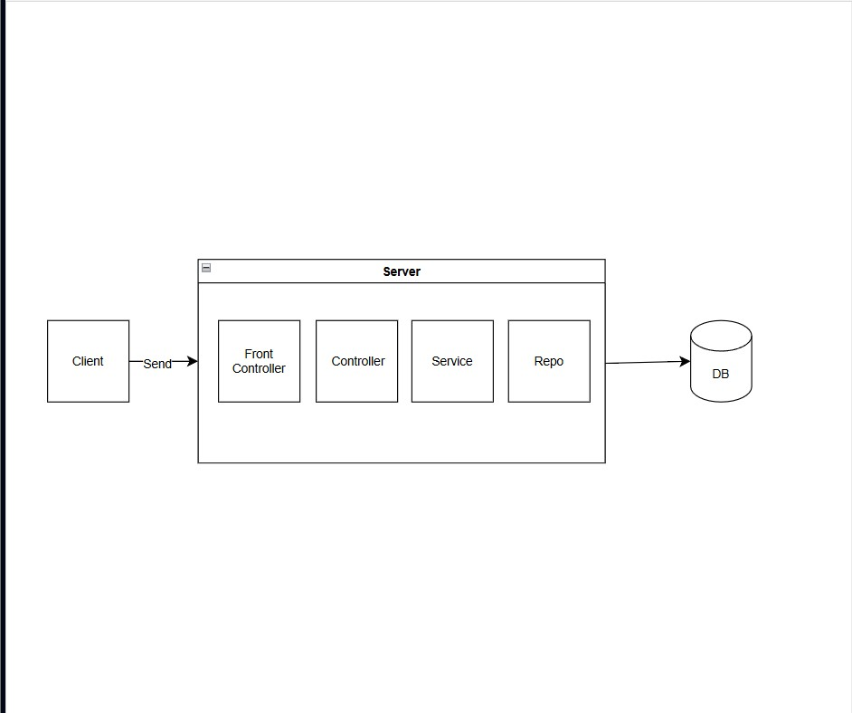

- Sending data from client to the server and receiving data from the server to the client.
- What we are doing here is we are sending data from server to client.
- But we do certian other things as well.
- We send data from client to server -> To store something in DB.
- Basically we are fetching data from the server or Storing it on the server. (send or store)
- Next what if you want to update or delete certian things.
- Eg: If i want to delete prod 103. -> Or may be i want update the price of prod 103.
- These things you can do with Sometype of Request (special request).
- Now RestApi uses a protocol called 'HTTP'.
- And it has certian methods to work with.
- So basically your 'RESTAPI' -> 'HTTP' -> Uses http protocol -> Which has certian methods to work with.

## CRUD Operations using HTTP Methods.

- 'Get' - Method to fetch something.
- 'Post' - Method to store something on the server.
- 'Put' - Method to update something on the server.
- 'Delete' - Method to remove something from the server.
- We have other methods as well but these are most normally used methods.

- We use 'CRUD' short for Create Read Update Delete.
- Create -> with 'POST'.
- Read -> with 'GET'.
- Update -> with 'PUT'.
- Delete -> with 'DELETE'.
- Methods.

- Rest uses HTTP and we are going to use this by default when you pass the 'URL' in the browser.
- It sends the 'GET' request. (we have done)
- By default, @RequestMapping("/") can handle GET requests.

- But what about -> 'POST', 'PUT', 'Delete'.
- Now this is not something you can do in your browser.
- You cannot simply use the browser address bar to change the methods.

- Now this is where we have to use certian 'API Tools' to do that ->
- Not one tool -> we have multiple tools.

- One of the tools is 'Postman'. If you know one tool it is easy to explore others as well.

- How exactly we are going to hit the 'URL'(In Postman).
- In address bar.
- GET -> http://localhost:8086/products
- Click on -> Send.
- You can see other methods apart from 'GET' method. If you expand the options by clicking on 'GET'.
- When you click on send.
- It will send the request and you will get the response.

- Eg: GET -> http://localhost:8086/products -> send.
- It will send the request and you will get the response back.

- Apart from response you also will get a status code "200 OK".
- There are different status codes.
- HTTP Status code series:
- 100 - Informational:
- Request recieved, continuing process.
- Eg: 100 Continue
- 200 - Success:
- Request successfully processed.
- Eg: 200 OK, 201 Created
- 300 - Redirection:
- Further action needed, redirected.
- Eg: 301 Moved Permanently, 302 Found
- 400 - Client Error:
- Error from client side.
- Eg: 400 Bad Request, 404 Not Found
- 500 - Server Error:
- Error from server side.
- Eg: 500 Internal Server Error, 503 Service Unavailable
- There are different status code options available in the service of 100, 200, 300, 400, 500.
- If you have seen one of the most famous code. Which you will get is "404" -> For resource not found.
- So that is a part of -> This status code it comes under 400 series. (This status code belongs to the 400 (client error) series).

- If something is wrong with the web resources -> It will send you status code of 400 series.
- If something is wrong with the server -> It will go for 500 series.
- If everything is going well it will go into 200 series.

- And we have a response time. Which is 20 milliseconds.
- And we have the size of data. Which we are getting back '321 B' -Bytes.
- And this is your data:

```
//data
[
    {
        "prod_id": 1,
        "prod_name": "Kitkat",
        "prod_price": 10.0
    },
    {
        "prod_id": 2,
        "prod_name": "Lays",
        "prod_price": 20.0
    }
]
```

- Apart from body.
- You will also recieve Headers from the server.
- This is the header:

```
Key                 |   Value
---------------------------------------------------------
Content-Type        |    application/json
Transfer-Encoding   |    chunked
Date                |    Sun, 22 Mar 2026 08:30:29 GMT
Keep-Alive          |    timeout=60
Connection          |    keep-alive
```

- Content-Type (type of data) -> JSON -> You are getting.
- That means you can also ask for 'XML' data if you want.
- But by default it is JSON (Data format).
- You can the Body data format by clicking on. JSON -> Dropdown -> textformat or other formats.

- This is what we have done to get the data.
- But what about. If you want to lets say -> Get one product, and not all. -> One.
- Some thing like this ->

```
//Eg:
http://localhost:8086/products/prod_id
http://localhost:8086/products/102
```

- Say you want the product with the Id 102.
- Can we do that -> We simply say /102.
- This is simply how you also build your RESTAPIs.
- /products -> URL for all products.
- /prod_id -> The id of the product which you want to fetch '102'.
- And when you say send -> It should only fetch one record.

- GET - http://localhost:8086/products/102 -> Send
- Error:

```
 "timestamp": "2026-03-22T10:55:48.958Z",
    "status": 404,
    "error": "Not Found",
    "trace": "org.springframework.web.servlet.resource.NoResourceFoundException: No static resource products/102 for request '/products/102'.
```

- How do we solve this -> I want to return one product (data).
- I want to hit this url '/products/102'

- Now to achive that we have to create one more method.

```
public class ProductController {

}
```

- To accept this '/products/id' URL.
- RequestMapping("/products") -> Will accept and respond only to '/products' and not the '/products/102'

- This time we are not going to return the list of products.
- We are going to return only one product.
- Because we are accessing the unique field -> Which is product_id.

- Code:

```
public Product getProductById(int prodId) {

}
```

- We are going to accept the id (prodId) sent by the client.
- And based on that (prodId) we are going to fetch the product.

```
public Product getProductById(int prodId) {
    return service.getProductById(prodId);
    //return service.getProductById() is responsible to give me the product
}
```

- Unforunately we dont have this method (getProductById()) in the service layer.
- We need to click on the error code line and create the method.

```
//ProductController.java
package com.example.Ecommerce.Controller;

import java.util.List;
import com.example.Ecommerce.Model.Product;
import com.example.Ecommerce.Service.ProductService;
import org.springframework.beans.factory.annotation.Autowired;
import org.springframework.web.bind.annotation.RequestMapping;
import org.springframework.web.bind.annotation.RestController;

@RestController
public class ProductController {
    @Autowired
    private ProductService productService;
//    @RequestMapping("/getproduct")
//    public String getProducts() {
//        return "getproduct controller";
//    }

    @RequestMapping("/products")
    public List<Product> showProducts() {
        return productService.getProducts();
    }

    public Product getProductById(int prodId) {
        return productService.getProductById(prodId); //Click to create method.
    }
}
```

- If you go to ProductService.java class

```
//ProductService.java
package com.example.Ecommerce.Service;

import com.example.Ecommerce.Model.Product2;
import com.example.Ecommerce.Model.Product;
import org.springframework.stereotype.Service;

import java.util.Arrays;
import java.util.List;

@Service //Converts simple java class to a Service layer class
public class ProductService {
    //Contains the logic for returning Data to ProductController.

    public List<Product> getProducts() {
        //List of Products
        List<Product2> products2 =  Arrays.asList(
                new Product2("G006","Kissan Mixed Fruit Jam","groceries","Kissan Mixed Fruit Jam , With Real Fruit Ingredients, 200 g",67.00,80.00,16,true,1500,4.4f,4193),
                new Product2("G001","Daawat Biryani Basmati Rice","groceries","Daawat Biryani Basmati Rice, 5 Kg| World s Longest Rice Grain expands 24mm* | Tasty, Non-sticky & Rich Aroma |Naturally Aged",989.00,1245.00,21,true,800,4.0f,2452),
                new Product2("G003","ABHI EGGS","groceries","ABHI EGGS Gold+ Brown Eggs Box (Pack of 6)",105.00,115.00,9,true,200,4.1f,586),
                new Product2("G004","Fortune Sugar","groceries","Fortune Sugar, 1 kg",58.00,75.00,23,true,3000,4.5f,6005),
                new Product2("G005","GEMINI REF SUNFLOWER OIL","groceries","GEMINI REF SUNFLOWER OIL 840g-840ML Pouch",159.00,192.00,17,true,2500,4.4f,2554)
        );
        List<Product> products = Arrays.asList(
          new Product(1,"Kitkat",10.00d),
          new Product(2,"Lays",20.00d)
        );
        return products;
    }

    //We got the method here.
    public Product getProductById(int prodId) {
    }
}
```

- We have got the method (getProductById()) now.
- This method will do the actual work.
- Now how do you get your data.
- Which is in the list (ArrayList)
- Answer is (JavaStreamAPI).

//Confusion need to work:

## JavaStreamAPI

- Java Stream API is a Java 8 feature that allows processing of collections and arrays in a functional and declarative way using a pipeline of operations (Source, intermediate, and terminal).
- Stream API is a way to process data from collections (List, Set, etc.) in a clean functional style.
- Instead of writing loops, you describle what you want, not how to do it.
- Stream: A Stream is a sequence of elements used to perform operations on data from collections.
- **_Old way (imperative style)_**

```
//Example
for(User user: users) {
    if(user.isActive()) {
        System.out.println(user.getName());
    }
}
```

- You control how it runs (Loop, Condition, etc).
- **_Stream way (declarative style)_**

```
//Example
users.stream()
    .filter(User::isActive)
    .forEach(u -> System.out.println(u.getName()));
```

- You just say:
- Filter active users.
- Print them.
- '.filter(User::isActive)
- isActive() is a method with no parameter and boolean return type
- filter() needs a function that returns boolean.
- User::isActive means it is a method reference (short form of lambda)
- Equivalent lambda filter(user -> user.isActive()).
- Why are we not using () parenthesis in User::isActive?
- Because we are passing the method, not calling it immediately.
- Java will automatically call it for each element in the stream.

## Java Stream API Notes:

## Fetching A Single Product From the List:

## ProductService.java class:

```
//ProductService.java
package com.example.Ecommerce.Service;

import com.example.Ecommerce.Model.Product2;
import com.example.Ecommerce.Model.Product;
import org.springframework.stereotype.Service;

import java.util.Arrays;
import java.util.List;

@Service //Converts simple java class to a Service layer class
public class ProductService {
    //Contains the logic for returning Data to ProductController.

    public List<Product> getProducts() {
        //List of Products
        List<Product2> products2 =  Arrays.asList(
                new Product2("G006","Kissan Mixed Fruit Jam","groceries","Kissan Mixed Fruit Jam , With Real Fruit Ingredients, 200 g",67.00,80.00,16,true,1500,4.4f,4193),
                new Product2("G001","Daawat Biryani Basmati Rice","groceries","Daawat Biryani Basmati Rice, 5 Kg| World s Longest Rice Grain expands 24mm* | Tasty, Non-sticky & Rich Aroma |Naturally Aged",989.00,1245.00,21,true,800,4.0f,2452),
                new Product2("G003","ABHI EGGS","groceries","ABHI EGGS Gold+ Brown Eggs Box (Pack of 6)",105.00,115.00,9,true,200,4.1f,586),
                new Product2("G004","Fortune Sugar","groceries","Fortune Sugar, 1 kg",58.00,75.00,23,true,3000,4.5f,6005),
                new Product2("G005","GEMINI REF SUNFLOWER OIL","groceries","GEMINI REF SUNFLOWER OIL 840g-840ML Pouch",159.00,192.00,17,true,2500,4.4f,2554)
        );
        List<Product> products = Arrays.asList(
          new Product(1,"Kitkat",10.00d),
          new Product(2,"Lays",20.00d)
        );
        return products;
    }


    public Product getProductById(int prodId) {
        // It has to do the actual work.
        // Now how do you get your data (Product).
        // Which is in the List (ArrayList).
        // Java Stream API (Have to work on notes).
        // return products.
        // stream() -> filters the products
        // based on the condition -> p.getProdId == prodId
        return products.stream()
                    .filter(p -> p.getProdId == prodId)
                    .findFirst()
                    .get();
        // Or you can use a normal For loop
    }
}
```

- **_Code:_**

```
//ProductService.java
package com.example.Ecommerce.Service;

import com.example.Ecommerce.Model.Product2;
import com.example.Ecommerce.Model.Product;
import org.springframework.stereotype.Service;

import java.util.Arrays;
import java.util.List;

@Service //Converts simple java class to a Service layer class
public class ProductService {
    //Contains the logic for returning Data to ProductController.

    //List of Products
     private List<Product2> products2 =  Arrays.asList(
            new Product2("G006","Kissan Mixed Fruit Jam","groceries","Kissan Mixed Fruit Jam , With Real Fruit Ingredients, 200 g",67.00,80.00,16,true,1500,4.4f,4193),
            new Product2("G001","Daawat Biryani Basmati Rice","groceries","Daawat Biryani Basmati Rice, 5 Kg| World s Longest Rice Grain expands 24mm* | Tasty, Non-sticky & Rich Aroma |Naturally Aged",989.00,1245.00,21,true,800,4.0f,2452),
            new Product2("G003","ABHI EGGS","groceries","ABHI EGGS Gold+ Brown Eggs Box (Pack of 6)",105.00,115.00,9,true,200,4.1f,586),
            new Product2("G004","Fortune Sugar","groceries","Fortune Sugar, 1 kg",58.00,75.00,23,true,3000,4.5f,6005),
            new Product2("G005","GEMINI REF SUNFLOWER OIL","groceries","GEMINI REF SUNFLOWER OIL 840g-840ML Pouch",159.00,192.00,17,true,2500,4.4f,2554)
    );
    private List<Product> products = Arrays.asList(
            new Product(1,"Kitkat",10.00d),
            new Product(2,"Lays",20.00d)
    );

    public List<Product> getProducts() {
        return products;
    }

    public Product getProductById(int prodId) {
        // JavaStreamAPI
        return products.stream()
                .filter(p -> p.getProd_id() == prodId)
                .findFirst()
                .get();
        // Or you can use a normal For loop.
    }
}
```

```
//ProductController.java
package com.example.Ecommerce.Controller;

import java.util.List;
import com.example.Ecommerce.Model.Product;
import com.example.Ecommerce.Service.ProductService;
import org.springframework.beans.factory.annotation.Autowired;
import org.springframework.web.bind.annotation.PathVariable;
import org.springframework.web.bind.annotation.RequestMapping;
import org.springframework.web.bind.annotation.RestController;

@RestController
public class ProductController {
    @Autowired
    private ProductService productService;
//    @RequestMapping("/getproduct")
//    public String getProducts() {
//        return "getproduct controller";
//    }

    @RequestMapping("/products")
    public List<Product> showProducts() {
        return productService.getProducts();
    }

    @RequestMapping("/products/{prodId}")
    public Product getProductById(@PathVariable int prodId) {
        return productService.getProductById(prodId);
    }
}
```

- **_/products/{prodId}_**:
- {prodId} -> Dynamic value from the URL.
- **_@PathVariable_**:
- @PathVariable is used to extract values from the URL path and bind them to method parameters in Spring Boot.
- @PathVariable -> Extracts value form URL into method parameter.
- Best practice is to use @GetMapping.

```
//output:
- browser -> http://localhost:8086/products/1
{
  "prod_id": 1,
  "prod_name": "Kitkat",
  "prod_price": 10
}

- Postman -> GET -> http://localhost:8086/products/1 -> Send
{
    "prod_id": 1,
    "prod_name": "Kitkat",
    "prod_price": 10.0
}
200 OK
13 ms
216 B
```

## Stream Syntax

```
public Product getProductById(int prodId) {
    // JavaStreamAPI
    return products.stream()
        .filter(p -> p.getProd_id() == prodId)
        .findFirst()
        .get();
    // Or you can use a normal For loop.
}
```

- products -> object for list of items.
- filter() -> filter the products(list).
- p -> p is variable representing each element in the stream.
- filter(p -> p.getProd_id() == prodId) -> filter evaluates the condition for each element in the list and filter the products based on the result.
- findFirst() -> returns the firsy matching element in the stream that matches the condition and stops further processing of the stream.
- get() -> is used to extract the values from an Optional.
- **_Optional:_**
- Why get() extracts Optional ?
- findFirst() does Not return object directly. It returns Optional<Product>.
- Optional is container (box) that may or may not contain a value.
- Value present -> box has something. ✅
- Value not present -> empty box. ❌
- Why Optional -> To avoid : NullPointerException.
- Example:

```
Optional<String> name = Optional.of("Prajwal");
Optional<String> empty = Optional.empty();
```

- Because Stream has no idea -> We have unique Product Id.
- Stream says, i will filter this but there might be chance that you get multiple occurences.
- So 'findFirst()' -> returns the first occurence.

- For Stream video in description.

## Back to Controller:

- In the controller. We are asking the service to get us the Product.
- Run -> localhost:8090/products/103 (browser) -> error 404 (Not Found).

- What is missing here?
- We are missing the @RequestMapping("").

- **_ProductController:_**

## RequestMapping("/url"):

- @RequestMapping is used to map HTTP requests (URL) to a method in a Spring Boot Controller.

```
@RequestMapping("/products/103")
```

- We are passing the hard coded product Id (103).
- We are not going search 103 always.
- We may search for 102 or 110 etc. Next.
- We dont want it to be static.
- We want this to be dynamic.

```
@RequestMapping("/products/{prodId}")
```

## {prodId}

- {prodId} -> variable name.
- /products/{prodId} -> helps us to insert dynamic values in the URL.
- What Spring will do is. Whatever is comming in the browser.
- Which is /products/103. (103)
- It will store this 103 -> in {prodId} -> in /products/{prodId}. It will map it.
- And that will be later mapped to -> public Product getProductById(int prodId) {}.

## @PathVariable

- @PathVariable is used to extract values from the URL path and bind them to method parameters.

- We have to use (@PathVariable int ProdId) beacause we have to match URL {prodId} to method argument prodId.

- Run app:

```
//ProductService:
package com.example.Ecommerce.Service;

import com.example.Ecommerce.Model.Product2;
import com.example.Ecommerce.Model.Product;
import org.springframework.stereotype.Service;

import java.util.Arrays;
import java.util.List;

@Service //Converts simple java class to a Service layer class
public class ProductService {
    //Contains the logic for returning Data to ProductController.

    //List of Products
     private List<Product2> products2 =  Arrays.asList(
            new Product2("G006","Kissan Mixed Fruit Jam","groceries","Kissan Mixed Fruit Jam , With Real Fruit Ingredients, 200 g",67.00,80.00,16,true,1500,4.4f,4193),
            new Product2("G001","Daawat Biryani Basmati Rice","groceries","Daawat Biryani Basmati Rice, 5 Kg| World s Longest Rice Grain expands 24mm* | Tasty, Non-sticky & Rich Aroma |Naturally Aged",989.00,1245.00,21,true,800,4.0f,2452),
            new Product2("G003","ABHI EGGS","groceries","ABHI EGGS Gold+ Brown Eggs Box (Pack of 6)",105.00,115.00,9,true,200,4.1f,586),
            new Product2("G004","Fortune Sugar","groceries","Fortune Sugar, 1 kg",58.00,75.00,23,true,3000,4.5f,6005),
            new Product2("G005","GEMINI REF SUNFLOWER OIL","groceries","GEMINI REF SUNFLOWER OIL 840g-840ML Pouch",159.00,192.00,17,true,2500,4.4f,2554)
    );
    private List<Product> products = Arrays.asList(
            new Product(1,"Kitkat",10.00d),
            new Product(2,"Lays",20.00d)
    );

    public List<Product> getProducts() {
        return products;
    }

    public Product getProductById(int prodId) {
        // JavaStreamAPI
        return products.stream()
                .filter(p -> p.getProd_id() == prodId)
                .findFirst()
                .get();
        // Or you can use a normal For loop.
    }
}
```

```
//ProductController:
package com.example.Ecommerce.Controller;

import java.util.List;
import com.example.Ecommerce.Model.Product;
import com.example.Ecommerce.Service.ProductService;
import org.springframework.beans.factory.annotation.Autowired;
import org.springframework.web.bind.annotation.PathVariable;
import org.springframework.web.bind.annotation.RequestMapping;
import org.springframework.web.bind.annotation.RestController;

@RestController
public class ProductController {
    @Autowired
    private ProductService productService;
//    @RequestMapping("/getproduct")
//    public String getProducts() {
//        return "getproduct controller";
//    }

    @RequestMapping("/products")
    public List<Product> showProducts() {
        return productService.getProducts();
    }

    //Inserting dynamic values in URL
    @RequestMapping("/products/{prodId}")
    //Extract values from the URL and Bind them to method argument.
    public Product getProductById(@PathVariable int prodId) {
        return productService.getProductById(prodId);
    }
}
```

```
//output:
Postman
GET -> http://localhost:8086/products/1 -> Send
{
    "prod_id": 1,
    "prod_name": "Kitkat",
    "prod_price": 10.0
}

GET -> http://localhost:8086/products/2 -> Send
{
    "prod_id": 2,
    "prod_name": "Lays",
    "prod_price": 20.0
}

//Error
GET -> http://localhost:8086/products/3 -> Send
{
    "timestamp": "2026-03-28T16:01:57.320Z",
    "status": 500,
    "error": "Internal Server Error",
    "trace": "java.util.NoSuchElementException: No value
```

## ProductService.java

- Business logic.

```
public Product getProductById(int prodId) {
    return products.stream()
        .filter(p -> p.getProdId() == prodId)
        .findFirst()
        .orElse(new Product(101, "noItem", 0)); //Dummy Product
}
```

- What will do is if id is not found eg '3' -> is not there in list -> we will return with 'noItem'.

```
//ProductService.java
package com.example.Ecommerce.Service;

import com.example.Ecommerce.Model.Product2;
import com.example.Ecommerce.Model.Product;
import org.springframework.stereotype.Service;

import java.util.Arrays;
import java.util.List;

@Service //Converts simple java class to a Service layer class
public class ProductService {
    //Contains the logic for returning Data to ProductController.

    //List of Products
     private List<Product2> products2 =  Arrays.asList(
            new Product2("G006","Kissan Mixed Fruit Jam","groceries","Kissan Mixed Fruit Jam , With Real Fruit Ingredients, 200 g",67.00,80.00,16,true,1500,4.4f,4193),
            new Product2("G001","Daawat Biryani Basmati Rice","groceries","Daawat Biryani Basmati Rice, 5 Kg| World s Longest Rice Grain expands 24mm* | Tasty, Non-sticky & Rich Aroma |Naturally Aged",989.00,1245.00,21,true,800,4.0f,2452),
            new Product2("G003","ABHI EGGS","groceries","ABHI EGGS Gold+ Brown Eggs Box (Pack of 6)",105.00,115.00,9,true,200,4.1f,586),
            new Product2("G004","Fortune Sugar","groceries","Fortune Sugar, 1 kg",58.00,75.00,23,true,3000,4.5f,6005),
            new Product2("G005","GEMINI REF SUNFLOWER OIL","groceries","GEMINI REF SUNFLOWER OIL 840g-840ML Pouch",159.00,192.00,17,true,2500,4.4f,2554)
    );
    private List<Product> products = Arrays.asList(
            new Product(1,"Kitkat",10.00d),
            new Product(2,"Lays",20.00d)
    );

    public List<Product> getProducts() {
        return products;
    }

    public Product getProductById(int prodId) {
        // JavaStreamAPI
//        return products.stream()
//                .filter(p -> p.getProd_id() == prodId)
//                .findFirst()
//                .get();
        return products.stream()
                .filter(p -> p.getProd_id() == prodId)
                .findFirst()
                .orElse(new Product(0, "noItem",0));
        // Or you can use a normal For loop.
    }
}
```

```
//ProductController.java
package com.example.Ecommerce.Controller;

import java.util.List;
import com.example.Ecommerce.Model.Product;
import com.example.Ecommerce.Service.ProductService;
import org.springframework.beans.factory.annotation.Autowired;
import org.springframework.web.bind.annotation.PathVariable;
import org.springframework.web.bind.annotation.RequestMapping;
import org.springframework.web.bind.annotation.RestController;

@RestController
public class ProductController {
    @Autowired
    private ProductService productService;
//    @RequestMapping("/getproduct")
//    public String getProducts() {
//        return "getproduct controller";
//    }

    @RequestMapping("/products")
    public List<Product> showProducts() {
        return productService.getProducts();
    }

    @RequestMapping("/products/{prodId}")
    public Product getProductById(@PathVariable int prodId) {
        return productService.getProductById(prodId);
    }
}
```

```
//output
Postman
GET -> http://localhost:8086/products/3 -> Send
{
    "prod_id": 0,
    "prod_name": "noItem",
    "prod_price": 0.0
}
```

- Now we are fetching the data/prodId.

## Creating a product and adding it to the list:

- Next we want to send the data and Store that in this List<Product> products

## ProductService.java

```
public void addProduct(Product prod) {
    products.add(prod);
}
```

## ProductController.java

```
public void add(Product prod) {

}
```

- On the client side you will be sending JSON.
- As it reaches the server side. It will be automatically getting converted to object format.
- Infact.
- Even while sending List of Products or a single product from the server side. We are sending the object format.
- And what you are receiving at the client side is JSON.
- Who is doing that. Someone is converting the data from Java Object -> Json and from Json -> Java Object.
- And for that you have got a library.
- When you add Spring web (dependency).
- You by default get one library 'Jackson'.

## Jackson

- Jackson is a Java library used to:
- Convert Java object -> Json (Serialization)
- Convert Json -> Java object (Deserialization)
- Spring boot uses Jackson by default behind the scenes.

- **_How It Works:_**
- **_Json -> Java Object (Deserialization)_**
- When you send this request:

```
//Json
{
    "id":1,
    "name":"Lays",
    "price":10
}
```

- Jackson automatically converts it into

```
Product product;
```

- Because of:

```
@PostMapping("/products/addProduct")
public String addProduct(@RequestBody Product product) {
    return service.addProduct(product);
}
```

- **_Java Object -> Json (Serialization):_**
- If you return a Product:

```
@RequestMapping("/products/{id}")
public Product getProduct(@PathVariable int id) {
    return service.getProduct(id);
}
```

- Jackson converts it into:

```
{
    "id":1,
    "name":"Lays",
    "price":10
}
```

- **_Important Rules:_**
- Getters and Setters are required.
- Jackson uses them:

```
public int getId() { return id; }
public void setId(int id) { this.id = id; }
```

- Default Construct required.

```
public Product() {}
```

- Without this -> Deserialization fails.

- Field names must match Json keys

```
"id" -> id
"name" -> name
```

- **_Code:_**

```
//Controller
public void addProduct(Product prod) {
    service.addProduct(prod);
}
```

- If you observe we are not doing anything in the Controller.
- Controller's job is to accept the request.
- If you want to do certian things. We ask Service to do that.
- you don't do it in the Controller.

- We have to do the Mapping as well for 'Adding the Product'.

```
@RequestMapping("/products")
```

- **_Problem:_**
- But here is the problem if you see.

```
@RequestMapping("/products")
```

```
public List<Product> getProducts() {}
```

- Looks same as.

```
@RequestMapping("/products")
public void addProduct(Product prod) {}
```

- That means for 2 different methods. We are using the same URL -> Will it work ?
- It will not work. As Spring will get confused seeing the same URL.
- And that's where we can use the different methods -> GET, POST, PUT, DELETE.
- Remember POST, GET methods.
- But we have not used those methods.
- Every method we have used till now.

```
@RequestMapping("/products")
@RequestMapping("/products/{prod_id}")
```

- @RequestMapping("/") is a GET request. We have not mentioned it (GET).
- Why it worked as GET (even without mentioning)?

```
@RequestMapping("/products")
@RequestMapping("/products/{prod_id}")
```

- These worked as GET requests by default in your case because:
- When you open the request in browser / hit URL directly.
- Browser sends it as a GET request automatically.
- So Spring handles it as GET request.
- @RequestMapping itself is not GET method.
- @RequestMapping supports All HTTP Methods (GET, POST, PUT, DELETE) by default.
- Its because by default in the case '@RequestMapping("/products")' is acting as HTTP GET method/request.

- If you want to use something else (some other method). We have to metion that.

```
@RequestMapping("/products", mention the method type)
```

- By default, '@RequestMapping' supports all HTTP methods, but if you want to restrict it (GET, POST, PUT, DELETE) you must specify the method attribute.

- Syntax for all HTTP methods using @RequestMapping

1. GET (Fetch data):

```
@RequestMapping(value = "/products", method = RequestMethod.GET)
public List<Product> getProducts() {
    return productService.getAllProducts();
}
```

2. POST (Create data):

```
@RequestMapping(value = "/addProduct", method = RequestMethod.POST)
public String addProduct(@RequestBody Product product) {
    productService.addProduct(product);
    return "Product added";
}
```

3. PUT (Update data):

```
@RequestMapping(value = "/products/{id}", method = RequestMethod.PUT)
public String updataProduct(@PathVariable int id, @RequestBody Product product) {
    productService.updateProduct(id, product);
    return "Product updated";
}
```

4. DELETE (Delete data):

```
@RequestMapping(value = "/products/{id}", method = RequestMethod.DELETE)
public String deleteProduct(@PathVariable int id) {
    productService.deleteProduct(id);
    return "Product deleted";
}
```

- Or you can use some specialized annotations:
- Shortcut (Recommended in mordern Spring Boot):
- Instead of writing @RequestMapping with method, we usually use specialized annotations:
- @GetMapping
- @PostMapping
- @PutMapping
- @DeleteMapping

- So what do we use instead of @RequestMapping -> We can use say '@GetMapping' for GET method.

```
@GetMapping("/products")
```

```
@GetMapping("/products/{id}")
```

- And for 'POST' -> instead of @RequestMapping -> We are going to use '@PostMapping'.

```
@PostMapping("/products")
```

```
@PostMapping("/products/{id}")
```

- Now these two mappings.

```
@GetMapping("/products")
```

- And.

```
@PostMapping("/products")
```

- Are different, is because of there HTTP methods are different.
- The URL '/products' looks the same. -> But the HTTP methods are different

```
//ProductService.java
package com.example.Ecommerce.Service;

import com.example.Ecommerce.Model.Product2;
import com.example.Ecommerce.Model.Product;
import org.springframework.stereotype.Service;

import java.util.ArrayList;
import java.util.Arrays;
import java.util.List;

@Service //Converts simple java class to a Service layer class
public class ProductService {
    //Contains the logic for returning Data to ProductController.

    //List of Products
     private List<Product2> products2 =  Arrays.asList(
            new Product2("G006","Kissan Mixed Fruit Jam","groceries","Kissan Mixed Fruit Jam , With Real Fruit Ingredients, 200 g",67.00,80.00,16,true,1500,4.4f,4193),
            new Product2("G001","Daawat Biryani Basmati Rice","groceries","Daawat Biryani Basmati Rice, 5 Kg| World s Longest Rice Grain expands 24mm* | Tasty, Non-sticky & Rich Aroma |Naturally Aged",989.00,1245.00,21,true,800,4.0f,2452),
            new Product2("G003","ABHI EGGS","groceries","ABHI EGGS Gold+ Brown Eggs Box (Pack of 6)",105.00,115.00,9,true,200,4.1f,586),
            new Product2("G004","Fortune Sugar","groceries","Fortune Sugar, 1 kg",58.00,75.00,23,true,3000,4.5f,6005),
            new Product2("G005","GEMINI REF SUNFLOWER OIL","groceries","GEMINI REF SUNFLOWER OIL 840g-840ML Pouch",159.00,192.00,17,true,2500,4.4f,2554)
    );
//    private List<Product> products = Arrays.asList(
//            new Product(1,"Kitkat",10.00d),
//            new Product(2,"Lays",20.00d)
//    );
    private List<Product> products = new ArrayList<Product>(Arrays.asList(
            new Product(1,"Kitkat",10.00d),
            new Product(2,"Lays",20.00d)
    ));
    public List<Product> getProducts() {
        return products;
    }

    public Product getProductById(int prodId) {
        // JavaStreamAPI
//        return products.stream()
//                .filter(p -> p.getProd_id() == prodId)
//                .findFirst()
//                .get();
        return products.stream()
                .filter(p -> p.getProd_id() == prodId)
                .findFirst()
                .orElse(new Product(0, "noItem",0));
        // Or you can use a normal For loop.
    }

    public String addProduct(Product product) {
        products.add(product);
        return this.getProductById(product.getProd_id()).toString()+"\n"+"Product added successfully";
    }
}
```

```
//ProductController.java
package com.example.Ecommerce.Controller;

import java.util.List;
import com.example.Ecommerce.Model.Product;
import com.example.Ecommerce.Service.ProductService;
import org.springframework.beans.factory.annotation.Autowired;
import org.springframework.web.bind.annotation.*;

@RestController
public class ProductController {
    @Autowired
    private ProductService productService;
//    @RequestMapping("/getproduct")
//    public String getProducts() {
//        return "getproduct controller";
//    }

    @RequestMapping("/products")
    public List<Product> showProducts() {
        return productService.getProducts();
    }

    @RequestMapping("/products/{id}") //default GET method
    public Product getProductById(@PathVariable int id) {
        return productService.getProductById(id);
    }

    //@RequestMapping(value = "/products", method = RequestMethod.POST)
    @PostMapping("/products")
    public String addProduct(@RequestBody Product product) {
        return productService.addProduct(product);
    }

}
```

```
//output:
Postman -> POST -> http://localhost:8086/products ->
Body:
{
    "prod_id":5,
    "prod_name":"Del Monte Classic Blend Tomato Ketchup",
    "prod_price":67.00
}
-> Send
5 Del Monte Classic Blend Tomato Ketchup 67.0
Product added successfully

GET -> http://localhost:8086/products -> Send
[
    {
        "prod_id": 1,
        "prod_name": "Kitkat",
        "prod_price": 10.0
    },
    {
        "prod_id": 2,
        "prod_name": "Lays",
        "prod_price": 20.0
    },
    {
        "prod_id": 5,
        "prod_name": "Del Monte Classic Blend Tomato Ketchup",
        "prod_price": 67.0
    }
]
```

- Now the Controller and Service is done -> Now lets try to work with the Client side:

## Client Side (for the POST method request):

- Now for the POST request. We can't simply use the browser's address bar.
- You can create a React app. Using which you can send this data.
- Other wise you can also create a form. But again you will have to do it in Javascript.
- You have to do some more coding to achive that.
- But we are not going to do that we will simply use Postman.

- Restart the app.
- Observe the Error:

```
//output
Postman
POST -> http://localhost:8086/products ->
Body:
{
    "prod_id":5,
    "prod_name":"Del Monte Classic Blend Tomato Ketchup",
    "prod_price":67.00
}
-> Send
{
    "timestamp": "2026-04-09T03:11:33.339Z",
    "status": 500,
    "error": "Internal Server Error",
    "trace": "java.lang.UnsupportedOperationException\r\n\tat java.base/java.util.AbstractList.add(AbstractList.java:155)\r\n\tat java.base/java.util.AbstractList.add(AbstractList.java:113)\r\n\tat com.example.Ecommerce.Service.ProductService.addProduct(ProductService.java:49)\r\n\tat com.example.Ecommerce.Controller.ProductController.addProduct(ProductController.java:31)\r\n\tat java.base/jdk.internal.reflect.


- Server:
85+05:30 ERROR 4508 --- [Ecommerce] [nio-8086-exec-1] o.a.c.c.C.[.[.[/].[dispatcherServlet]    : Servlet.service() for servlet [dispatcherServlet] in context with path [] threw exception [Request processing failed: java.lang.UnsupportedOperationException] with root cause
java.lang.UnsupportedOperationException
```

- This Error is caused because of how we have defined the List to store the Products.
- The Error states that the add operation is not supported 'UnsupportedOperationException' -> On 'AbstractList.add'.

- One more thing we are not sending any data? -> 'We are sending the Json statement quoted from notes'.
- So basically we have to send that data as well in the HTTP Request Body.
- In Postman:
- Goto -> Body (Below the Request URL) -> Select (raw) -> JSON (Add the product).

```
{
    "prod_id":5,
    "prod_name":"Del Monte Classic Blend Tomato Ketchup",
    "prod_price":67.00
}
```

- Press -> Send.
- Again we got the same problem 'AbstractList.add'.
- We are sending the data, there is no problem with the send data.
- The problem is with:

```
List<Product> products = Arrays.asList(new Product(),new Product());
```

- 'Arrays.asList()' creates a immutable list.
- Solution:
- what we are going to do is:
- Create a 'new ArrayList<>()'. Which is fully mutable Arraylist.
- And put 'Arrays.asList()' inside the ArrayList copying all the elements into the mutable list.

```
List<Product> products = new ArrayList<Product>(Arrays.asList(
    new Product(1,"Kitkat",10.00d),
    new Product(2,"Lays",20.00d)
));
```

```
//ProductService.java
package com.example.Ecommerce.Service;

import com.example.Ecommerce.Model.Product2;
import com.example.Ecommerce.Model.Product;
import org.springframework.stereotype.Service;

import java.util.ArrayList;
import java.util.Arrays;
import java.util.List;

@Service //Converts simple java class to a Service layer class
public class ProductService {
    //Contains the logic for returning Data to ProductController.

    //List of Products
     private List<Product2> products2 =  Arrays.asList(
            new Product2("G006","Kissan Mixed Fruit Jam","groceries","Kissan Mixed Fruit Jam , With Real Fruit Ingredients, 200 g",67.00,80.00,16,true,1500,4.4f,4193),
            new Product2("G001","Daawat Biryani Basmati Rice","groceries","Daawat Biryani Basmati Rice, 5 Kg| World s Longest Rice Grain expands 24mm* | Tasty, Non-sticky & Rich Aroma |Naturally Aged",989.00,1245.00,21,true,800,4.0f,2452),
            new Product2("G003","ABHI EGGS","groceries","ABHI EGGS Gold+ Brown Eggs Box (Pack of 6)",105.00,115.00,9,true,200,4.1f,586),
            new Product2("G004","Fortune Sugar","groceries","Fortune Sugar, 1 kg",58.00,75.00,23,true,3000,4.5f,6005),
            new Product2("G005","GEMINI REF SUNFLOWER OIL","groceries","GEMINI REF SUNFLOWER OIL 840g-840ML Pouch",159.00,192.00,17,true,2500,4.4f,2554)
    );
//    private List<Product> products = Arrays.asList(
//            new Product(1,"Kitkat",10.00d),
//            new Product(2,"Lays",20.00d)
//    );
    private List<Product> products = new ArrayList<Product>(Arrays.asList(
            new Product(1,"Kitkat",10.00d),
            new Product(2,"Lays",20.00d)
    ));
    public List<Product> getProducts() {
        return products;
    }

    public Product getProductById(int prodId) {
        // JavaStreamAPI
//        return products.stream()
//                .filter(p -> p.getProd_id() == prodId)
//                .findFirst()
//                .get();
        return products.stream()
                .filter(p -> p.getProd_id() == prodId)
                .findFirst()
                .orElse(new Product(0, "noItem",0));
        // Or you can use a normal For loop.
    }

    public String addProduct(Product product) {
        products.add(product);
        return this.getProductById(product.getProd_id()).toString()+"\n"+"Product added successfully";
    }
}
```

- We are now able to add the data into the List.
- Restart the App.

```
//output:
Postman
POST -> http://localhost:8086/products
Body:
{
    "prod_id":5,
    "prod_name":"Del Monte Classic Blend Tomato Ketchup",
    "prod_price":67.00
}
-> Send
5 Del Monte Classic Blend Tomato Ketchup 67.0
Product added successfully
GET -> http://localhost:8086/products -> Send
[
    {
        "prod_id": 1,
        "prod_name": "Kitkat",
        "prod_price": 10.0
    },
    {
        "prod_id": 2,
        "prod_name": "Lays",
        "prod_price": 20.0
    },
    {
        "prod_id": 5,
        "prod_name": "Del Monte Classic Blend Tomato Ketchup",
        "prod_price": 67.0
    }
]
```

- Send -> http Request (JSON data) observe that app is working properly.
- But we have not got any response back because in the 'ProductController' we are using void. Which will not send any response data back.
- But if you observe the Postman response. You will see the 'Status code': it says '200' (Successful). How do we verify this.
- The way you can verify that is by sending a request. For getting all the products. Using GET Method.
- 'GET -> localhost:8090/products -> Send'.
- Note: i am not getting any errors. but there is error in notes.
- Ok -> it is not working you got Zero. (0,null,0).
- What is wrong -> Lets check the Controller.
- Lets print what ever you are getting on the Server side.

```
//ProductController.java
//@RequestMapping(value = "/products", method = RequestMethod.POST)
    @PostMapping("/products")
    public String addProduct(@RequestBody Product product) {
        System.out.println(product);
        return productService.addProduct(product);
    }
```

- My bad -> I taught we are using Lombok.
- Which we are not using that.
- We should have added 'toString()' method.
- Because in Lombok. You get that by default in Lombok.
- Generate -> 'toString()'

```
//Product.java
@Override
public String toString(){
    return prod_id + " " + prod_name + " " + prod_price;
}
```

- Restart the app.
- Postman: POST -> localhost:8090/products

```
//Body JSON
{
    "prod_id":5,
    "prod_name":"Del Monte Classic Blend Tomato Ketchup",
    "prod_price":67.00
}
```

-> Send.

- Note: I am getting the output properly on Server Side. But Notes show error.
- And this is what we are getting on the Server Side.

```
//Actual on Server Side
5 Del Monte Classic Blend Tomato Ketchup 67.0
```

```
//Notes show error
{
    prod_id=0,
    prod_name='null',
    prod_price=0
}
```

- That means what you are sending from the client is not actually getting received on the server side.
- Its Because to achive that we have to use one annotation '@RequestBody'

## @RequestBody annotation:

- '@RequestBody' annotation takes JSON (or other data) sent from the client and converts it into a java object automatically (for Spring Boot app).

- Example:

```
//Client sends
//Json
{
    "name":"prajwal",
    "age":25
}
```

```
//Controller
//Java
@PostMapping("/user")
public String addUser(@RequestBody User user) {
    return "User:" + user.getName();
}
```

```
//UserClass
//Java
public class User {
    private String name;
    private int age;

    //getters and setters
    public String getName() {
        return this.name;
    }
    public void setName(String name) {
        this.name = name;
    }

    public int getAge() {
        return this.age;
    }
    public void setAge() {
        this.age = age;
    }
}
```

- Now since you are sending a body from client to server.
- We use this annotation '@RequestBody'.
- '@RequestBody' maps the incoming request data from the client and maps it to the Product object.
- Send.
- Same status code (200).
- On the Server side if you see the console.

```
Product {prodId=104, prodName=AcRemote, price=2000}
```

- You are getting the data. Which you are sending from the client.
- Postman.
- GET -> localhost:8090/products -> Send
- And you see we got data of Product 104 added in the List.
- The only problem is we are using a list in the code.
- It is not storing in the database.
- The movement we Stop or Restart the app, we will lose our data.
- Now that we know how to use GET, POST
- **_'GET' Method/Request -> Is for the Read Operation._**
- **_'POST' Method/Request -> Is for the Create/Add Operation._**
- We also kown how to get data by Product Id using Filter.

- What we have done till now is basically is mostly done with in the Controller Itself.
- We are sending request to get all products -> Which we are getting on the Browser or API Client (Postman).
- We are also able to fetch one Single Product details.
- OR We are able to add new product in the List.
- And That we have done with the help of Postman (Client Side).
- GET -> /products -> Send.
- And we get 3 products available in the List.
- **_Problem:_**
- Every Time you restart your app -> you will lose all the data (Products) in the List.
- As they are currently stored in the Tempory memory and not in the Database for Persistent storage.

```
//Postman
POST -> /products -> Body {
  "prod_id":1,
  "prod_name":"KitKat",
  "prod_price":10.00
} -> Send
```

- Will add Product to the List residing in the Program 'Temp Storage' from the Postman (client side).

## PUT and DELETE method:

- Now lets try to update something.
- Example updating prod_price from 10.00 to 20.00
- How do we do that. -> For the Update.
- We have to change the type of request to 'PUT'.
- **_'PUT' -> Is used for the Update Opertation._**
- If we try to update a product price using the Postman client.

```
//Postman
PUT -> /products -> Body {
    //JSON
    //Existing Product
    "prod_id":1,
    "prod_name":"KitKat",
    "prod_price":10.00 -> 20.00
}
-> Send
```

- This will cause a 'Error' and will not work because we don't have any method that is accepting 'PUT' request.
- **_Error: Method not allowed_**

- ProductController:

```
//ProductController.java
public void updateProduct(@RequestBody Product prod) {
    service.updateProduct(prod);
    //create a method in ProductService class
}
```

- ProductService:

```
//ProductService.java
public void updateProduct(Product prod) {

}
```

- The tricky part when it comes to updating a Product.
- Is Doing it manually. -> With the help of 'List<E>'.
- Its tricky.

- In the normal world -> We store this data in Database.
- Now because of a module called 'Spring Data JPA' -> It becomes very easy.
- Which we will see later.

- **_ Updating in List Manually:_**

```
public void updateProduct(Product prod) {
    int index = 0;
    for(int i = 0; i < products.size(); i++) {
        //ilterate through list.
        if(products.get(i).getProdId() == prod.getProdId()) {
            //Check if i'th product id == argument product id.
            index = i;
            //Assign i value to index.
        }
    }
    products.set(index,prod);
    //set() method is used to update a element in the List
}
```

- Basically, we are updating an existing resource.
- It replaces -> the old data/object with the new data/object.
- Let's try.

```
//ProductController.java
package com.example.Ecommerce.Controller;

import java.util.List;
import com.example.Ecommerce.Model.Product;
import com.example.Ecommerce.Service.ProductService;
import org.springframework.beans.factory.annotation.Autowired;
import org.springframework.web.bind.annotation.*;

@RestController
public class ProductController {
    @Autowired
    private ProductService productService;
//    @RequestMapping("/getproduct")
//    public String getProducts() {
//        return "getproduct controller";
//    }

    @RequestMapping("/products")
    public List<Product> showProducts() {
        return productService.getProducts();
    }

    @RequestMapping("/products/{id}") //default GET method
    public Product getProductById(@PathVariable int id) {
        return productService.getProductById(id);
    }

    //@RequestMapping(value = "/products", method = RequestMethod.POST)
    @PostMapping("/products")
    public String addProduct(@RequestBody Product product) {
        System.out.println(product);
        return productService.addProduct(product);
    }

    @PutMapping("/products")
    public String updateProduct(@RequestBody Product product) {
        return productService.updateProduct(product);
    }
}
```

```
//ProductService.java
package com.example.Ecommerce.Service;

import com.example.Ecommerce.Model.Product2;
import com.example.Ecommerce.Model.Product;
import org.springframework.stereotype.Service;

import java.util.ArrayList;
import java.util.Arrays;
import java.util.List;

@Service //Converts simple java class to a Service layer class
public class ProductService {
    //Contains the logic for returning Data to ProductController.

    //List of Products
     private List<Product2> products2 =  Arrays.asList(
            new Product2("G006","Kissan Mixed Fruit Jam","groceries","Kissan Mixed Fruit Jam , With Real Fruit Ingredients, 200 g",67.00,80.00,16,true,1500,4.4f,4193),
            new Product2("G001","Daawat Biryani Basmati Rice","groceries","Daawat Biryani Basmati Rice, 5 Kg| World s Longest Rice Grain expands 24mm* | Tasty, Non-sticky & Rich Aroma |Naturally Aged",989.00,1245.00,21,true,800,4.0f,2452),
            new Product2("G003","ABHI EGGS","groceries","ABHI EGGS Gold+ Brown Eggs Box (Pack of 6)",105.00,115.00,9,true,200,4.1f,586),
            new Product2("G004","Fortune Sugar","groceries","Fortune Sugar, 1 kg",58.00,75.00,23,true,3000,4.5f,6005),
            new Product2("G005","GEMINI REF SUNFLOWER OIL","groceries","GEMINI REF SUNFLOWER OIL 840g-840ML Pouch",159.00,192.00,17,true,2500,4.4f,2554)
    );
//    private List<Product> products = Arrays.asList(
//            new Product(1,"Kitkat",10.00d),
//            new Product(2,"Lays",20.00d)
//    );
    private List<Product> products = new ArrayList<Product>(Arrays.asList(
            new Product(1,"Kitkat",10.00d),
            new Product(2,"Lays",20.00d)
    ));
    public List<Product> getProducts() {
        return products;
    }

    public Product getProductById(int prodId) {
        // JavaStreamAPI
//        return products.stream()
//                .filter(p -> p.getProd_id() == prodId)
//                .findFirst()
//                .get();
        return products.stream()
                .filter(p -> p.getProd_id() == prodId)
                .findFirst()
                .orElse(new Product(0, "noItem",0));
        // Or you can use a normal For loop.
    }

    public String addProduct(Product product) {
        products.add(product);
        return this.getProductById(product.getProd_id()).toString()+"\n"+"Product added successfully";
    }

    public String updateProduct(Product product) {
        int index = 0;
        for(Product p : products) {
            if(p.getProd_id() == product.getProd_id()) {
                index = p.getProd_id();
            }
        }
        products.set(index, product);
        return this.getProductById(product.getProd_id()).toString()+"\n"+"Product updated successfully";
    }
}
```

```
//output
//Postman
PUT -> http://localhost:8086/products ->
Body {
    //JSON
    "prod_id":5,
    "prod_name":"Del Monte Classic Blend Tomato Ketchup",
    "prod_price":70.00
}
-> Send
//Error:
{
    "timestamp": "2026-04-18T07:37:42.421Z",
    "status": 500,
    "error": "Internal Server Error",
    "trace": "java.lang.IndexOutOfBoundsException: Index 5 out of bounds for length 3\r\n\tat java.base/jdk.internal.util.Preconditions.outOfBounds(Preconditions.java:100)\r\n\tat java.base/jdk.internal.util.Preconditions.
```

- The above Error is caused as the logic uses forEach loop instead of for loop due to which incorrect index value is passed in the set() method.

```
//Corrected
//ProductService.java
package com.example.Ecommerce.Service;

import com.example.Ecommerce.Model.Product2;
import com.example.Ecommerce.Model.Product;
import org.springframework.stereotype.Service;

import java.util.ArrayList;
import java.util.Arrays;
import java.util.List;

@Service //Converts simple java class to a Service layer class
public class ProductService {
    //Contains the logic for returning Data to ProductController.

    //List of Products
     private List<Product2> products2 =  Arrays.asList(
            new Product2("G006","Kissan Mixed Fruit Jam","groceries","Kissan Mixed Fruit Jam , With Real Fruit Ingredients, 200 g",67.00,80.00,16,true,1500,4.4f,4193),
            new Product2("G001","Daawat Biryani Basmati Rice","groceries","Daawat Biryani Basmati Rice, 5 Kg| World s Longest Rice Grain expands 24mm* | Tasty, Non-sticky & Rich Aroma |Naturally Aged",989.00,1245.00,21,true,800,4.0f,2452),
            new Product2("G003","ABHI EGGS","groceries","ABHI EGGS Gold+ Brown Eggs Box (Pack of 6)",105.00,115.00,9,true,200,4.1f,586),
            new Product2("G004","Fortune Sugar","groceries","Fortune Sugar, 1 kg",58.00,75.00,23,true,3000,4.5f,6005),
            new Product2("G005","GEMINI REF SUNFLOWER OIL","groceries","GEMINI REF SUNFLOWER OIL 840g-840ML Pouch",159.00,192.00,17,true,2500,4.4f,2554)
    );
//    private List<Product> products = Arrays.asList(
//            new Product(1,"Kitkat",10.00d),
//            new Product(2,"Lays",20.00d)
//    );
    private List<Product> products = new ArrayList<Product>(Arrays.asList(
            new Product(1,"Kitkat",10.00d),
            new Product(2,"Lays",20.00d)
    ));
    public List<Product> getProducts() {
        return products;
    }

    public Product getProductById(int prodId) {
        // JavaStreamAPI
//        return products.stream()
//                .filter(p -> p.getProd_id() == prodId)
//                .findFirst()
//                .get();
        return products.stream()
                .filter(p -> p.getProd_id() == prodId)
                .findFirst()
                .orElse(new Product(0, "noItem",0));
        // Or you can use a normal For loop.
    }

    public String addProduct(Product product) {
        products.add(product);
        return this.getProductById(product.getProd_id()).toString()+"\n"+"Product added successfully";
    }

    public String updateProduct(Product product) {
        int index = 0;
//        for(Product p : products) {
//            if(p.getProd_id() == product.getProd_id()) {
//                index = p.getProd_id();
//            }
//        }
        for(int i = 0; i < products.size(); i++) {
            if(products.get(i).getProd_id() == product.getProd_id()) {
                index = i;
            }
        }
        products.set(index, product);
        return this.getProductById(product.getProd_id()).toString()+"\n"+"Product updated successfully";
    }
}
```

```
//output
//Postman
//get products
GET -> http://localhost:8086/products -> Send
[
    {
        "prod_id": 1,
        "prod_name": "Kitkat",
        "prod_price": 10.0
    },
    {
        "prod_id": 2,
        "prod_name": "Lays",
        "prod_price": 20.0
    }
]
//adding a new product
POST -> http://localhost:8086/products -> Send
5 Del Monte Classic Blend Tomato Ketchup 67.0
Product added successfully
//get products
GET -> http://localhost:8086/products -> Send
[
    {
        "prod_id": 1,
        "prod_name": "Kitkat",
        "prod_price": 10.0
    },
    {
        "prod_id": 2,
        "prod_name": "Lays",
        "prod_price": 20.0
    },
    {
        "prod_id": 5,
        "prod_name": "Del Monte Classic Blend Tomato Ketchup",
        "prod_price": 67.0
    }
]
//updating the new product
PUT -> http://localhost:8086/products ->
Body {
    //JSON
    "prod_id":5,
    "prod_name":"Del Monte Classic Blend Tomato Ketchup",
    "prod_price":70.00
}
-> Send
5 Del Monte Classic Blend Tomato Ketchup 70.0
Product updated successfully
//get products
GET -> http://localhost:8086/products -> Send
[
    {
        "prod_id": 1,
        "prod_name": "Kitkat",
        "prod_price": 10.0
    },
    {
        "prod_id": 2,
        "prod_name": "Lays",
        "prod_price": 20.0
    },
    {
        "prod_id": 5,
        "prod_name": "Del Monte Classic Blend Tomato Ketchup",
        "prod_price": 70.0
    }
]
```

- Notes Error:
- Error: unsupported media type.
- Debug code line:

```
@PutMapping("/products")
public String updateProduct(@RequestBody Product product) {
    System.out.println("Update method product received:"+product.toString()+"\n");
    return productService.updateProduct(product);
}
```

- Resend the previous 'PUT' request.
- The method 'updateProduct()' is not getting called.
- Error Body -> Type text -> to Json.
- Send -> 200 ok
- GET -> /products -> Send

```
{
    "prod_id": 5,
    "prod_name": "Del Monte Classic Blend Tomato Ketchup",
    "prod_price": 67.0
}
{
    "prod_id": 5,
    "prod_name": "Del Monte Classic Blend Tomato Ketchup",
    "prod_price": 70.0 <- Updated
}
```

## Delete Method:

- Basically for 'Deleting a Product' we have to send a 'Delete' request.
- Question ariese how are we going to delete a Product.
- This -> localhost:8086/products.
- We will have to give the request a Product Id 'prodId(102)'.
- And we will have to delete it.

```
Delete -> localhost:8086/products/102 -> Send
```

```
//Postman:
Delete -> localhost:8086/products/2 -> Send
{
    "timestamp": "2026-04-19T10:39:40.706Z",
    "status": 405,
    "error": "Method Not Allowed",
    "trace": "org.springframework.web.HttpRequestMethodNotSupportedException: Request method 'DELETE' is not supported\r\n\tat org.springframework.web.servlet.mvc.method.RequestMappingInfoHandlerMapping.
```

- Error: 'Method not allowed' -> Mapping not done yet.

```
//ProductController.java
@DeleteMapping("/products/{id}") //passing the product ID to delete.
public String deleteProduct(@PathVariable int prodId) { // prodId s matches with Products in the List, else we will have product Name in the @PathVariable.
    //We will not delete Product from the Controller.
    return productService.deleteProduct(prodId)
    //We will have to forward the request to Service.
}
/*
- Note:
- (@PathVariable int prodId) should match URL '/products/{prodId}.
- Other wise we have metion the name used in (@PathVariable int name_used) in URL '/products/{name_used}'
*/

```

## @PathVariable vs @RequestParam

- **_@PathVariable:_**
- Used to get values from URL path.
- Typically used identify a specific resource.
- Example:

```
@GetMapping("/products/{id}")
public String getProduct(@PathVariable int id) {
    return "Product By Id:"+service.getProduct(id);
}
```

- URL:

```
/products/101
```

- Used for:
- IDs
- Mandatory values
- RESTful APIs

- **_@RequestParam:_**
- Used to get values from query parameters
- Optional or additional data (filters,Search,etc.)
- Example:

```
@GetMapping("/products")
public String getProduct(@RequestParam String name) {
    return "Product By Name:"+service.getProduct(name);
}
```

- URL:

```
/products?name=phone
```

- Used for:
- Filtering
- Searching
- Optional inputs

```
//Study query params URL remaining
http://localhost:8080/products?name=phone&price=10000
```

- **_Method to delete Product in Service_**

```
public String deleteProduct(int prodId) {
    //We need index to remove the product
    int index = 0;
    for(int i = 0; i < products.size(); i++) {
        if(products.get(i).getProd_id() == prodId) {
            index = i;
        }
    }
    if(index == 0) {
        return "Product not found."
        exit;
    }
    products.remove(index);
    return "Product" + prodId + "removed successful."
}
```

- **_Code for Delete request:_**

```
//ProductController.java
package com.example.Ecommerce.Controller;

import java.util.List;
import com.example.Ecommerce.Model.Product;
import com.example.Ecommerce.Service.ProductService;
import org.springframework.beans.factory.annotation.Autowired;
import org.springframework.web.bind.annotation.*;

@RestController
public class ProductController {
    @Autowired
    private ProductService productService;
//    @RequestMapping("/getproduct")
//    public String getProducts() {
//        return "getproduct controller";
//    }

    @RequestMapping("/products")
    public List<Product> showProducts() {
        return productService.getProducts();
    }

//    @RequestMapping("/products/{id}") //default GET method
    @GetMapping("/products/{id}")
    public Product getProductById(@PathVariable int id) {
        return productService.getProductById(id);
    }

    //@RequestMapping(value = "/products", method = RequestMethod.POST)
    @PostMapping("/products")
    public String addProduct(@RequestBody Product product) {
        System.out.println(product);
        return productService.addProduct(product);
    }

    @PutMapping("/products")
    public String updateProduct(@RequestBody Product product) {
        System.out.println("Product received in update Method:"+product.toString()+"\n");
        return productService.updateProduct(product);
    }

    @DeleteMapping("/products/{id}")
    public String deleteProduct(@PathVariable int id) {
        System.out.println("Product ID received in Delete Method:"+id+"\n");
        return productService.deleteProduct(id);
    }
}
```

```
//ProductService.java
package com.example.Ecommerce.Service;

import com.example.Ecommerce.Model.Product2;
import com.example.Ecommerce.Model.Product;
import org.springframework.stereotype.Service;

import java.util.ArrayList;
import java.util.Arrays;
import java.util.List;

@Service //Converts simple java class to a Service layer class
public class ProductService {
    //Contains the logic for returning Data to ProductController.

    //List of Products
     private List<Product2> products2 =  Arrays.asList(
            new Product2("G006","Kissan Mixed Fruit Jam","groceries","Kissan Mixed Fruit Jam , With Real Fruit Ingredients, 200 g",67.00,80.00,16,true,1500,4.4f,4193),
            new Product2("G001","Daawat Biryani Basmati Rice","groceries","Daawat Biryani Basmati Rice, 5 Kg| World s Longest Rice Grain expands 24mm* | Tasty, Non-sticky & Rich Aroma |Naturally Aged",989.00,1245.00,21,true,800,4.0f,2452),
            new Product2("G003","ABHI EGGS","groceries","ABHI EGGS Gold+ Brown Eggs Box (Pack of 6)",105.00,115.00,9,true,200,4.1f,586),
            new Product2("G004","Fortune Sugar","groceries","Fortune Sugar, 1 kg",58.00,75.00,23,true,3000,4.5f,6005),
            new Product2("G005","GEMINI REF SUNFLOWER OIL","groceries","GEMINI REF SUNFLOWER OIL 840g-840ML Pouch",159.00,192.00,17,true,2500,4.4f,2554)
    );
//    private List<Product> products = Arrays.asList(
//            new Product(1,"Kitkat",10.00d),
//            new Product(2,"Lays",20.00d)
//    );
    private List<Product> products = new ArrayList<Product>(Arrays.asList(
            new Product(1,"Kitkat",10.00d),
            new Product(2,"Lays",20.00d)
    ));
    public List<Product> getProducts() {
        return products;
    }

    public Product getProductById(int prodId) {
        // JavaStreamAPI
//        return products.stream()
//                .filter(p -> p.getProd_id() == prodId)
//                .findFirst()
//                .get();
        return products.stream()
                .filter(p -> p.getProd_id() == prodId)
                .findFirst()
                .orElse(new Product(0, "noItem",0));
        // Or you can use a normal For loop.
    }

    public String addProduct(Product product) {
        products.add(product);
        return this.getProductById(product.getProd_id()).toString()+"\n"+"Product added successfully";
    }

    public String updateProduct(Product product) {
        int index = 0;
//        for(Product p : products) {
//            if(p.getProd_id() == product.getProd_id()) {
//                index = p.getProd_id();
//            }
//        }
        for(int i = 0; i < products.size(); i++) {
            if(products.get(i).getProd_id() == product.getProd_id()) {
                index = i;
            }
        }
        products.set(index, product);
        return this.getProductById(product.getProd_id()).toString()+"\n"+"Product updated successfully";
    }

    public String deleteProduct(int id) {
        int index = 0;
        Product tempProduct;
        for(int i = 0; i < products.size(); i++) {
            if(products.get(i).getProd_id() == id) {
                index = i;
            }
        }
        tempProduct = products.get(index);
        products.remove(index);
        return tempProduct.toString()+"\n"+"Product deleted successfully";
    }
}
```

```
//Output:
//Postman
//get Products
GET -> http://localhost:8086/products -> Send
[
    {
        "prod_id": 1,
        "prod_name": "Kitkat",
        "prod_price": 10.0
    },
    {
        "prod_id": 2,
        "prod_name": "Lays",
        "prod_price": 20.0
    }
]
//delete Product
DELETE -> http://localhost:8086/products/2 -> Send
2 Lays 20.0
Product deleted successfully
//get Products
GET -> http://localhost:8086/products -> Send
[
    {
        "prod_id": 1,
        "prod_name": "Kitkat",
        "prod_price": 10.0
    }
]
```

- As you can observe that, we have used the same logic to find the index.
- May be we can create a separate method to 'getIndex()', a common method.
- Repeating the same code violates the 'Dry Principle'.
- So what we are doing is getting the index for a particular Product id.
- We are running a loop to check if the Product I'd given in arguments matches with any of the product IDs in the List.
- If it matches then remove(index) [remove the Product at that index].
- **_One of the Problem:_**
- What if the ID you are passing in the arguments is not found.

## Connecting MYSQL database to the Spring Boot app:

- Create Database in MYSQL
- Run this command in WorkBench:

```
Create database your_db_name;
```

- Add Queries in SQL workbench:

```
//create database.
create database Product;

// list the databases to verify the database is created.
show databases;

//select the database to create table and execute the queries on the selected db.
use Product;

//create table in the db.
create Table Products(prod_id int primary key, prod_name varchar(100), prod_price decimal(10,2));

//verify the table is created.
select * from Products;

//insert record in the table.
insert into Products values (1, "kitkat", 10.00);

//verify the record is created in db.
select * from Products;

//update database record (alter)
update Products set prod_name = "English Oven Fruit Bread", prod_price = 24.00 where prod_id = 1;

//verify the record is updated.
select * from Products;
```

- Add dependency to 'pom.xml' file:

```
<!-- Source: https://mvnrepository.com/artifact/com.mysql/mysql-connector-j -->
<dependency>
	<groupId>com.mysql</groupId>
	<artifactId>mysql-connector-j</artifactId>
	<version>8.3.0</version>
	<scope>compile</scope>
</dependency>
```

- Add Environment Properties to 'application.properties' file:

```
spring.datasource.url=jdbc:mysql://localhost:3306/{DB_Name}
spring.datasource.username=root
spring.datasource.password=Password123$

spring.datasource.driver-class-name=com.mysql.cj.jdbc.Driver
```

```
<!-- Source: https://mvnrepository.com/artifact/org.springframework.boot/spring-boot-starter-data-jpa -->
<dependency>
	<groupId>org.springframework.boot</groupId>
	<artifactId>spring-boot-starter-data-jpa</artifactId>
	<version>3.5.11</version>
	<scope>compile</scope>
</dependency>
```
